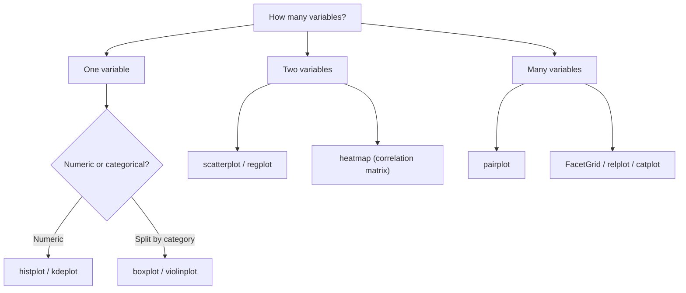

# 🎯 Day 28: Advanced Visualization with Seaborn

> *"Seaborn: where statistics meets beautiful charts."*

---

## The "Never-Coded" Bridge

**Yesterday's Matplotlib gave you complete control.** You positioned every element, chose every color. That's powerful—but time-consuming.

**Seaborn gives you intelligence.** It understands your data. Tell it "show me how tips vary by day and time," and it creates a publication-ready visualization with proper statistical annotations, beautiful colors, and appropriate chart choices.

**The difference:**

- **Matplotlib**: "Draw a bar at x=0, height=10, color blue, then at x=1, height=15..."
- **Seaborn**: "Show me total_bill by day, colored by time"

**Real-world applications:**

- **Research papers**: Professional statistical graphics
- **Exploratory analysis**: Pair plots to scan all relationships at once
- **Presentations**: Clean, consistent styling that impresses executives
- **A/B testing**: Distribution comparisons with statistical context

---

## The Technical Deep Dive

### Seaborn Basics

```python
import seaborn as sns
import pandas as pd
import matplotlib.pyplot as plt

# Set a professional theme
sns.set_theme(style="whitegrid", palette="deep")

# Load built-in dataset
tips = sns.load_dataset("tips")
print(tips.head())
```

### Distribution Plots

Understanding data distribution is fundamental to statistical analysis.

**What is a Violin Plot?** A **violin plot** combines a box plot with a kernel density estimate (KDE) to show the full shape of a distribution. Where a box plot only shows you the median, quartiles, and outliers, a violin plot additionally reveals **multimodal distributions** — data with two or more peaks.

**Violin plot anatomy:**

- The **wide part** of the violin shows where most data is concentrated (like a histogram rotated 90°)
- The **narrow part** shows sparse regions
- The **white dot** in the center marks the median
- The **thick black bar** shows the IQR (25th to 75th percentile)
- The **thin lines** extend to the whiskers (typically 1.5 × IQR beyond Q1/Q3)

**When to choose violin over box plot:**

| Situation | Prefer |
|-----------|--------|
| Data has one peak (unimodal) | Box plot (simpler, easier to read) |
| Data might have two peaks (bimodal) | Violin plot (reveals the shape) |
| Comparing 2–4 groups | Either works |
| Comparing 5+ groups in a presentation | Box plot (violins get cluttered) |
| Showing distribution shape to stakeholders | Violin plot |

**Business example:** Analyzing salary distributions across departments. A bimodal distribution in the "Engineering" violin might reveal two distinct pay bands (junior vs. senior), which a box plot would obscure.

```python
import seaborn as sns
import matplotlib.pyplot as plt

tips = sns.load_dataset("tips")
fig, axes = plt.subplots(2, 2, figsize=(12, 10))

# Histogram with KDE (kernel density estimate)
sns.histplot(tips["total_bill"], kde=True, ax=axes[0, 0], color="steelblue")
axes[0, 0].set_title("Distribution with KDE")

# KDE only (smooth density curve)
sns.kdeplot(tips["total_bill"], fill=True, ax=axes[0, 1], color="coral")
axes[0, 1].set_title("KDE Plot (Smoothed Density)")

# Box plot (shows median, quartiles, outliers)
sns.boxplot(x="day", y="total_bill", data=tips, ax=axes[1, 0], palette="Set2")
axes[1, 0].set_title("Box Plot: Bill by Day")

# Violin plot (combines box plot + KDE)
sns.violinplot(x="day", y="total_bill", data=tips, ax=axes[1, 1], palette="Set3")
axes[1, 1].set_title("Violin Plot: Distribution Shape")

plt.tight_layout()
plt.show()
```

### Categorical Plots

```python
import seaborn as sns
import matplotlib.pyplot as plt

tips = sns.load_dataset("tips")
fig, axes = plt.subplots(2, 2, figsize=(12, 10))

# Count plot (bar chart of frequencies)
sns.countplot(x="day", data=tips, ax=axes[0, 0], palette="Blues_d")
axes[0, 0].set_title("Visit Count by Day")

# Bar plot with aggregation (mean + error bars)
sns.barplot(
    x="day",
    y="total_bill",
    data=tips,
    ax=axes[0, 1],
    estimator="mean",
    errorbar="sd",
    palette="coolwarm",
)
axes[0, 1].set_title("Average Bill by Day (with Std Dev)")

# Strip plot (individual points)
sns.stripplot(
    x="day",
    y="total_bill",
    data=tips,
    ax=axes[1, 0],
    jitter=True,
    alpha=0.5,
    palette="Set1",
)
axes[1, 0].set_title("Individual Bills by Day")

# Swarm plot (no overlapping points)
sns.swarmplot(x="day", y="total_bill", data=tips, ax=axes[1, 1], size=4, palette="Set2")
axes[1, 1].set_title("Swarm Plot (No Overlap)")

plt.tight_layout()
plt.show()
```

### Relationship Plots

```python
import seaborn as sns
import matplotlib.pyplot as plt

tips = sns.load_dataset("tips")
fig, axes = plt.subplots(1, 3, figsize=(15, 5))

# Scatter with regression line
sns.regplot(
    x="total_bill",
    y="tip",
    data=tips,
    ax=axes[0],
    scatter_kws={"alpha": 0.5},
    line_kws={"color": "red"},
)
axes[0].set_title("Tips vs Bill (with Trend Line)")

# Scatter with categorical color
sns.scatterplot(
    x="total_bill", y="tip", hue="smoker", style="time", data=tips, ax=axes[1], s=80
)
axes[1].set_title("Multi-dimensional Scatter")

# Residual plot (check linear relationship)
sns.residplot(
    x="total_bill", y="tip", data=tips, ax=axes[2], scatter_kws={"alpha": 0.5}
)
axes[2].set_title("Residuals (should be random)")

plt.tight_layout()
plt.show()
```

### Heatmaps

Heatmaps excel at showing patterns in matrices—especially correlation matrices.

```python
import seaborn as sns
import matplotlib.pyplot as plt
import pandas as pd
import numpy as np

tips = sns.load_dataset("tips")

# Correlation heatmap
fig, axes = plt.subplots(1, 2, figsize=(14, 5))

# Basic correlation heatmap
numeric_cols = tips.select_dtypes(include=[np.number])
corr = numeric_cols.corr()
sns.heatmap(
    corr,
    annot=True,
    cmap="coolwarm",
    center=0,
    vmin=-1,
    vmax=1,
    ax=axes[0],
    fmt=".2f",
    square=True,
    linewidths=0.5,
)
axes[0].set_title("Correlation Matrix")

# Pivot table heatmap
pivot = tips.pivot_table(values="tip", index="day", columns="time", aggfunc="mean")
sns.heatmap(
    pivot,
    annot=True,
    cmap="YlGnBu",
    fmt=".2f",
    ax=axes[1],
    linewidths=0.5,
    cbar_kws={"label": "Average Tip ($)"},
)
axes[1].set_title("Average Tip by Day and Time")

plt.tight_layout()
plt.show()
```

### Pair Plots (Multi-Variable Exploration)

```python
import seaborn as sns
import matplotlib.pyplot as plt

# The ultimate exploratory tool: see all pairwise relationships at once
tips = sns.load_dataset("tips")

# Basic pair plot
g = sns.pairplot(
    tips, hue="smoker", palette="husl", diag_kind="kde", plot_kws={"alpha": 0.6}
)
g.fig.suptitle("Tips Dataset: All Pairwise Relationships", y=1.02)
plt.show()

# More focused: specific columns only
g = sns.pairplot(tips, vars=["total_bill", "tip", "size"], hue="time", palette="Set1")
plt.show()
```

### FacetGrid (Multi-Panel Layouts)

```python
import seaborn as sns
import matplotlib.pyplot as plt

tips = sns.load_dataset("tips")

# Create grid of histograms by categories
g = sns.FacetGrid(tips, col="time", row="smoker", height=4, aspect=1.2)
g.map(sns.histplot, "total_bill", kde=True)
g.set_titles("{row_name} | {col_name}")
g.add_legend()
plt.show()

# Using relplot for automatic FacetGrid
g = sns.relplot(
    x="total_bill",
    y="tip",
    col="time",
    hue="smoker",
    style="smoker",
    data=tips,
    height=5,
    aspect=1.2,
)
g.fig.suptitle("Tips by Bill Amount, Time, and Smoking Status", y=1.02)
plt.show()
```

---

## Senior-Level Insights

### When to Use Each Seaborn Plot

| Goal                          | Plot Function                     | Key Parameters                  |
| ----------------------------- | --------------------------------- | ------------------------------- |
| Distribution of one variable  | `histplot`, `kdeplot`             | `kde=True`, `fill=True`         |
| Distribution by category      | `boxplot`, `violinplot`           | `x=category`, `y=value`         |
| Show all data points          | `stripplot`, `swarmplot`          | `jitter=True`                   |
| Relationship between two vars | `scatterplot`, `regplot`          | `hue=category`                  |
| Correlation matrix            | `heatmap`                         | `annot=True`, `cmap="coolwarm"` |
| Explore all relationships     | `pairplot`                        | `hue=category`                  |
| Same plot across categories   | `FacetGrid`, `relplot`, `catplot` | `col=`, `row=`                  |



### Statistical Annotation Best Practices

```python
# Add statistical context to your visualizations
import seaborn as sns
import matplotlib.pyplot as plt
from scipy import stats

tips = sns.load_dataset("tips")

fig, ax = plt.subplots(figsize=(10, 6))
sns.regplot(x="total_bill", y="tip", data=tips, ax=ax)

# Calculate and display correlation
r, p = stats.pearsonr(tips["total_bill"], tips["tip"])
ax.text(
    0.05,
    0.95,
    f"r = {r:.3f}\np < 0.001" if p < 0.001 else f"r = {r:.3f}\np = {p:.3f}",
    transform=ax.transAxes,
    fontsize=12,
    verticalalignment="top",
    bbox=dict(boxstyle="round", facecolor="wheat", alpha=0.5),
)

ax.set_title("Tips vs Total Bill (with Correlation)")
plt.show()
```

### Colorblind-Safe Palettes

```python
# Seaborn includes colorblind-friendly palettes
colorblind_palettes = ["colorblind", "deep", "muted", "Set2"]

# Custom colorblind-safe palette
cb_palette = ["#0072B2", "#E69F00", "#009E73", "#CC79A7", "#D55E00"]
sns.set_palette(cb_palette)

# Test your palette
sns.palplot(sns.color_palette("colorblind"))
```

### Production-Ready Export

```python
# High-quality export for publications
fig, ax = plt.subplots(figsize=(8, 6))
sns.boxplot(x="day", y="total_bill", data=tips, ax=ax)
ax.set_title("Bill Distribution by Day")

# Save in multiple formats
plt.savefig("figure.png", dpi=300, bbox_inches="tight", facecolor="white")
plt.savefig("figure.pdf", bbox_inches="tight")  # Vector format for print
plt.savefig("figure.svg", bbox_inches="tight")  # Vector format for web
```

### The Danger of Over-Plotting in Executive Dashboards

The most common mistake in business visualization is trying to show too much at once:

- **Too many variables on one chart** (5+ series on a line chart) makes every line hard to read
- **Too much text** — annotations, footnotes, and data labels compete for attention
- **Cognitive load kills decisions** — if a chart requires more than 5 seconds to interpret, executives will ignore it

**Rules for executive dashboards:**

1. **One key insight per chart** — if you can't state the point in one sentence, split the chart
2. **Remove chart junk** — eliminate gridlines, borders, tick marks, and legends that don't add information
3. **Highlight the signal** — use color to draw attention to the one thing that matters (e.g., make the "at-risk" bar red, leave others grey)
4. **Order bars by value**, not alphabetically, unless the category order carries meaning

```python
# Before: Cluttered
plt.figure(figsize=(8, 5))
for i, col in enumerate(df.columns):
    plt.plot(df.index, df[col], label=col)
plt.legend()  # 8-item legend = cognitive overload

# After: Focused — highlight one series
fig, ax = plt.subplots(figsize=(8, 5))
for col in df.columns:
    ax.plot(df.index, df[col], color="lightgray", linewidth=1)
ax.plot(df.index, df["key_product"], color="#E63946", linewidth=2.5, label="Key Product")
ax.annotate("Peak Month", xy=(df["key_product"].idxmax(), df["key_product"].max()),
            xytext=(5, 10), textcoords="offset points")
ax.legend()
```

---

## Hands-on Lab

### Exercise 1: Statistical Distribution Analysis

**Business Scenario:** HR wants to compare salary distributions across 4 departments (Engineering, Marketing, Sales, Operations). The compensation committee suspects Engineering has two distinct pay bands (junior/senior). A violin plot would make this visible in a way a standard box plot would not.

**Your Task:**

1. Create a violin plot comparing salary distributions across 4 departments
2. Add a strip plot (or swarm plot) overlay to show individual data points
3. Use appropriate labels and a title
4. Note in a comment which department shows evidence of a bimodal distribution

**Expected Output:** A violin plot with 4 violins side by side, individual data points overlaid as a strip plot, y-axis labeled "Salary ($)", and a title "Salary Distribution by Department."

```python
import seaborn as sns
import matplotlib.pyplot as plt
import numpy as np

tips = sns.load_dataset("tips")


def distribution_analysis(data, value_col, group_col):
    """Create comprehensive distribution analysis."""
    fig, axes = plt.subplots(2, 2, figsize=(14, 10))

    # 1. Overall distribution
    sns.histplot(data[value_col], kde=True, ax=axes[0, 0], color="steelblue")
    mean_val = data[value_col].mean()
    median_val = data[value_col].median()
    axes[0, 0].axvline(
        mean_val, color="red", linestyle="--", label=f"Mean: {mean_val:.2f}"
    )
    axes[0, 0].axvline(
        median_val, color="green", linestyle="-.", label=f"Median: {median_val:.2f}"
    )
    axes[0, 0].legend()
    axes[0, 0].set_title(f"Overall {value_col.title()} Distribution")

    # 2. Box plots by group
    sns.boxplot(x=group_col, y=value_col, data=data, ax=axes[0, 1], palette="Set2")
    axes[0, 1].set_title(f"{value_col.title()} by {group_col.title()}")

    # 3. Violin plots (show distribution shape)
    sns.violinplot(
        x=group_col,
        y=value_col,
        data=data,
        ax=axes[1, 0],
        inner="quartile",
        palette="Set3",
    )
    axes[1, 0].set_title(f"Distribution Shape by {group_col.title()}")

    # 4. Strip plot with means
    sns.stripplot(
        x=group_col,
        y=value_col,
        data=data,
        ax=axes[1, 1],
        jitter=True,
        alpha=0.4,
        palette="dark",
    )
    # Overlay means
    means = data.groupby(group_col)[value_col].mean()
    for i, (group, mean) in enumerate(means.items()):
        axes[1, 1].scatter(i, mean, color="red", s=100, zorder=5, marker="D")
    axes[1, 1].set_title(f"Individual Points with Mean (red diamond)")

    plt.suptitle(
        f"Distribution Analysis: {value_col.title()} by {group_col.title()}",
        fontsize=16,
        fontweight="bold",
    )
    plt.tight_layout()
    plt.savefig("distribution_analysis.png", dpi=150)
    plt.show()


distribution_analysis(tips, "total_bill", "day")
```

---

### Exercise 2: Correlation Dashboard

**Business Scenario:** The data science team wants to quickly identify which pairs of numerical variables in a business dataset are strongly correlated — positive or negative — before building a predictive model. A heatmap of the correlation matrix is the standard tool.

**Your Task:**

1. Generate a correlation matrix for a business dataset (you may create synthetic data)
2. Create a heatmap using Seaborn with diverging color scale (blue = negative, red = positive)
3. Annotate each cell with the correlation coefficient rounded to 2 decimal places
4. Add a title

**Expected Output:** A square heatmap with color cells ranging from dark blue (−1.0) to dark red (+1.0), numeric annotations in each cell, and variable names on both axes.

```python
import seaborn as sns
import matplotlib.pyplot as plt
import numpy as np
import pandas as pd

tips = sns.load_dataset("tips")


def create_correlation_dashboard(data):
    """Create comprehensive correlation analysis dashboard."""
    fig, axes = plt.subplots(2, 2, figsize=(14, 12))

    # 1. Correlation heatmap
    numeric_data = data.select_dtypes(include=[np.number])
    corr = numeric_data.corr()
    mask = np.triu(np.ones_like(corr, dtype=bool))  # Upper triangle mask
    sns.heatmap(
        corr,
        mask=mask,
        annot=True,
        cmap="RdBu_r",
        center=0,
        square=True,
        linewidths=0.5,
        ax=axes[0, 0],
        fmt=".2f",
        cbar_kws={"shrink": 0.8},
    )
    axes[0, 0].set_title("Correlation Matrix")

    # 2. Primary relationship with regression
    sns.regplot(
        x="total_bill", y="tip", data=data, ax=axes[0, 1], scatter_kws={"alpha": 0.5}
    )
    r = data["total_bill"].corr(data["tip"])
    axes[0, 1].set_title(f"Tip vs Total Bill (r = {r:.3f})")

    # 3. Joint plot embedded (scatter + marginal distributions)
    # We'll simulate this with scatterplot + histograms
    ax_main = axes[1, 0]
    sns.scatterplot(
        x="total_bill", y="tip", hue="time", data=data, ax=ax_main, alpha=0.6
    )
    ax_main.set_title("Tip vs Bill by Time")

    # 4. Residual analysis
    sns.residplot(
        x="total_bill",
        y="tip",
        data=data,
        ax=axes[1, 1],
        scatter_kws={"alpha": 0.5},
        color="purple",
    )
    axes[1, 1].axhline(0, color="black", linestyle="--", alpha=0.5)
    axes[1, 1].set_title("Residuals (should be random around 0)")

    plt.suptitle("Correlation Analysis Dashboard", fontsize=16, fontweight="bold")
    plt.tight_layout()
    plt.savefig("correlation_dashboard.png", dpi=150)
    plt.show()


create_correlation_dashboard(tips)
```

---

### Exercise 3: Multi-Dimensional Exploration

**Business Scenario:** The product team wants to explore the relationship between price, marketing spend, and sales volume across 5 product categories. A scatter plot with color and size encoding can show three dimensions at once: x = price, y = sales, size = marketing spend, color = category.

**Your Task:**

1. Create a scatter plot with price on x-axis and sales on y-axis
2. Encode marketing spend as point size (larger = higher spend)
3. Encode product category as point color (use a categorical palette)
4. Add a legend, labels, and title

**Expected Output:** A scatter plot with variably-sized, color-coded points, a legend showing category colors, and axis labels. Points with high marketing spend (large circles) should visually cluster near high-sales regions if the relationship holds.

```python
import seaborn as sns
import matplotlib.pyplot as plt
import pandas as pd

tips = sns.load_dataset("tips")


def multi_dimensional_analysis(data):
    """Explore data across multiple dimensions with FacetGrid."""

    # 1. FacetGrid: Histograms across categories
    g = sns.FacetGrid(
        data, col="time", row="smoker", height=4, aspect=1.3, margin_titles=True
    )
    g.map(sns.histplot, "total_bill", kde=True, color="steelblue")
    g.set_titles(row_template="{row_name}", col_template="{col_name}")
    g.fig.suptitle("Bill Distribution: Time × Smoking Status", y=1.02, fontsize=14)
    g.savefig("facetgrid_histograms.png", dpi=150)
    plt.show()

    # 2. Catplot: Box plots across multiple dimensions
    g = sns.catplot(
        x="day",
        y="total_bill",
        hue="smoker",
        col="time",
        data=data,
        kind="box",
        height=5,
        aspect=1.2,
    )
    g.fig.suptitle("Bill by Day, Time, and Smoking", y=1.02, fontsize=14)
    g.savefig("catplot_boxes.png", dpi=150)
    plt.show()

    # 3. Pair plot with categorical coloring
    subset = data[["total_bill", "tip", "size", "time"]]
    g = sns.pairplot(
        subset, hue="time", palette="husl", diag_kind="kde", plot_kws={"alpha": 0.6}
    )
    g.fig.suptitle("Pairwise Relationships by Time", y=1.02)
    g.savefig("pairplot_analysis.png", dpi=150)
    plt.show()


multi_dimensional_analysis(tips)
```

---

## Mastery Check

### Question 1: Distribution Visualization

You need to compare salary distributions across three departments. Which Seaborn plot allows best comparison of both spread AND distribution shape?

<details>
<summary>Click for Answer</summary>

**Violin plot** is the best choice because it shows:

- The full distribution shape (like KDE)
- Quartiles and median (like box plot)
- Easy comparison across categories

```python
sns.violinplot(x="department", y="salary", data=df, inner="quartile")
```

**Alternative**: `boxenplot` (letter-value plot) for very large datasets
**When to use boxplot**: When you mainly care about quartiles and outliers, not shape

</details>

---

### Question 2: Heatmap Interpretation

Your correlation heatmap shows a value of 0.95 between two variables. What should you do before concluding they're strongly related?

<details>
<summary>Click for Answer</summary>

**Verification steps:**

1. **Create a scatter plot** to visually confirm the relationship

   ```python
   sns.regplot(x="var1", y="var2", data=df)
   ```

2. **Check for outliers** driving the correlation

   ```python
   sns.residplot(x="var1", y="var2", data=df)
   ```

3. **Consider if it's spurious** - could both be caused by a third variable?

4. **Check sample size** - high correlations are less reliable with small n

5. **Look at the actual units** - is this relationship meaningful for your analysis?

</details>

---

### Question 3: FacetGrid Usage

When would you use FacetGrid over regular subplots?

<details>
<summary>Click for Answer</summary>

**Use FacetGrid when:**

- You want the same plot type repeated across categories
- The number of categories is dynamic (determined by data)
- You want automatic handling of legends and axis labels

**Use regular subplots when:**

- Each subplot shows a different type of chart
- You need fine-grained control over each panel
- The layout is predetermined, not data-driven

```python
# FacetGrid: Same scatter plot across time × smoker categories
g = sns.FacetGrid(tips, col="time", row="smoker")
g.map(sns.scatterplot, "total_bill", "tip")

# Regular subplots: Different chart types
fig, axes = plt.subplots(1, 3)
axes[0].plot(...)  # Line chart
axes[1].pie(...)  # Pie chart
axes[2].hist(...)  # Histogram
```

</details>

---

### Question 4: Debugging Challenge

This code produces an empty heatmap. Find the bug:

```python
corr = df.corr()
sns.heatmap(corr)
plt.show()
```

<details>
<summary>Click for Answer</summary>

**Possible issues:**

1. **No numeric columns**: `df.corr()` only works on numeric columns

   ```python
   # Check what columns are numeric
   print(df.select_dtypes(include=[np.number]).columns)
   ```

2. **All NaN values**: If data has missing values, correlations may be NaN

   ```python
   print(corr.isnull().sum())  # Check for NaN correlations
   ```

3. **Missing figure size**: Heatmap may be too small to see

   ```python
   plt.figure(figsize=(10, 8))  # Add before heatmap
   ```

4. **Need `annot=True`** to see values if colors are subtle

   ```python
   sns.heatmap(corr, annot=True, fmt=".2f")
   ```

</details>

---

### Question 5: Design Scenario

You're preparing a figure for a research paper. What considerations should guide your Seaborn configuration?

<details>
<summary>Click for Answer</summary>

**Publication-ready configuration:**

```python
# 1. Set appropriate style (usually whitegrid or white)
sns.set_theme(style="whitegrid", font_scale=1.2)

# 2. Use colorblind-safe palette
sns.set_palette("colorblind")

# 3. Set figure size based on journal requirements
fig, ax = plt.subplots(figsize=(6, 4))  # Often 6-8 inches wide

# 4. Remove unnecessary elements
sns.despine()  # Remove top and right spines

# 5. Export as vector format
plt.savefig("figure.pdf", bbox_inches="tight")
plt.savefig("figure.eps", bbox_inches="tight")  # Some journals want EPS

# 6. Use appropriate DPI for raster formats
plt.savefig("figure.png", dpi=600, bbox_inches="tight")  # 300-600 DPI for print
```

**Other considerations:**

- Check journal's figure guidelines
- Ensure text is readable at printed size
- Use patterns in addition to colors for accessibility
- Include all statistical annotations in figure or caption

</details>

---

## Summary

Today you learned:

- ✅ Distribution plots: histplot, kdeplot, boxplot, violinplot
- ✅ Categorical plots: barplot, countplot, stripplot, swarmplot
- ✅ Relationship plots: regplot, scatterplot, residplot
- ✅ Heatmaps for correlation matrices and pivot tables
- ✅ Pair plots for multi-variable exploration
- ✅ FacetGrid for automated multi-panel layouts

**Tomorrow**: Interactive visualization with Plotly—charts you can click, zoom, and share as web pages.
