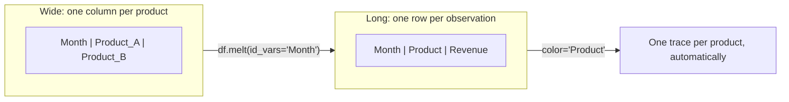

# 🎯 Day 29: Interactive Visualization with Plotly

> *"Static charts show data. Interactive charts let users explore it."*

---

## The "Never-Coded" Bridge

**Imagine presenting to executives.** With static charts, you show one view. When someone asks "What about Q2?" or "Can we zoom into that spike?", you scramble for different slides.

**With Plotly:** The CFO hovers to see exact values. The VP zooms into their region. One visualization answers multiple questions.

**Real-world applications:**

- **Dashboards**: Zoom into date ranges, filter by category
- **Presentations**: Hover for details without slide changes
- **Analysis**: Explore outliers by clicking points

---

## The Technical Deep Dive

### Data Format for Plotly Express: Tidy (Long) vs Wide

Before building interactive charts with Plotly Express, you need to understand the data format it expects. This is the #1 stumbling block for beginners.

**Wide format** (how most spreadsheets look): Each variable gets its own column.

```
Month  | Product_A | Product_B | Product_C
-------|-----------|-----------|----------
Jan    | 10000     | 8000      | 12000
Feb    | 15000     | 9000      | 14000
```

**Tidy (Long) format** (what Plotly Express prefers): Each row is one observation. Multiple series become a single "value" column with a "category" column identifying which series it belongs to.

```
Month  | Product   | Revenue
-------|-----------|--------
Jan    | Product_A | 10000
Jan    | Product_B | 8000
Jan    | Product_C | 12000
Feb    | Product_A | 15000
```

**Why Plotly Express prefers long format:** Long format lets you pass one column name to `color=`, `size=`, `facet_col=`, and `animation_frame=` parameters, and Plotly automatically creates a separate trace for each unique value.



```python
# Convert wide to long (melt) before using Plotly Express
import pandas as pd
import plotly.express as px

wide_df = pd.DataFrame({
    "Month": ["Jan", "Feb", "Mar"],
    "Product_A": [10000, 15000, 13000],
    "Product_B": [8000, 9000, 11000],
})

# Melt into long format
long_df = wide_df.melt(id_vars="Month", var_name="Product", value_name="Revenue")
# Now: Month | Product | Revenue

fig = px.line(long_df, x="Month", y="Revenue", color="Product",
              title="Monthly Revenue by Product")
fig.show()
```

**When you can use wide format:** Plotly Express `px.line()` accepts wide format if you pass a list to `y=` — but you lose access to `color=`, `facet_col=`, and `animation_frame=`. Use long format from the start to avoid limitations.

### Plotly Express Basics

```python
import plotly.express as px

df = px.data.gapminder()

fig = px.scatter(
    df.query("year == 2007"),
    x="gdpPercap",
    y="lifeExp",
    size="pop",
    color="continent",
    hover_name="country",
    log_x=True,
    title="GDP vs Life Expectancy (2007)",
)
fig.show()
```

### Common Chart Types

```python
import plotly.express as px

df = px.data.gapminder()

# Line chart
fig = px.line(
    df.query("country == 'United States'"),
    x="year",
    y="gdpPercap",
    title="US GDP Over Time",
)

# Bar chart
fig = px.bar(
    df.query("year == 2007 and continent == 'Europe'").nlargest(10, "pop"),
    x="country",
    y="pop",
    title="European Populations",
)

# Histogram
fig = px.histogram(df, x="lifeExp", nbins=30, title="Life Expectancy Distribution")

# Box plot
fig = px.box(df, x="continent", y="lifeExp", title="Life Expectancy by Continent")
```

### Customization

```python
fig = px.scatter(
    df.query("year == 2007"), x="gdpPercap", y="lifeExp", color="continent"
)

fig.update_layout(
    title=dict(text="Global Development", font=dict(size=24)),
    xaxis_title="GDP per Capita ($)",
    yaxis_title="Life Expectancy (years)",
    template="plotly_white",
)
fig.update_traces(marker=dict(opacity=0.7))
fig.show()
```

### Animations

```python
fig = px.scatter(
    df,
    x="gdpPercap",
    y="lifeExp",
    animation_frame="year",
    animation_group="country",
    size="pop",
    color="continent",
    hover_name="country",
    range_x=[100, 100000],
    range_y=[25, 90],
    log_x=True,
)
fig.show()
```

### Saving Charts

```python
fig.write_html("chart.html")  # Interactive HTML
fig.write_image("chart.png", scale=2)  # Static image (needs kaleido)
```

---

## Senior-Level Insights

### Performance Tips

| Scenario        | Solution                     |
| --------------- | ---------------------------- |
| >10K points     | Use `render_mode="webgl"`    |
| Slow animations | Reduce frames, simplify data |
| Many traces     | Combine with color mapping   |

### When to Use Plotly vs Matplotlib

| Use Case               | Recommendation     |
| ---------------------- | ------------------ |
| Static publication     | Matplotlib/Seaborn |
| Web dashboards         | Plotly             |
| Exploratory analysis   | Plotly             |
| Complex custom layouts | Matplotlib         |

### When to Graduate: Plotly Express vs Plotly Graph Objects

| Feature | Plotly Express (px) | Plotly Graph Objects (go) |
|---------|-------------------|--------------------------|
| **Purpose** | Fast, opinionated — one-liners for common chart types | Full control — build any chart from scratch |
| **Syntax** | `px.bar(df, x="col", y="val", color="cat")` | `go.Figure(data=[go.Bar(x=..., y=...)])` |
| **Data format** | Prefers tidy/long DataFrames | Accepts lists, arrays, or dicts |
| **Customization** | Limited — good for 80% of use cases | Unlimited — every trace, axis, and annotation is configurable |
| **When to use** | Quick exploration, standard charts | Custom layouts, mixed chart types, pixel-perfect dashboards |
| **Dash/Streamlit** | Both work equally well | Required for complex multi-trace figures |

**Rule of thumb:** Start with `px`. When you hit a wall (e.g., you need a dual y-axis or a custom tooltip), switch to `go`.

### Next Step: Dash and Streamlit

Plotly charts are interactive HTML — but they live in Jupyter or static files. To build a **full web application** with dropdowns, sliders, and live data:

- **Dash** (by Plotly): Full web app framework, pure Python. Best for data-heavy analytical apps.
- **Streamlit**: Simpler syntax, great for prototypes and internal tools. Add `st.plotly_chart(fig)` to embed any Plotly figure in a web app.

---

## Hands-on Lab

### Exercise 1: Sales Dashboard

**Business Scenario:** The Sales Director wants a self-service interactive dashboard showing monthly revenue by product. Unlike a static PNG, this needs to be sharable as an HTML file where stakeholders can hover over data points to see exact values, click the legend to isolate product lines, and zoom into specific months.

**Your Task:**

1. Create an interactive line chart with `plotly.express` showing revenue over 12 months for at least 2 products
2. Use the tidy (long) format for your data — melt if necessary
3. Add hover tooltips showing the exact revenue value and date
4. Set a descriptive title and axis labels
5. Show the chart (or save as HTML with `fig.write_html("sales_dashboard.html")`)

**Expected Output:** An interactive Plotly line chart. Hovering over a point displays the month and revenue. Clicking a product name in the legend toggles its visibility. The chart has a title "Monthly Sales Dashboard."

```python
import plotly.express as px
import pandas as pd
import numpy as np

np.random.seed(42)
dates = pd.date_range("2024-01-01", periods=90, freq="D")
df = pd.DataFrame(
    {
        "date": dates,
        "revenue": np.cumsum(np.random.randn(90) * 500 + 300),
        "region": np.random.choice(["North", "South", "East"], 90),
    }
)

# Revenue trend
fig = px.line(df, x="date", y="revenue", title="Daily Revenue")
fig.show()

# By region
fig = px.bar(
    df.groupby("region")["revenue"].sum().reset_index(),
    x="region",
    y="revenue",
    color="region",
)
fig.show()
```

### Exercise 2: Time Series with Range Selector

**Business Scenario:** The finance team monitors daily stock prices and needs a chart with built-in time range controls — buttons to toggle between "1 month", "3 months", "6 months", and "1 year" views, plus a range slider at the bottom for custom date selection.

**Your Task:**

1. Generate or use a time series dataset (daily data over 1 year)
2. Create a Plotly line chart with `rangeselector` buttons: 1M, 3M, 6M, 1Y, All
3. Add a `rangeslider` at the bottom of the chart
4. Display the chart

**Expected Output:** An interactive time series chart with 5 preset range buttons at the top and a mini range-slider at the bottom. Clicking "1M" zooms to the last month of data.

```python
import plotly.express as px
import pandas as pd
import numpy as np

dates = pd.date_range("2020-01-01", periods=365, freq="D")
df = pd.DataFrame({"date": dates, "value": np.cumsum(np.random.randn(365) * 10)})

fig = px.line(df, x="date", y="value", title="Interactive Time Series")
fig.update_xaxes(
    rangeslider_visible=True,
    rangeselector=dict(
        buttons=[
            dict(count=1, label="1M", step="month"),
            dict(count=3, label="3M", step="month"),
            dict(step="all", label="All"),
        ]
    ),
)
fig.show()
```

### Exercise 3: Animated Scatter

**Business Scenario:** The strategy team wants to present how marketing spend vs. revenue has evolved across 5 regions over a 5-year period — similar to a Gapminder "bubble chart" animation. Each frame of the animation represents one year; bubbles move as both variables change.

**Your Task:**

1. Create a dataset with columns: Year, Region, Marketing_Spend, Revenue, Market_Size
2. Build an animated scatter plot with `animation_frame="Year"`
3. Map `Marketing_Spend` → x-axis, `Revenue` → y-axis, `Region` → color, `Market_Size` → bubble size
4. Add a title and axis labels

**Expected Output:** A Plotly animated scatter with a play/pause button and a year slider at the bottom. Each frame shows the 5 regional bubbles repositioned for that year. The size of each bubble reflects market size.

```python
import plotly.express as px

df = px.data.gapminder()
fig = px.scatter(
    df,
    x="gdpPercap",
    y="lifeExp",
    animation_frame="year",
    size="pop",
    color="continent",
    hover_name="country",
    log_x=True,
    range_x=[100, 100000],
    range_y=[25, 90],
)
fig.write_html("animated_scatter.html")
fig.show()
```

---

## Mastery Check

### Question 1: Interactivity Benefits

When is an interactive chart clearly better than static?

<details>
<summary>Click for Answer</summary>

- Executive dashboards (self-service exploration)
- Large datasets (zoom to find patterns)
- Client presentations (filter live for their segment)
- Exploratory analysis (hover to identify outliers)

</details>

### Question 2: Performance

Your 100K point scatter is slow. What helps?

<details>
<summary>Click for Answer</summary>

```python
fig = px.scatter(df, x="x", y="y", render_mode="webgl")
# Or reduce data with sampling
df_sample = df.sample(10000)
```

</details>

### Question 3: Animation vs Facets

When use animation_frame vs faceted charts?

<details>
<summary>Click for Answer</summary>

**Animation**: Showing change over time, storytelling
**Facets**: Need to compare states simultaneously, print output

</details>

### Question 4: HTML Export Bug

Chart shows in Jupyter but HTML is blank after `fig.write_html("chart.html", include_plotlyjs=False)`. Why?

<details>
<summary>Click for Answer</summary>

No JavaScript included. Fix: `include_plotlyjs=True` or `include_plotlyjs="cdn"`

</details>

### Question 5: Design Scenario

Building 5-chart dashboard. How organize?

<details>
<summary>Click for Answer</summary>

- KPIs at top
- Primary trend chart (large)
- Supporting details (smaller)
- Consistent filtering across charts
- Use Dash for linked interactivity

</details>

---

## Summary

- ✅ Plotly Express for quick interactive charts
- ✅ Hover, zoom, pan out of the box
- ✅ Animations show changes over time
- ✅ Export to HTML for sharing
- ✅ Use webgl for large datasets

**Tomorrow**: Web scraping to collect data from websites.
