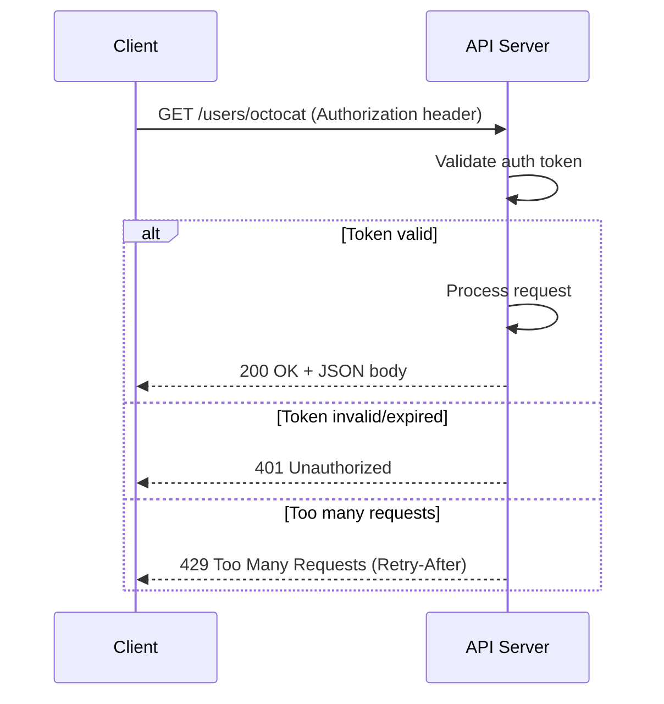

# 🎯 Day 33: Consuming APIs

> *"APIs are how programs talk to each other."*

---

## The "Never-Coded" Bridge

**Imagine you need weather data.** You could scrape weather websites, parsing HTML and hoping the layout doesn't change. Or you could ask politely—via an API.

**APIs (Application Programming Interfaces)** are structured ways to request data from services. Instead of parsing HTML, you get clean JSON.

**Real-world APIs:**

- **Weather**: OpenWeatherMap, WeatherAPI
- **Finance**: Yahoo Finance, Alpha Vantage
- **Social**: Twitter, GitHub, Reddit
- **Maps**: Google Maps, Mapbox
- **AI**: OpenAI, Anthropic

**Why APIs beat scraping:**

- Structured data (JSON vs HTML)
- Stable (documented contracts)
- Faster (no HTML overhead)
- Legal (explicit permission)

---

## The Technical Deep Dive

### What is REST?

**REST** stands for **Representational State Transfer** — an architectural style for designing web APIs, introduced by Roy Fielding in his 2000 doctoral dissertation.

**What makes an API RESTful?** Six key constraints:

1. **Stateless:** Each request is independent. The server does not store session state between requests — every call must contain all necessary information (like authentication tokens).
2. **Standard HTTP Methods:** Uses the standard HTTP verbs to convey intent:
   - `GET` — Read/retrieve data (safe, no side effects)
   - `POST` — Create a new resource
   - `PUT` / `PATCH` — Update an existing resource (`PUT` replaces the whole thing, `PATCH` updates specific fields)
   - `DELETE` — Remove a resource
3. **Resource-based URLs:** URLs identify resources (nouns), not actions (verbs):
   - ✅ Good: `GET /users/123` (get user 123)
   - ❌ Bad: `GET /getUser?id=123` (verb in URL)
4. **Uniform interface:** Consistent URL patterns and response formats (typically JSON).

**REST in practice — GitHub API example:**

| Action | HTTP Method | URL |
|--------|------------|-----|
| Get a user's profile | GET | `/users/octocat` |
| List a user's repos | GET | `/users/octocat/repos` |
| Create a new repo | POST | `/user/repos` |
| Update a repo | PATCH | `/repos/octocat/Hello-World` |
| Delete a repo | DELETE | `/repos/octocat/Hello-World` |

### What is JSON?

**JSON** (JavaScript Object Notation) is the universal data format for REST APIs. Despite the name, it is language-agnostic — Python, Java, Go, and every other language can read it.

**JSON maps directly to Python data structures:**

| JSON | Python |
|------|--------|
| `{ "key": "value" }` | `dict` |
| `[ 1, 2, 3 ]` | `list` |
| `"hello"` | `str` |
| `42` | `int` |
| `3.14` | `float` |
| `true` / `false` | `True` / `False` |
| `null` | `None` |

```python
import json

# Parse JSON string → Python dict
json_string = '{"name": "Alice", "age": 30, "active": true}'
data = json.loads(json_string)
print(data["name"])     # Alice
print(type(data))       # <class 'dict'>

# Python dict → JSON string (for sending to an API)
payload = {"product": "Laptop", "quantity": 2}
json_str = json.dumps(payload, indent=2)
print(json_str)
```

When you call `response.json()` in the `requests` library, it is doing exactly `json.loads(response.text)` for you.

### Making GET Requests

```python
import requests

# Simple GET request
response = requests.get("https://api.github.com/users/python")
print(f"Status: {response.status_code}")
print(f"Content-Type: {response.headers['content-type']}")

# Parse JSON response
data = response.json()
print(f"Name: {data['name']}")
print(f"Followers: {data['followers']}")
```

### Query Parameters

```python
import requests

# Add query parameters
params = {"q": "python", "sort": "stars", "order": "desc"}
response = requests.get("https://api.github.com/search/repositories", params=params)
data = response.json()

for repo in data["items"][:5]:
    print(f"{repo['full_name']}: {repo['stargazers_count']} stars")
```

### POST Requests

```python
import requests

# POST with JSON body
payload = {"name": "New Repository", "description": "Created via API"}
headers = {"Authorization": "token YOUR_TOKEN"}

response = requests.post(
    "https://api.github.com/user/repos", json=payload, headers=headers
)
print(f"Status: {response.status_code}")
```

### Error Handling

```python
import requests
from requests.exceptions import RequestException


def safe_api_call(url, params=None):
    try:
        response = requests.get(url, params=params, timeout=10)
        response.raise_for_status()  # Raises for 4xx/5xx
        return response.json()
    except requests.Timeout:
        print("Request timed out")
    except requests.HTTPError as e:
        print(f"HTTP error: {e.response.status_code}")
    except RequestException as e:
        print(f"Request failed: {e}")
    return None


data = safe_api_call("https://api.github.com/users/octocat")
```



`safe_api_call()` above is the client-side half of this exchange — it has to handle all three branches the server might take.

---

## Senior-Level Insights

### HTTP Status Codes

| Code | Meaning      | Action                   |
| ---- | ------------ | ------------------------ |
| 200  | Success      | Parse response           |
| 201  | Created      | Resource was created     |
| 400  | Bad Request  | Fix your request         |
| 401  | Unauthorized | Check authentication     |
| 403  | Forbidden    | Insufficient permissions |
| 404  | Not Found    | Check URL                |
| 429  | Rate Limited | Wait and retry           |
| 500  | Server Error | Retry later              |

### Authentication Methods

```python
# API Key (in header)
headers = {"X-API-Key": "your_key"}
response = requests.get(url, headers=headers)

# Bearer Token (OAuth)
headers = {"Authorization": "Bearer your_token"}
response = requests.get(url, headers=headers)

# Basic Auth
response = requests.get(url, auth=("username", "password"))
```

### Rate Limiting Best Practices

```python
import time


def rate_limited_request(urls, delay=1):
    results = []
    for url in urls:
        response = requests.get(url)
        results.append(response.json())
        time.sleep(delay)  # Respect rate limits
    return results
```

### Reading API Documentation (Swagger / OpenAPI)

Every production API should have documentation. The modern standard is **OpenAPI** (formerly Swagger), which produces interactive API docs you can explore in a browser.

**How to read Swagger docs:**

1. **Base URL**: At the top — e.g., `https://api.example.com/v1`
2. **Endpoints**: Listed by HTTP method + path — e.g., `GET /users/{id}`
3. **Parameters**: Divided into `path` (in the URL), `query` (after `?`), `header`, and `body`
4. **Request body schema**: Shows the JSON structure to send for POST/PUT
5. **Response schema**: Shows what JSON the API will return on success
6. **Authentication**: How to pass your API key (header, query param, or Bearer token)
7. **Try it out button**: Most Swagger UIs let you test calls directly in the browser

**Common authentication patterns:**

```python
import requests

# API Key in header
headers = {"X-API-Key": "your_key_here"}
response = requests.get("https://api.example.com/data", headers=headers)

# Bearer token (OAuth2)
headers = {"Authorization": "Bearer your_token_here"}
response = requests.get("https://api.example.com/data", headers=headers)

# API key in query string (less secure, avoid if possible)
response = requests.get("https://api.example.com/data?api_key=your_key_here")
```

**Where to find documentation:** Most APIs provide a link to their docs at their developer portal. Look for `/docs`, `/swagger`, or `/api-docs` paths. For GitHub: `https://docs.github.com/rest`.

---

## Hands-on Lab

### Exercise 1: GitHub API Explorer

**Business Scenario:** Your engineering team wants an automated script that checks the health of your top open-source dependencies on GitHub — specifically, how recently each project was updated and how many open issues it has. This helps the team decide which dependencies need attention.

**Your Task:**

1. Use the GitHub REST API (`https://api.github.com/repos/{owner}/{repo}`) to fetch info about at least 3 Python repos (e.g., `psf/requests`, `pandas-dev/pandas`, `tiangolo/fastapi`)
2. For each repo, extract: name, stargazers_count, open_issues_count, updated_at
3. Print a formatted summary table
4. Handle the case where the API rate-limits you (status 403 or 429) with a clear error message

**Expected Output:**

```
=== GitHub Repository Health Check ===
Repository          | Stars    | Open Issues | Last Updated
--------------------|----------|-------------|------------------
requests            | 51,234   | 287         | 2024-01-14
pandas              | 41,876   | 3,542       | 2024-01-15
fastapi             | 72,310   | 643         | 2024-01-15

All 3 repositories fetched successfully.
```

```python
import requests


def get_user_repos(username):
    """Fetch user's public repositories."""
    url = f"https://api.github.com/users/{username}/repos"
    response = requests.get(url, params={"sort": "updated", "per_page": 5})

    if response.status_code != 200:
        print(f"Error: {response.status_code}")
        return []

    repos = response.json()
    for repo in repos:
        print(f"- {repo['name']}: {repo['stargazers_count']} stars")
    return repos


repos = get_user_repos("python")
```

### Exercise 2: JSON Processing Pipeline

**Business Scenario:** You receive a batch of customer order records from a partner company's API as a deeply nested JSON response. Before loading into your database, you need to flatten the structure and extract key fields.

**Your Task:**

1. Define (or receive) a sample JSON payload with nested structure: orders → items → product details
2. Flatten it: each row should represent one line item (product + quantity + price)
3. Load into a Pandas DataFrame
4. Calculate total order value per order_id and print the summary

**Sample JSON input:**

```python
api_response = {
    "orders": [
        {
            "order_id": "ORD001",
            "customer": "Alice",
            "items": [
                {"product": "Laptop", "qty": 1, "price": 999.99},
                {"product": "Mouse", "qty": 2, "price": 29.99}
            ]
        },
        {
            "order_id": "ORD002",
            "customer": "Bob",
            "items": [
                {"product": "Monitor", "qty": 1, "price": 299.99},
                {"product": "Keyboard", "qty": 1, "price": 79.99}
            ]
        }
    ]
}
```

**Expected Output:**

```
=== Flattened Order Items ===
  order_id customer   product  qty    price
0   ORD001    Alice    Laptop    1   999.99
1   ORD001    Alice     Mouse    2    29.99
2   ORD002      Bob   Monitor    1   299.99
3   ORD002      Bob  Keyboard    1    79.99

=== Order Totals ===
  order_id  total_value
0   ORD001      1059.97
1   ORD002       379.98
```

```python
import requests
import pandas as pd


def analyze_github_org(org_name):
    """Analyze an organization's repositories."""
    url = f"https://api.github.com/orgs/{org_name}/repos"
    response = requests.get(url, params={"per_page": 30})
    repos = response.json()

    df = pd.DataFrame(
        [
            {
                "name": r["name"],
                "stars": r["stargazers_count"],
                "forks": r["forks_count"],
                "language": r["language"],
            }
            for r in repos
        ]
    )

    print(f"Total repos: {len(df)}")
    print(f"Total stars: {df['stars'].sum()}")
    print(f"\nTop languages:\n{df['language'].value_counts().head()}")

    return df


df = analyze_github_org("python")
```

### Exercise 3: Multi-Page API

**Business Scenario:** You need to retrieve all pages of results from a paginated REST API (e.g., GitHub Issues API returns max 100 results per page). Your script must automatically follow pagination until all records are collected.

**Your Task:**

1. Build a generic `paginate_api(url, params, max_pages)` function
2. Test it against the GitHub API: fetch all public repos for a user (`/users/{username}/repos`)
3. Use `?per_page=10&page=1` and increment `page` until fewer than `per_page` results are returned
4. Return all results as a flat list
5. Report the total count and a few field values

**Expected Output:**

```
Fetching page 1... 10 results
Fetching page 2... 10 results
Fetching page 3... 7 results (last page)

Total repos fetched: 27
First 3 repos:
  - requests: 51,234 stars
  - certifi: 832 stars
  - chardet: 2,105 stars
```

```python
import requests


def get_all_repos(username, max_pages=3):
    """Fetch all repos with pagination."""
    all_repos = []

    for page in range(1, max_pages + 1):
        response = requests.get(
            f"https://api.github.com/users/{username}/repos",
            params={"page": page, "per_page": 30},
        )
        repos = response.json()

        if not repos:
            break

        all_repos.extend(repos)
        print(f"Page {page}: {len(repos)} repos")

    print(f"Total: {len(all_repos)} repos")
    return all_repos


repos = get_all_repos("torvalds", max_pages=2)
```

### Reliability & Maintainability Tasks

- Build an input validation matrix for each endpoint (valid, boundary, invalid, and malicious payloads).
- Write status-code contract tests for success and error paths (`200`, `400`, `401`, `404`, `429`, `500` as relevant).
- Implement robust pagination + rate-limit handling (`next` links, `Retry-After`, bounded retries, checkpoint resume).

### Exercise 4: Failure Injection — Throttling and Bad Payload

Use a mock/stub API mode that intermittently returns `429` and occasionally malformed JSON.

Your debugging goals:

1. Confirm your client honors `Retry-After` and backoff limits.
2. Validate payload shape before transformation.
3. Record failed pages for replay without re-fetching successful pages.

---

## Mastery Check

### Question 1: JSON vs HTML

Why is API JSON easier than scraping HTML?

<details>
<summary>Click for Answer</summary>

- **Structured**: Direct access to data fields
- **Stable**: API contracts don't change like HTML layouts
- **No parsing**: `response.json()` vs BeautifulSoup
- **Documented**: Know exactly what fields exist
- **Legal**: APIs grant explicit access

```python
# API: Direct access
data = response.json()
user_name = data["name"]

# Scraping: Parse HTML
soup = BeautifulSoup(html)
user_name = soup.select_one(".user-name").text  # Fragile!
```

</details>

### Question 2: 429 Error

Your API calls suddenly return 429 status. What happened and how do you fix it?

<details>
<summary>Click for Answer</summary>

**429 = Rate Limited.** You sent too many requests.

**Fixes:**

1. Add delays: `time.sleep(1)`
2. Check `Retry-After` header for wait time
3. Implement exponential backoff
4. Cache responses to reduce calls
5. Upgrade to paid tier if needed

```python
if response.status_code == 429:
    wait = int(response.headers.get("Retry-After", 60))
    time.sleep(wait)
```

</details>

### Question 3: Authentication

What's the difference between API key and Bearer token?

<details>
<summary>Click for Answer</summary>

**API Key:**

- Simple string identifying your app
- Often passed in header or URL
- Usually for read-only or limited access

**Bearer Token (OAuth):**

- Temporary token after user authorization
- Grants access on behalf of user
- Has scopes/permissions
- Expires and can be revoked

```python
# API Key
headers = {"X-API-Key": "abc123"}

# Bearer Token
headers = {"Authorization": "Bearer eyJhbGc..."}
```

</details>

### Question 4: Debugging

API returns `{"error": "Invalid JSON"}`. Your code:

```python
data = {"key": "value"}
response = requests.post(url, data=data)
```

What's wrong?

<details>
<summary>Click for Answer</summary>

**`data=` sends form data, not JSON.**

Fix:

```python
response = requests.post(url, json=data)  # Sends as JSON
# OR
response = requests.post(
    url, data=json.dumps(data), headers={"Content-Type": "application/json"}
)
```

</details>

### Question 5: Design

You need to fetch data from an API for 10,000 items. How do you approach this?

<details>
<summary>Click for Answer</summary>

1. **Check bulk endpoints** - many APIs have batch endpoints
2. **Paginate efficiently** - fetch 100 at a time, not 1 at a time
3. **Rate limit** - respect API limits with delays
4. **Cache** - store responses to avoid re-fetching
5. **Async** - use `asyncio` + `aiohttp` for parallelism (if allowed)

```python
# Bad: 10,000 individual requests
for id in ids:
    fetch_item(id)

# Better: Bulk or paginated
for page in range(100):
    fetch_page(page, per_page=100)
```

</details>

---

## Summary

- ✅ Use `requests.get()` for API calls
- ✅ Parse JSON with `response.json()`
- ✅ Handle errors and status codes
- ✅ Authenticate with API keys or tokens
- ✅ Respect rate limits

**Tomorrow**: Building your own API with FastAPI.
