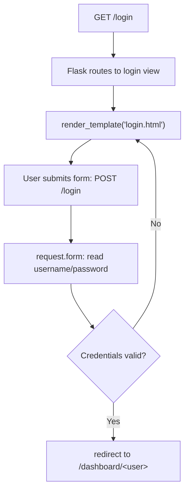

# 🎯 Day 35: Flask Web Framework

> *"FastAPI for APIs, Flask for web pages."*

---

## The "Never-Coded" Bridge

**APIs return JSON. But users want web pages.** They want to click buttons, submit forms, see styled interfaces.

**Flask gives you the full web experience.** It serves HTML pages with Jinja templates, handles form submissions, manages user sessions—everything needed for real web applications.

**When to use Flask vs FastAPI:**

| Need                    | Tool    |
| ----------------------- | ------- |
| JSON API for apps       | FastAPI |
| Website with HTML pages | Flask   |
| Admin dashboard         | Flask   |
| Mobile app backend      | FastAPI |

---

## The Technical Deep Dive

### Flask Basics

```python
from flask import Flask

app = Flask(__name__)


@app.route("/")
def home():
    return "<h1>Welcome to Flask!</h1>"


@app.route("/about")
def about():
    return "<h1>About Page</h1>"


if __name__ == "__main__":
    app.run(debug=True)
```

### Templates with Jinja2

### What is Jinja2 and Why Do We Need It?

**Jinja2** is a **templating engine** for Python — it lets you write HTML files with embedded Python-like expressions that get evaluated on the server and replaced with real values before the page is sent to the browser.

**The problem Jinja2 solves:** Without a templating engine, you'd have to build HTML strings manually in Python:

```python
# Bad: HTML hardcoded in Python — unmaintainable
html = "<h1>Hello, " + user_name + "!</h1>"
html += "<ul>"
for item in products:
    html += f"<li>{item['name']}: ${item['price']}</li>"
html += "</ul>"
```

This mixes logic with presentation, making both hard to maintain. Jinja2 separates concerns:

- Python code (routes.py): handles business logic and data
- HTML templates (templates/*.html): handles presentation and layout

**Jinja2 syntax quick reference:**

| Syntax | Purpose | Example |
|--------|---------|---------|
| `{{ variable }}` | Print a variable's value | `{{ user.name }}` |
| `` | Conditional block | `` |
| `` | Loop | `` |
| `` | Template inheritance | Reuse header/footer |
| `` | Define a replaceable block | Fill in per-page content |
| `{{ value \| filter }}` | Apply a filter | `{{ price \| round(2) }}` |

**How Flask connects Python to Jinja2:**

```python
from flask import Flask, render_template

app = Flask(__name__)

@app.route("/products")
def product_list():
    products = [
        {"name": "Laptop", "price": 999.99},
        {"name": "Mouse", "price": 29.99},
    ]
    # render_template() finds templates/products.html
    # and makes `products` available inside the template as {{ products }}
    return render_template("products.html", products=products)
```

**Corresponding template** (`templates/products.html`):

```html
<!DOCTYPE html>
<html>
<body>
  <h1>Product Catalog</h1>
  <ul>
    
    <li>{{ product.name }}: ${{ product.price }}</li>
    
  </ul>
</body>
</html>
```

Flask automatically looks for templates in the `templates/` subdirectory of your project.

```python
# app.py
from flask import Flask, render_template

app = Flask(__name__)


@app.route("/")
def home():
    return render_template("index.html", title="Home", user="Alice")


@app.route("/items")
def items():
    products = [
        {"name": "Laptop", "price": 999},
        {"name": "Mouse", "price": 29},
        {"name": "Keyboard", "price": 79},
    ]
    return render_template("items.html", products=products)
```

```html
<!-- templates/index.html -->
<!DOCTYPE html>
<html>
<head><title>{{ title }}</title></head>
<body>
    <h1>Hello, {{ user }}!</h1>
</body>
</html>

<!-- templates/items.html -->
<!DOCTYPE html>
<html>
<body>
    <h1>Products</h1>
    <ul>
    
        <li>{{ product.name }}: ${{ product.price }}</li>
    
    </ul>
</body>
</html>
```

### Handling Forms

```python
from flask import Flask, render_template, request, redirect, url_for

app = Flask(__name__)


@app.route("/login", methods=["GET", "POST"])
def login():
    if request.method == "POST":
        username = request.form["username"]
        password = request.form["password"]
        # Validate credentials...
        return redirect(url_for("dashboard", user=username))
    return render_template("login.html")


@app.route("/dashboard/<user>")
def dashboard(user):
    return f"<h1>Welcome, {user}!</h1>"
```

```html
<!-- templates/login.html -->
<form method="POST">
    <input type="text" name="username" placeholder="Username" required>
    <input type="password" name="password" placeholder="Password" required>
    <button type="submit">Login</button>
</form>
```



The same view function handles both `GET` (show the form) and `POST` (process the submission) — that's why `request.method` is checked at the top of `login()`.

### Dynamic Routes

```python
@app.route("/user/<username>")
def user_profile(username):
    return f"<h1>Profile: {username}</h1>"


@app.route("/post/<int:post_id>")
def show_post(post_id):
    return f"<h1>Post #{post_id}</h1>"
```

---

## Senior-Level Insights

### Project Structure

```
myapp/
├── app.py              # Main application
├── templates/          # HTML templates
│   ├── base.html       # Base template
│   ├── index.html
│   └── items.html
├── static/             # CSS, JS, images
│   ├── style.css
│   └── script.js
└── requirements.txt
```

### Template Inheritance

```html
<!-- templates/base.html -->
<!DOCTYPE html>
<html>
<head>
    <title>My App</title>
    <link rel="stylesheet" href="{{ url_for('static', filename='style.css') }}">
</head>
<body>
    <nav><!-- Common navigation --></nav>
    
</body>
</html>

<!-- templates/index.html -->

Home

    <h1>Welcome!</h1>

```

### Security Considerations

```python
# CSRF Protection with Flask-WTF
from flask_wtf import FlaskForm
from wtforms import StringField, PasswordField, SubmitField


class LoginForm(FlaskForm):
    username = StringField("Username")
    password = PasswordField("Password")
    submit = SubmitField("Login")


# Escape user input (Jinja2 does this by default)
# {{ user_input }}  <- Safe, auto-escaped
# {{ user_input|safe }}  <- Dangerous, renders raw HTML
```

### Deployment-Ready Baseline (Flask)

**API contract tests (minimum set):**

- Happy path: valid request returns expected status + response keys.
- Validation failure: bad/missing form or JSON input returns `400` with stable error fields.

```python
# tests/test_contact.py

def test_contact_happy_path(client):
    r = client.post("/contact", data={"name": "Ana", "email": "ana@example.com", "message": "Hi"})
    assert r.status_code in (200, 302)


def test_contact_validation_error(client):
    r = client.post("/contact", data={"name": "", "email": "bad", "message": ""})
    assert r.status_code == 400
    assert "error" in r.get_json()
```

**Structured logging with request IDs + error context:**

```python
import logging, uuid
from flask import g, request

logger = logging.getLogger("web")


@app.before_request
def attach_request_id():
    g.request_id = request.headers.get("X-Request-ID", str(uuid.uuid4()))


@app.after_request
def log_response(response):
    response.headers["X-Request-ID"] = g.request_id
    logger.info("request_complete", extra={"request_id": g.request_id, "path": request.path, "status": response.status_code})
    return response
```

**Security baseline (Phase 3 level):**

- Validate/sanitize form and JSON input (length, format, required fields).
- Store `SECRET_KEY`, DB creds, and API tokens in env vars; never commit them.
- Harden sessions (`SESSION_COOKIE_HTTPONLY=True`, `SESSION_COOKIE_SECURE=True` in prod).
- Restrict CORS origins and methods if frontend is hosted separately.

---

## Hands-on Lab

### Exercise 1: Simple Blog

**Business Scenario:** You're building a simple internal company blog where employees can post updates. The homepage lists all posts (title + author + date), and clicking a post shows the full content.

**Your Task:**

1. Create the Flask app with two routes: `GET /` (list posts) and `GET /post/<int:id>` (single post)
2. Create the `templates/blog_index.html` template (content provided below)
3. Create the `templates/post.html` template (content provided below)
4. Run with `flask run` and verify both pages work

**`templates/blog_index.html` (create this file):**

```html
<!DOCTYPE html>
<html lang="en">
<head><meta charset="UTF-8"><title>Company Blog</title></head>
<body>
  <h1>Company Blog</h1>
  <hr>
  
  <article>
    <h2><a href="/post/{{ post.id }}">{{ post.title }}</a></h2>
    <p><em>By {{ post.author }} on {{ post.date }}</em></p>
    <p>{{ post.summary }}</p>
    <hr>
  </article>
  
  <p>No posts yet.</p>
  
</body>
</html>
```

**`templates/post.html` (create this file):**

```html
<!DOCTYPE html>
<html lang="en">
<head><meta charset="UTF-8"><title>{{ post.title }}</title></head>
<body>
  <a href="/">&larr; Back to Blog</a>
  <h1>{{ post.title }}</h1>
  <p><em>By {{ post.author }} on {{ post.date }}</em></p>
  <hr>
  <p>{{ post.content }}</p>
</body>
</html>
```

```python
from flask import Flask, render_template

app = Flask(__name__)

posts = [
    {"title": "First Post", "content": "Hello World!", "author": "Alice"},
    {"title": "Flask Tutorial", "content": "Flask is great...", "author": "Bob"},
]


@app.route("/")
def index():
    return render_template("blog_index.html", posts=posts)


@app.route("/post/<int:post_id>")
def post_detail(post_id):
    if 0 <= post_id < len(posts):
        return render_template("post.html", post=posts[post_id])
    return "Post not found", 404


if __name__ == "__main__":
    app.run(debug=True)
```

**Expected Output:**

- `GET /` renders a list of blog posts with title, author, date, and summary
- `GET /post/1` renders the full content of the first post
- `GET /post/99` returns a 404 page (or redirect to `/` with a "Post not found" message)

### Exercise 2: Contact Form

**Business Scenario:** Your marketing site needs a "Contact Us" form. When a visitor submits their name, email, and message, the data should be validated (non-empty fields) and stored (or printed to console in this exercise). The page should show a success message after submission.

**Your Task:**

1. Create a Flask route `GET /contact` (render the form) and `POST /contact` (process it)
2. Create `templates/contact.html` (content provided below)
3. Validate that name, email, and message are all non-empty; if invalid, re-render the form with an error
4. On success, redirect to `/` or render a "Thank You" page

**`templates/contact.html` (create this file):**

```html
<!DOCTYPE html>
<html lang="en">
<head><meta charset="UTF-8"><title>Contact Us</title></head>
<body>
  <h1>Contact Us</h1>
  
  <p style="color:red;">{{ error }}</p>
  
  
  <p style="color:green;">{{ success }}</p>
  
  <form method="POST" action="/contact">
    <label>Name: <input type="text" name="name" required></label><br><br>
    <label>Email: <input type="email" name="email" required></label><br><br>
    <label>Message:<br>
      <textarea name="message" rows="4" cols="40" required></textarea>
    </label><br><br>
    <button type="submit">Send Message</button>
  </form>
</body>
</html>
```

**Expected Output:**

- `GET /contact` — renders the form
- `POST /contact` with valid data — prints `"New contact: Alice (alice@example.com): Hello!"` to console and redirects or shows success message
- `POST /contact` with empty fields — re-renders form with error: "All fields are required."

```python
from flask import Flask, render_template, request, flash, redirect, url_for

app = Flask(__name__)
app.secret_key = "your-secret-key"


@app.route("/contact", methods=["GET", "POST"])
def contact():
    if request.method == "POST":
        name = request.form.get("name")
        email = request.form.get("email")
        message = request.form.get("message")

        # Here you'd save or email the message
        flash(f"Thanks {name}! We'll respond to {email} soon.")
        return redirect(url_for("contact"))

    return render_template("contact.html")


if __name__ == "__main__":
    app.run(debug=True)
```

### Exercise 3: Data Dashboard

**Business Scenario:** The analytics team wants an internal web dashboard showing live sales statistics. The page should display a summary table of sales by region, total revenue, and the top 3 products — all rendered server-side from a Python data source.

**Your Task:**

1. Create a Flask route `GET /dashboard` that computes or loads sales data
2. Pass the data to `templates/dashboard.html`
3. Create the template (content provided below)
4. Display a summary table and key metrics

**`templates/dashboard.html` (create this file):**

```html
<!DOCTYPE html>
<html lang="en">
<head>
  <meta charset="UTF-8">
  <title>Sales Dashboard</title>
  <style>
    table { border-collapse: collapse; width: 100%; }
    th, td { border: 1px solid #ccc; padding: 8px 12px; text-align: left; }
    th { background-color: #4472C4; color: white; }
    tr:nth-child(even) { background-color: #f2f2f2; }
  </style>
</head>
<body>
  <h1>Sales Dashboard</h1>
  <h2>Total Revenue: ${{ total_revenue | round(2) }}</h2>
  <h3>Sales by Region</h3>
  <table>
    <tr><th>Region</th><th>Revenue</th><th>Transactions</th></tr>
    
    <tr>
      <td>{{ row.region }}</td>
      <td>${{ row.revenue | round(2) }}</td>
      <td>{{ row.transactions }}</td>
    </tr>
    
  </table>
  <h3>Top 3 Products</h3>
  <ol>
    
    <li>{{ product.name }}: ${{ product.revenue | round(2) }}</li>
    
  </ol>
</body>
</html>
```

**Expected Output:**

- `GET /dashboard` renders a styled HTML page with total revenue header, a "Sales by Region" table, and a top-3 products list

```python
from flask import Flask, render_template
import pandas as pd

app = Flask(__name__)


@app.route("/dashboard")
def dashboard():
    # Sample data
    data = {
        "total_users": 1250,
        "active_today": 342,
        "revenue": 15240.50,
        "top_products": [
            {"name": "Product A", "sales": 450},
            {"name": "Product B", "sales": 320},
            {"name": "Product C", "sales": 280},
        ],
    }
    return render_template("dashboard.html", **data)


if __name__ == "__main__":
    app.run(debug=True)
```

### Reliability & Maintainability Tasks

- Split configuration by environment (`development`, `testing`, `production`) and load settings from env vars instead of hardcoding secrets.
- Add structured logging (JSON or key-value) with request ID, route, status, latency, and user/session context where appropriate.
- Add centralized error-handling middleware for consistent responses and safe user-facing messages.

### Exercise 4: Failure Injection — Production Misconfiguration

**Business Scenario:** A colleague's Flask app raises an unhandled exception when certain URLs are visited. You need to identify the unhandled exception and add proper error handling.

**Starter Code (Broken — raises unhandled exception):**

```python
from flask import Flask, render_template

app = Flask(__name__)

products = {
    1: {"name": "Laptop", "price": 999.99},
    2: {"name": "Mouse", "price": 29.99},
}

@app.route("/product/<int:product_id>")
def product_detail(product_id):
    product = products[product_id]   # BUG: KeyError if product_id not in dict
    return render_template("product.html", product=product)

if __name__ == "__main__":
    app.run(debug=True)
```

**Your Task:**

1. Run the app and visit `http://localhost:5000/product/99` — what error do you see?
2. Fix the `KeyError` by using `products.get(product_id)` and returning a `404` if not found:

   ```python
   from flask import abort
   product = products.get(product_id)
   if product is None:
       abort(404)
   ```

3. Add a custom 404 error handler that renders a friendly "Product not found" page
4. Test that `GET /product/1` still works and `GET /product/99` now returns a clean 404

**Expected Output after fix:**

- `GET /product/1` → renders product detail page: "Laptop — $999.99"
- `GET /product/99` → renders custom 404 page: "Product not found. Return to homepage."

### Exercise 5: Definition of Done (DoD) Drill

For one Flask feature you built today, release only when all boxes are checked:

- [ ] Contract tests include one happy path and one validation failure.
- [ ] Request logs include `request_id`, route, status, and error context when failures happen.
- [ ] Input validation exists for all user-provided fields.
- [ ] Secrets/config are loaded from env vars and validated at startup.
- [ ] Session + CORS settings are explicitly reviewed for production defaults.
- [ ] User-facing errors are safe; debugging detail stays in logs.

Reuse this checklist in Phase 5 when deploying model-backed web services.

---

## Mastery Check

### Question 1: Flask vs FastAPI

When would you choose Flask over FastAPI?

<details>
<summary>Click for Answer</summary>

**Choose Flask when:**

- Building web pages with HTML/CSS
- Need template rendering (Jinja2)
- Building admin interfaces
- Traditional web applications

**Choose FastAPI when:**

- Building JSON APIs
- Mobile app backends
- Need async performance
- API documentation is priority

</details>

### Question 2: Templates

What does `{{ variable }}` vs `` mean in Jinja2?

<details>
<summary>Click for Answer</summary>

- `{{ }}` - Output variable value
- `` - Execute logic (if, for, etc.)

```html
{{ user.name }}           <!-- Outputs: Alice -->

   <!-- Loop -->
    {{ item }}


        <!-- Conditional -->
    Welcome back!

```

</details>

### Question 3: Form Security

What is CSRF and why does Flask-WTF help?

<details>
<summary>Click for Answer</summary>

**CSRF (Cross-Site Request Forgery):** Attacker tricks user's browser into submitting a form to your site.

**Flask-WTF protection:**

- Generates hidden token in each form
- Validates token on submission
- Blocks requests from other sites

```html
<form method="POST">
    {{ form.csrf_token }}  <!-- Hidden token -->
    {{ form.submit() }}
</form>
```

</details>

### Question 4: Static Files

How do you link to CSS in Flask templates?

<details>
<summary>Click for Answer</summary>

```html
<link rel="stylesheet" href="{{ url_for('static', filename='style.css') }}">
<script src="{{ url_for('static', filename='script.js') }}"></script>

```

Never hardcode paths—`url_for` handles URL generation correctly.

</details>

### Question 5: Debug Mode

Why should you never use `debug=True` in production?

<details>
<summary>Click for Answer</summary>

Debug mode:

- Shows detailed error traces (security risk)
- Allows code execution via debugger console
- Exposes internal application details

**Production:**

```python
# Development
app.run(debug=True)

# Production (use WSGI server)
# gunicorn app:app
```

</details>

---

## Summary

- ✅ Flask for web applications with HTML
- ✅ Jinja2 templates for dynamic content
- ✅ Form handling with GET/POST
- ✅ Template inheritance for DRY code
- ✅ Static files for CSS/JS/images

**Tomorrow**: Putting it all together in a case study.
