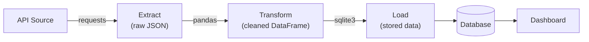

# 🎯 Day 36: Case Study - Complete ETL Pipeline

> *"The capstone: Extract, Transform, Load—then visualize."*

---

## The "Never-Coded" Bridge

**All month you've learned individual skills.** Cleaning data. Visualizations. APIs. Databases. Flask.

**Now you combine them all.** A real data pipeline:

1. **Extract**: Fetch data from an API
2. **Transform**: Clean and reshape it
3. **Load**: Store in a database
4. **Serve**: Display via web dashboard

**This is what data engineers actually do.** Every company needs pipelines that automatically gather, process, and present data.

---

## Before You Start

This case study now supports **two implementation tracks**:

- **Track A (core):** synchronous ETL + Flask dashboard (the baseline path).
- **Track B (advanced):** async ingestion + FastAPI-style patterns + Dockerized deployment.

To be successful, review:

- [Day 36B: Docker Fundamentals](../Day_36B_Docker_Fundamentals/README.md)
- [Day 36C: Async Python and FastAPI](../Day_36C_Async_Python_and_FastAPI/README.md)

If you are short on time, finish Track A first, then extend to Track B as your stretch implementation.

---

## The Technical Deep Dive

### Pipeline Architecture



### Step 1: Extract

```python
import requests
import pandas as pd


def extract_data(url):
    """Extract data from API."""
    response = requests.get(url, timeout=10)
    response.raise_for_status()
    data = response.json()
    print(f"Extracted {len(data)} records")
    return data


# Example: Using JSONPlaceholder (fake API)
url = "https://jsonplaceholder.typicode.com/users"
raw_data = extract_data(url)
```

### Track B Extract (Advanced): Async + Bounded Concurrency

```python
import asyncio
import httpx


async def fetch_json(client, url, semaphore):
    async with semaphore:
        response = await client.get(url, timeout=10.0)
        response.raise_for_status()
        return response.json()


async def extract_many(urls, concurrency=5):
    semaphore = asyncio.Semaphore(concurrency)
    async with httpx.AsyncClient() as client:
        tasks = [fetch_json(client, url, semaphore) for url in urls]
        return await asyncio.gather(*tasks)


urls = [
    "https://jsonplaceholder.typicode.com/users",
    "https://jsonplaceholder.typicode.com/posts",
    "https://jsonplaceholder.typicode.com/comments",
]
results = asyncio.run(extract_many(urls, concurrency=3))
print(f"Fetched {len(results)} payloads with bounded concurrency")
```

### Step 2: Transform

```python
import pandas as pd


def transform_data(raw_data):
    """Clean and transform raw data."""
    df = pd.DataFrame(raw_data)

    # Select relevant columns
    df = df[["id", "name", "email", "company"]]

    # Flatten nested structure
    df["company_name"] = df["company"].apply(lambda x: x["name"])
    df = df.drop("company", axis=1)

    # Clean text
    df["email"] = df["email"].str.lower()
    df["name"] = df["name"].str.strip()

    # Validate
    df = df.dropna()
    df = df.drop_duplicates(subset=["email"])

    print(f"Transformed to {len(df)} clean records")
    return df


clean_df = transform_data(raw_data)
print(clean_df.head())
```

### Step 3: Load

```python
import sqlite3


def load_data(df, db_path, table_name):
    """Load data into SQLite database."""
    conn = sqlite3.connect(db_path)

    # Replace existing data
    df.to_sql(table_name, conn, if_exists="replace", index=False)

    # Verify
    cursor = conn.cursor()
    cursor.execute(f"SELECT COUNT(*) FROM {table_name}")
    count = cursor.fetchone()[0]
    print(f"Loaded {count} records to {table_name}")

    conn.close()
    return count


load_data(clean_df, "pipeline.db", "users")
```

### Step 4: Serve (Dashboard)

```python
from flask import Flask, render_template
import sqlite3
import pandas as pd

app = Flask(__name__)


def get_data():
    conn = sqlite3.connect("pipeline.db")
    df = pd.read_sql("SELECT * FROM users", conn)
    conn.close()
    return df


@app.route("/")
def dashboard():
    df = get_data()
    stats = {
        "total_users": len(df),
        "companies": df["company_name"].nunique(),
        "users": df.to_dict("records"),
    }
    return render_template("dashboard.html", **stats)


if __name__ == "__main__":
    app.run(debug=True)
```

### Complete Pipeline

```python
import requests
import pandas as pd
import sqlite3
from datetime import datetime


class ETLPipeline:
    def __init__(self, source_url, db_path, table_name):
        self.source_url = source_url
        self.db_path = db_path
        self.table_name = table_name

    def extract(self):
        """Fetch data from source."""
        print(f"[{datetime.now()}] Extracting from {self.source_url}")
        response = requests.get(self.source_url, timeout=30)
        response.raise_for_status()
        return response.json()

    def transform(self, data):
        """Clean and transform data."""
        print(f"[{datetime.now()}] Transforming {len(data)} records")
        df = pd.DataFrame(data)

        # Your transformation logic here
        df = df.dropna()
        df = df.drop_duplicates()

        return df

    def load(self, df):
        """Load to database."""
        print(f"[{datetime.now()}] Loading to {self.db_path}")
        conn = sqlite3.connect(self.db_path)
        df.to_sql(self.table_name, conn, if_exists="replace", index=False)
        conn.close()
        return len(df)

    def run(self):
        """Execute full pipeline."""
        try:
            raw = self.extract()
            cleaned = self.transform(raw)
            count = self.load(cleaned)
            print(f"Pipeline complete: {count} records processed")
            return True
        except Exception as e:
            print(f"Pipeline failed: {e}")
            return False


# Run pipeline
pipeline = ETLPipeline(
    source_url="https://jsonplaceholder.typicode.com/posts",
    db_path="blog.db",
    table_name="posts",
)
pipeline.run()
```

---

## Senior-Level Insights

### Pipeline Design Principles

| Principle   | Implementation                  |
| ----------- | ------------------------------- |
| Idempotent  | Running twice gives same result |
| Observable  | Logging at each step            |
| Recoverable | Save intermediate state         |
| Testable    | Each step can run independently |

### Error Handling

```python
def robust_extract(url, retries=3):
    for attempt in range(retries):
        try:
            response = requests.get(url, timeout=30)
            response.raise_for_status()
            return response.json()
        except requests.RequestException as e:
            print(f"Attempt {attempt + 1} failed: {e}")
            if attempt == retries - 1:
                raise
            time.sleep(2**attempt)  # Exponential backoff
```

### Scheduling Options

| Tool                   | Use Case               |
| ---------------------- | ---------------------- |
| cron                   | Simple Unix scheduling |
| Airflow                | Complex DAG workflows  |
| Prefect                | Modern Python-native   |
| Windows Task Scheduler | Windows environments   |

---

## Hands-on Lab

## Implementation Tracks & Required Deliverables

### Track A (Core)

- Build the existing synchronous ETL pipeline (`requests` + `pandas` + `sqlite3`).
- Serve results with Flask.
- Demonstrate idempotent reruns and basic error handling.

### Track B (Advanced)

- Add async extraction using `httpx.AsyncClient` with bounded concurrency.
- Containerize API + database for reproducible local deployment.
- Add operational runbook notes for local debugging.

### Explicit Deliverables (submit all)

1. **`Dockerfile` + `docker-compose.yml` skeleton (API + DB)**

```dockerfile
# Dockerfile
FROM python:3.11-slim
WORKDIR /app

COPY requirements.txt .
RUN pip install --no-cache-dir -r requirements.txt

COPY . .
EXPOSE 8000
CMD ["python", "app.py"]
```

```yaml
# docker-compose.yml
version: "3.9"
services:
  api:
    build: .
    ports:
      - "8000:8000"
    environment:
      - DATABASE_URL=postgresql://etl:etl@db:5432/etl_db
    depends_on:
      - db

  db:
    image: postgres:16
    environment:
      POSTGRES_USER: etl
      POSTGRES_PASSWORD: etl
      POSTGRES_DB: etl_db
    ports:
      - "5432:5432"
```

1. **Async extraction example with bounded concurrency (`httpx`)**
   - Reuse/adapt the Track B extract snippet above.

2. **Minimal runbook**
   - Local run commands:
     - `python pipeline.py`
     - `python app.py` (or `uvicorn app:app --reload` for async API variant)
     - `docker compose up --build`
   - Health-check endpoint:
     - `GET /health` returns `{"status": "ok"}` once API and DB are reachable.
   - Troubleshooting checklist:
     - Verify API key/env vars are loaded.
     - Check DB connectivity and port conflicts.
     - Confirm migration/table creation happened before serving requests.
     - Inspect logs for timeout/retry failures during extraction.
     - Validate duplicate protection/idempotency settings.

### ETL Load Strategy — Full Load vs Incremental Load

The case study uses `if_exists="replace"` in several places, which is a **Full Load** strategy. It is correct for small reference datasets but wrong for large or audit-sensitive tables:

| Strategy | How It Works | When to Use | Risk |
|----------|-------------|-------------|------|
| **Full Load** | Delete everything, reload all data | Small tables (<10K rows), reference data (product catalog, config) | Loses history; slow for large tables |
| **Append** | Add new rows, keep old ones | Immutable event logs, audit trails | Table grows forever; creates duplicates if re-run |
| **Incremental (Upsert)** | Insert new rows, update changed rows | Most business data — orders, inventory, customer profiles | Requires a unique key; most complex to implement |
| **Snapshot** | Add rows with a `snapshot_date` column | Slowly changing dimensions, historical state reporting | Storage grows proportionally |

**The weather pipeline uses Full Load correctly** — we only care about today's conditions. But for a **sales pipeline**, use Incremental to avoid losing history:

```python
# Incremental upsert — does not overwrite existing orders
conn = sqlite3.connect("sales.db")
conn.execute("""
    CREATE TABLE IF NOT EXISTS orders (
        order_id TEXT PRIMARY KEY,
        customer TEXT,
        amount REAL,
        updated_at TEXT
    )
""")
for order in new_orders:
    conn.execute("""
        INSERT OR REPLACE INTO orders (order_id, customer, amount, updated_at)
        VALUES (?, ?, ?, ?)
    """, (order["id"], order["customer"], order["amount"], order["updated_at"]))
conn.commit()
```

### Exercise 1: Weather Pipeline

**Business Scenario:** A logistics company's route planning team needs daily weather data to optimize delivery schedules. Drivers need to know wind speed and precipitation forecasts for 5 key cities. You'll build a pipeline that fetches weather data from the Open-Meteo API (free, no key required), processes it, and stores it in SQLite.

**Your Task:**

1. Fetch current weather data for 5 cities using the Open-Meteo API: `https://api.open-meteo.com/v1/forecast?latitude={lat}&longitude={lon}&current_weather=true`
2. Extract: city name, temperature (°C), windspeed (km/h), and timestamp
3. Store in SQLite table `weather_log` with columns: city, temperature, windspeed, fetched_at
4. Print the daily briefing in a formatted table

**City coordinates to use:**

```python
cities = [
    {"name": "New York",    "lat": 40.71, "lon": -74.01},
    {"name": "Los Angeles", "lat": 34.05, "lon": -118.24},
    {"name": "Chicago",     "lat": 41.88, "lon": -87.63},
    {"name": "Houston",     "lat": 29.76, "lon": -95.37},
    {"name": "Phoenix",     "lat": 33.45, "lon": -112.07},
]
```

**Expected Output:**

```
=== Daily Weather Briefing — 2024-01-15 08:00 UTC ===

City           | Temp (°C) | Wind (km/h) | Fetched At
---------------|-----------|-------------|------------------
New York       |      -2.1 |        18.5 | 2024-01-15 08:01
Los Angeles    |      14.3 |         8.2 | 2024-01-15 08:01
Chicago        |      -5.8 |        22.1 | 2024-01-15 08:01
Houston        |       9.4 |        12.6 | 2024-01-15 08:02
Phoenix        |      11.7 |         6.4 | 2024-01-15 08:02

Pipeline complete. 5 records written to weather_log.db
```

```python
import requests
import pandas as pd
import sqlite3


def weather_pipeline():
    # Note: Use your own API key from openweathermap.org
    cities = ["London", "Paris", "Berlin", "Tokyo", "New York"]
    api_key = "YOUR_API_KEY"

    all_weather = []
    for city in cities:
        url = f"http://api.openweathermap.org/data/2.5/weather?q={city}&appid={api_key}"
        response = requests.get(url)
        if response.status_code == 200:
            data = response.json()
            all_weather.append(
                {
                    "city": city,
                    "temp_kelvin": data["main"]["temp"],
                    "humidity": data["main"]["humidity"],
                    "description": data["weather"][0]["description"],
                }
            )

    df = pd.DataFrame(all_weather)
    df["temp_celsius"] = df["temp_kelvin"] - 273.15

    conn = sqlite3.connect("weather.db")
    df.to_sql("current_weather", conn, if_exists="replace", index=False)
    conn.close()

    return df


# Run and inspect
df = weather_pipeline()
print(df)
```

### Exercise 2: GitHub Stats Pipeline

**Business Scenario:** The engineering team tracks the health of their top open-source dependencies. Every week, the tech lead wants a report showing stars, open issues, and last push date for the team's 5 most-used repos. This pipeline automates that report.

**Your Task:**

1. Use the GitHub REST API to fetch repo data for at least 5 repos (use public endpoints, no auth needed for basic data)
2. For each repo: extract name, stars, open issues, last push date
3. Store in a SQLite database table `github_stats` (upsert to avoid duplicates)
4. Display as a formatted report

**Repos to use:**

```python
repos = [
    "psf/requests",
    "pandas-dev/pandas",
    "tiangolo/fastapi",
    "pallets/flask",
    "docker/compose"
]
```

**Expected Output:**

```
=== GitHub Dependency Health Report — 2024-01-15 ===

Repository         | Stars  | Open Issues | Last Push
-------------------|--------|-------------|------------------
requests           | 51,234 |         287 | 2024-01-14
pandas             | 41,876 |       3,542 | 2024-01-15
fastapi            | 72,310 |         643 | 2024-01-15
flask              | 67,891 |          54 | 2024-01-13
compose            | 33,412 |         312 | 2024-01-12

5 records saved to github_stats.db
```

```python
import requests
import pandas as pd
import sqlite3


def github_pipeline(username):
    # Extract
    url = f"https://api.github.com/users/{username}/repos"
    response = requests.get(url, params={"per_page": 100})
    repos = response.json()

    # Transform
    df = pd.DataFrame(
        [
            {
                "name": r["name"],
                "stars": r["stargazers_count"],
                "forks": r["forks_count"],
                "language": r["language"],
                "updated": r["updated_at"][:10],
            }
            for r in repos
        ]
    )

    df = df.dropna(subset=["language"])
    df = df.sort_values("stars", ascending=False)

    # Load
    conn = sqlite3.connect("github.db")
    df.to_sql("repositories", conn, if_exists="replace", index=False)
    conn.close()

    # Stats
    print(f"Total repos: {len(df)}")
    print(f"Total stars: {df['stars'].sum()}")
    print(f"Top language: {df['language'].value_counts().idxmax()}")

    return df


df = github_pipeline("python")
```

### Exercise 3: Full Dashboard

**Business Scenario:** The logistics company wants a unified operations dashboard combining the weather data and GitHub dependency stats pipelines into a single internal web page. The Flask app reads from the SQLite databases built in Exercises 1 and 2 and renders styled HTML tables.

**Your Task:**

1. Create a Flask app with route `GET /` that reads from both SQLite databases
2. Pass `repos` (list of dicts) and `languages` (list of dicts) to `templates/index.html`
3. Create `templates/index.html` (content provided below) — Flask looks for templates in the `templates/` subdirectory
4. Run with `flask run` and verify the dashboard renders correctly

**`templates/index.html` (create this file):**

```html
<!DOCTYPE html>
<html lang="en">
<head>
  <meta charset="UTF-8">
  <title>Operations Dashboard</title>
  <style>
    body { font-family: Arial, sans-serif; max-width: 960px; margin: 40px auto; color: #333; }
    table { border-collapse: collapse; width: 100%; margin-bottom: 30px; }
    th { background: #2c3e50; color: white; padding: 10px 14px; text-align: left; }
    td { border-bottom: 1px solid #ddd; padding: 8px 14px; }
    tr:hover { background: #f5f5f5; }
    h2 { color: #2c3e50; border-bottom: 2px solid #3498db; padding-bottom: 5px; }
    .stat { font-size: 1.2em; font-weight: bold; color: #2980b9; }
  </style>
</head>
<body>
  <h1>Operations Dashboard</h1>
  <p>Showing top <span class="stat">{{ total_repos }}</span> repositories</p>

  <h2>Top Repositories by Stars</h2>
  <table>
    <tr><th>Repository</th><th>Language</th><th>Stars</th><th>Open Issues</th></tr>
    
    <tr>
      <td>{{ repo.name }}</td>
      <td>{{ repo.language or "N/A" }}</td>
      <td>{{ "{:,}".format(repo.stars) }}</td>
      <td>{{ repo.open_issues }}</td>
    </tr>
    
  </table>

  <h2>Stars by Language (Top 5)</h2>
  <table>
    <tr><th>Language</th><th>Repos</th><th>Total Stars</th></tr>
    
    <tr>
      <td>{{ lang.language or "Unknown" }}</td>
      <td>{{ lang.count }}</td>
      <td>{{ "{:,}".format(lang.stars) }}</td>
    </tr>
    
  </table>
</body>
</html>
```

**Expected Output:**

- `GET /` renders a styled HTML page with two tables: "Top Repositories by Stars" and "Stars by Language"
- Each table is populated with live data from `github.db`

```python
# app.py
from flask import Flask, render_template
import sqlite3
import pandas as pd

app = Flask(__name__)


@app.route("/")
def index():
    conn = sqlite3.connect("github.db")
    df = pd.read_sql("SELECT * FROM repositories ORDER BY stars DESC LIMIT 10", conn)

    by_language = pd.read_sql(
        """
        SELECT language, COUNT(*) as count, SUM(stars) as stars
        FROM repositories
        GROUP BY language
        ORDER BY stars DESC
        LIMIT 5
    """,
        conn,
    )

    conn.close()

    return render_template(
        "index.html",
        repos=df.to_dict("records"),
        languages=by_language.to_dict("records"),
        total_repos=len(df),
    )


if __name__ == "__main__":
    app.run(debug=True)
```

### Reliability & Maintainability Tasks

- Add data quality checks at transform/load boundaries: null-rate thresholds, uniqueness constraints, and freshness SLA checks.
- Complete an idempotency challenge: rerun the same batch twice and prove no duplicate or conflicting records are created.
- Add an incident postmortem template (`impact`, `timeline`, `root cause`, `detection gaps`, `action items`, `owner`, `due date`).

### Exercise 4: Failure Injection — Stale + Duplicate Batch

**Business Scenario:** The weather pipeline has been running in production for weeks and silently accumulating duplicate records. The `if_exists="append"` strategy causes the `current_weather` table to grow by 5 rows every run (5→10→15→20…). The data freshness check also never fires because old records are never replaced. Debug and fix both issues.

**Starter Code (Broken — has the duplicate accumulation bug):**

```python
import sqlite3
import pandas as pd
from datetime import datetime, timedelta

def fetch_weather_batch() -> pd.DataFrame:
    """Simulates fetching weather data (same cities each run)."""
    return pd.DataFrame({
        "city": ["New York", "Los Angeles", "Chicago", "Houston", "Phoenix"],
        "temperature": [-2.1, 14.3, -5.8, 9.4, 11.7],
        "windspeed": [18.5, 8.2, 22.1, 12.6, 6.4],
        # BUG 1: Using yesterday's timestamp (stale data) instead of now
        "fetched_at": (datetime.utcnow() - timedelta(days=1)).isoformat()
    })

def save_weather(df: pd.DataFrame):
    conn = sqlite3.connect("weather_bug.db")

    # BUG 2: "append" keeps adding rows every run — table grows indefinitely!
    df.to_sql("current_weather", conn, if_exists="append", index=False)

    row_count = pd.read_sql(
        "SELECT COUNT(*) as n FROM current_weather", conn
    ).iloc[0]["n"]
    print(f"After run: table has {row_count} rows")  # Will be 5, 10, 15, 20...
    conn.close()

# Run 3 times and watch the table grow
for i in range(3):
    save_weather(fetch_weather_batch())
```

**Your Debugging Goals:**

1. Run the code 3 times — confirm the table grows from 5 → 10 → 15 rows
2. Fix Bug 1: update `fetched_at` to use `datetime.utcnow()` (current time)
3. Fix Bug 2: replace `if_exists="append"` with `if_exists="replace"` so each run resets the table to exactly 5 rows
4. Add a freshness assertion after loading: if any row's `fetched_at` is more than 1 hour old, raise a `ValueError("Stale data detected")`
5. Verify that after 3 runs of the fixed code, the table still has exactly 5 rows

**Expected Output after fix:**

```
After run: table has 5 rows
After run: table has 5 rows  ← upsert replaced existing records
After run: table has 5 rows  ← still 5, no duplicates!
```

---

## Mastery Check

### Question 1: ETL Order

Why is it Extract → Transform → Load, not Transform → Extract → Load?

<details>
<summary>Click for Answer</summary>

You can't transform what you don't have!

1. **Extract**: Get raw data from source
2. **Transform**: Clean and reshape (requires data)
3. **Load**: Store final result

Logic requires this order.

</details>

### Question 2: Idempotent Pipelines

What makes a pipeline "idempotent"?

<details>
<summary>Click for Answer</summary>

Running it multiple times produces the same result as running once.

**Idempotent**: `if_exists="replace"` in `to_sql()`
**Not idempotent**: `if_exists="append"` (duplicates data)

Idempotent pipelines are safer for reruns and recovery.

</details>

### Question 3: Error Recovery

Pipeline fails during Transform. What should happen?

<details>
<summary>Click for Answer</summary>

Good pipeline design:

1. **Log the error** with context
2. **Don't corrupt existing data** (Load didn't run)
3. **Save extracted data** so re-run doesn't re-fetch
4. **Alert operators** if scheduled

```python
try:
    raw = extract()
    save_checkpoint(raw, "raw_data.json")  # Recovery point
    cleaned = transform(raw)
    load(cleaned)
except TransformError as e:
    log_error(e)
    alert_team()
    # Raw data saved, can retry transform only
```

</details>

### Question 4: Scheduling

Your pipeline must run daily at 2 AM. How?

<details>
<summary>Click for Answer</summary>

Options:

**Linux/Mac (cron):**

```bash
0 2 * * * /usr/bin/python3 /path/to/pipeline.py
```

**Windows (Task Scheduler):**

- Create task with trigger at 2:00 AM daily
- Action: Run python pipeline.py

**Python scheduler:**

```python
import schedule

schedule.every().day.at("02:00").do(pipeline.run)
```

**Production**: Use Airflow, Prefect, or cloud schedulers.

</details>

### Question 5: Scale

Your pipeline processes 100 records now. How do you handle 1 million?

<details>
<summary>Click for Answer</summary>

1. **Batch processing**: Process in chunks, not all at once
2. **Streaming**: Process as data arrives
3. **Parallel**: Multiple workers
4. **Pagination**: API requests in pages
5. **Database optimization**: Indexes, bulk inserts

```python
# Chunked loading
for chunk in pd.read_json(file, chunksize=10000):
    cleaned = transform(chunk)
    conn.execute("INSERT INTO ...", cleaned)
```

</details>

### Question 6: Architecture Tradeoffs

You need to productionize this project for a small team. Which architecture do you choose first, and why?

- **Option A:** Flask + synchronous ETL + local process deployment
- **Option B:** FastAPI + async ingestion + containerized deployment

In your answer, justify tradeoffs in:

1. Team complexity and learning curve
2. Throughput and latency needs
3. Operational consistency across environments
4. Debuggability and incident response

<details>
<summary>Click for Sample Rubric</summary>

Strong answers are context-dependent, but should show:

- **Option A is often best first** when team size is small, traffic is modest, and speed of delivery matters.
- **Option B is often best** when concurrency matters (many network-bound calls), deployment consistency is critical, and the team can operate containers confidently.
- A staged path is valid: launch with Flask sync baseline, then migrate extraction/API layers to async + containers as scale and reliability requirements grow.

</details>

---

## Summary

- ✅ ETL = Extract, Transform, Load
- ✅ APIs → Pandas → SQLite → Flask
- ✅ Error handling at each step
- ✅ Idempotent design for reruns
- ✅ Complete data pipeline architecture

**Phase 3 Complete!** You've mastered data engineering and web development fundamentals.
