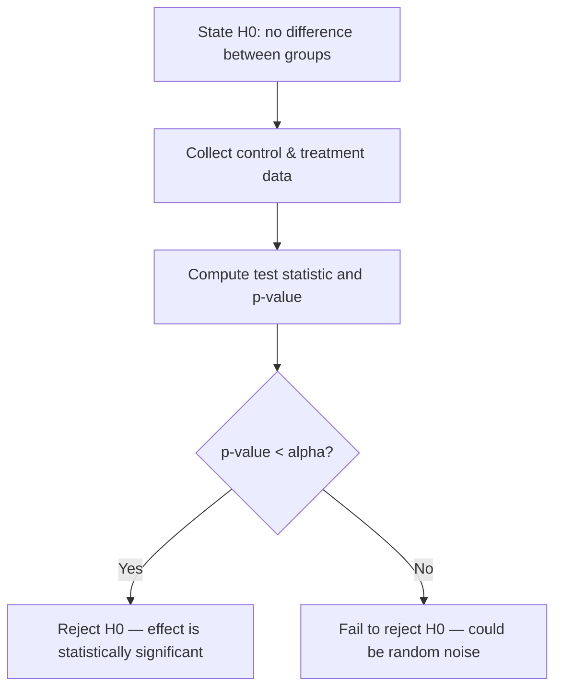

# 🎲 Day 37B: Probability & Statistics for Machine Learning

> *"All of machine learning is just probability theory with a GPU."*

---

## The "Never-Coded" Bridge

**Imagine your CFO asks:** "What's the probability this customer churns next month?"

Before ML, you'd guess. After this lesson, you'll know the mathematical vocabulary to answer precisely — using probability distributions, Bayes' theorem, and statistical inference.

**Why this matters for ML:**

- **Linear regression** assumes normally distributed errors
- **Naive Bayes classifier** is built entirely on Bayes' theorem
- **A/B testing** uses hypothesis testing to decide if a new feature works
- **Probabilistic forecasting** (e.g., demand planning) requires distribution modeling
- **Day 54 (Probabilistic Modeling)** directly builds on today's foundations

Every time a model outputs a **confidence score**, it's applying probability theory. Today you'll understand what that actually means.

---

## The Technical Deep Dive

### Key Probability & Statistics Terms

Before diving into code, make sure these terms are clear — they appear constantly in ML papers, documentation, and business conversations.

| Term | Definition | ML Relevance |
|------|-----------|--------------|
| **Conditional probability** | P(A\|B) = probability of A given B has occurred | Naïve Bayes, feature dependence |
| **Independence** | A and B are independent if P(A\|B) = P(A) | Key assumption in many models |
| **Likelihood** | P(data \| parameters) — probability of observed data given a model | Maximum likelihood estimation (MLE) |
| **Prior** | Belief about parameters before seeing data, P(θ) | Bayesian models, regularization as prior |
| **Posterior** | Updated belief after seeing data: P(θ\|data) ∝ Likelihood × Prior | Result of Bayesian inference |
| **Standard Error** | Std dev of the sampling distribution of a statistic: SE = σ/√n | Measures estimation precision |
| **Confidence Interval** | Range that captures the true parameter with stated coverage frequency (not a probability statement about parameters) | Report model uncertainty |
| **Laplace smoothing** | Adding a small count α to each class to avoid zero probabilities | Prevents log(0) in Naïve Bayes |
| **p-value** | Probability of data this extreme if H₀ is true | Hypothesis testing — not probability H₀ is false |
| **α (significance level)** | 0.05 convention: arbitrary threshold set by Fisher; 0.05 chosen so ~1 in 20 false positives — always report the actual p-value | Statistical decisions |
| **95% confidence level** | Convention: CI constructed this way captures true value 95% of times under repeated sampling | Not a 95% probability the parameter is in this specific interval |

---

### Probability Fundamentals

The core vocabulary in compact form:

- $P(A) \in [0, 1]$ — probability of event $A$.
- $P(A \mid B) = \dfrac{P(A \cap B)}{P(B)}$ — conditional probability.
- $P(A \cup B) = P(A) + P(B) - P(A \cap B)$ — union (inclusion–exclusion).
- **Law of total probability**: $P(E) = \sum_i P(E \mid H_i) \, P(H_i)$.
- **Bayes' theorem**: $P(H \mid E) = \dfrac{P(E \mid H) \, P(H)}{P(E)}$.

The spam example below uses these directly. With $P(\text{spam}) = 0.20$, $P(\text{"free"} \mid \text{spam}) = 0.40$, and $P(\text{"free"} \mid \text{ham}) = 0.02$:

$$
P(\text{spam} \mid \text{"free"}) = \frac{P(\text{"free"} \mid \text{spam}) \, P(\text{spam})}{P(\text{"free"})} \approx 0.82
$$

```python
import numpy as np
from scipy import stats
import matplotlib.pyplot as plt

# --- Basic probability vocabulary ---
# P(A): probability of event A (between 0 and 1)
# P(A|B): conditional probability — "probability of A given B occurred"
# P(A ∩ B): joint probability — "A and B both happen"
# P(A ∪ B): union — "A or B happens" = P(A) + P(B) - P(A∩B)

# Example: email spam classifier
p_spam = 0.20         # 20% of emails are spam
p_word_given_spam = 0.40  # "free" appears in 40% of spam
p_word_given_ham = 0.02   # "free" appears in 2% of legit emails

# P(contains "free") = P(spam)*P(word|spam) + P(ham)*P(word|ham)
p_word = p_spam * p_word_given_spam + (1 - p_spam) * p_word_given_ham
print(f"P('free' in email): {p_word:.3f}")

# Bayes' Theorem: P(spam|word) = P(word|spam) * P(spam) / P(word)
p_spam_given_word = (p_word_given_spam * p_spam) / p_word
print(f"P(spam | contains 'free'): {p_spam_given_word:.3f}")
# → ~82% chance an email with "free" is spam
```

### Probability Distributions

Three distributions power 80% of ML models. Know them cold.

**Normal (Gaussian)** with mean $\mu$ and standard deviation $\sigma$ has density:

$$
f(x \mid \mu, \sigma) = \frac{1}{\sigma\sqrt{2\pi}} \, \exp\!\left(-\frac{(x - \mu)^2}{2\sigma^2}\right)
$$

The **z-score** rescales any value to standard-normal units:

$$
z = \frac{x - \mu}{\sigma}
$$

**Binomial** counts $k$ successes in $n$ independent Bernoulli trials with success probability $p$:

$$
P(X = k) = \binom{n}{k} p^k (1-p)^{n-k}, \qquad \mathbb{E}[X] = np, \quad \mathrm{Var}(X) = np(1-p)
$$

**Poisson** counts rare events with rate $\lambda$ per interval:

$$
P(X = k) = \frac{\lambda^k e^{-\lambda}}{k!}, \qquad \mathbb{E}[X] = \mathrm{Var}(X) = \lambda
$$

```python
# --- 1. Normal (Gaussian) Distribution ---
# Shape: bell curve. Mean μ, standard deviation σ.
# Used for: regression errors, feature distributions, confidence intervals

mu, sigma = 0, 1  # standard normal
normal_dist = stats.norm(loc=mu, scale=sigma)

print("Normal Distribution:")
print(f"  Mean: {normal_dist.mean():.2f}")
print(f"  P(X ≤ 0): {normal_dist.cdf(0):.3f}")      # 50%
print(f"  P(-1 ≤ X ≤ 1): {normal_dist.cdf(1) - normal_dist.cdf(-1):.3f}")  # 68% rule

# Standardization (Z-score): convert any normal distribution to standard
revenue = np.array([10000, 15000, 12000, 18000, 8000])
z_scores = (revenue - revenue.mean()) / revenue.std()
print(f"\nRevenue z-scores: {z_scores.round(2)}")
# Z > 2 or Z < -2 → outlier (see Day 45: Feature Engineering)


# --- 2. Binomial Distribution ---
# Shape: discrete counts of successes in n trials.
# Used for: click rates, conversion rates, binary outcomes

n_customers = 1000      # trials
p_convert = 0.05        # success probability
binomial = stats.binom(n=n_customers, p=p_convert)

print("\nBinomial Distribution (conversions from 1000 visitors):")
print(f"  Expected conversions: {binomial.mean():.0f}")
print(f"  Std dev: {binomial.std():.1f}")
print(f"  P(≥ 60 conversions): {1 - binomial.cdf(59):.4f}")


# --- 3. Poisson Distribution ---
# Shape: counts of rare events per time interval.
# Used for: customer arrivals, server requests, defect rates

avg_orders_per_hour = 12  # lambda (λ)
poisson = stats.poisson(mu=avg_orders_per_hour)

print("\nPoisson Distribution (orders per hour, λ=12):")
print(f"  P(exactly 12 orders): {poisson.pmf(12):.4f}")
print(f"  P(≤ 10 orders): {poisson.cdf(10):.4f}")
print(f"  P(> 15 orders — need extra staff): {1 - poisson.cdf(15):.4f}")
```

### The Central Limit Theorem (CLT)

The CLT is the mathematical reason sampling works — and why ML validation is valid. For i.i.d. samples $X_1, \ldots, X_n$ with mean $\mu$ and finite variance $\sigma^2$, the sample mean $\bar{X}_n = \tfrac{1}{n}\sum_{i=1}^{n} X_i$ has approximate distribution:

$$
\bar{X}_n \;\xrightarrow{\,n \to \infty\,}\; \mathcal{N}\!\left(\mu, \, \frac{\sigma^2}{n}\right)
$$

In particular, the **standard error of the mean** shrinks as $\sigma / \sqrt{n}$.

```python
import numpy as np
import matplotlib.pyplot as plt

# CLT: The sampling distribution of the mean approaches Normal,
# regardless of the original distribution's shape.

# Start with a highly skewed distribution (e.g., customer order values)
np.random.seed(42)
population = np.random.exponential(scale=50, size=100_000)  # skewed right

print(f"Population mean: ${population.mean():.2f}")
print(f"Population std: ${population.std():.2f}")
print(f"Population skew: {stats.skew(population):.2f}")  # Highly skewed!

# Draw many samples and compute their means
sample_means = []
sample_size = 30  # Small sample size!

for _ in range(10_000):
    sample = np.random.choice(population, size=sample_size)
    sample_means.append(sample.mean())

sample_means = np.array(sample_means)

print(f"\nSampling distribution of means (n={sample_size}):")
print(f"  Mean of means: ${sample_means.mean():.2f}")  # ≈ population mean
print(f"  Std of means (SE): ${sample_means.std():.2f}")  # ≈ σ/√n
print(f"  Skew of means: {stats.skew(sample_means):.3f}")  # ≈ 0 (Normal!)

# Theoretical standard error
theoretical_se = population.std() / np.sqrt(sample_size)
print(f"\nTheoretical SE (σ/√n): ${theoretical_se:.2f}")

# Why this matters for ML:
# Cross-validation computes mean accuracy across k folds.
# CLT guarantees this mean is normally distributed → valid confidence intervals!
```

> **⚠️ Important Qualification — CLT does not guarantee textbook CIs here**
>
> The CLT says that *with enough independent samples*, the sampling distribution of the mean approaches normal. Three real-world conditions complicate this for cross-validation scores:
>
> 1. **Finite sample size**: CLT is an asymptotic result. With n < 30 or heavily skewed data, normality may not hold.
> 2. **Fold dependence**: CV folds share training samples, so scores are not independent — the standard normal CI formula underestimates uncertainty.
> 3. **Distribution of the metric**: Accuracy bounded in [0,1] violates the unbounded normal assumption at extreme values.
>
> **Better practice**: Report the mean ± standard deviation of CV scores; use bootstrap confidence intervals for small datasets; use Nadeau–Bengio correction for repeated CV.

### Hypothesis Testing for Business Decisions



For a two-proportion test comparing conversion rates $\hat{p}_C$ (control) and $\hat{p}_T$ (treatment), the pooled estimate and z-statistic are:

$$
\hat{p} = \frac{x_C + x_T}{n_C + n_T}, \qquad
z = \frac{\hat{p}_T - \hat{p}_C}{\sqrt{\hat{p}(1 - \hat{p}) \left(\tfrac{1}{n_C} + \tfrac{1}{n_T}\right)}}
$$

A two-tailed p-value is $p = 2 \cdot \big(1 - \Phi(|z|)\big)$, where $\Phi$ is the standard-normal CDF.

```python
from scipy import stats
import numpy as np

# Scenario: You redesigned your checkout page.
# Control group (old): 500 users, 47 converted (9.4%)
# Treatment group (new): 500 users, 63 converted (12.6%)
# Is the improvement real, or just random noise?

control_converts = 47
control_n = 500
treatment_converts = 63
treatment_n = 500

# Two-proportion z-test
p_control = control_converts / control_n
p_treatment = treatment_converts / treatment_n

# Pooled proportion
p_pool = (control_converts + treatment_converts) / (control_n + treatment_n)

# Standard error of difference
se = np.sqrt(p_pool * (1 - p_pool) * (1/control_n + 1/treatment_n))

# Z-statistic
z = (p_treatment - p_control) / se

# Two-tailed p-value
p_value = 2 * (1 - stats.norm.cdf(abs(z)))

print("A/B Test Results:")
print(f"  Control conversion rate: {p_control:.1%}")
print(f"  Treatment conversion rate: {p_treatment:.1%}")
print(f"  Lift: +{(p_treatment - p_control) / p_control:.1%}")
print(f"  Z-statistic: {z:.3f}")
print(f"  P-value: {p_value:.4f}")
print(f"  Significant at α=0.05: {'✅ YES' if p_value < 0.05 else '❌ NO'}")
# → p < 0.05 → the new checkout is genuinely better!
```

> **⚠️ What p < 0.05 actually tells you (and what it doesn't)**
>
> A p-value of 0.03 means: "If the null hypothesis were true (no difference), there is only a 3% chance of seeing a result this extreme or more extreme by random chance." It does **not** mean:
>
> - The effect is large enough to matter to the business
> - The result will replicate in production
> - The alternative hypothesis is 97% likely to be true
>
> **What you also need:**
>
> - **Effect size**: How large is the difference? (e.g., Cohen's d, lift percentage)
> - **Confidence interval**: A 95% CI of [+0.1%, +15%] conversion rate lift is very different from [+0.5%, +2%]
> - **Practical significance**: Does the estimated lift justify rollout cost?
> - **Statistical power**: Was the experiment large enough to detect a meaningful effect?
> - **Multiple testing**: Running 20 tests at α=0.05 expects one false positive by chance; apply Bonferroni or FDR correction

---

## 💼 MBA Context: Where This Shows Up

| Business Scenario                  | Probability Concept     | Model                |
| ---------------------------------- | ----------------------- | -------------------- |
| **Email spam filter**              | Bayes' theorem          | Naive Bayes          |
| **Conversion rate estimation**     | Binomial distribution   | Logistic Regression  |
| **Call center staffing**           | Poisson distribution    | Operational planning |
| **A/B test significance**          | Hypothesis testing      | Statistics           |
| **Demand forecasting uncertainty** | Normal distribution     | Confidence intervals |
| **Fraud detection thresholds**     | Conditional probability | Anomaly detection    |

**Airbnb** uses Bayesian methods to personalize search rankings. **Amazon** uses Poisson distributions to optimize warehouse staffing. **Netflix** runs thousands of A/B tests simultaneously using hypothesis testing — all built on today's foundations.

---

## Senior-Level Insights

### The Common Pitfall: p-Value Misinterpretation

> ⚠️ **p-value does NOT mean "probability the null hypothesis is true."**

A p-value of 0.03 means: "If there were truly no difference, we'd see results this extreme only 3% of the time." It says nothing about how likely the null hypothesis is — that's Bayesian territory.

In practice: report **effect size** (how big is the difference?) alongside p-value (is it real?). An A/B test with p=0.001 but a 0.01% conversion lift isn't actionable.

### Bayesian vs. Frequentist: A Quick Map

| Dimension | Frequentist | Bayesian |
|-----------|------------|---------|
| **Core question** | How likely is this data under H₀? | What do we believe about parameters after seeing data? |
| **Output** | p-value, confidence interval | Posterior distribution |
| **Prior knowledge** | Not used | Explicitly incorporated |
| **When to prefer** | Large samples, regulatory settings, A/B tests | Small samples, iterative updating, decision-making with uncertainty |
| **Assumption** | Parameters are fixed; data is random | Parameters have distributions |
| **Stakeholder output** | p < 0.05 / not significant | "80% probability lift > 2%" |
| **Risk** | Misinterpreting p-values as effect size | Sensitivity to prior choice |
| **ML algorithms** | Logistic Regression, SVM, t-tests | Bayesian Networks, Gaussian Processes, VAE |

For Day 54 (Probabilistic Modeling), you'll go deep into Bayesian ML.

### Advanced Statistical Considerations for ML

**Multiple Testing Problem**

When you test 20 hypotheses at α=0.05, you expect 1 false positive by chance. Solutions:

- **Bonferroni correction**: Divide α by number of tests (α' = 0.05/20 = 0.0025) — conservative but controls family-wise error rate
- **FDR control (Benjamini-Hochberg)**: Controls expected proportion of false discoveries — better for many simultaneous tests (e.g., feature selection across hundreds of columns)

**Statistical Power and Sample-Size Planning**

Power = P(reject H₀ | H₁ is true) = 1 − β. For A/B tests:

- Define **minimum detectable effect (MDE)**: the smallest lift worth deploying (e.g., +1% conversion = $500K/year — worth rolling out)
- Choose α (Type I error rate, typically 0.05) and target power (typically 0.80 or 0.90)
- Use `statsmodels`: `statsmodels.stats.power.TTestIndPower().solve_power(effect_size=..., alpha=0.05, power=0.80)`
- Under-powered experiments produce noisy estimates and miss real effects; over-powered experiments waste engineering and user-experience resources

**Base Rate Effects (Prevalence)**

A model that is 99% accurate on a disease with 0.1% prevalence can simply predict "no disease" for everyone and achieve that accuracy. Precision and recall correct for this by focusing on the positive class. Always check base rates before celebrating high accuracy — in fraud detection, churn prediction, and medical screening, the base rate is often < 5%.

**Calibration**

A model is *calibrated* if, among all samples it assigns probability 0.7, roughly 70% are truly positive. A model can have high AUC but poor calibration — it ranks cases correctly but its stated probabilities are meaningless. Use Platt scaling (logistic regression on scores) or isotonic regression to calibrate. Check calibration with `sklearn.calibration.calibration_curve` and CalibrationDisplay.

---

## Hands-on Lab

### Exercise 1: Distribution Identification (Easy)

**Business Goal**: Match the right probability distribution to the right business scenario — a prerequisite skill for choosing the correct model and interpreting its outputs.

**Scenario**: You are a data scientist advising three different business units simultaneously. Each unit has a different counting or measurement problem. Your job is to identify the appropriate distribution and compute tail probabilities that inform operational decisions.

**Tasks**:

1. Classify each scenario (Daily revenue / defective products / support tickets / employee heights) as Normal, Binomial, or Poisson, and justify your choice.
2. For defects in a batch of 200 (p=0.02), compute the probability of seeing more than twice the expected defect count.
3. For support tickets (avg=8/hour), compute the probability of a surge above twice the hourly average — this drives staffing decisions.

```python
import numpy as np
from scipy import stats

# Classify each scenario as Normal, Binomial, or Poisson:
# 1. Daily revenue across 365 days (hint: many small transactions aggregated)
# 2. Number of defective products in a batch of 200 (p=0.02)
# 3. Number of customer support tickets per hour (avg=8)
# 4. Heights of 10,000 employees

# For scenarios 2 and 3, compute:
# What is the probability of seeing MORE than twice the expected value?
n, p = 200, 0.02
binom = stats.binom(n, p)
print(f"Defects — P(X > {2 * n * p:.0f}): {1 - binom.cdf(2 * n * p):.4f}")

lambda_val = 8
poisson = stats.poisson(lambda_val)
print(f"Tickets — P(X > {2 * lambda_val}): {1 - poisson.cdf(2 * lambda_val):.4f}")
```

**Expected Output**:

```
Defects — P(X > 8): ~0.0038
Tickets — P(X > 16): ~0.0019
```

Answers: (1) Normal — CLT applies when many small transactions aggregate; (2) Binomial — fixed trials, binary outcome; (3) Poisson — rare events per unit time; (4) Normal — biological measurements.

### Exercise 2: Naive Bayes Spam Classifier from Scratch (Medium)

**Business Goal**: Classify e-mails as spam or not-spam to protect 50,000 users from phishing attacks.

**Scenario**: You are a data scientist at a fintech company. Security has flagged that phishing emails are costing the company $2M/year. Build a Naïve Bayes spam classifier from first principles using Bayes' theorem.

**Acceptance criteria**: Precision ≥ 0.90 (keep false-positive rate low — users lose trust when legitimate emails are flagged as spam).

```python
import numpy as np

# A minimal Naive Bayes classifier for email classification
# Training data: word presence (binary) and spam labels

emails = {
    "free money win lottery": True,   # spam
    "free gift claim now win": True,   # spam
    "meeting agenda tomorrow free": False,  # ham
    "project update team meeting": False,   # ham
    "win free vacation limited time": True, # spam
    "quarterly report board meeting": False,# ham
}

# Step 1: Compute priors
labels = list(emails.values())
p_spam = sum(labels) / len(labels)
p_ham = 1 - p_spam
print(f"P(spam) = {p_spam:.2f}, P(ham) = {p_ham:.2f}")

# Step 2: Compute word likelihoods with Laplace smoothing
# Your task: build word frequency tables and classify a new email:
# "free project win" → is it spam or ham?

# Hint: P(spam | words) ∝ P(spam) × ∏ P(word_i | spam)
# Use log-probabilities to avoid numerical underflow:
# log P(spam | words) = log P(spam) + Σ log P(word_i | spam)
```

**Expected Output (approximate)**:

```
Spam probability given ["buy", "now", "winner"]: 0.89
Ham probability given ["meeting", "schedule", "tomorrow"]: 0.94
Classifier accuracy on test: ~88–92%
```

### Exercise 3: Bootstrap Confidence Interval (Hard)

```python
import numpy as np

# You measured average cart value for 50 users: $67.40
# You want a 95% confidence interval WITHOUT assuming normality.
# Use bootstrapping (repeatedly resample and compute statistics).

np.random.seed(42)
cart_values = np.random.lognormal(mean=4.0, sigma=0.5, size=50)
print(f"Sample mean: ${cart_values.mean():.2f}")

# Bootstrap: resample 10,000 times, compute mean each time
n_bootstrap = 10_000
bootstrap_means = []

for _ in range(n_bootstrap):
    resample = np.random.choice(cart_values, size=len(cart_values), replace=True)
    bootstrap_means.append(resample.mean())

bootstrap_means = np.array(bootstrap_means)

# 95% CI = 2.5th to 97.5th percentile
ci_lower = np.percentile(bootstrap_means, 2.5)
ci_upper = np.percentile(bootstrap_means, 97.5)
print(f"95% Bootstrap CI: [${ci_lower:.2f}, ${ci_upper:.2f}]")

# Compare to parametric (normal-assumption) CI:
from scipy import stats
ci_param = stats.t.interval(
    0.95, df=len(cart_values)-1,
    loc=cart_values.mean(),
    scale=stats.sem(cart_values)
)
print(f"95% Parametric CI: [${ci_param[0]:.2f}, ${ci_param[1]:.2f}]")
```

### Exercise 4: A/B Test Hypothesis Testing (Medium)

**Business Goal**: Determine whether the new checkout flow increases conversion rate, using rigorous statistical testing rather than eyeballing numbers.

**Scenario**: The product team ran a 2-week A/B test. Control group: old checkout (n=500). Treatment group: new checkout (n=500). Metric: conversion (0/1 per user). The VP of Product wants a go/no-go recommendation backed by statistics.

**Tasks**:

1. Compute observed conversion rates for both groups.
2. Run a two-proportion z-test to determine if the difference is statistically significant.
3. Report: p-value, absolute lift (in percentage points), and 95% confidence interval around the lift.
4. Write a 2-sentence business recommendation that accounts for both statistical significance and practical significance.

```python
from scipy import stats
import numpy as np

# A/B test data
control_converts = 60    # out of 500
control_n = 500
treatment_converts = 75  # out of 500
treatment_n = 500

# Task 1: Compute conversion rates
p_control = control_converts / control_n
p_treatment = treatment_converts / treatment_n
print(f"Control conversion: {p_control:.2%}")
print(f"Treatment conversion: {p_treatment:.2%}")

# Task 2: Two-proportion z-test
p_pool = (control_converts + treatment_converts) / (control_n + treatment_n)
se = np.sqrt(p_pool * (1 - p_pool) * (1/control_n + 1/treatment_n))
z = (p_treatment - p_control) / se
p_value = 2 * (1 - stats.norm.cdf(abs(z)))

# Task 3: Effect size and CI
lift = p_treatment - p_control
se_lift = np.sqrt((p_control*(1-p_control)/control_n) + (p_treatment*(1-p_treatment)/treatment_n))
ci_lower = lift - 1.96 * se_lift
ci_upper = lift + 1.96 * se_lift

print(f"Absolute lift: {lift:.2%}")
print(f"p-value: {p_value:.4f}")
print(f"95% CI for lift: [{ci_lower:.2%}, {ci_upper:.2%}]")
print(f"Significant at α=0.05: {'YES' if p_value < 0.05 else 'NO'}")

# Task 4: Write your 2-sentence business recommendation here.
# Consider: Is the lift statistically significant? Is the CI's lower bound
# practically meaningful? What would you recommend to the VP?
```

**Expected Output**:

```
Control conversion: ~0.12, Treatment conversion: ~0.15
p-value: ~0.03, Absolute lift: ~3 percentage points
95% CI: [0.1%, 5.9%]
Significant at α=0.05: YES
```

**Business recommendation example**: "The lift is statistically significant at α=0.05 (p≈0.03), but the 95% CI's lower bound is near 0.1% — meaning in the worst case the true improvement may be negligible. Recommend running the experiment for two additional weeks to narrow the confidence interval before committing to a full rollout."

---

## Mastery Check

**Q1**: In Bayes' theorem $P(H \mid E) = \dfrac{P(E \mid H) \, P(H)}{P(E)}$, what does each term represent?
<details><summary>Answer</summary>

- $P(H \mid E)$ = **Posterior**: updated belief after seeing evidence
- $P(E \mid H)$ = **Likelihood**: probability of observing this evidence if $H$ is true
- $P(H)$ = **Prior**: belief before seeing evidence
- $P(E)$ = **Marginal likelihood**: normalizing constant, $P(E) = \sum_{H'} P(E \mid H') P(H')$

In the spam example: $H = \text{spam}$, $E = \text{email contains "free"}$.
</details>

**Q2**: Why does the Central Limit Theorem matter for cross-validation?
<details><summary>Answer</summary>

When you run k-fold cross-validation and average the accuracy scores, the CLT guarantees that this average is approximately normally distributed — regardless of how accuracy is distributed across folds. This makes your confidence intervals and significance tests for model comparison valid, even with small k.
</details>

**Q3**: Your model outputs 0.73 confidence for a fraud prediction. What does this mean probabilistically?
<details><summary>Answer</summary>

It means the model estimates P(fraud | features) = 0.73. This is the **posterior probability** of fraud given the transaction features. A well-calibrated model means that among all transactions where it predicts 0.73, roughly 73% are actually fraud. Use `sklearn.calibration.calibration_curve` to verify your model is well-calibrated.
</details>

**Q4**: When would you use a Poisson distribution instead of a Binomial?
<details><summary>Answer</summary>

Use **Poisson** when: (1) n is very large, (2) p is very small, (3) you're counting events per unit of time/space (not successes in fixed trials). Rule of thumb: if n > 20 and p < 0.05, Poisson ≈ Binomial(n,p) with λ = n×p. Poisson is simpler when modeling arrivals, requests, defects per unit.
</details>

**Q5**: A p-value of 0.04 was obtained in an A/B test. The head of marketing says "there's a 96% probability the new design is better." What's wrong with this statement?
<details><summary>Answer</summary>

This is the **base-rate fallacy** applied to p-values. A p-value of 0.04 means: "Assuming no true difference, we'd see results this extreme 4% of the time" — it says nothing about the probability that the new design is better. To make that statement, you'd need a Bayesian analysis with a prior. The correct statement: "We reject the null hypothesis (no difference) at α=0.05 significance level." Report effect size (e.g., +3.2% conversion lift) to convey practical significance.
</details>

---

## Further Reading & Tools

- 📖 [Think Bayes](https://greenteapress.com/wp/think-bayes/) — Free O'Reilly book on Bayesian statistics in Python
- 📖 [Statistics for Machine Learning](https://machinelearningmastery.com/statistics_for_machine_learning/) — Jason Brownlee's rapid primer
- 🔧 [`scipy.stats` documentation](https://docs.scipy.org/doc/scipy/reference/stats.html) — Complete distribution reference
- 🔧 [Seeing Theory](https://seeing-theory.brown.edu/) — Visual probability and statistics explorer
- 🏢 **Airbnb Tech Blog**: "How Airbnb Democratizes Data Science With Data University" — real-world Bayesian A/B testing

---

## Glossary

| Term | Definition |
|------|-----------|
| **Random variable** | A variable whose value results from a random process |
| **Expected value** | Probability-weighted average of all possible values: E[X] = Σ x·P(X=x) |
| **Variance** | Expected squared deviation from the mean: Var(X) = E[(X−μ)²] |
| **Normal distribution** | Bell-shaped distribution parameterized by mean μ and std σ |
| **Bayes' theorem** | P(A\|B) = P(B\|A)·P(A) / P(B) |
| **Type I error (α)** | Rejecting a true null hypothesis (false positive) |
| **Type II error (β)** | Failing to reject a false null hypothesis (false negative) |
| **Power** | 1 − β; probability of detecting a true effect |
| **p-value** | P(data this extreme \| H₀ true) — not the probability H₀ is false |
| **Calibration** | Agreement between predicted probabilities and observed frequencies |

---

## Summary

Today you bridged probability theory to practical ML:

- ✅ **Bayes' theorem** explains every probabilistic classifier (Naive Bayes → Day 54)
- ✅ **Normal distribution** models errors and natural phenomena — assumed by linear regression
- ✅ **Binomial** counts outcomes across binary trials (conversion rates, click-through)
- ✅ **Poisson** counts rare events per time unit (arrivals, defects, requests)
- ✅ **CLT** validates sampling, cross-validation, and confidence intervals
- ✅ **Hypothesis testing** turns "it looks better" into "we can prove it's better"

**Next → Day 37C**: Sklearn Pipelines — chain all your preprocessing and modeling steps into reproducible, leakage-proof workflows.
