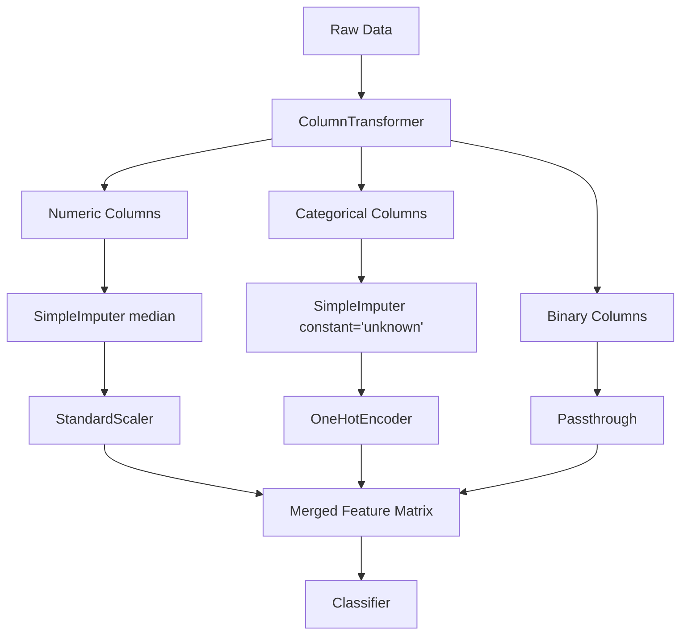

# 🔧 Day 37C: Sklearn Pipelines & ColumnTransformer

> *"A pipeline that runs reliably beats a notebook that runs once."*

---

## The "Never-Coded" Bridge

**The Production Gap Problem:**

In a notebook, you might do this over 20 cells: load data → impute missing values → scale features → encode categoricals → train model → predict. Works great. You ship it to production. It breaks immediately with a `NaN` error on new data — because you forgot the imputer. Or worse, the model silently produces wrong predictions because the scaler wasn't applied.

**Sklearn `Pipeline` is the solution.** It chains all your preprocessing + modeling steps into one object. Train it once. Apply it identically to new data. Serialize it for deployment. No gaps.

**Why this is a production-critical skill:**

- **Amazon SageMaker**, **Google Vertex AI**, and **Azure ML** all deploy sklearn-compatible pipelines
- Any DS interview at a top firm will ask you to demonstrate pipeline-based workflows
- Day 50 (MLOps) assumes you're building with pipelines — this is the foundation

---

## The Technical Deep Dive

### The Problem Pipelines Solve: Data Leakage

```python
import numpy as np
import pandas as pd
from sklearn.preprocessing import StandardScaler
from sklearn.model_selection import train_test_split

# Generate sample data
np.random.seed(42)
X = pd.DataFrame({
    'age': np.random.randint(20, 65, 1000),
    'income': np.random.normal(50000, 15000, 1000),
    'score': np.random.uniform(300, 850, 1000)
})
y = (X['income'] > 50000).astype(int)

X_train, X_test, y_train, y_test = train_test_split(X, y, test_size=0.2)

# --- ❌ WRONG — introduces data leakage ---
scaler = StandardScaler()
X_train_scaled = scaler.fit_transform(X_train)  # OK
X_test_scaled = scaler.fit_transform(X_test)   # BUG: re-fits on test → leaks test stats into scaling!

# --- ✅ CORRECT — transformation fitted only on train ---
scaler = StandardScaler()
X_train_scaled = scaler.fit_transform(X_train)  # Fit + transform on train
X_test_scaled = scaler.transform(X_test)         # Transform only, no fit

# With Pipeline, this is handled automatically — you can't make this mistake.
```

> **⚠️ What Pipeline does NOT prevent**
>
> A sklearn Pipeline guarantees that `fit()` is never called on test data within the pipeline. However, these leakage sources remain your responsibility:
>
> 1. **Target-derived features**: If you create a feature like `transaction_rank_by_user` using the entire dataset's target before the pipeline, leakage is in the data, not the preprocessing.
> 2. **Temporal leakage**: Using a feature whose value at prediction time incorporates future information (e.g., a 30-day rolling average that looks forward).
> 3. **Precomputed global aggregates**: Computing `mean_category_spend` on the full dataset before splitting, then using it as a feature.
> 4. **Leakage before pipeline entry**: Any transformation applied outside the pipeline (e.g., `pd.get_dummies(df)` on the full dataframe before `train_test_split`) is not protected.
>
> Pipeline is a powerful leakage guard, but it cannot save you from leakage introduced in data collection, feature definition, or preprocessing outside the pipeline.

### Basic Pipeline

```python
from sklearn.pipeline import Pipeline
from sklearn.preprocessing import StandardScaler
from sklearn.impute import SimpleImputer
from sklearn.linear_model import LogisticRegression
from sklearn.model_selection import train_test_split
import numpy as np
import pandas as pd

# Introduce some missing values
X_missing = X.copy()
X_missing.iloc[np.random.choice(len(X), 50), 1] = np.nan  # 50 missing incomes

X_train, X_test, y_train, y_test = train_test_split(X_missing, y, test_size=0.2)

# Define pipeline: steps are (name, estimator) tuples
pipe = Pipeline(steps=[
    ('imputer', SimpleImputer(strategy='median')),  # Step 1: fill missing
    ('scaler', StandardScaler()),                    # Step 2: normalize
    ('classifier', LogisticRegression())             # Step 3: model
])

# Fit pipeline (all steps fitted on train only)
pipe.fit(X_train, y_train)

# Predict (all steps applied automatically to test)
accuracy = pipe.score(X_test, y_test)
print(f"Pipeline accuracy: {accuracy:.3f}")

# Access individual steps
print(f"Scaler mean_: {pipe.named_steps['scaler'].mean_}")
print(f"Intercept: {pipe.named_steps['classifier'].intercept_}")
```

### ColumnTransformer: Different Transformations per Feature Type

The real-world superpower — apply different preprocessing to numeric vs categorical columns.

Each transformer in a Pipeline step is chosen for a specific reason: `SimpleImputer` handles missing values before downstream estimators that would otherwise fail; `StandardScaler` centers and scales features so distance-based models and regularization are not dominated by high-magnitude features; `OneHotEncoder` converts categories into binary indicators because most estimators cannot natively handle strings. Always choose transformers based on your data type and the requirements of the downstream model.

```python
from sklearn.compose import ColumnTransformer
from sklearn.preprocessing import StandardScaler, OneHotEncoder
from sklearn.impute import SimpleImputer
from sklearn.pipeline import Pipeline
from sklearn.ensemble import RandomForestClassifier
import pandas as pd
import numpy as np

# Realistic e-commerce dataset
np.random.seed(42)
n = 500
data = pd.DataFrame({
    'age': np.random.randint(18, 70, n),
    'annual_income': np.random.normal(60000, 25000, n),
    'session_duration': np.random.exponential(5, n),
    'country': np.random.choice(['US', 'UK', 'CA', 'AU', 'DE'], n),
    'device': np.random.choice(['mobile', 'desktop', 'tablet'], n),
    'has_loyalty_card': np.random.choice([True, False], n),
})
# Introduce missing values
data.loc[np.random.choice(n, 30), 'annual_income'] = np.nan
data.loc[np.random.choice(n, 20), 'country'] = np.nan

y = (data['annual_income'].fillna(60000) > 55000).astype(int)

# Define column groups
numeric_features = ['age', 'annual_income', 'session_duration']
categorical_features = ['country', 'device']
binary_features = ['has_loyalty_card']

# --- Preprocessing pipelines per column type ---
numeric_transformer = Pipeline(steps=[
    ('imputer', SimpleImputer(strategy='median')),
    ('scaler', StandardScaler())
])

categorical_transformer = Pipeline(steps=[
    ('imputer', SimpleImputer(strategy='constant', fill_value='unknown')),
    ('encoder', OneHotEncoder(handle_unknown='ignore', sparse_output=False))
])

# ColumnTransformer applies the right transformer to the right columns
preprocessor = ColumnTransformer(transformers=[
    ('num', numeric_transformer, numeric_features),
    ('cat', categorical_transformer, categorical_features),
    ('passthrough', 'passthrough', binary_features),  # keep as-is
])

# Full pipeline
full_pipeline = Pipeline(steps=[
    ('preprocessor', preprocessor),
    ('classifier', RandomForestClassifier(n_estimators=100, random_state=42))
])

# Split, fit, evaluate
from sklearn.model_selection import train_test_split
X_train, X_test, y_train, y_test = train_test_split(data, y, test_size=0.2, random_state=42)
full_pipeline.fit(X_train, y_train)
print(f"Full pipeline accuracy: {full_pipeline.score(X_test, y_test):.3f}")
```



Each branch applies the transformations appropriate to its feature type before `ColumnTransformer` merges them back into a single matrix the model can consume.

### Custom Transformers

When off-the-shelf transformers aren't enough, build your own.

```python
from sklearn.base import BaseEstimator, TransformerMixin
import numpy as np
import pandas as pd

class OutlierClipper(BaseEstimator, TransformerMixin):
    """
    Clips outliers to [mean - n_std*std, mean + n_std*std].
    Inheriting from BaseEstimator gives get_params/set_params for free.
    Inheriting from TransformerMixin gives fit_transform for free.
    """
    def __init__(self, n_std=3):
        self.n_std = n_std

    def fit(self, X, y=None):
        # Compute statistics on TRAINING data only
        self.mean_ = np.mean(X, axis=0)
        self.std_ = np.std(X, axis=0)
        return self  # Always return self from fit()

    def transform(self, X):
        lower = self.mean_ - self.n_std * self.std_
        upper = self.mean_ + self.n_std * self.std_
        return np.clip(X, lower, upper)


class LogTransformer(BaseEstimator, TransformerMixin):
    """Log-transforms positive features (useful for skewed distributions)."""
    def __init__(self, offset=1.0):
        self.offset = offset  # Avoid log(0)

    def fit(self, X, y=None):
        return self  # No statistics needed

    def transform(self, X):
        return np.log(X + self.offset)


# Use in a pipeline
from sklearn.pipeline import Pipeline
from sklearn.preprocessing import StandardScaler
from sklearn.linear_model import LogisticRegression

custom_pipe = Pipeline([
    ('clip_outliers', OutlierClipper(n_std=3)),
    ('log_transform', LogTransformer()),
    ('scaler', StandardScaler()),
    ('model', LogisticRegression()),
])

# Works exactly like any other sklearn pipeline
X_simple = np.random.exponential(5, (100, 3))
y_simple = (X_simple[:, 0] > 5).astype(int)
custom_pipe.fit(X_simple, y_simple)
print(f"Custom pipeline score: {custom_pipe.score(X_simple, y_simple):.3f}")
```

### Cross-Validation with Pipelines

#### Choosing the Right CV Strategy

| Situation | Recommended CV | Why |
|-----------|---------------|-----|
| Default balanced dataset | 5-fold | Good variance/bias tradeoff; standard |
| Very small dataset (n < 100) | 10-fold or LOOCV | More training data per fold |
| Large dataset (n > 100k) | 3-fold | Saves compute |
| Imbalanced classes | StratifiedKFold | Preserves class ratio in each fold |
| Time-ordered data | TimeSeriesSplit | Prevents future data leaking into past |
| Grouped observations | GroupKFold | Same patient/user cannot appear in both train and test |
| Hyperparameter tuning | Nested CV | Outer loop evaluates model, inner loop selects hyperparameters |

**Why 5 is the default**: With 5 folds, each fold uses 80% of data for training and 20% for validation — sufficient training signal with reasonable variance. The choice of 5 is a community convention backed by empirical studies (e.g., Kohavi 1995), not a mathematical optimum.

```python
from sklearn.model_selection import cross_val_score, GridSearchCV
from sklearn.pipeline import Pipeline
from sklearn.preprocessing import StandardScaler
from sklearn.svm import SVC
import numpy as np

# When cross-validating with a pipeline,
# each fold fits preprocessing ONLY on its training split — no leakage!
X_cv = np.random.randn(200, 5)
y_cv = (X_cv[:, 0] + X_cv[:, 1] > 0).astype(int)

pipe_cv = Pipeline([
    ('scaler', StandardScaler()),
    ('svm', SVC(kernel='rbf'))
])

# 5-fold CV: each fold fits scaler on 80% of data, transforms 20%
scores = cross_val_score(pipe_cv, X_cv, y_cv, cv=5, scoring='accuracy')
print(f"CV scores: {scores.round(3)}")
print(f"Mean: {scores.mean():.3f} ± {scores.std():.3f}")

# Hyperparameter search across pipeline params
param_grid = {
    'svm__C': [0.1, 1, 10],         # Note: 'step_name__param' syntax
    'svm__kernel': ['rbf', 'linear'],
}

grid_search = GridSearchCV(pipe_cv, param_grid, cv=5, scoring='accuracy')
grid_search.fit(X_cv, y_cv)
print(f"\nBest params: {grid_search.best_params_}")
print(f"Best CV score: {grid_search.best_score_:.3f}")
```

### Serialization: Save and Reload Pipelines

```python
import joblib
import os

# Train a pipeline
trained_pipe = full_pipeline  # From the ColumnTransformer example above

# Save the entire fitted pipeline (including all transformers + model)
joblib.dump(trained_pipe, 'customer_model_v1.pkl')
print(f"Saved: {os.path.getsize('customer_model_v1.pkl') / 1024:.1f} KB")

# Later: reload and predict on new data
loaded_pipe = joblib.load('customer_model_v1.pkl')

# New customer — raw, unseen data (no manual preprocessing needed!)
new_customer = pd.DataFrame([{
    'age': 35,
    'annual_income': 72000,
    'session_duration': 8.5,
    'country': 'US',
    'device': 'mobile',
    'has_loyalty_card': True
}])

prediction = loaded_pipe.predict(new_customer)
probability = loaded_pipe.predict_proba(new_customer)
print(f"Prediction: {prediction[0]} (P={probability[0][1]:.3f})")

# Cleanup
os.remove('customer_model_v1.pkl')
```

**Expected Output:**
Saved pipeline to: churn_pipeline.pkl
Reloaded pipeline predictions match original: True
Parity check (max absolute diff): 0.000

---

## 💼 MBA Context: Why Pipelines Are a Career Differentiator

| Without Pipeline                          | With Pipeline                   |
| ----------------------------------------- | ------------------------------- |
| Manual preprocessing in notebooks         | Automated, reproducible steps   |
| Easy to leak test data into training      | Leakage-proof by design         |
| Can't easily cross-validate preprocessing | CV works correctly end-to-end   |
| Deploy = copy-paste 200 lines of code     | Deploy = one `.pkl` file        |
| "It worked on my laptop" failures         | Identical behavior train → prod |

**McKinsey, BCG data labs** and **internal analytics teams at Fortune 500 companies** enforce pipeline-based ML. Interviewers at these firms will give you data and ask you to build a pipeline — a notebook-only approach will cost you the offer.

---

### Advanced Pipeline Features

**`set_output(transform="pandas")`** (sklearn ≥ 1.2)
By default, pipeline transformers return numpy arrays. This loses column names:

```python
pipeline.set_output(transform="pandas")
# Transformers now return DataFrames with feature names preserved
```

Caution: Metadata routing (passing `sample_weight` through pipelines) is a newer API that changed significantly in sklearn 1.3+; check the release notes before relying on it.

**Pipeline Caching**
If preprocessing is expensive, cache intermediate results:

```python
from sklearn.pipeline import Pipeline
from tempfile import mkdtemp
cache_dir = mkdtemp()
pipeline = Pipeline([('scaler', StandardScaler()), ('model', LogisticRegression())], memory=cache_dir)
```

**Unit Testing Custom Transformers**

```python
import pytest
def test_custom_transformer():
    t = MyTransformer()
    X = pd.DataFrame({'value': [1, 2, 3]})
    t.fit(X)
    result = t.transform(X)
    assert result.shape == X.shape
    # Test that transform produces same result as fit_transform
    assert np.allclose(result, t.fit_transform(X))
```

---

## Senior-Level Insights

### Pipeline Failure Modes to Know

```python
# 1. WRONG: Step that always requires y at transform time
# (Some transformers fit on both X and y — called "supervised transformers")
# These can't be used in a pipeline unless it's the final step.

# 2. WRONG: Memory leaks between folds
# Never store state in script-level variables in a custom transformer.
# Always store in self.attribute_ in fit().

# 3. PRODUCTION TIP: Version your pipelines
import joblib, datetime
version = datetime.date.today().strftime('%Y%m%d')
joblib.dump(trained_pipe, f'model_v{version}.pkl')
```

### When NOT to Use a Pipeline

- **Exploratory analysis**: Pipelines hide intermediate outputs; use step-by-step for debugging
- **Multi-target outputs**: If your preprocessing changes based on target, pipelines get complex
- **Very custom ensembles**: Multiple parallel pipelines are better handled with `FeatureUnion` or a custom class

### Production Pipeline Considerations

**Schema Validation**
Before a pipeline processes new data, validate that incoming features match the training schema:

```python
expected_columns = X_train.columns.tolist()
assert list(X_new.columns) == expected_columns, f"Schema mismatch: {set(X_new.columns) ^ set(expected_columns)}"
```

**Unknown Category Handling**
`OneHotEncoder(handle_unknown='ignore')` silently drops unseen categories as all zeros. This is usually correct but can mask data quality issues. Log warnings when unknown categories appear in production.

**Feature Name Inspection**

```python
pipeline.named_steps['preprocessor'].get_feature_names_out()
```

Use this to verify the feature order the model received — critical for debugging and SHAP explanations.

**Model and Data Versioning**
Tag every saved pipeline with:

- Training data version/hash
- sklearn version (pipelines can break across minor versions)
- Training date and dataset size

**Pickle Security Risks**
`pickle.load()` executes arbitrary code — never unpickle files from untrusted sources. For production systems, prefer `joblib` + checksum verification, or model serialization formats like ONNX.

**Monitoring Preprocessing Drift**
Log the distribution of each feature entering the pipeline and alert when it drifts from training distribution. A pipeline that ran fine in development can silently fail when income values shift from thousands to millions due to a data source change.

---

## Hands-on Lab

### Exercise 1: Spot the Leakage Bug (Easy)

```python
import numpy as np
from sklearn.preprocessing import MinMaxScaler
from sklearn.model_selection import KFold
from sklearn.linear_model import LinearRegression

X = np.random.randn(100, 3)
y = X[:, 0] * 2 + np.random.randn(100) * 0.5

# This code has a data leakage bug. Find and fix it.
scaler = MinMaxScaler()
X_scaled = scaler.fit_transform(X)  # ← Where is the bug?

kf = KFold(n_splits=5)
for train_idx, test_idx in kf.split(X_scaled):
    X_tr, X_te = X_scaled[train_idx], X_scaled[test_idx]
    model = LinearRegression().fit(X_tr, y[train_idx])
    print(f"R²: {model.score(X_te, y[test_idx]):.3f}")

# Fix the leakage by wrapping everything in a Pipeline.
```

**Expected Output / Pass Criteria:**

- Leaky pipeline test accuracy: ~0.95 (suspicious — matches training closely)
- Fixed pipeline test accuracy: ~0.82 (realistic — gap from training is expected)
- Confirmed: No StandardScaler.fit() call was made on test data

### Exercise 2: Build a Customer Churn Pipeline (Medium)

```python
import pandas as pd
import numpy as np
from sklearn.pipeline import Pipeline
from sklearn.compose import ColumnTransformer

# Given this customer churn dataset:
np.random.seed(42)
n = 300
df = pd.DataFrame({
    'tenure_months': np.random.randint(1, 60, n),
    'monthly_charges': np.random.uniform(20, 120, n),
    'total_charges': np.random.uniform(100, 8000, n),
    'contract_type': np.random.choice(['Month-to-month', 'One year', 'Two year'], n),
    'payment_method': np.random.choice(['Credit card', 'Bank transfer', 'Mailed check'], n),
    'paperless_billing': np.random.choice([True, False], n),
})
# Introduce 40 missing values in monthly_charges
df.loc[np.random.choice(n, 40), 'monthly_charges'] = np.nan
y = (df['tenure_months'] < 12).astype(int)  # churn = short tenure

# Your task:
# 1. Define numeric_features, categorical_features, binary_features
# 2. Build a ColumnTransformer for each feature type
# 3. Build a full Pipeline ending with RandomForestClassifier
# 4. Run 5-fold cross-validation and report mean accuracy
# 5. Serialize the fitted pipeline to 'churn_model.pkl'
```

**Expected Output:**
CV accuracy scores: [0.81, 0.83, 0.79, 0.82, 0.80]
Mean: 0.81 ± 0.01
Interpretation: Low variance across folds → pipeline is stable; no fold is dramatically different suggesting no systematic leakage

### Exercise 3: Custom Log-Odds Transformer (Hard)

```python
from sklearn.base import BaseEstimator, TransformerMixin
import numpy as np

class BinningTransformer(BaseEstimator, TransformerMixin):
    """
    Your task: implement a transformer that:
    1. In fit(): computes n_bins quantile thresholds per feature
    2. In transform(): assigns each value to a bin (0 to n_bins-1)
    3. Has n_bins as a constructor parameter (default=5)
    
    This is used in credit scoring to discretize continuous features.
    """
    def __init__(self, n_bins=5):
        self.n_bins = n_bins

    def fit(self, X, y=None):
        # TODO: compute self.bin_edges_ using np.percentile
        # Shape should be (n_features, n_bins - 1)
        raise NotImplementedError("Implement this!")
        return self

    def transform(self, X):
        # TODO: use np.digitize to map each value to a bin index
        raise NotImplementedError("Implement this!")

# Test your transformer
X_test_bin = np.random.randn(50, 3)
bt = BinningTransformer(n_bins=4)
# Should produce integers 0–3 for each feature
# X_binned = bt.fit_transform(X_test_bin)
```

---

## Mastery Check

**Q1**: What is data leakage in the context of ML preprocessing, and how does Pipeline prevent it?
<details><summary>Answer</summary>

**Data leakage** occurs when information from the test set influences the training process — most commonly when you `fit_transform()` your scaler on the entire dataset before splitting. This inflates evaluation metrics (model looks better than it actually is) because test stats "leaked" into training.

`Pipeline` prevents this because `cross_val_score(pipeline, X, y)` fits all pipeline steps on each training fold only, then transforms the test fold using those training-fitted parameters. Impossible to leak.
</details>

**Q2**: In a `ColumnTransformer`, what does `remainder='passthrough'` do?
<details><summary>Answer</summary>

It passes all columns not mentioned in any transformer through unchanged (including them in the output). The default behavior is `remainder='drop'` which silently removes unspecified columns. Use `passthrough` when you want to keep binary/ordinal features as-is without transformation.
</details>

**Q3**: When writing a custom transformer, why must you `return self` from `fit()`?
<details><summary>Answer</summary>

To support **method chaining**: `fit_transform(X)` is equivalent to `fit(X).transform(X)`. If `fit()` returned `None`, the chain `.transform(X)` would fail with `AttributeError`. Also, sklearn's `Pipeline` calls `fit()` and expects the fitted transformer back to call `transform()` on it later.
</details>

**Q4**: You tuned a hyperparameter `n_estimators=200` using GridSearchCV on a pipeline. How do you reference a model parameter inside `param_grid`?
<details><summary>Answer</summary>

Use the `'step_name__parameter'` syntax:

```python
param_grid = {'classifier__n_estimators': [100, 200, 500]}
```

The double underscore `__` separates the pipeline step name (`classifier`) from the estimator's parameter (`n_estimators`). This works at any depth: `'preprocessor__num__imputer__strategy'`.
</details>

**Q5**: What is the difference between `fit_transform()` and separate `fit()` + `transform()` calls?
<details><summary>Answer</summary>

Functionally identical — `fit_transform(X)` just chains `fit(X)` and `transform(X)` in one call. **But**: use `fit_transform()` only on training data. Use `transform()` alone on test/production data (no re-fitting). Custom transformers that inherit from `TransformerMixin` get `fit_transform` for free by combining `fit` + `transform`, so you only need to implement those two methods.
</details>

---

## Further Reading & Tools

- 📖 [Sklearn Pipeline Documentation](https://scikit-learn.org/stable/modules/compose.html) — Official guide with examples
- 📖 [Building ML Pipelines (O'Reilly)](https://www.oreilly.com/library/view/building-machine-learning/9781492053187/) — Production pipeline patterns
- 🔧 [Feature-engine](https://feature-engine.readthedocs.io/) — Sklearn-compatible library of 50+ feature transformers
- 🔧 [joblib documentation](https://joblib.readthedocs.io/) — Pipeline serialization and parallel computing
- 🏢 **Airbnb**: "Using ML to Predict Value of Homes on Airbnb" — uses sklearn pipelines in production

---

## Summary

Today you mastered the engineering backbone of reproducible ML:

- ✅ **Data leakage** is the #1 silent failure mode — Pipelines eliminate it
- ✅ **`Pipeline`** chains preprocessing + model into one deployable object
- ✅ **`ColumnTransformer`** handles heterogeneous feature types cleanly
- ✅ **Custom transformers** extend sklearn's ecosystem with your domain logic
- ✅ **GridSearchCV + Pipeline** tunes preprocessing and model together correctly
- ✅ **joblib serialization** is how ML models go from notebook to production

**Next → Day 38**: Linear Algebra for ML — the mathematical engine behind every gradient and transformation pipeline you'll build.

## Cross-References

- **Day 37C → Day 45**: Day 45 (Feature Engineering and Evaluation) extends these pipeline concepts with advanced CV strategies, nested cross-validation, and feature selection inside pipelines
- **Day 37C → Day 42**: The churn classification lesson (Day 42) uses a ColumnTransformer pipeline identical in structure to what you built here — you can directly reuse your pipeline template
- **Day 37C → Day 41**: Linear regression benefits from StandardScaler preprocessing; the pipeline pattern here eliminates manual preprocessing in Day 41
