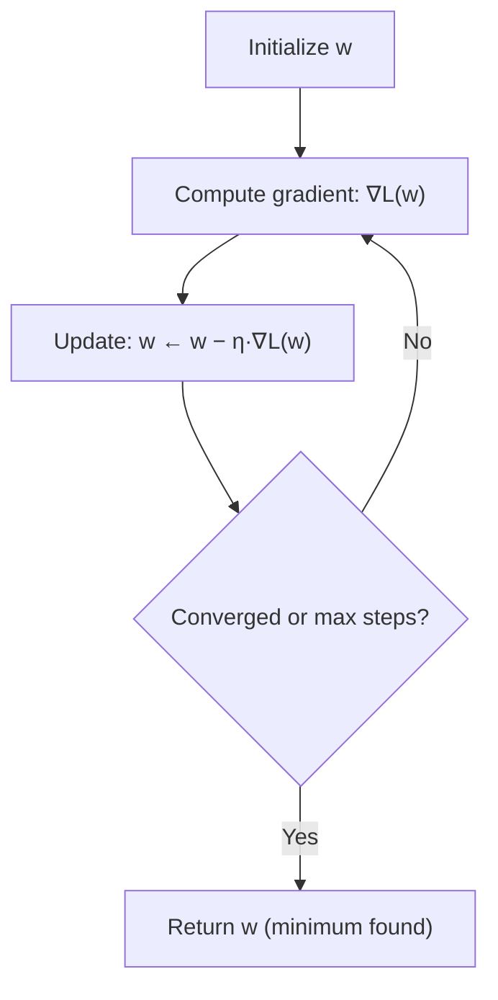

# 🎯 Day 39: Calculus for Machine Learning

> *"Calculus finds the bottom of the hill. That's where the best model lives."*

---

## The "Never-Coded" Bridge

**Imagine adjusting a thermostat.** If the room is too cold, you turn it up. Too hot, you turn it down. You're doing optimization intuitively—adjusting a parameter (temperature setting) to minimize discomfort (error).

Machine learning works the same way, but with thousands of parameters adjusted simultaneously. **Calculus** tells us:

- **How much** does the error change when we adjust each parameter? (Derivatives)
- **Which direction** should we move each parameter to reduce error fastest? (Gradients)
- **How do we systematically find the best parameters?** (Gradient descent)

**Real-world applications:**

- **Tesla**: Training neural networks to recognize road signs uses gradient descent
- **DeepMind**: AlphaGo learned through billions of gradient updates
- **OpenAI**: GPT models optimize billions of parameters with calculus-based methods
- **Finance**: Portfolio optimization uses gradient-based techniques

You don't need to be a calculus expert. You need to understand the *intuition*—why gradient descent works and how to tune it.

---

## The Technical Deep Dive

### Key Calculus & Optimization Terms

| Term | Plain-Language Definition | Business / ML Meaning |
|------|--------------------------|----------------------|
| **Loss function** | A function that measures how wrong a model's predictions are | Quantifies the cost of prediction errors; what we minimize during training |
| **Derivative** | The instantaneous rate of change of a function at a point; slope of the tangent line | How much loss changes when we nudge a single parameter |
| **Partial derivative** | Derivative with respect to one variable while holding all others fixed | How much loss changes when we nudge one weight, all others constant |
| **Gradient** | Vector of all partial derivatives — one entry per parameter | Direction of steepest uphill ascent in parameter space; we move in the *opposite* direction to reduce loss |
| **Convexity** | A function is convex if the line segment between any two points on it lies above the curve | Convex loss functions (e.g., linear regression MSE) have a single global minimum — gradient descent is guaranteed to find it |
| **Local minimum** | A point where the function is lower than all nearby points, but possibly not the lowest overall | Neural networks can get trapped here; rarely a problem in practice for overparameterized models |
| **Global minimum** | The lowest point of the entire function | The target for training; guaranteed with convex losses |
| **Epoch** | One complete pass through the entire training dataset | After each epoch, weights are updated based on aggregated gradients |
| **Convergence** | When parameter updates become negligibly small — loss has stabilized | Observable as: loss curve flattens; gradient norm approaches zero |

### Derivatives: How Things Change

A derivative measures how a function's output changes when its input changes. Think of it as the "slope" at any point. Formally, the derivative of $f$ at $x$ is the limit of the average rate of change as the step size shrinks to zero:

$$
f'(x) = \frac{df}{dx} = \lim_{h \to 0} \frac{f(x + h) - f(x)}{h}
$$

For $f(x) = x^2$, applying the power rule gives $f'(x) = 2x$.

```python
import numpy as np
import matplotlib.pyplot as plt

# Function: f(x) = x²
# Derivative: f'(x) = 2x (the slope at any point x)


def f(x):
    return x**2


def f_derivative(x):
    return 2 * x


# What does the derivative tell us?
x_values = [-3, -1, 0, 1, 3]
for x in x_values:
    slope = f_derivative(x)
    print(f"At x={x:2d}: f(x)={f(x):2d}, slope={slope:2d}")

# Output:
# At x=-3: f(x)= 9, slope=-6  (declining steeply)
# At x=-1: f(x)= 1, slope=-2  (declining gently)
# At x= 0: f(x)= 0, slope= 0  (flat → minimum!)
# At x= 1: f(x)= 1, slope= 2  (rising gently)
# At x= 3: f(x)= 9, slope= 6  (rising steeply)

# Visualize
x = np.linspace(-4, 4, 100)
plt.figure(figsize=(12, 4))

plt.subplot(1, 2, 1)
plt.plot(x, f(x), "b-", linewidth=2, label="f(x) = x²")
plt.axhline(y=0, color="k", linewidth=0.5)
plt.axvline(x=0, color="k", linewidth=0.5)
plt.xlabel("x")
plt.ylabel("f(x)")
plt.title("Function")
plt.legend()
plt.grid(True, alpha=0.3)

plt.subplot(1, 2, 2)
plt.plot(x, f_derivative(x), "r-", linewidth=2, label="f'(x) = 2x")
plt.axhline(y=0, color="k", linewidth=0.5)
plt.axvline(x=0, color="k", linewidth=0.5)
plt.xlabel("x")
plt.ylabel("f'(x)")
plt.title("Derivative (Slope)")
plt.legend()
plt.grid(True, alpha=0.3)

plt.tight_layout()
plt.show()
```

### The Key Insight: Finding Minimums

**Business Application: Optimizing a Pricing Model**

Instead of an abstract quadratic, consider a pricing problem. Your company sells a product at price p. Historical data suggests demand follows: demand(p) = 1000 − 5p. Revenue is R(p) = p × demand(p) = 1000p − 5p².

To maximize revenue, you find the price that makes dR/dp = 0:
dR/dp = 1000 − 10p = 0 → p* = $100

This is exactly what gradient *ascent* does (or descent on the negative revenue):

- At p=50: dR/dp = 500 (revenue increasing — move price up)
- At p=100: dR/dp = 0 (optimal price — stop)
- At p=150: dR/dp = −500 (revenue decreasing — move price down)

The gradient tells you the marginal business impact of changing your decision variable.

---

**At a minimum, the derivative equals zero** (the function is flat—no slope). Setting $f'(x) = 0$ gives a *first-order necessary condition* for an optimum:

$$
\frac{d}{dw}\,\mathcal{L}(w) = 0 \quad \Longrightarrow \quad w \text{ is a stationary point}
$$

For the loss $\mathcal{L}(w) = (w - 3)^2$, $\mathcal{L}'(w) = 2(w-3) = 0$, giving the unique minimum $w^\star = 3$.

```python
# ML Loss function example: L(w) = (w - 3)²
# We want to find w that minimizes L


def loss(w):
    return (w - 3) ** 2


def loss_derivative(w):
    return 2 * (w - 3)


# At the minimum:
# loss_derivative(w) = 0
# 2(w - 3) = 0
# w = 3  ← This is the optimal weight!

print(f"Loss at w=0: {loss(0)}")  # 9
print(f"Loss at w=3: {loss(3)}")  # 0 ← Minimum!
print(f"Loss at w=5: {loss(5)}")  # 4
```

### Gradient Descent: Walking Downhill

We can't always solve for the minimum analytically. **Gradient descent** finds it iteratively by repeatedly stepping in the direction of steepest *descent* — that is, the negative gradient — scaled by a learning rate $\eta$:

$$
w_{t+1} = w_t - \eta \, \nabla_w \mathcal{L}(w_t)
$$

For our quadratic loss with $\mathcal{L}'(w) = 2(w - 3)$ and $\eta = 0.1$ starting from $w_0 = 0$, each step shrinks the gap to $w^\star = 3$ by a factor of $1 - 2\eta = 0.8$.



```python
def gradient_descent(start, learning_rate, n_steps):
    """Find minimum of loss(w) = (w-3)² starting from 'start'."""
    w = start
    history = [(w, loss(w))]

    for step in range(n_steps):
        # 1. Compute gradient (derivative)
        grad = loss_derivative(w)

        # 2. Update: move opposite to gradient direction
        # (gradient points uphill, we want downhill)
        w = w - learning_rate * grad

        history.append((w, loss(w)))

        if step < 5 or step >= n_steps - 3:
            print(f"Step {step + 1:2d}: w={w:.4f}, loss={loss(w):.4f}, grad={grad:.4f}")

    return w, history


# Run gradient descent
optimal_w, history = gradient_descent(start=0.0, learning_rate=0.1, n_steps=20)
print(f"\nFinal: w={optimal_w:.4f} (target: 3.0)")

# Visualize the descent
w_vals = [h[0] for h in history]
loss_vals = [h[1] for h in history]

plt.figure(figsize=(10, 5))
w_range = np.linspace(-1, 5, 100)
plt.plot(w_range, loss(w_range), "b-", linewidth=2, label="Loss function")
plt.scatter(
    w_vals,
    loss_vals,
    c=range(len(w_vals)),
    cmap="Reds",
    s=100,
    zorder=5,
    label="Gradient descent path",
)
plt.colorbar(label="Step")
plt.xlabel("w")
plt.ylabel("Loss")
plt.title("Gradient Descent: Finding the Minimum")
plt.legend()
plt.grid(True, alpha=0.3)
plt.show()
```

### Multivariate Gradients: Multiple Parameters

Real ML models have many parameters. The **gradient** is a vector of partial derivatives that points in the direction of steepest ascent:

$$
\nabla_{\mathbf{w}} \mathcal{L} = \begin{bmatrix}
\dfrac{\partial \mathcal{L}}{\partial w_1} \\[4pt]
\dfrac{\partial \mathcal{L}}{\partial w_2} \\[4pt]
\vdots \\[4pt]
\dfrac{\partial \mathcal{L}}{\partial w_n}
\end{bmatrix}
$$

For $\mathcal{L}(w_1, w_2) = (w_1 - 2)^2 + (w_2 + 1)^2$, the partial derivatives are $\partial \mathcal{L} / \partial w_1 = 2(w_1 - 2)$ and $\partial \mathcal{L} / \partial w_2 = 2(w_2 + 1)$.

```python
# Loss function with two parameters: L(w1, w2) = (w1-2)² + (w2+1)²
# Minimum at (2, -1)


def loss_2d(w):
    return (w[0] - 2) ** 2 + (w[1] + 1) ** 2


def gradient_2d(w):
    """Gradient = [∂L/∂w1, ∂L/∂w2]"""
    return np.array(
        [
            2 * (w[0] - 2),  # Partial derivative w.r.t. w1
            2 * (w[1] + 1),  # Partial derivative w.r.t. w2
        ]
    )


# Gradient descent in 2D
w = np.array([0.0, 0.0])
learning_rate = 0.1
history_2d = [w.copy()]

for step in range(30):
    grad = gradient_2d(w)
    w = w - learning_rate * grad
    history_2d.append(w.copy())

print(f"Starting point: [0, 0]")
print(f"Final point: [{w[0]:.4f}, {w[1]:.4f}]")
print(f"Target: [2, -1]")

# Visualize 2D gradient descent
history_2d = np.array(history_2d)

# Create contour plot
w1_range = np.linspace(-1, 4, 50)
w2_range = np.linspace(-3, 2, 50)
W1, W2 = np.meshgrid(w1_range, w2_range)
Z = (W1 - 2) ** 2 + (W2 + 1) ** 2

plt.figure(figsize=(8, 6))
plt.contour(W1, W2, Z, levels=20, cmap="Blues")
plt.colorbar(label="Loss")
plt.plot(history_2d[:, 0], history_2d[:, 1], "r.-", linewidth=1, markersize=8)
plt.scatter(2, -1, color="green", s=200, marker="*", label="Minimum", zorder=5)
plt.xlabel("w1")
plt.ylabel("w2")
plt.title("2D Gradient Descent")
plt.legend()
plt.show()
```

### Learning Rate: The Critical Hyperparameter

```python
def experiment_learning_rates(learning_rates):
    """Compare different learning rates."""
    plt.figure(figsize=(12, 4))

    for i, lr in enumerate(learning_rates):
        w = 0.0
        history = [w]

        for _ in range(20):
            grad = loss_derivative(w)
            w = w - lr * grad
            history.append(w)

            # Stop if diverging
            if abs(w) > 100:
                break

        plt.subplot(1, 3, i + 1)
        plt.plot(history, "o-", markersize=4)
        plt.axhline(y=3, color="r", linestyle="--", label="Target")
        plt.xlabel("Step")
        plt.ylabel("w")
        plt.title(f"LR = {lr}")
        plt.legend()
        plt.grid(True, alpha=0.3)

    plt.suptitle("Learning Rate Impact", fontsize=14)
    plt.tight_layout()
    plt.show()


experiment_learning_rates([0.01, 0.1, 0.9])
# 0.01: Too slow - barely moves
# 0.1: Just right - smooth convergence
# 0.9: Too fast - oscillates wildly (or diverges)
```

> **⚠️ Important Qualification**
>
> The learning rate values above are specific to the toy loss `L(w) = (w − 3)²`. A "just right" learning rate depends heavily on:
>
> - **Loss function curvature**: A steep loss landscape needs smaller steps than a flat one
> - **Feature scale**: If features span very different ranges (age: 18–80 vs income: 10,000–500,000), gradients will be wildly different in magnitude. Standardize features before training.
> - **Batch size**: Mini-batch gradients are noisier than full-batch — stochastic gradients tolerate higher learning rates
> - **Optimizer**: Adam, RMSprop, and AdaGrad adapt the effective learning rate per parameter — they're much less sensitive to the initial choice than vanilla gradient descent
> - **Model architecture**: Deeper networks with many layers often require smaller learning rates due to gradient accumulation
>
> **Practical approach**: Start with 1e-3 for Adam or 0.1 for SGD with momentum; use a learning rate scheduler (e.g., cosine annealing) and monitor the loss curve.

### The Chain Rule: Foundation of Backpropagation

When functions are composed (like neural network layers), we use the chain rule. For $y = g(f(x))$:

$$
\frac{dy}{dx} = \frac{dy}{du} \cdot \frac{du}{dx}, \quad \text{where } u = f(x)
$$

For $y = (3x + 2)^2$ with $u = 3x + 2$: $\dfrac{dy}{du} = 2u$ and $\dfrac{du}{dx} = 3$, giving $\dfrac{dy}{dx} = 6(3x + 2)$.

```python
# If y = g(f(x)), then dy/dx = dg/df * df/dx

# Example: y = (3x + 2)²
# Let u = 3x + 2 (inner function)
# Let y = u² (outer function)
# dy/dx = dy/du * du/dx = 2u * 3 = 6(3x + 2)


def composite_function(x):
    return (3 * x + 2) ** 2


def chain_rule_derivative(x):
    u = 3 * x + 2
    dy_du = 2 * u  # Derivative of outer: d(u²)/du = 2u
    du_dx = 3  # Derivative of inner: d(3x+2)/dx = 3
    return dy_du * du_dx


# Verify with numerical derivative
x = 2.0
h = 0.0001
numerical_deriv = (composite_function(x + h) - composite_function(x)) / h
analytical_deriv = chain_rule_derivative(x)

print(f"Numerical derivative: {numerical_deriv:.4f}")
print(f"Analytical derivative: {analytical_deriv:.4f}")
# Both should be 48.0 (or very close)

# In neural networks:
# Loss = L(output) where output = activation(W @ input + b)
# Chain rule lets us compute ∂Loss/∂W by chaining derivatives through layers
```

### Advanced Optimization Concepts

**Gradient Checking (Finite Differences)**
Verify your gradient implementation is correct by comparing to numerical approximation:

```python
def numerical_gradient(f, w, epsilon=1e-5):
    """Finite-difference gradient check"""
    grad = np.zeros_like(w)
    for i in range(len(w)):
        w_plus = w.copy(); w_plus[i] += epsilon
        w_minus = w.copy(); w_minus[i] -= epsilon
        grad[i] = (f(w_plus) - f(w_minus)) / (2 * epsilon)
    return grad

# If |analytic_grad - numeric_grad| / (|analytic_grad| + |numeric_grad|) < 1e-7, your gradient is correct
```

**Stochastic and Mini-Batch Gradient Descent**

| Variant | Update Rule | Pro | Con |
|---------|------------|-----|-----|
| Batch GD | All n samples per update | Smooth, stable | Slow for large datasets |
| Stochastic GD (SGD) | 1 sample per update | Fast, can escape local minima | Noisy, needs tuning |
| Mini-batch GD | k samples per update (k=32–256) | Best tradeoff; GPU-efficient | Hyperparameter k to tune |

**Adam Optimizer (Adaptive Moment Estimation)**
Adam maintains per-parameter adaptive learning rates using estimates of gradient mean (m) and variance (v):

```
m_t = β₁ × m_{t-1} + (1 − β₁) × g_t      # Gradient momentum
v_t = β₂ × v_{t-1} + (1 − β₂) × g_t²    # Gradient variance
w_{t+1} = w_t − α × m̂_t / (√v̂_t + ε)    # Adaptive update
```

Default values (β₁=0.9, β₂=0.999, ε=1e-8) work well for most problems. Adam is the default choice for neural networks.

**Saddle Points**
In high-dimensional spaces, most "flat" regions are saddle points (gradient=0 but not a minimum), not true local minima. The gradient points away from a saddle point in some directions, so momentum-based optimizers naturally escape them.

**Regularization Gradients**
Adding L2 regularization to the loss (λ Σwᵢ²) adds a gradient term that pushes weights toward zero:
∂L_reg/∂wᵢ = ∂L/∂wᵢ + 2λwᵢ
This is why L2 regularization is called "weight decay" — each update shrinks weights slightly before the gradient step.

---

## Senior-Level Insights

### Gradient Descent Variants

| Variant           | Description                           | When to Use                      |
| ----------------- | ------------------------------------- | -------------------------------- |
| **Batch GD**      | Use entire dataset for each update    | Small datasets, convex problems  |
| **Stochastic GD** | Use one random sample per update      | Large datasets, online learning  |
| **Mini-batch GD** | Use small batches (32, 64, 128)       | Default choice for deep learning |
| **Adam**          | Adaptive learning rates per parameter | Complex architectures, most NNs  |
| **RMSprop**       | Running average of squared gradients  | RNNs, non-stationary objectives  |

### Common Optimization Challenges

| Problem                 | Symptom                      | Solution                                        |
| ----------------------- | ---------------------------- | ----------------------------------------------- |
| **Vanishing gradients** | Deep networks stop learning  | Use ReLU, batch normalization, skip connections |
| **Exploding gradients** | Loss becomes NaN             | Gradient clipping, lower learning rate          |
| **Saddle points**       | Stuck with non-zero gradient | Momentum, Adam optimizer                        |
| **Local minima**        | Suboptimal solution          | Random restarts, simulated annealing            |

### Learning Rate Schedules

```python
# Fixed learning rate often isn't optimal
# Start high (explore), decay over time (refine)

# Popular schedules:
def step_decay(epoch, initial_lr=0.1, drop_rate=0.5, epochs_drop=10):
    """Drop LR by factor every N epochs."""
    return initial_lr * (drop_rate ** (epoch // epochs_drop))


def exponential_decay(epoch, initial_lr=0.1, decay_rate=0.95):
    """Decay LR exponentially each epoch."""
    return initial_lr * (decay_rate**epoch)


def cosine_decay(epoch, total_epochs, initial_lr=0.1, min_lr=0.001):
    """Smooth cosine annealing."""
    return (
        min_lr + (initial_lr - min_lr) * (1 + np.cos(np.pi * epoch / total_epochs)) / 2
    )


# Visualize
epochs = np.arange(50)
plt.figure(figsize=(10, 4))
plt.plot(epochs, [step_decay(e) for e in epochs], label="Step decay")
plt.plot(epochs, [exponential_decay(e) for e in epochs], label="Exponential decay")
plt.plot(epochs, [cosine_decay(e, 50) for e in epochs], label="Cosine annealing")
plt.xlabel("Epoch")
plt.ylabel("Learning Rate")
plt.title("Learning Rate Schedules")
plt.legend()
plt.grid(True, alpha=0.3)
plt.show()
```

---

## Hands-on Lab

### Exercise 1: Implement Gradient Descent for Linear Regression

**Business Scenario:** You are pricing manager modeling how total revenue R(p) = p × demand(p) changes with price p. Your loss is mean squared error between predicted and actual revenue across 100 price points.

**Tasks:**

1. Implement gradient descent on L(w) = (w − 3)² with learning_rate=0.1, 50 iterations
2. Plot the loss curve — it should decrease monotonically
3. Repeat with learning_rate=0.9 — observe: does it converge or diverge?
4. Report: final w value, final loss, number of iterations to convergence (loss < 0.01)

**Expected Output (learning_rate=0.1):**

```
Iteration 0:  w=0.000, loss=9.000
Iteration 10: w=2.658, loss=0.117
Iteration 20: w=2.936, loss=0.004
Iteration 30: w=2.998, loss=0.000
Converged at iteration ~28
Final w ≈ 3.00 (correct: minimum at w=3)
```

**Expected Output (learning_rate=0.9):**

```
Iteration 0: w=0.000, loss=9.000
Iteration 1: w=5.400, loss=5.760  ← overshoots!
Iteration 2: w=0.360, loss=6.912  ← oscillates
Diagnosis: Diverging — loss is increasing, not decreasing. Fix: reduce learning rate.
```

```python
import numpy as np
import matplotlib.pyplot as plt

# Generate data: y = 2x + 1 + noise
np.random.seed(42)
n = 50
X = np.random.randn(n)
y = 2 * X + 1 + np.random.randn(n) * 0.3

# Initialize parameters
w = 0.0  # slope
b = 0.0  # intercept
learning_rate = 0.1
n_epochs = 100

# Track loss history
loss_history = []

for epoch in range(n_epochs):
    # Forward pass: predictions
    y_pred = w * X + b

    # Compute loss (Mean Squared Error)
    loss = np.mean((y_pred - y) ** 2)
    loss_history.append(loss)

    # Compute gradients (MSE loss):
    #   dL/dw = (2/n) * sum((y_pred - y) * X)
    #   dL/db = (2/n) * sum(y_pred - y)
    dw = (2 / n) * np.sum((y_pred - y) * X)
    db = (2 / n) * np.sum(y_pred - y)

    # Update parameters
    w = w - learning_rate * dw
    b = b - learning_rate * db

    if epoch % 20 == 0:
        print(f"Epoch {epoch:3d}: loss={loss:.4f}, w={w:.3f}, b={b:.3f}")

print(f"\nFinal: w={w:.3f} (target: 2.0), b={b:.3f} (target: 1.0)")

# Visualize
fig, axes = plt.subplots(1, 2, figsize=(12, 4))

axes[0].scatter(X, y, alpha=0.6, label="Data")
axes[0].plot(X, w * X + b, "r-", linewidth=2, label=f"Fit: y={w:.2f}x+{b:.2f}")
axes[0].set_xlabel("X")
axes[0].set_ylabel("y")
axes[0].set_title("Linear Regression via Gradient Descent")
axes[0].legend()

axes[1].plot(loss_history)
axes[1].set_xlabel("Epoch")
axes[1].set_ylabel("MSE Loss")
axes[1].set_title("Training Loss")
axes[1].grid(True, alpha=0.3)

plt.tight_layout()
plt.show()
```

---

### Exercise 2: Visualize Loss Landscape

**Expected Output (multi-variable gradient descent):**

```
Optimal w0 (intercept) ≈ target intercept ± 0.5
Optimal w1 (slope) ≈ target slope ± 0.1
Final loss: < 5.0
```

```python
import numpy as np
import matplotlib.pyplot as plt
from mpl_toolkits.mplot3d import Axes3D


# Create a 3D loss surface
def complex_loss(w1, w2):
    """A more interesting loss landscape with a global minimum."""
    return (w1 - 1) ** 2 + (w2 - 2) ** 2 + 0.5 * np.sin(4 * w1) + 0.5 * np.sin(4 * w2)


# Create meshgrid
w1_range = np.linspace(-2, 4, 100)
w2_range = np.linspace(-1, 5, 100)
W1, W2 = np.meshgrid(w1_range, w2_range)
Z = complex_loss(W1, W2)

# Plot 3D surface
fig = plt.figure(figsize=(14, 5))

ax1 = fig.add_subplot(121, projection="3d")
ax1.plot_surface(W1, W2, Z, cmap="viridis", alpha=0.8)
ax1.set_xlabel("w1")
ax1.set_ylabel("w2")
ax1.set_zlabel("Loss")
ax1.set_title("3D Loss Landscape")

# Plot contour with gradient descent path
ax2 = fig.add_subplot(122)


# Run gradient descent numerically
def numerical_gradient(w1, w2, h=1e-6):
    dw1 = (complex_loss(w1 + h, w2) - complex_loss(w1 - h, w2)) / (2 * h)
    dw2 = (complex_loss(w1, w2 + h) - complex_loss(w1, w2 - h)) / (2 * h)
    return np.array([dw1, dw2])


w = np.array([3.5, 4.0])
history = [w.copy()]

for _ in range(100):
    grad = numerical_gradient(w[0], w[1])
    w = w - 0.05 * grad
    history.append(w.copy())

history = np.array(history)

ax2.contour(W1, W2, Z, levels=30, cmap="viridis")
ax2.plot(
    history[:, 0], history[:, 1], "r.-", linewidth=1, markersize=4, label="GD path"
)
ax2.scatter(history[0, 0], history[0, 1], color="blue", s=100, label="Start", zorder=5)
ax2.scatter(history[-1, 0], history[-1, 1], color="red", s=100, label="End", zorder=5)
ax2.set_xlabel("w1")
ax2.set_ylabel("w2")
ax2.set_title("Contour Plot with Gradient Descent")
ax2.legend()

plt.tight_layout()
plt.show()

print(f"Started at: [{history[0, 0]:.2f}, {history[0, 1]:.2f}]")
print(f"Ended at: [{history[-1, 0]:.2f}, {history[-1, 1]:.2f}]")
```

---

### Exercise 3: Learning Rate Finder

```python
import numpy as np
import matplotlib.pyplot as plt

# Simulate finding optimal learning rate
np.random.seed(42)
X = np.random.randn(100)
y = 2 * X + 1 + np.random.randn(100) * 0.5


def train_one_epoch(X, y, w, b, lr):
    """Train for one epoch, return new w, b, and loss."""
    y_pred = w * X + b
    loss = np.mean((y_pred - y) ** 2)

    dw = (2 / len(X)) * np.sum((y_pred - y) * X)
    db = (2 / len(X)) * np.sum(y_pred - y)

    w_new = w - lr * dw
    b_new = b - lr * db

    return w_new, b_new, loss


# Learning rate range test
learning_rates = np.logspace(-4, 0, 50)  # 0.0001 to 1.0
losses_after_10_epochs = []

for lr in learning_rates:
    w, b = 0.0, 0.0
    for _ in range(10):
        w, b, loss = train_one_epoch(X, y, w, b, lr)
    losses_after_10_epochs.append(loss)

# Find optimal learning rate (where loss drops fastest)
plt.figure(figsize=(10, 5))
plt.semilogx(learning_rates, losses_after_10_epochs, "b.-")
plt.xlabel("Learning Rate (log scale)")
plt.ylabel("Loss after 10 epochs")
plt.title("Learning Rate Finder")
plt.axhline(y=min(losses_after_10_epochs), color="r", linestyle="--", alpha=0.5)
plt.grid(True, alpha=0.3)
plt.show()

optimal_idx = np.argmin(losses_after_10_epochs)
print(f"Best learning rate: {learning_rates[optimal_idx]:.4f}")
print(f"Lowest loss: {min(losses_after_10_epochs):.4f}")
```

---

## Mastery Check

### Question 1: Gradient Direction

If the gradient at a point is positive, which direction should you move the parameter to decrease the loss?

<details>
<summary>Click for Answer</summary>

**Answer:** Move in the **negative** direction (decrease the parameter).

**Why:**

- Positive gradient means the function is increasing as the parameter increases
- To reduce the function value, we go the opposite way
- That's why the update rule is: `w = w - learning_rate * gradient`

**Intuition:** If walking east increases your elevation, go west to descend.

</details>

---

### Question 2: Learning Rate Too High

What happens if the learning rate is too high?

<details>
<summary>Click for Answer</summary>

**Answer:** The parameters **oscillate** wildly or **diverge** to infinity.

**What happens:**

1. Large learning rate = big steps
2. Big steps overshoot the minimum
3. Land on the opposite slope, still far from minimum
4. Take another big step, overshoot again
5. Either oscillate back and forth, or spiral outward to infinity (loss → NaN)

**How to detect:**

- Loss increases instead of decreasing
- Loss becomes NaN or inf
- Parameters grow to extreme values

**Solution:** Reduce learning rate by factor of 10.

</details>

---

### Question 3: Chain Rule Purpose

Why is the chain rule essential for training neural networks?

<details>
<summary>Click for Answer</summary>

**Answer:** Neural networks are compositions of functions (layers stacked on layers). The chain rule lets us compute how the final loss changes with respect to parameters in any layer, even early ones.

**Concretely:**

$$
\mathbf{x} \;\to\; \text{Layer}_1 \;\to\; \text{Layer}_2 \;\to\; \text{Layer}_3 \;\to\; \hat{\mathbf{y}} \;\to\; \mathcal{L}
$$

To update weights in Layer 1, we need $\partial \mathcal{L} / \partial W_1$.

Using the chain rule:

$$
\frac{\partial \mathcal{L}}{\partial W_1}
= \frac{\partial \mathcal{L}}{\partial \hat{\mathbf{y}}}
\cdot \frac{\partial \hat{\mathbf{y}}}{\partial \text{Layer}_3}
\cdot \frac{\partial \text{Layer}_3}{\partial \text{Layer}_2}
\cdot \frac{\partial \text{Layer}_2}{\partial W_1}
$$

This is called **backpropagation**: propagating gradients backward through the network.

</details>

---

### Question 4: Local vs Global Minimum

A function might have multiple minimums. How do gradient descent practitioners handle this?

<details>
<summary>Click for Answer</summary>

**Answer:** Several strategies:

1. **Random initialization**: Start from multiple random points, pick best result

2. **Momentum**: Keep moving even when gradient is small, helping escape shallow local minima

3. **Learning rate schedules**: Start high (explore widely), decay over time (settle into minimum)

4. **Adam optimizer**: Adaptive learning rates help navigate complex landscapes

5. **Stochastic noise**: Mini-batch SGD adds noise that can help escape local minima

**In deep learning:** Research suggests modern networks have many local minima that are nearly as good as the global minimum. Getting "close enough" is usually sufficient.

</details>

---

### Question 5: Practical Debugging

Your model's loss is NaN after a few epochs. What are the most likely causes and fixes?

<details>
<summary>Click for Answer</summary>

**Likely causes:**

1. **Learning rate too high** → exponential explosion of weights
2. **Numerical overflow** → values exceed float32 range
3. **Divide by zero** → in loss function or normalization
4. **Log of zero or negative** → if using log-loss with predictions exactly 0 or 1

**Fixes:**

1. **Reduce learning rate** by 10x or 100x
2. **Gradient clipping**: `grad = np.clip(grad, -1.0, 1.0)`
3. **Check for divide by zero**: add small epsilon `(x + 1e-8)`
4. **Clip predictions**: `pred = np.clip(pred, 1e-7, 1 - 1e-7)` before log
5. **Use numerically stable implementations**: CrossEntropyLoss instead of manual log

**Debugging approach:**

```python
# Add print statements
print(f"Loss: {loss}, Max weight: {np.max(np.abs(weights))}")
print(f"Max gradient: {np.max(np.abs(gradient))}")
# Stop early if unusual values appear
```

</details>

---

## Math-to-Debug Tasks

1. **Gradient behavior explanation**: Given three training logs (smooth convergence, oscillation, exploding loss), use derivative magnitude and curvature intuition to explain gradient behavior in each run.
2. **Learning instability case**: A network loss becomes `nan` after 40 iterations. Explain conceptually *why the model failed* (step size too large on steep curvature + unstable updates), then apply concrete fixes: lower learning rate, gradient clipping, and feature normalization; verify by plotting gradient norms over epochs.

---

## Glossary

| Term | Definition |
|------|-----------|
| Derivative | Rate of change of a function; slope of tangent line |
| Partial derivative | Derivative with respect to one variable, others held fixed |
| Gradient | Vector of all partial derivatives; points in direction of steepest ascent |
| Hessian | Matrix of second-order partial derivatives; describes curvature |
| Learning rate (α) | Step size for parameter updates; too large → diverge, too small → slow |
| Epoch | One full pass through training data |
| Batch size | Number of samples per gradient update |
| Momentum | Exponential moving average of past gradients; smooths updates |
| Adam | Adaptive optimizer combining momentum and per-parameter learning rates |
| Convergence | State where parameter updates become negligible; loss has stabilized |
| Saddle point | Critical point (gradient=0) that is not a local minimum or maximum |

---

## Summary

Today you learned:

- ✅ Derivatives $f'(x)$ measure how a function changes (slope/rate of change)
- ✅ Gradients $\nabla_{\mathbf{w}} \mathcal{L}$ extend derivatives to multiple variables (vector of partial derivatives)
- ✅ Gradient descent $w_{t+1} = w_t - \eta \nabla_w \mathcal{L}$ iteratively finds minimums by walking downhill
- ✅ Learning rate $\eta$ controls step size—too small is slow, too large diverges
- ✅ The chain rule $\dfrac{dy}{dx} = \dfrac{dy}{du} \dfrac{du}{dx}$ enables backpropagation through neural network layers
- ✅ Common optimizers (Adam, RMSprop) improve on basic gradient descent

**Tomorrow**: Introduction to Machine Learning—putting these mathematical foundations into practice.
