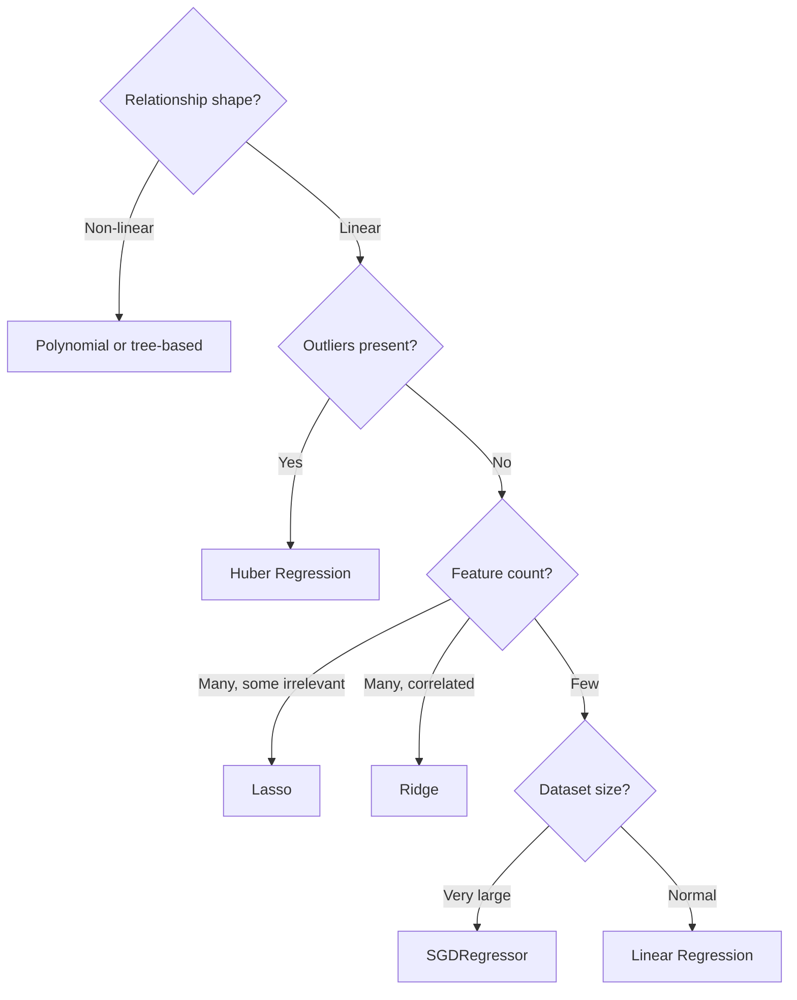

# 🎯 Day 41: Supervised Learning—Regression

> *"Regression predicts numbers. How much? How many? How long?"*

---

## The "Never-Coded" Bridge

**You're a real estate analyst.** A client asks: "What's my house worth?" You can't just guess. You need a model that considers square footage, location, bedrooms, age—and gives a defensible price.

That's regression: predicting a **continuous numerical value** based on input features.

**Regression everywhere:**

- **Zillow/Redfin**: Housing price estimates
- **Insurance**: Claim amount prediction
- **Finance**: Stock price forecasting
- **E-commerce**: Demand prediction
- **Healthcare**: Patient treatment costs
- **Logistics**: Delivery time estimation

---

## The Technical Deep Dive

> **RetailCo Thread**: In this lesson, we will apply regression to predict `total_spend_last_12m` for RetailCo customers using `age`, `annual_income`, `years_as_customer`, `num_purchases`, and `product_category`. The model and metric choices made here will feed into the evaluation framework in Day 45.

### Regression Assumptions and Diagnostics

Before fitting a regression model, understand what assumptions it makes and what violations look like:

**Linear Regression Assumptions:**

| Assumption | What It Means | Business Consequence of Violation | Diagnostic |
|-----------|--------------|-----------------------------------|-----------|
| **Linearity** | Relationship between X and y is linear | Systematic under/over-prediction | Plot residuals vs fitted values — should show no pattern |
| **Independence** | Errors are independent across observations | Underestimated standard errors (common with time series or repeat customers) | Durbin-Watson test; plot residuals over time |
| **Homoscedasticity** | Error variance is constant | Prediction intervals are too wide or too narrow in different regions | Breusch-Pagan test; plot residuals vs fitted values |
| **Normality of errors** | Residuals are approximately normally distributed | Affects CI and p-value validity | Q-Q plot of residuals |
| **No multicollinearity** | Features are not highly correlated with each other | Coefficients are unstable and uninterpretable | Variance Inflation Factor (VIF) > 10 signals multicollinearity |

**Key Definitions:**

- **Residual**: The difference between actual and predicted value: εᵢ = yᵢ − ŷᵢ. Residual plots reveal model misspecification.
- **Multicollinearity**: When two or more features are highly correlated (e.g., `house_size` and `num_rooms`). Coefficients become unreliable — a small change in data can flip the sign of a coefficient.
- **Heteroscedasticity**: When error variance increases with fitted values (common in income data). Makes standard errors unreliable.
- **Extrapolation**: Predicting outside the range of training data. A model trained on houses priced $100k–$500k should not be used to price a $2M mansion.
- **Regularization (Ridge/Lasso)**: Adds a penalty on coefficient size. Ridge (L2) shrinks all coefficients smoothly. Lasso (L1) drives some to exactly zero (feature selection). Both help when features are correlated or when n < p (more features than samples).

### Linear Regression: The Foundation

Linear regression finds the best straight line (or hyperplane) through your data. For a sample with feature vector $\mathbf{x}_i \in \mathbb{R}^p$, the prediction is:

$$
\hat{y}_i = \mathbf{w}^\top \mathbf{x}_i + b = w_1 x_{i1} + w_2 x_{i2} + \cdots + w_p x_{ip} + b
$$

The weights $\mathbf{w}$ and bias $b$ are chosen to minimize the **mean-squared-error** loss:

$$
\mathcal{L}_{\text{MSE}}(\mathbf{w}, b) = \frac{1}{n} \sum_{i=1}^{n} (y_i - \hat{y}_i)^2
$$

When written in matrix form, the closed-form solution (the *normal equation*) is:

$$
\mathbf{w}^\star = (X^\top X)^{-1} X^\top \mathbf{y}
$$

```python
import numpy as np
import pandas as pd
import matplotlib.pyplot as plt
from sklearn.linear_model import LinearRegression
from sklearn.model_selection import train_test_split
from sklearn.metrics import mean_squared_error, r2_score

# Generate sample data: house prices
np.random.seed(42)
n = 200

sqft = np.random.uniform(800, 3000, n)
bedrooms = np.random.randint(1, 6, n)
age = np.random.uniform(0, 50, n)

# True relationship: price = 100*sqft + 20000*bedrooms - 500*age + 50000 + noise
price = (
    100 * sqft + 20000 * bedrooms - 500 * age + 50000 + np.random.normal(0, 30000, n)
)

# Create DataFrame
df = pd.DataFrame({"sqft": sqft, "bedrooms": bedrooms, "age": age, "price": price})

# Prepare features and target
X = df[["sqft", "bedrooms", "age"]]
y = df["price"]

# Split data
X_train, X_test, y_train, y_test = train_test_split(
    X, y, test_size=0.2, random_state=42
)

# Train linear regression
model = LinearRegression()
model.fit(X_train, y_train)

# Model parameters
print("=== Linear Regression Model ===")
print(f"Intercept: ${model.intercept_:,.0f}")
for name, coef in zip(X.columns, model.coef_):
    print(f"Coefficient for {name}: {coef:,.2f}")

# Interpretation:
# - Each additional sqft adds $100 to price
# - Each additional bedroom adds $20,000
# - Each year of age subtracts $500

# Predictions
y_pred = model.predict(X_test)

# Evaluate
rmse = np.sqrt(mean_squared_error(y_test, y_pred))
r2 = r2_score(y_test, y_pred)
print(f"\nRMSE: ${rmse:,.0f}")
print(f"R² Score: {r2:.3f}")

# Visualize predictions vs actual
plt.figure(figsize=(8, 6))
plt.scatter(y_test, y_pred, alpha=0.5)
plt.plot([y_test.min(), y_test.max()], [y_test.min(), y_test.max()], "r--", linewidth=2)
plt.xlabel("Actual Price ($)")
plt.ylabel("Predicted Price ($)")
plt.title("Linear Regression: Predicted vs Actual")
plt.tight_layout()
plt.show()
```

### Feature Scaling: Why It Matters

Features on different scales can hurt some algorithms. **Standardization** maps each feature to mean zero and unit variance:

$$
x'_{ij} = \frac{x_{ij} - \mu_j}{\sigma_j}
$$

where $\mu_j$ and $\sigma_j$ are the column-wise mean and standard deviation computed on the **training set only**.

```python
from sklearn.preprocessing import StandardScaler

# Notice the scale differences
print("Feature ranges:")
print(f"  sqft: {X['sqft'].min():.0f} to {X['sqft'].max():.0f}")
print(f"  bedrooms: {X['bedrooms'].min()} to {X['bedrooms'].max()}")
print(f"  age: {X['age'].min():.1f} to {X['age'].max():.1f}")

# StandardScaler: mean=0, std=1
scaler = StandardScaler()
X_train_scaled = scaler.fit_transform(X_train)
X_test_scaled = scaler.transform(X_test)

# After scaling
print("\nAfter scaling:")
print(f"  Mean: {X_train_scaled.mean(axis=0).round(2)}")
print(f"  Std:  {X_train_scaled.std(axis=0).round(2)}")

# For linear regression, scaling doesn't change predictions
# But it DOES change coefficient interpretation
model_scaled = LinearRegression()
model_scaled.fit(X_train_scaled, y_train)

print("\nScaled coefficients (comparable magnitudes):")
for name, coef in zip(X.columns, model_scaled.coef_):
    print(f"  {name}: {coef:,.0f}")
# Now you can compare: which feature has the most impact?
```

### Polynomial Regression: Capturing Non-linearity

When relationships aren't straight lines, expand the feature into polynomial basis functions and fit a linear model in the expanded space. A degree-$d$ polynomial expansion of a single feature $x$ produces:

$$
\hat{y} = w_0 + w_1 x + w_2 x^2 + \cdots + w_d x^d
$$

```python
from sklearn.preprocessing import PolynomialFeatures
from sklearn.pipeline import make_pipeline

# Generate data with non-linear relationship
np.random.seed(42)
X_curve = np.linspace(0, 10, 100).reshape(-1, 1)
y_curve = (
    2 * X_curve.squeeze() ** 2
    - 5 * X_curve.squeeze()
    + 10
    + np.random.normal(0, 5, 100)
)

# Split
X_train_c, X_test_c, y_train_c, y_test_c = train_test_split(
    X_curve, y_curve, test_size=0.2
)

# Compare linear vs polynomial
fig, axes = plt.subplots(1, 3, figsize=(15, 4))

for ax, degree in zip(axes, [1, 2, 5]):
    model = make_pipeline(PolynomialFeatures(degree), LinearRegression())
    model.fit(X_train_c, y_train_c)

    # Predictions
    X_plot = np.linspace(0, 10, 100).reshape(-1, 1)
    y_plot = model.predict(X_plot)

    # Score
    train_r2 = model.score(X_train_c, y_train_c)
    test_r2 = model.score(X_test_c, y_test_c)

    ax.scatter(X_curve, y_curve, alpha=0.5, label="Data")
    ax.plot(X_plot, y_plot, "r-", linewidth=2, label=f"Degree {degree}")
    ax.set_title(f"Degree {degree}\nTrain R²={train_r2:.3f}, Test R²={test_r2:.3f}")
    ax.legend()
    ax.set_xlabel("X")
    ax.set_ylabel("y")

plt.tight_layout()
plt.show()
```

### Regularization: Ridge and Lasso

Regularization prevents overfitting by penalizing large coefficients. Both methods minimize the MSE plus a coefficient norm:

**Ridge (L2)**:

$$
\mathcal{L}_{\text{Ridge}}(\mathbf{w}) = \frac{1}{n} \sum_{i=1}^{n} (y_i - \hat{y}_i)^2 + \alpha \sum_{j=1}^{p} w_j^2 = \mathrm{MSE} + \alpha \, \|\mathbf{w}\|_2^2
$$

**Lasso (L1)**:

$$
\mathcal{L}_{\text{Lasso}}(\mathbf{w}) = \frac{1}{n} \sum_{i=1}^{n} (y_i - \hat{y}_i)^2 + \alpha \sum_{j=1}^{p} |w_j| = \mathrm{MSE} + \alpha \, \|\mathbf{w}\|_1
$$

The L1 penalty has corners at $w_j = 0$, which is why Lasso drives coefficients **exactly** to zero (automatic feature selection); the L2 penalty only shrinks them smoothly.

```python
from sklearn.linear_model import Ridge, Lasso

# Create data with many features (some irrelevant)
np.random.seed(42)
n, p = 100, 20  # 100 samples, 20 features

X_reg = np.random.randn(n, p)
# Only first 3 features actually matter
true_coef = np.array([10, -5, 3] + [0] * 17)
y_reg = X_reg @ true_coef + np.random.randn(n) * 2

X_train_r, X_test_r, y_train_r, y_test_r = train_test_split(X_reg, y_reg, test_size=0.2)

# Compare models
models = {
    "Linear Regression": LinearRegression(),
    "Ridge (L2)": Ridge(alpha=1.0),
    "Lasso (L1)": Lasso(alpha=0.5),
}

plt.figure(figsize=(12, 4))
for i, (name, model) in enumerate(models.items()):
    model.fit(X_train_r, y_train_r)

    plt.subplot(1, 3, i + 1)
    plt.bar(range(20), model.coef_)
    plt.axhline(y=0, color="k", linestyle="-", linewidth=0.5)
    plt.xlabel("Feature Index")
    plt.ylabel("Coefficient")
    test_r2 = model.score(X_test_r, y_test_r)
    plt.title(f"{name}\nTest R²={test_r2:.3f}")

    # Highlight true important features
    for idx in [0, 1, 2]:
        plt.axvline(x=idx, color="red", linestyle="--", alpha=0.3)

plt.tight_layout()
plt.show()

# Lasso drives irrelevant coefficients to exactly zero (feature selection!)
print("\nLasso non-zero coefficients:")
lasso = models["Lasso (L1)"]
for i, coef in enumerate(lasso.coef_):
    if abs(coef) > 0.01:
        print(f"  Feature {i}: {coef:.3f}")
```

### Choosing Regularization Strength

```python
from sklearn.model_selection import cross_val_score

# Test different alpha values
alphas = np.logspace(-3, 3, 50)  # 0.001 to 1000

ridge_scores = []
lasso_scores = []

for alpha in alphas:
    ridge = Ridge(alpha=alpha)
    lasso = Lasso(alpha=alpha, max_iter=10000)

    ridge_cv = cross_val_score(ridge, X_train_r, y_train_r, cv=5)
    lasso_cv = cross_val_score(lasso, X_train_r, y_train_r, cv=5)

    ridge_scores.append(ridge_cv.mean())
    lasso_scores.append(lasso_cv.mean())

plt.figure(figsize=(10, 5))
plt.semilogx(alphas, ridge_scores, "b-", label="Ridge")
plt.semilogx(alphas, lasso_scores, "r-", label="Lasso")
plt.xlabel("Alpha (regularization strength)")
plt.ylabel("Cross-validation R² Score")
plt.title("Regularization: Finding Optimal Alpha")
plt.legend()
plt.grid(True, alpha=0.3)
plt.show()

# Best alpha
best_ridge_alpha = alphas[np.argmax(ridge_scores)]
best_lasso_alpha = alphas[np.argmax(lasso_scores)]
print(f"Best Ridge alpha: {best_ridge_alpha:.4f}")
print(f"Best Lasso alpha: {best_lasso_alpha:.4f}")
```

---

## Senior-Level Insights

### Regression Metrics Explained

| Metric   | Formula                                                                      | Interpretation           | Use When              |
| -------- | ---------------------------------------------------------------------------- | ------------------------ | --------------------- |
| **MAE**  | $\dfrac{1}{n}\sum_i \lvert y_i - \hat{y}_i\rvert$                            | Average absolute error   | Robust to outliers    |
| **MSE**  | $\dfrac{1}{n}\sum_i (y_i - \hat{y}_i)^2$                                     | Average squared error    | Penalize large errors |
| **RMSE** | $\sqrt{\mathrm{MSE}}$                                                        | Same units as target     | Standard choice       |
| **R²**   | $1 - \dfrac{\sum_i (y_i - \hat{y}_i)^2}{\sum_i (y_i - \bar{y})^2}$           | Variance explained (0–1) | Compare models        |
| **MAPE** | $\dfrac{100}{n}\sum_i \left\lvert\dfrac{y_i - \hat{y}_i}{y_i}\right\rvert$   | Percentage error         | Business reporting    |

### Regression Metric Selection Guide

| Metric | Formula | Best When | Avoid When | Example |
|--------|---------|-----------|-----------|---------|
| **MAE** | mean(\|y − ŷ\|) | Errors in original units; outliers should not be penalized heavily; stakeholders understand it | Large errors are disproportionately costly | Forecasting daily store visits |
| **RMSE** | √mean((y−ŷ)²) | Large errors are especially bad; compare models on same scale | Target has many outliers (will dominate loss) | Predicting financial returns where large mistakes are catastrophic |
| **MAPE** | mean(\|y−ŷ\|/y) × 100% | Percentage errors matter; comparing accuracy across different scales | y can be zero or near-zero (division by zero) | Sales forecasting across categories of different magnitude |
| **R²** | 1 − SS_res/SS_tot | Communicating variance explained to stakeholders | Sole production metric; can be gamed; doesn't show direction of errors | Explaining model fit in presentations |
| **RMSE vs MAE** | — | RMSE > MAE signals large errors are present | — | If RMSE = 50 but MAE = 30, errors are mostly small with occasional large ones |

**Cost-asymmetric targets**: When over-prediction and under-prediction have different business costs (e.g., over-ordering inventory wastes money but under-ordering loses sales), use quantile regression or asymmetric loss functions.

### When to Use Each Regression Type

| Scenario                       | Recommended Model         | Why                        |
| ------------------------------ | ------------------------- | -------------------------- |
| Few features, interpretable    | Linear Regression         | Simple, interpretable      |
| Many features, some irrelevant | Lasso                     | Feature selection          |
| Many correlated features       | Ridge                     | Handles multicollinearity  |
| Non-linear relationships       | Polynomial, or tree-based | Captures curves            |
| Outliers in data               | Huber Regression          | Robust to outliers         |
| Very large datasets            | SGDRegressor              | Efficient gradient descent |



### Common Pitfalls

```python
# 1. Forgetting to scale for regularized models
# Ridge and Lasso penalize large coefficients
# Features with large values will have artificially small coefficients

# WRONG:
ridge = Ridge()
ridge.fit(X_train, y_train)  # X has different scales

# RIGHT:
from sklearn.pipeline import Pipeline

pipeline = Pipeline([("scaler", StandardScaler()), ("ridge", Ridge())])
pipeline.fit(X_train, y_train)

# 2. Data leakage: fitting scaler on all data
# WRONG:
scaler = StandardScaler()
X_scaled = scaler.fit_transform(X)  # Sees test data!
X_train, X_test = train_test_split(X_scaled, ...)

# RIGHT:
X_train, X_test = train_test_split(X, ...)
scaler = StandardScaler()
X_train_scaled = scaler.fit_transform(X_train)  # Fit on train only
X_test_scaled = scaler.transform(X_test)  # Transform test
```

### Advanced Regression Topics

**Prediction Intervals vs Confidence Intervals**

- **Confidence interval**: Range for the *expected mean* response at a given X — "The mean house price for 2,000 sqft homes is $350k ± $15k (95% CI)"
- **Prediction interval**: Range for an *individual* prediction — "This specific house is predicted at $350k ± $60k (95% PI)"
Prediction intervals are always wider than confidence intervals because they include irreducible individual variation.

```python
# sklearn does not provide prediction intervals natively for linear regression
# Use statsmodels for proper inference:
import statsmodels.api as sm
model = sm.OLS(y_train, sm.add_constant(X_train)).fit()
predictions = model.get_prediction(sm.add_constant(X_test))
pred_summary = predictions.summary_frame(alpha=0.05)
# Columns: mean, mean_se, obs_ci_lower, obs_ci_upper (prediction interval)
```

**Quantile Regression**
When you need the 10th or 90th percentile rather than the mean (e.g., worst-case revenue forecast, planning inventory for peak demand):

```python
from sklearn.linear_model import QuantileRegressor
q10 = QuantileRegressor(quantile=0.1).fit(X_train, y_train)
q90 = QuantileRegressor(quantile=0.9).fit(X_train, y_train)
```

**Time-Aware Regression Validation**
Never use random train/test splits for time-series data. Use a chronological split:

```python
from sklearn.model_selection import TimeSeriesSplit
tscv = TimeSeriesSplit(n_splits=5)
for train_idx, val_idx in tscv.split(X):
    # Always: train on past, validate on future
```

**Leakage in Target-Derived Features**
If you create `days_to_next_purchase` as a feature to predict `churn`, but that feature is computed from the outcome period, you have leakage. Audit every feature with the question: "Would this value be available at the time I need to make a prediction?"

### Senior-Level Regression Insights

**Coefficient and Feature Importance Caveats**

- Linear model coefficients are valid only if features are standardized — otherwise they're not comparable
- Correlated features "share" predictive power unpredictably across coefficients — adding a correlated feature can reverse the sign of an existing one
- Tree feature importance (MDI) biases toward high-cardinality and high-variance features; prefer permutation importance for unbiased estimates

**Subgroup Error Analysis**
A model with RMSE=$30k overall may have RMSE=$60k for a specific region or store type. Always segment errors:

```python
error_by_region = test_df.assign(error=abs(y_test - y_pred)).groupby('region')['error'].mean()
```

Large subgroup errors often indicate missing features for that group.

**Drift Monitoring**
Production models degrade as the world changes. Monitor:

- Input drift: distribution of features shifts (e.g., income ranges change post-inflation)
- Concept drift: relationship between features and target changes (e.g., pricing dynamics shift)
- Track RMSE on new labeled data weekly; set an alert threshold for retraining.

**Baseline-vs-Complexity Deployment Gate**
Before deploying a complex model, confirm it beats a simple baseline by enough to justify the maintenance cost:

```python
baseline_rmse = mean_absolute_error(y_test, np.full_like(y_test, y_train.mean()))
model_rmse = mean_absolute_error(y_test, model.predict(X_test))
if (baseline_rmse - model_rmse) / baseline_rmse < 0.10:
    print("Model does not improve enough over baseline — reconsider complexity")
```

---

## Hands-on Lab

### Exercise 1: Building a House Price Model

```python
import numpy as np
import pandas as pd
from sklearn.model_selection import train_test_split, cross_val_score
from sklearn.linear_model import LinearRegression, Ridge
from sklearn.preprocessing import StandardScaler
from sklearn.metrics import mean_squared_error, r2_score

# Create realistic housing data
np.random.seed(42)
n = 500

data = pd.DataFrame(
    {
        "sqft": np.random.uniform(800, 4000, n),
        "bedrooms": np.random.randint(1, 6, n),
        "bathrooms": np.random.uniform(1, 4, n).round(1),
        "age": np.random.uniform(0, 80, n),
        "lot_size": np.random.uniform(2000, 20000, n),
        "garage": np.random.randint(0, 4, n),
        "neighborhood_score": np.random.uniform(1, 10, n),  # 1-10 rating
    }
)

# Price with non-linear effects
data["price"] = (
    150 * data["sqft"]
    + 25000 * data["bedrooms"]
    + 15000 * data["bathrooms"]
    - 1000 * data["age"]
    + 5 * data["lot_size"]
    + 15000 * data["garage"]
    + 20000 * data["neighborhood_score"]
    + 50000
    + np.random.normal(0, 40000, n)
)

# Ensure no negative prices
data["price"] = data["price"].clip(lower=50000)

print("Dataset shape:", data.shape)
print("\nFeature statistics:")
print(data.describe().round(1))

# Prepare data
X = data.drop("price", axis=1)
y = data["price"]

X_train, X_test, y_train, y_test = train_test_split(
    X, y, test_size=0.2, random_state=42
)

# Scale features
scaler = StandardScaler()
X_train_scaled = scaler.fit_transform(X_train)
X_test_scaled = scaler.transform(X_test)

# Train and evaluate
model = LinearRegression()
model.fit(X_train_scaled, y_train)
y_pred = model.predict(X_test_scaled)

print("\n=== Model Performance ===")
print(f"RMSE: ${np.sqrt(mean_squared_error(y_test, y_pred)):,.0f}")
print(f"R² Score: {r2_score(y_test, y_pred):.3f}")

# Feature importance (from scaled coefficients)
importance = pd.DataFrame(
    {
        "Feature": X.columns,
        "Coefficient": model.coef_,
        "Abs_Importance": np.abs(model.coef_),
    }
).sort_values("Abs_Importance", ascending=False)

print("\n=== Feature Importance ===")
print(importance.to_string(index=False))
```

**Business Scenario:** RetailCo's real estate team wants to estimate store rental costs in new markets. Your model will inform capital allocation decisions.

**Tasks:**

1. Split data 80/20; train LinearRegression, Ridge, and RandomForestRegressor
2. Report MAE, RMSE, MAPE, and R² on the test set for each model
3. Plot residuals vs fitted values for the best model
4. Interpret the residual plot: are errors random, or is there a pattern?
5. Write a 3-sentence "Business Recommendation Memo" stating: which model to use, the expected average prediction error, and what the model cannot reliably predict

**Expected Metric Ranges:**
Linear Regression: RMSE ~$35,000–55,000, R² ~0.55–0.70
Ridge Regression: Similar to linear; slightly better when multicollinearity present
Random Forest: RMSE ~$20,000–35,000, R² ~0.75–0.88

**Residual Plot Interpretation:**

- Horizontal band of points with no pattern → assumptions met ✅
- Fan shape (errors grow with fitted value) → heteroscedasticity — try log-transforming target ⚠️
- Curved pattern → non-linearity not captured — try polynomial features or tree model ⚠️

**Sample Business Recommendation Memo:**
"The Random Forest model reduces prediction error by 38% vs a linear baseline (RMSE: $28k vs $45k). The model is most reliable for stores priced $50k–$300k/year; predictions outside this range should be treated with caution. Recommend using this model for initial market screening but requiring human review for any estimate above $250k."

---

### Exercise 2: Comparing Regularization Effects

```python
import numpy as np
import matplotlib.pyplot as plt
from sklearn.linear_model import LinearRegression, Ridge, Lasso, ElasticNet
from sklearn.preprocessing import StandardScaler
from sklearn.model_selection import train_test_split

# Create dataset with multicollinearity
np.random.seed(42)
n = 150

# Correlated features
x1 = np.random.randn(n)
x2 = 0.9 * x1 + 0.1 * np.random.randn(n)  # Highly correlated with x1
x3 = np.random.randn(n)
x4 = 0.8 * x3 + 0.2 * np.random.randn(n)  # Correlated with x3
x5 = np.random.randn(n)  # Independent

X = np.column_stack([x1, x2, x3, x4, x5])
y = 3 * x1 + 2 * x3 + 1 * x5 + np.random.randn(n) * 0.5

# Split and scale
X_train, X_test, y_train, y_test = train_test_split(X, y, test_size=0.2)
scaler = StandardScaler()
X_train_s = scaler.fit_transform(X_train)
X_test_s = scaler.transform(X_test)

# Train different models
models = {
    "Linear": LinearRegression(),
    "Ridge (α=1)": Ridge(alpha=1),
    "Ridge (α=10)": Ridge(alpha=10),
    "Lasso (α=0.1)": Lasso(alpha=0.1),
    "Lasso (α=0.5)": Lasso(alpha=0.5),
    "ElasticNet": ElasticNet(alpha=0.1, l1_ratio=0.5),
}

results = []
coef_data = {}

for name, model in models.items():
    model.fit(X_train_s, y_train)
    train_r2 = model.score(X_train_s, y_train)
    test_r2 = model.score(X_test_s, y_test)
    results.append({"Model": name, "Train R²": train_r2, "Test R²": test_r2})
    coef_data[name] = model.coef_

# Display results
print("=== Model Comparison ===")
for r in results:
    print(f"{r['Model']:20s}: Train R²={r['Train R²']:.3f}, Test R²={r['Test R²']:.3f}")

# Visualize coefficients
fig, ax = plt.subplots(figsize=(12, 6))
x_pos = np.arange(5)
width = 0.12

for i, (name, coefs) in enumerate(coef_data.items()):
    ax.bar(x_pos + i * width, coefs, width, label=name)

ax.axhline(y=0, color="k", linewidth=0.5)
ax.set_xlabel("Feature")
ax.set_ylabel("Coefficient")
ax.set_title("Coefficient Comparison Across Models")
ax.set_xticks(x_pos + width * 2.5)
ax.set_xticklabels(["x1 (corr)", "x2 (corr)", "x3 (corr)", "x4 (corr)", "x5 (indep)"])
ax.legend(loc="upper right")
plt.tight_layout()
plt.show()

# True coefficients: x1=3, x2=0, x3=2, x4=0, x5=1
print("\nTrue coefficients: [3, 0, 2, 0, 1]")
print("Notice how regularization handles correlated features differently!")
```

---

### Exercise 3: Complete Regression Pipeline with Cross-Validation

```python
import numpy as np
import pandas as pd
from sklearn.model_selection import train_test_split, cross_val_score, GridSearchCV
from sklearn.linear_model import Ridge, Lasso
from sklearn.preprocessing import StandardScaler, PolynomialFeatures
from sklearn.pipeline import Pipeline
from sklearn.metrics import mean_squared_error, r2_score

# Load or create data
np.random.seed(42)
n = 400

X = pd.DataFrame(
    {
        "feature_1": np.random.uniform(0, 10, n),
        "feature_2": np.random.uniform(0, 5, n),
        "feature_3": np.random.uniform(-2, 2, n),
    }
)

# Non-linear target
y = (
    2 * X["feature_1"]
    + X["feature_1"] ** 2 * 0.1
    + 3 * X["feature_2"]
    + X["feature_1"] * X["feature_2"] * 0.2
    + np.random.randn(n) * 3
)

X_train, X_test, y_train, y_test = train_test_split(
    X, y, test_size=0.2, random_state=42
)

# Create pipeline with polynomial features and Ridge
pipeline = Pipeline(
    [("poly", PolynomialFeatures()), ("scaler", StandardScaler()), ("ridge", Ridge())]
)

# Grid search for best parameters
param_grid = {"poly__degree": [1, 2, 3], "ridge__alpha": [0.1, 1.0, 10.0, 100.0]}

grid_search = GridSearchCV(
    pipeline,
    param_grid,
    cv=5,
    scoring="neg_mean_squared_error",
    return_train_score=True,
)

grid_search.fit(X_train, y_train)

# Results
print("=== Grid Search Results ===")
print(f"Best parameters: {grid_search.best_params_}")
print(f"Best CV RMSE: {np.sqrt(-grid_search.best_score_):.3f}")

# Evaluate on test set
best_model = grid_search.best_estimator_
y_pred = best_model.predict(X_test)
test_rmse = np.sqrt(mean_squared_error(y_test, y_pred))
test_r2 = r2_score(y_test, y_pred)

print(f"\nTest RMSE: {test_rmse:.3f}")
print(f"Test R²: {test_r2:.3f}")

# Visualize grid search results
results_df = pd.DataFrame(grid_search.cv_results_)
pivot = results_df.pivot_table(
    values="mean_test_score", index="param_ridge__alpha", columns="param_poly__degree"
)

import matplotlib.pyplot as plt
import seaborn as sns

plt.figure(figsize=(8, 6))
sns.heatmap(-pivot, annot=True, fmt=".2f", cmap="viridis")
plt.title("Grid Search: RMSE (lower is better)")
plt.xlabel("Polynomial Degree")
plt.ylabel("Ridge Alpha")
plt.show()
```

---

## Mastery Check

### Question 1: Coefficient Interpretation

In a house price model, the coefficient for 'bedrooms' is 25000. What does this mean?

<details>
<summary>Click for Answer</summary>

**Answer:** All else being equal, each additional bedroom increases the predicted house price by $25,000.

**Important caveats:**

1. This assumes other features (sqft, age, etc.) are held constant
2. This is a linear approximation—real relationships may be non-linear
3. The interpretation assumes the model is correctly specified
4. Causation is not implied—more bedrooms might correlate with other factors

**Example:**

```
House A: 3 bedrooms, 2000 sqft → Predicted: $300,000
House B: 4 bedrooms, 2000 sqft → Predicted: $325,000
Difference: $25,000 (the coefficient)
```

</details>

---

### Question 2: Ridge vs Lasso

When would you prefer Lasso over Ridge regression?

<details>
<summary>Click for Answer</summary>

**Answer:** Use Lasso when you want **automatic feature selection**.

| Aspect              | Ridge (L2)             | Lasso (L1)                  |
| ------------------- | ---------------------- | --------------------------- |
| Coefficients        | Shrinks toward zero    | Drives some exactly to zero |
| Feature selection   | Keeps all features     | Selects relevant features   |
| Correlated features | Shrinks together       | Picks one, zeros others     |
| Best for            | Many relevant features | Few relevant features       |

**Use Lasso when:**

- You have many features and suspect most are irrelevant
- You want interpretable results with fewer features
- You need to identify the most important predictors

**Use Ridge when:**

- Most features are relevant
- Features are correlated (multicollinearity)
- You want to keep all features but reduce variance

</details>

---

### Question 3: Scaling Importance

Why is feature scaling important for Ridge regression but not for ordinary linear regression?

<details>
<summary>Click for Answer</summary>

**Answer:** Ridge penalizes large coefficients. Without scaling, features with larger values will have smaller coefficients (to compensate), making the penalty unfair.

**Example without scaling:**

- `sqft` ranges 800-3000 → coefficient ~100
- `bedrooms` ranges 1-5 → coefficient ~25000

Ridge penalty treats the coefficient 100 and 25000 equally, but sqft's 100 actually has more impact (100 × 2000 vs 25000 × 3).

**With scaling:**

- Both features have similar ranges (mean=0, std=1)
- Coefficients are comparable
- Penalty is applied fairly

**Ordinary linear regression** doesn't care about scaling because there's no penalty—the coefficients adjust naturally.

</details>

---

### Question 4: R² Interpretation

Your model has R² = 0.85. Is this good?

<details>
<summary>Click for Answer</summary>

**Answer:** It depends on the domain and baseline!

**R² = 0.85 means:**

- Your model explains 85% of the variance in the target
- 15% remains unexplained (noise or missing features)

**Is it good?**

- **Physical sciences**: Often expect R² > 0.95 (controllable systems)
- **Social sciences/economics**: R² = 0.50 can be excellent
- **Stock prediction**: R² > 0.05 can be profitable!

**Better questions:**

1. What's the baseline? (Does a simpler model achieve R² = 0.80?)
2. What's the RMSE in practical terms? (Is $10K error acceptable?)
3. Is the model useful for decisions? (Lower variance in predictions?)

**Caution:** R² can always be increased by adding features, even useless ones. Use adjusted R² or cross-validation instead.

</details>

---

### Question 5: Diagnosing Problems

Your regression model has RMSE of $50,000 on training data but $150,000 on test data. What's wrong and how do you fix it?

<details>
<summary>Click for Answer</summary>

**Answer:** Classic **overfitting**. The model memorized training data but doesn't generalize.

**Diagnosis:** Large gap between train and test performance.

**Solutions:**

1. **Regularization**: Add Ridge (L2) or Lasso (L1) penalty
2. **Simplify model**: Reduce polynomial degree, fewer features
3. **More data**: Harder to memorize with more samples
4. **Feature selection**: Remove irrelevant/noisy features
5. **Cross-validation**: Use CV during model selection

**Example fix:**

```python
# Before (overfitting)
model = LinearRegression()

# After (regularized)
from sklearn.linear_model import Ridge

model = Ridge(alpha=1.0)  # Tune alpha via cross-validation
```

Monitor the train-test gap as you tune!

</details>

---

## Math-to-Debug Tasks

1. **Residual diagnostics tied to assumptions**: Use residual-vs-fitted and Q-Q plots to test linearity, constant variance, and near-normal error assumptions; document which assumption breaks first and expected business impact on predictions.
2. **Why-model-failed case (regression)**: RMSE is good on train but poor on test, with funnel-shaped residuals. Explain conceptually *why the model failed* (heteroscedasticity + omitted nonlinearity), then take corrective action with log/Box-Cox transform, interaction or polynomial terms, and weighted/robust regression.

---

## Summary

Today you learned:

- ✅ Linear regression $\hat{y} = \mathbf{w}^\top \mathbf{x} + b$ fits a line/hyperplane to predict continuous values
- ✅ Feature scaling $x' = (x - \mu) / \sigma$ ensures fair treatment across features
- ✅ Polynomial features capture non-linear relationships in a linear model
- ✅ Ridge (L2): adds $\alpha \|\mathbf{w}\|_2^2$ to shrink coefficients smoothly
- ✅ Lasso (L1): adds $\alpha \|\mathbf{w}\|_1$ to drive some coefficients to zero (feature selection)
- ✅ RMSE $= \sqrt{\tfrac{1}{n}\sum (y_i - \hat{y}_i)^2}$ and R² are standard regression metrics
- ✅ Cross-validation helps find optimal regularization strength $\alpha$

**Tomorrow**: Classification—predicting categories instead of numbers.
