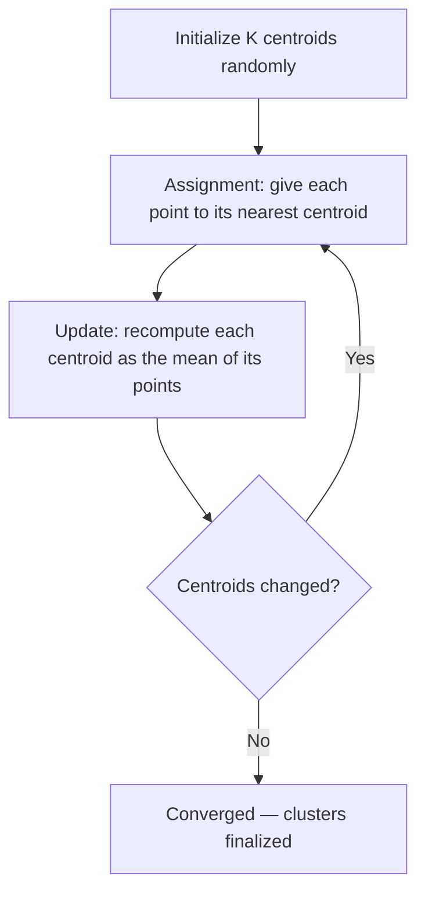

# 🎯 Day 44: Unsupervised Learning

> *"No labels? No problem. Find patterns hiding in your data."*

---

## The "Never-Coded" Bridge

**You're a marketing analyst with millions of customers.** You don't have predefined segments—no one told you what "types" of customers exist. But intuitively, you know they're not all the same. Some are high-spenders, some are bargain-hunters, some are loyal, some are about to churn.

**Unsupervised learning** discovers these hidden structures without being told what to look for.

**Unsupervised learning in action:**

- **Retail**: Customer segmentation for targeted marketing
- **Finance**: Fraud detection (anomalies from normal patterns)
- **Biology**: Gene expression clustering
- **Security**: Network intrusion detection
- **Compression**: Image and video compression via PCA

---

## The Technical Deep Dive

### Critical: What Clusters Are (and Are Not)

Cluster assignments are **model-dependent constructs**, not discovered ground truth. The same dataset can produce entirely different clusters depending on:

- The algorithm (K-means vs DBSCAN vs hierarchical)
- The number of clusters (K)
- The distance metric and feature scaling
- The random initialization seed

**What this means for business:**

- Customer "segments" from K-means are patterns the algorithm found given your assumptions — not inherent, stable, universal groups
- Two analysts using different K values will describe the same customers as belonging to completely different segments
- Overinterpreting cluster labels ("Budget-Conscious Millennials") as definitive customer identities can mislead strategy and reinforce stereotypes
- **Safeguard**: Always validate that business actions based on segments produce measurable outcomes; treat segments as hypotheses to test, not facts

**Good practices:**

- Run clustering with multiple K values and algorithms; report stability
- Have domain experts validate whether clusters are meaningful before acting on them
- Use segments descriptively ("customers in Cluster 2 tend to...") not prescriptively ("Cluster 2 customers are...")

---

### K-Means Clustering

K-Means groups data points into $K$ clusters by minimizing the within-cluster sum of squared distances to the cluster centroids $\boldsymbol{\mu}_1, \ldots, \boldsymbol{\mu}_K$:

$$
\mathcal{J}(\{C_k\}, \{\boldsymbol{\mu}_k\}) = \sum_{k=1}^{K} \sum_{\mathbf{x}_i \in C_k} \|\mathbf{x}_i - \boldsymbol{\mu}_k\|_2^2
$$

The algorithm alternates two steps until convergence:

1. **Assignment step** — assign each point to its nearest centroid: $C_k = \{\mathbf{x}_i : k = \arg\min_{j} \|\mathbf{x}_i - \boldsymbol{\mu}_j\|_2\}$.
2. **Update step** — recompute each centroid as the mean of its assigned points: $\boldsymbol{\mu}_k = \dfrac{1}{|C_k|}\sum_{\mathbf{x}_i \in C_k} \mathbf{x}_i$.

The objective is non-convex, so multiple random restarts (`n_init`) help avoid bad local minima. The final value of $\mathcal{J}$ is reported by sklearn as `inertia_`.



```python
import numpy as np
import pandas as pd
import matplotlib.pyplot as plt
from sklearn.cluster import KMeans
from sklearn.preprocessing import StandardScaler

# Create customer data
np.random.seed(42)
n = 300

# Three natural clusters
cluster1 = np.random.randn(100, 2) * 0.5 + [2, 2]  # High value
cluster2 = np.random.randn(100, 2) * 0.8 + [6, 6]  # Premium
cluster3 = np.random.randn(100, 2) * 0.6 + [2, 6]  # Engaged

X = np.vstack([cluster1, cluster2, cluster3])
df = pd.DataFrame(X, columns=["recency_score", "monetary_score"])

# Scale features (important for distance-based algorithms)
scaler = StandardScaler()
X_scaled = scaler.fit_transform(X)

# Fit K-Means
kmeans = KMeans(n_clusters=3, random_state=42, n_init=10)
clusters = kmeans.fit_predict(X_scaled)

# Visualize
plt.figure(figsize=(10, 5))

plt.subplot(1, 2, 1)
plt.scatter(X[:, 0], X[:, 1], alpha=0.6)
plt.title("Before Clustering")
plt.xlabel("Recency Score")
plt.ylabel("Monetary Score")

plt.subplot(1, 2, 2)
plt.scatter(X[:, 0], X[:, 1], c=clusters, cmap="viridis", alpha=0.6)
centers = scaler.inverse_transform(kmeans.cluster_centers_)
plt.scatter(centers[:, 0], centers[:, 1], c="red", marker="X", s=200, label="Centers")
plt.title("After K-Means Clustering (K=3)")
plt.xlabel("Recency Score")
plt.ylabel("Monetary Score")
plt.legend()

plt.tight_layout()
plt.show()
```

### Finding Optimal K: The Elbow Method

The **silhouette score** for a point $i$ blends how tight its cluster is with how far away the next-closest cluster is:

$$
s(i) = \frac{b(i) - a(i)}{\max\{a(i), b(i)\}} \in [-1, 1]
$$

where $a(i)$ is the average distance from $i$ to other points in *its* cluster and $b(i)$ is the average distance to points in the *nearest other* cluster. Higher is better; values near $0$ indicate overlapping clusters, negatives indicate misassignment.

```python
# Elbow method: find the "elbow" where adding clusters has diminishing returns
inertias = []
K_range = range(1, 11)

for k in K_range:
    kmeans = KMeans(n_clusters=k, random_state=42, n_init=10)
    kmeans.fit(X_scaled)
    inertias.append(kmeans.inertia_)  # Sum of squared distances to centers

plt.figure(figsize=(10, 5))

plt.subplot(1, 2, 1)
plt.plot(K_range, inertias, "bo-", linewidth=2)
plt.xlabel("Number of Clusters (K)")
plt.ylabel("Inertia (Sum of Squared Distances)")
plt.title("Elbow Method")
plt.axvline(x=3, color="r", linestyle="--", label="Elbow at K=3")
plt.legend()
plt.grid(True, alpha=0.3)

# Silhouette score: measures cluster quality
from sklearn.metrics import silhouette_score

silhouettes = []
for k in range(2, 11):  # Silhouette needs at least 2 clusters
    kmeans = KMeans(n_clusters=k, random_state=42, n_init=10)
    labels = kmeans.fit_predict(X_scaled)
    silhouettes.append(silhouette_score(X_scaled, labels))

plt.subplot(1, 2, 2)
plt.plot(range(2, 11), silhouettes, "go-", linewidth=2)
plt.xlabel("Number of Clusters (K)")
plt.ylabel("Silhouette Score")
plt.title("Silhouette Method")
plt.axvline(x=3, color="r", linestyle="--", label="Best at K=3")
plt.legend()
plt.grid(True, alpha=0.3)

plt.tight_layout()
plt.show()

print(f"Best K by silhouette: {range(2, 11)[np.argmax(silhouettes)]}")
print(f"Best silhouette score: {max(silhouettes):.3f}")
```

> **Justifying the Choice of K**
>
> Selecting K=3 above was based on the elbow in the inertia plot. However, the "elbow" is subjective and often ambiguous. Also consider:
>
> - **Silhouette score**: Average similarity of each point to its cluster vs other clusters (-1 to 1; higher is better)
> - **Business constraint**: If your marketing team can only run 4 campaigns, try K=4
> - **Operational capacity**: If you can only service 2 customer tiers, K=2 may be forced
> - **Stability check**: Does the same cluster structure appear with different random seeds?
>
> ```python
> from sklearn.metrics import silhouette_score
> for k in range(2, 8):
>     km = KMeans(n_clusters=k, random_state=42, n_init=10)
>     labels = km.fit_predict(X_scaled)
>     sil = silhouette_score(X_scaled, labels)
>     print(f"K={k}: inertia={km.inertia_:.0f}, silhouette={sil:.3f}")
> ```

### Analyzing Clusters

```python
# Add cluster labels to data
df["cluster"] = clusters

# Cluster profiles
cluster_profiles = df.groupby("cluster").agg(["mean", "std", "count"])
print("=== Cluster Profiles ===")
print(cluster_profiles.round(2))

# Naming clusters based on characteristics
cluster_names = {0: "Budget-Conscious", 1: "Premium Customers", 2: "Engaged Shoppers"}
df["segment"] = df["cluster"].map(cluster_names)

# Visualize cluster distributions
fig, axes = plt.subplots(1, 2, figsize=(12, 5))

for i, col in enumerate(["recency_score", "monetary_score"]):
    df.boxplot(column=col, by="segment", ax=axes[i])
    axes[i].set_title(f"{col} by Segment")
    axes[i].set_xlabel("Segment")

plt.suptitle("")
plt.tight_layout()
plt.show()
```

### PCA: Dimensionality Reduction

Principal Component Analysis finds directions of maximum variance. Given a centered data matrix $X \in \mathbb{R}^{n \times p}$ (each column has zero mean), the **sample covariance** is:

$$
\Sigma = \frac{1}{n - 1} X^\top X
$$

The principal components are the eigenvectors $\mathbf{v}_1, \ldots, \mathbf{v}_p$ of $\Sigma$, sorted by their eigenvalues $\lambda_1 \geq \lambda_2 \geq \cdots \geq \lambda_p \geq 0$:

$$
\Sigma \mathbf{v}_k = \lambda_k \mathbf{v}_k
$$

Each $\lambda_k$ is the variance captured along $\mathbf{v}_k$, so the **fraction of total variance explained** by the first $K$ components is:

$$
\text{ExplainedVar}(K) = \frac{\sum_{k=1}^{K} \lambda_k}{\sum_{j=1}^{p} \lambda_j}
$$

Projecting $\mathbf{x}_i$ onto the top-$K$ components gives a compressed representation $\mathbf{z}_i = V_K^\top \mathbf{x}_i \in \mathbb{R}^K$.

```python
from sklearn.decomposition import PCA

# Create high-dimensional data (6 features)
np.random.seed(42)
n = 200

# Features with correlations
feature1 = np.random.randn(n)
feature2 = 0.8 * feature1 + 0.2 * np.random.randn(n)  # Correlated
feature3 = np.random.randn(n)
feature4 = 0.9 * feature3 + 0.1 * np.random.randn(n)  # Correlated
feature5 = np.random.randn(n)
feature6 = np.random.randn(n)

X_high = np.column_stack([feature1, feature2, feature3, feature4, feature5, feature6])
X_high_scaled = StandardScaler().fit_transform(X_high)

# Apply PCA
pca = PCA()
X_pca = pca.fit_transform(X_high_scaled)

# Explained variance
print("=== PCA Variance Explained ===")
for i, var in enumerate(pca.explained_variance_ratio_):
    print(f"PC{i + 1}: {var:.1%}")
print(f"Cumulative: {pca.explained_variance_ratio_.cumsum()}")

# Visualize
plt.figure(figsize=(12, 4))

plt.subplot(1, 3, 1)
plt.bar(range(1, 7), pca.explained_variance_ratio_)
plt.xlabel("Principal Component")
plt.ylabel("Variance Explained")
plt.title("Variance by Component")

plt.subplot(1, 3, 2)
plt.plot(range(1, 7), pca.explained_variance_ratio_.cumsum(), "bo-")
plt.axhline(y=0.95, color="r", linestyle="--", label="95% threshold")
plt.xlabel("Number of Components")
plt.ylabel("Cumulative Variance")
plt.title("Cumulative Variance Explained")
plt.legend()
plt.grid(True, alpha=0.3)

# > **Justifying the 95% PCA Threshold**
# >
# > Retaining components that explain 95% of variance is a common convention, but the right
# > threshold depends on:
# > - **Downstream model**: Some models are robust to noisy dimensions (trees); linear models
# >   benefit more from noise removal
# > - **Interpretability**: Fewer components are easier to explain; 3 components can be plotted
# > - **Computational budget**: More components → larger model inputs → slower training
# >
# > Consider visualizing the scree plot and choosing the "knee" where adding components stops
# > helping much, rather than always targeting 95%.

plt.subplot(1, 3, 3)
plt.scatter(X_pca[:, 0], X_pca[:, 1], alpha=0.5)
plt.xlabel("PC1")
plt.ylabel("PC2")
plt.title("Data Projected onto First 2 PCs")

plt.tight_layout()
plt.show()

# Reduce to 2 components (capturing 60%+ variance)
pca_2d = PCA(n_components=2)
X_reduced = pca_2d.fit_transform(X_high_scaled)
print(f"\nReduced from {X_high.shape[1]} to {X_reduced.shape[1]} dimensions")
print(f"Variance retained: {pca_2d.explained_variance_ratio_.sum():.1%}")
```

> **Justifying the 95% PCA Threshold**
>
> Retaining components that explain 95% of variance is a common convention, but the right threshold depends on:
>
> - **Downstream model**: Some models are robust to noisy dimensions (trees); linear models benefit more from noise removal
> - **Interpretability**: Fewer components are easier to explain; 3 components can be plotted
> - **Computational budget**: More components → larger model inputs → slower training
>
> Consider visualizing the scree plot and choosing the "knee" where adding components stops helping much, rather than always targeting 95%.

### Combining PCA and Clustering

```python
# Real-world pattern: PCA for visualization, then cluster
from sklearn.datasets import load_iris

# Load iris dataset (4 features)
iris = load_iris()
X_iris = iris.data
y_iris = iris.target  # We'll hide this for unsupervised

# Scale
X_iris_scaled = StandardScaler().fit_transform(X_iris)

# Reduce to 2D for visualization
pca_iris = PCA(n_components=2)
X_iris_2d = pca_iris.fit_transform(X_iris_scaled)

# Cluster in original space
kmeans_iris = KMeans(n_clusters=3, random_state=42, n_init=10)
clusters_iris = kmeans_iris.fit_predict(X_iris_scaled)

# Visualize
plt.figure(figsize=(12, 5))

plt.subplot(1, 2, 1)
plt.scatter(X_iris_2d[:, 0], X_iris_2d[:, 1], c=y_iris, cmap="Set1", alpha=0.7)
plt.xlabel("PC1")
plt.ylabel("PC2")
plt.title("True Labels (Iris)")
plt.colorbar(label="Species")

plt.subplot(1, 2, 2)
plt.scatter(
    X_iris_2d[:, 0], X_iris_2d[:, 1], c=clusters_iris, cmap="viridis", alpha=0.7
)
plt.xlabel("PC1")
plt.ylabel("PC2")
plt.title("K-Means Clusters (K=3)")
plt.colorbar(label="Cluster")

plt.tight_layout()
plt.show()

# Compare to true labels
from sklearn.metrics import adjusted_rand_score

ari = adjusted_rand_score(y_iris, clusters_iris)
print(f"Adjusted Rand Index: {ari:.3f} (1.0 = perfect match)")
```

### Extended Unsupervised Methods

**DBSCAN (Density-Based Spatial Clustering of Applications with Noise)**
Unlike K-means, DBSCAN:

- Does not require specifying K in advance
- Finds clusters of arbitrary shape
- Labels outliers as noise (cluster label = -1)
- Works poorly in high dimensions

```python
from sklearn.cluster import DBSCAN
db = DBSCAN(eps=0.5, min_samples=5)  # eps: neighborhood radius; min_samples: core point threshold
labels = db.fit_predict(X_scaled)
n_clusters = len(set(labels)) - (1 if -1 in labels else 0)
n_noise = list(labels).count(-1)
print(f"Clusters: {n_clusters}, Noise points: {n_noise}")
```

**Hierarchical Clustering**
Builds a tree (dendrogram) of nested clusters without requiring K upfront. Use the dendrogram to choose a meaningful K by eye:

```python
from scipy.cluster.hierarchy import dendrogram, linkage
Z = linkage(X_scaled, method='ward')  # Ward minimizes within-cluster variance
```

**Gaussian Mixture Models (GMM)**
Assumes data is drawn from a mixture of Gaussian distributions. Produces soft cluster assignments (probabilities):

```python
from sklearn.mixture import GaussianMixture
gmm = GaussianMixture(n_components=3, random_state=42)
probabilities = gmm.predict_proba(X_scaled)  # Soft assignments
```

**PCA Leakage Prevention**
PCA must be fitted on training data only:

```python
# WRONG: fit PCA on all data before splitting
pca = PCA(n_components=10).fit(X)           # Leaks test statistics into PCA directions

# CORRECT: fit PCA only on training data
pca = PCA(n_components=10).fit(X_train)
X_train_pca = pca.transform(X_train)
X_test_pca = pca.transform(X_test)         # Same transformation, not refitted
```

**Nonlinear Dimensionality Reduction**
For visualization only (not for creating model inputs or new-point transformation):

- **t-SNE**: Preserves local structure; great for visualizing clusters in 2D; non-deterministic; cannot transform new points
- **UMAP**: Faster than t-SNE; preserves more global structure; can transform new points

---

## Senior-Level Insights

### Clustering Evaluation Without Labels

| Metric                | What It Measures                    | Interpretation           |
| --------------------- | ----------------------------------- | ------------------------ |
| **Inertia**           | Sum of squared distances to centers | Lower = tighter clusters |
| **Silhouette**        | Cohesion vs separation              | -1 to 1, higher = better |
| **Calinski-Harabasz** | Between vs within cluster variance  | Higher = better          |
| **Davies-Bouldin**    | Average similarity between clusters | Lower = better           |

### PCA vs Other Reduction Techniques

| Technique | Best For | Scaling Required | New-Point Transform | Interpretability | Limitation |
|-----------|---------|------------------|--------------------|--------------------|------------|
| **PCA** | Linear correlations; preprocessing for ML models | Yes | Yes | Components = linear combos of features | Cannot capture nonlinear structure |
| **t-SNE** | 2D/3D visualization of clusters | Yes | No (fit new points separately) | Very low | Hyperparameter sensitive; slow on large datasets |
| **UMAP** | Visualization + new-point transform; faster than t-SNE | Yes | Yes | Low | Stochastic; results change across runs |
| **Autoencoder** | Complex nonlinear compression; image/text features | Yes | Yes (encoder) | Very low (latent space) | Requires deep learning infrastructure |
| **Factor Analysis** | Interpretable latent factors; psychometric data | Yes | Yes | Moderate (factor loadings) | Assumes linear Gaussian model |

### Production Clustering Considerations

```python
# 1. Feature scaling is critical
scaler = StandardScaler()  # Mean=0, Std=1
X_scaled = scaler.fit_transform(X)
# K-Means uses Euclidean distance; unscaled features dominate

# 2. K-Means assumptions
# - Clusters are spherical and equally sized
# - If violated, consider: DBSCAN, Gaussian Mixture, Hierarchical

# 3. Stability check: run multiple times
from sklearn.cluster import KMeans

results = []
for seed in range(10):
    km = KMeans(n_clusters=3, random_state=seed, n_init=10)
    labels = km.fit_predict(X_scaled)
    results.append(silhouette_score(X_scaled, labels))
print(f"Silhouette: {np.mean(results):.3f} ± {np.std(results):.3f}")

# 4. Assigning new data to existing clusters
# Save the trained model and use predict()
new_data = scaler.transform(new_raw_data)
new_clusters = kmeans.predict(new_data)
```

### Production Unsupervised Learning

**Cluster Drift and Stability Monitoring**
Customer segments are not static. Monitor monthly:

- **Cluster size drift**: Alert if any cluster grows/shrinks > 20% month-over-month
- **Centroid drift**: Alert if cluster centers shift significantly in feature space
- **Assignment instability**: Track how many customers change cluster assignment each month

```python
from sklearn.metrics import adjusted_rand_score
# Compare assignments from month 1 vs month 2
stability = adjusted_rand_score(labels_month1, labels_month2)
print(f"Cluster stability (ARI): {stability:.3f}")  # 1.0 = identical; 0.0 = random
```

**Cluster Versioning and Reassignment Policy**
When you retrain the clustering model (e.g., quarterly):

- Version the cluster definitions (Cluster-v1, Cluster-v2)
- Do not automatically reassign customers — communicate to business that segment membership changed
- Provide a transition matrix showing what % of Cluster-v1-A became Cluster-v2-B

**Human Validation Before Action**
Before acting on cluster profiles:

1. Validate with 5–10 representative customer interviews per cluster
2. Have a domain expert review whether the cluster story is coherent
3. Run a pilot (A/B test) before full rollout

**Online Scoring Considerations**
When scoring new customers in real time against static cluster centers:

- Use Euclidean distance to nearest centroid (available in `KMeans.predict()`)
- Log the distance — customers far from all centroids are outliers
- Refresh cluster centers periodically; stale centroids misclassify new customer types

---

## Hands-on Lab

**Business Scenario:** RetailCo's marketing team wants to differentiate their customer engagement strategy. They believe distinct customer types should receive different email cadences and offer types.

**Tasks:**

1. Scale features (age, annual_income, total_spend) using StandardScaler
2. Find optimal K using both inertia elbow and silhouette score (K=2 to 7)
3. Fit KMeans with chosen K; add cluster labels to DataFrame
4. Profile each cluster: compute mean of each feature per cluster
5. Propose a business action for each cluster and define how you would validate it

**Expected Cluster Profiles (K=3 example):**
Cluster 0 — "High-Value Loyalists": mean income=$95k, mean spend=$3,200, mean age=42 → Targeted premium program
Cluster 1 — "Budget Browsers": mean income=$38k, mean spend=$420, mean age=27 → Discount promotions
Cluster 2 — "Moderate Engagers": mean income=$62k, mean spend=$1,100, mean age=35 → Loyalty rewards program

**Silhouette scores:** K=2: 0.41, K=3: 0.52, K=4: 0.49 → K=3 optimal

**Business Validation Plan:**
For each cluster, run a 90-day A/B test: 50% receive cluster-specific treatment, 50% receive generic email.
Measure: conversion rate, average order value, churn rate.
Hypothesis: "High-Value Loyalists" respond better to premium offers than generic email (expected +12% conversion lift).

---

### Exercise 1: Customer Segmentation

```python
import numpy as np
import pandas as pd
from sklearn.preprocessing import StandardScaler
from sklearn.cluster import KMeans
from sklearn.metrics import silhouette_score
import matplotlib.pyplot as plt

# Create RFM (Recency, Frequency, Monetary) customer data
np.random.seed(42)
n = 500

# Different customer types
# Type 1: New customers (low all)
# Type 2: Loyal customers (high frequency, moderate monetary)
# Type 3: VIP customers (high all)
# Type 4: At-risk customers (high recency, low recent frequency)

data = pd.DataFrame(
    {
        "recency_days": np.concatenate(
            [
                np.random.exponential(10, 125),  # New
                np.random.exponential(30, 125),  # Loyal
                np.random.exponential(15, 125),  # VIP
                np.random.exponential(90, 125),  # At-risk
            ]
        ),
        "frequency": np.concatenate(
            [
                np.random.poisson(2, 125),  # New
                np.random.poisson(15, 125),  # Loyal
                np.random.poisson(20, 125),  # VIP
                np.random.poisson(5, 125),  # At-risk
            ]
        ),
        "monetary": np.concatenate(
            [
                np.random.exponential(50, 125),  # New
                np.random.exponential(150, 125),  # Loyal
                np.random.exponential(500, 125),  # VIP
                np.random.exponential(80, 125),  # At-risk
            ]
        ),
    }
)

# Scale features
scaler = StandardScaler()
X_scaled = scaler.fit_transform(data)

# Find optimal K
K_range = range(2, 10)
silhouettes = []
inertias = []

for k in K_range:
    km = KMeans(n_clusters=k, random_state=42, n_init=10)
    labels = km.fit_predict(X_scaled)
    silhouettes.append(silhouette_score(X_scaled, labels))
    inertias.append(km.inertia_)

# Plot
fig, axes = plt.subplots(1, 2, figsize=(12, 4))
axes[0].plot(K_range, inertias, "bo-")
axes[0].set_xlabel("K")
axes[0].set_ylabel("Inertia")
axes[0].set_title("Elbow Method")
axes[0].grid(True, alpha=0.3)

axes[1].plot(K_range, silhouettes, "go-")
axes[1].set_xlabel("K")
axes[1].set_ylabel("Silhouette Score")
axes[1].set_title("Silhouette Method")
axes[1].grid(True, alpha=0.3)
plt.tight_layout()
plt.show()

# Cluster with optimal K
optimal_k = K_range[np.argmax(silhouettes)]
print(f"Optimal K: {optimal_k}")

kmeans = KMeans(n_clusters=optimal_k, random_state=42, n_init=10)
data["cluster"] = kmeans.fit_predict(X_scaled)

# Analyze clusters
print("\n=== Cluster Profiles ===")
profiles = data.groupby("cluster").mean().round(1)
print(profiles)

# Name segments
segment_names = {
    0: "New Customers",
    1: "VIP Customers",
    2: "Loyal Regulars",
    3: "At-Risk",
}
# Assign based on profile characteristics
```

---

### Exercise 2: Anomaly Detection with Clustering

**Expected Output:**
Total transactions: 500
Anomalies flagged (top 10%): 50
True fraud rate in flagged set: ~25% (vs 5% base rate — model lifts detection 5×)

```python
import numpy as np
import matplotlib.pyplot as plt
from sklearn.cluster import KMeans
from sklearn.preprocessing import StandardScaler

# Generate transaction data with anomalies
np.random.seed(42)
n_normal = 450
n_anomaly = 50

# Normal transactions
normal = np.column_stack(
    [
        np.random.normal(100, 30, n_normal),  # Amount
        np.random.normal(12, 3, n_normal),  # Hour (around noon)
    ]
)

# Anomalous transactions (high amounts at unusual hours)
anomalies = np.column_stack(
    [
        np.random.normal(500, 100, n_anomaly),  # Higher amounts
        np.random.choice([2, 3, 23], n_anomaly)
        + np.random.randn(n_anomaly) * 0.5,  # Night hours
    ]
)

X = np.vstack([normal, anomalies])
y_true = np.array([0] * n_normal + [1] * n_anomaly)  # 0=normal, 1=anomaly

# Scale
scaler = StandardScaler()
X_scaled = scaler.fit_transform(X)

# Cluster into 2 groups
kmeans = KMeans(n_clusters=2, random_state=42, n_init=10)
clusters = kmeans.fit_predict(X_scaled)

# Distance to nearest cluster center (anomalies are far from centers)
distances = np.min(kmeans.transform(X_scaled), axis=1)

# Flag top 10% by distance as potential anomalies
threshold = np.percentile(distances, 90)
anomaly_pred = (distances > threshold).astype(int)

# > **Justifying the Anomaly Cutoff**
# >
# > The "top 10% by distance" cutoff is arbitrary. In practice, the right threshold depends on:
# > - **Operational capacity**: If the fraud team can investigate 50 cases/day and you get 500
# >   transactions/day, your cutoff is ~top 10%. If they can handle 20 cases/day, it's top 4%.
# > - **Error cost asymmetry**: FN (missed fraud) vs FP (false alarm) costs
# > - **Base rate**: If true fraud rate is 0.1%, flagging top 10% means 99% of alerts are false —
# >   investigate only the top 1%.
# >
# > Always connect the threshold to operational reality, not a round number.

# Visualize
fig, axes = plt.subplots(1, 3, figsize=(15, 4))

axes[0].scatter(X[:, 0], X[:, 1], c=y_true, cmap="coolwarm", alpha=0.6)
axes[0].set_xlabel("Transaction Amount")
axes[0].set_ylabel("Hour")
axes[0].set_title("True Labels (Red=Anomaly)")

axes[1].scatter(X[:, 0], X[:, 1], c=distances, cmap="viridis", alpha=0.6)
axes[1].colorbar = plt.colorbar(axes[1].collections[0], ax=axes[1])
axes[1].set_xlabel("Transaction Amount")
axes[1].set_ylabel("Hour")
axes[1].set_title("Distance to Cluster Center")

axes[2].scatter(X[:, 0], X[:, 1], c=anomaly_pred, cmap="coolwarm", alpha=0.6)
axes[2].axhline(y=threshold, color="k", linestyle="--", alpha=0.5)
axes[2].set_xlabel("Transaction Amount")
axes[2].set_ylabel("Hour")
axes[2].set_title("Predicted Anomalies (Distance-based)")

plt.tight_layout()
plt.show()

# Evaluate
from sklearn.metrics import precision_score, recall_score

print(f"Precision: {precision_score(y_true, anomaly_pred):.2f}")
print(f"Recall: {recall_score(y_true, anomaly_pred):.2f}")
```

> **Justifying the Anomaly Cutoff**
>
> The "top 10% by distance" cutoff is arbitrary. In practice, the right threshold depends on:
>
> - **Operational capacity**: If the fraud team can investigate 50 cases/day and you get 500 transactions/day, your cutoff is ~top 10%. If they can handle 20 cases/day, it's top 4%.
> - **Error cost asymmetry**: FN (missed fraud) vs FP (false alarm) costs
> - **Base rate**: If true fraud rate is 0.1%, flagging top 10% means 99% of alerts are false — investigate only the top 1%.
>
> Always connect the threshold to operational reality, not a round number.

---

### Exercise 3: PCA for Feature Engineering

```python
import numpy as np
import pandas as pd
from sklearn.decomposition import PCA
from sklearn.preprocessing import StandardScaler
from sklearn.model_selection import train_test_split
from sklearn.linear_model import LogisticRegression
from sklearn.metrics import accuracy_score
import matplotlib.pyplot as plt

# Create high-dimensional dataset
np.random.seed(42)
n = 500
p = 20  # 20 features

# Generate features with some correlation
X = np.random.randn(n, p)
# Add correlations
for i in range(5, 10):
    X[:, i] = 0.7 * X[:, i - 5] + 0.3 * np.random.randn(n)
for i in range(10, 15):
    X[:, i] = 0.5 * X[:, i - 10] + 0.5 * np.random.randn(n)

# Generate target (only depends on first 3 features)
y = (X[:, 0] + 0.5 * X[:, 1] - 0.8 * X[:, 2] + np.random.randn(n) * 0.5 > 0).astype(int)

# Split
X_train, X_test, y_train, y_test = train_test_split(
    X, y, test_size=0.2, random_state=42
)

# Scale
scaler = StandardScaler()
X_train_scaled = scaler.fit_transform(X_train)
X_test_scaled = scaler.transform(X_test)

# Compare: full features vs PCA reduced
results = []

# Full features
clf_full = LogisticRegression(random_state=42, max_iter=1000)
clf_full.fit(X_train_scaled, y_train)
results.append(
    {"Method": "Full Features (20)", "Accuracy": clf_full.score(X_test_scaled, y_test)}
)

# PCA with different n_components
for n_comp in [2, 5, 10, 15]:
    pca = PCA(n_components=n_comp)
    X_train_pca = pca.fit_transform(X_train_scaled)
    X_test_pca = pca.transform(X_test_scaled)

    clf_pca = LogisticRegression(random_state=42, max_iter=1000)
    clf_pca.fit(X_train_pca, y_train)

    var_explained = pca.explained_variance_ratio_.sum()
    results.append(
        {
            "Method": f"PCA ({n_comp} components)",
            "Accuracy": clf_pca.score(X_test_pca, y_test),
            "Variance": var_explained,
        }
    )

results_df = pd.DataFrame(results)
print("=== Comparison: Full vs PCA ===")
print(results_df.to_string(index=False))

# Visualization (cumulative variance)
pca_full = PCA()
pca_full.fit(X_train_scaled)

plt.figure(figsize=(10, 4))
plt.subplot(1, 2, 1)
plt.plot(range(1, 21), pca_full.explained_variance_ratio_.cumsum(), "bo-")
plt.axhline(y=0.95, color="r", linestyle="--", label="95% variance")
plt.xlabel("Number of Components")
plt.ylabel("Cumulative Variance Explained")
plt.title("PCA: Variance by Components")
plt.legend()
plt.grid(True, alpha=0.3)

plt.subplot(1, 2, 2)
accuracies = [r["Accuracy"] for r in results[1:]]
n_comps = [2, 5, 10, 15]
plt.bar(n_comps, accuracies)
plt.axhline(y=results[0]["Accuracy"], color="r", linestyle="--", label="Full features")
plt.xlabel("PCA Components")
plt.ylabel("Test Accuracy")
plt.title("Accuracy vs Dimensionality")
plt.legend()

plt.tight_layout()
plt.show()
```

---

## Mastery Check

### Question 1: Why Scale Before K-Means?

What happens if you run K-Means without scaling features?

<details>
<summary>Click for Answer</summary>

**Answer:** Features with larger scales dominate the distance calculations.

**Example:**

- Feature A: income (range 30,000 - 150,000)
- Feature B: age (range 18 - 80)

Without scaling, income dominates because:

- Distance contribution from income: (150000-30000)² = 14.4 billion
- Distance contribution from age: (80-18)² = 3,844

K-Means will cluster almost entirely based on income, ignoring age.

**Solution:**

```python
scaler = StandardScaler()  # Mean=0, Std=1
X_scaled = scaler.fit_transform(X)
```

Now both features contribute equally to distance.

</details>

---

### Question 2: Interpreting Silhouette Score

A silhouette score of 0.7 vs 0.2—what's the difference?

<details>
<summary>Click for Answer</summary>

**Answer:**

**Silhouette score** ranges from -1 to 1:

- **0.7-1.0**: Strong cluster structure. Points are well-matched to own cluster, far from others.
- **0.5-0.7**: Reasonable structure. Clusters are distinct but some overlap.
- **0.2-0.5**: Weak structure. Clusters overlap significantly.
- **< 0.2**: Poor structure. May not be meaningful clusters.
- **Negative**: Points are likely in wrong cluster.

**Score of 0.7:** Good clustering—distinct, compact groups.
**Score of 0.2:** Clusters barely separated—consider different K or algorithm.

</details>

---

### Question 3: PCA Components

Your PCA shows PC1 explains 60% variance and PC2 explains 25%. Should you keep only 2 components?

<details>
<summary>Click for Answer</summary>

**Answer:** It depends on your goal!

**85% variance (PC1 + PC2) is often acceptable for:**

- Visualization (2D plots)
- Noise reduction
- Quick exploration

**You might need more components for:**

- Model training (goal: maximize accuracy)
- Retaining specific information
- When remaining 15% contains the signal you need

**Guidelines:**

- 90-95% variance: Common threshold
- Compare model performance with and without PCA
- For visualization: 2-3 components are enough

```python
# Keep enough for 95% variance
pca = PCA(n_components=0.95)  # Automatically selects components
X_reduced = pca.fit_transform(X)
print(f"Components needed: {pca.n_components_}")
```

</details>

---

### Question 4: Cluster Stability

You run K-Means twice with different random seeds and get different clusters. Is this a problem?

<details>
<summary>Click for Answer</summary>

**Answer:** Yes, it suggests **unstable clustering**.

**Causes:**

1. K-Means depends on random initialization
2. Data may not have clear cluster structure
3. Wrong K value

**Solutions:**

1. **Multiple runs**: Use `n_init=10` (sklearn default) to run with different initializations
2. **K-means++**: Better initialization (sklearn default: `init='k-means++'`)
3. **Stability check**: Run many times, measure consistency
4. **Different K**: Try other values; maybe data has different structure
5. **Different algorithm**: DBSCAN, hierarchical clustering don't depend on initialization

```python
# Check stability
from sklearn.metrics import adjusted_rand_score

results = []
for seed in range(20):
    km = KMeans(n_clusters=3, random_state=seed, n_init=1)
    labels = km.fit_predict(X_scaled)
    results.append(labels)

# Compare all pairs
scores = []
for i in range(len(results)):
    for j in range(i + 1, len(results)):
        scores.append(adjusted_rand_score(results[i], results[j]))

print(f"Stability (ARI): {np.mean(scores):.3f}")
# ARI near 1.0 = stable, near 0 = unstable
```

</details>

---

### Question 5: Business Application

You've clustered customers into 4 segments. Marketing asks "What makes these segments different?" How do you explain?

<details>
<summary>Click for Answer</summary>

**Answer:** Create **cluster profiles** by computing statistics per cluster.

**Steps:**

1. Calculate mean/median of each feature per cluster
2. Compare to overall population average
3. Name clusters based on distinguishing characteristics
4. Visualize with bar charts or radar plots

```python
# Create cluster profiles
profiles = df.groupby("cluster").agg(
    {"recency": "mean", "frequency": "mean", "monetary": "mean"}
)

# Compare to overall
overall = df[["recency", "frequency", "monetary"]].mean()
profiles_normalized = profiles / overall  # Ratio to average

# Naming based on profiles:
# High monetary, high frequency → "VIP Customers"
# Low recency, medium monetary → "At-Risk Churners"
# etc.
```

**Presentation tips:**

- Use business language, not technical jargon
- Show % of customers in each segment
- Recommend specific actions per segment

</details>

---

## Math-to-Debug Tasks

1. **Geometry-to-debug mapping**: Connect linear transformations (scaling, PCA projection, distance metric changes) to cluster boundary changes and instability symptoms.
2. **Why-model-failed case**: K-Means segments look random between runs. Explain conceptually *why the model failed* (poor feature geometry + weak cluster separation), then take corrective action with standardized features, informed `k` selection (silhouette/elbow), multiple initializations, and cluster-stability checks.

---

## Summary

Today you learned:

- ✅ Unsupervised learning finds patterns without labels
- ✅ K-Means minimizes within-cluster variance: $\mathcal{J} = \sum_k \sum_{\mathbf{x}_i \in C_k} \|\mathbf{x}_i - \boldsymbol{\mu}_k\|_2^2$
- ✅ Elbow (inertia) and silhouette $s(i) = (b - a)/\max(a, b)$ help find optimal $K$
- ✅ PCA finds eigenvectors of $\Sigma = \tfrac{1}{n-1}X^\top X$; eigenvalues = variance captured
- ✅ Scale features before any distance- or variance-based algorithm
- ✅ Cluster profiles translate results into business insights
- ✅ Combine PCA (reduce) + K-Means (cluster) for high-dimensional data

**Tomorrow**: Feature Engineering and Model Evaluation—preparing data for maximum model performance.
