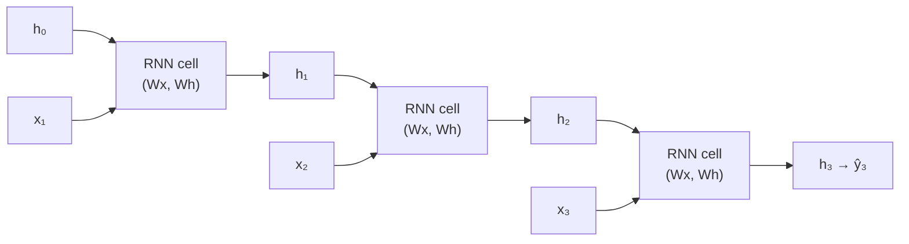

# 🎯 Day 48: Recurrent Neural Networks

> *"RNNs have memory—they remember what they saw before."*

---

## The "Never-Coded" Bridge

**You're reading a sentence.** Understanding "bank" requires context—is it a river bank or a money bank? You carry meaning from previous words. RNNs work the same way: they process sequences one step at a time, maintaining a "memory" of past inputs.

**RNNs in action:**

- **Google Translate**: Sequence-to-sequence translation
- **Autocomplete**: Predicting next word
- **Stock prediction**: Time series forecasting
- **Speech recognition**: Audio → text
- **Music generation**: Creating melodies

---

## The Technical Deep Dive

### RNN and Sequence Modeling: Key Terms

| Term | Definition | Example |
|------|-----------|---------|
| **Hidden state** | A vector that carries information from previous timesteps to the current one; the RNN's "memory" | h_t = tanh(W_h × h_{t-1} + W_x × x_t) |
| **Timestep** | One element in a sequence | One day's sales, one word in a sentence, one sensor reading |
| **Sequence window (lookback)** | How many past timesteps the model uses as input | 10-day window: use sales from t-10 to t-1 to predict t |
| **Horizon** | How many steps ahead the model predicts | 1-step: predict tomorrow; 7-step: predict next week |
| **Vanishing gradient** | Gradients shrink exponentially as they propagate through many timesteps — early timesteps get almost no learning signal | Problem for vanilla RNNs on sequences > 20 timesteps |
| **Gate** | A learned component in LSTM/GRU that controls information flow (forget, input, output gates) | Forget gate: multiplies h_{t-1} by values in [0,1] to selectively erase memory |
| **Teacher forcing** | During training, using the true target at time t as input to predict t+1 (instead of the model's own prediction) | Speeds up training; can cause instability at inference time (exposure bias) |
| **Autoregressive forecasting** | At inference, feeding the model's own prediction as the next input | Multi-step: predict t+1, feed it back to predict t+2, and so on |
| **Masking** | Telling the model to ignore padded timesteps (zeros added to make sequences equal length) | `Masking(mask_value=0.0)` in Keras |
| **Bidirectional** | Processing the sequence both forward and backward; can only be used when the full sequence is available | Text classification (whole sentence known); NOT for real-time forecasting (future unknown) |

### The Recurrent Connection

A recurrent layer maintains a hidden state $\mathbf{h}_t$ that summarizes everything seen so far. At every time step it updates the state from the new input $\mathbf{x}_t$ and the previous state $\mathbf{h}_{t-1}$:

$$
\mathbf{h}_t = \tanh\!\big(W_x \mathbf{x}_t + W_h \mathbf{h}_{t-1} + \mathbf{b}\big), \qquad
\hat{y}_t = W_y \mathbf{h}_t + \mathbf{b}_y
$$

The same weight matrices $W_x, W_h$ are reused at every step (parameter sharing across time).

The **vanishing-gradient problem** of vanilla RNNs comes from backpropagating through time: $\partial \mathbf{h}_t / \partial \mathbf{h}_0 \approx \prod_{k=1}^{t} W_h \cdot \mathrm{diag}(\tanh'(\cdot))$. When eigenvalues of $W_h$ are below $1$ this product collapses to zero exponentially fast — the network forgets long-range dependencies.

Unrolled across time, the same cell (and the same weights) repeats at every step:



```python
import numpy as np


def simple_rnn_cell(x_t, h_prev, Wx, Wh, b):
    """One step of a simple RNN.

    Args:
        x_t: Current input
        h_prev: Previous hidden state (memory)
        Wx, Wh: Weight matrices
        b: Bias
    """
    h_t = np.tanh(np.dot(x_t, Wx) + np.dot(h_prev, Wh) + b)
    return h_t


# Example: Process a sequence
sequence = [[1, 0, 0], [0, 1, 0], [0, 0, 1]]  # 3 time steps, 3 features
hidden_size = 4

# Initialize weights
np.random.seed(42)
Wx = np.random.randn(3, hidden_size) * 0.1
Wh = np.random.randn(hidden_size, hidden_size) * 0.1
b = np.zeros(hidden_size)

# Process sequence
h = np.zeros(hidden_size)  # Initial hidden state
print("Processing sequence:")
for t, x_t in enumerate(sequence):
    h = simple_rnn_cell(np.array(x_t), h, Wx, Wh, b)
    print(f"  Step {t}: h = {h.round(3)}")

print("\nFinal hidden state carries information from entire sequence!")
```

### Building RNNs with Keras

```python
from tensorflow import keras
from tensorflow.keras import layers
import numpy as np

# Generate sequence data (sine wave prediction)
np.random.seed(42)
x = np.linspace(0, 100, 1000)
y = np.sin(x) + np.random.randn(1000) * 0.1


# Create sequences (10 steps → predict next)
def create_sequences(data, seq_length):
    X, Y = [], []
    for i in range(len(data) - seq_length):
        X.append(data[i : i + seq_length])
        Y.append(data[i + seq_length])
    return np.array(X), np.array(Y)


seq_length = 20
X, Y = create_sequences(y, seq_length)
X = X.reshape(-1, seq_length, 1)  # (samples, timesteps, features)

# Split
train_size = int(len(X) * 0.8)
X_train, X_test = X[:train_size], X[train_size:]
Y_train, Y_test = Y[:train_size], Y[train_size:]

print(f"Training samples: {X_train.shape}")
print(f"Each sample: {seq_length} timesteps, 1 feature")
```

### Simple RNN vs LSTM

```python
# Simple RNN (suffers from vanishing gradients)
model_rnn = keras.Sequential(
    [layers.SimpleRNN(32, input_shape=(seq_length, 1)), layers.Dense(1)]
)

# LSTM (Long Short-Term Memory) - handles long dependencies
model_lstm = keras.Sequential(
    [layers.LSTM(32, input_shape=(seq_length, 1)), layers.Dense(1)]
)

# GRU (Gated Recurrent Unit) - simpler than LSTM, often similar performance
model_gru = keras.Sequential(
    [layers.GRU(32, input_shape=(seq_length, 1)), layers.Dense(1)]
)

# Compare models
models = {"SimpleRNN": model_rnn, "LSTM": model_lstm, "GRU": model_gru}

for name, model in models.items():
    model.compile(optimizer="adam", loss="mse")
    model.fit(X_train, Y_train, epochs=20, verbose=0)
    mse = model.evaluate(X_test, Y_test, verbose=0)
    print(f"{name}: MSE = {mse:.4f}")
```

### Understanding LSTM

The LSTM solves vanishing gradients by adding a **cell state** $\mathbf{c}_t$ that flows through time with only additive interactions, controlled by three sigmoid **gates**. Letting $[\mathbf{h}_{t-1}, \mathbf{x}_t]$ denote the concatenation of the previous hidden state and the current input:

$$
\mathbf{f}_t = \sigma\!\big(W_f [\mathbf{h}_{t-1}, \mathbf{x}_t] + \mathbf{b}_f\big) \quad \text{(forget gate)}
$$

$$
\mathbf{i}_t = \sigma\!\big(W_i [\mathbf{h}_{t-1}, \mathbf{x}_t] + \mathbf{b}_i\big), \qquad
\tilde{\mathbf{c}}_t = \tanh\!\big(W_c [\mathbf{h}_{t-1}, \mathbf{x}_t] + \mathbf{b}_c\big) \quad \text{(input gate + candidate)}
$$

$$
\mathbf{c}_t = \mathbf{f}_t \odot \mathbf{c}_{t-1} + \mathbf{i}_t \odot \tilde{\mathbf{c}}_t \quad \text{(cell state update)}
$$

$$
\mathbf{o}_t = \sigma\!\big(W_o [\mathbf{h}_{t-1}, \mathbf{x}_t] + \mathbf{b}_o\big), \qquad
\mathbf{h}_t = \mathbf{o}_t \odot \tanh(\mathbf{c}_t) \quad \text{(output gate + hidden state)}
$$

The forget gate $\mathbf{f}_t$ near $1$ means "remember"; near $0$ means "forget". Because $\mathbf{c}_t$ is updated additively (rather than multiplicatively), gradients can flow across hundreds of time steps without vanishing.

The simpler **GRU** merges the forget and input gates into a single update gate $\mathbf{z}_t$ and uses a reset gate $\mathbf{r}_t$:

$$
\mathbf{z}_t = \sigma(W_z [\mathbf{h}_{t-1}, \mathbf{x}_t]), \quad
\mathbf{r}_t = \sigma(W_r [\mathbf{h}_{t-1}, \mathbf{x}_t]), \quad
\mathbf{h}_t = (1 - \mathbf{z}_t) \odot \mathbf{h}_{t-1} + \mathbf{z}_t \odot \tanh\!\big(W_h [\mathbf{r}_t \odot \mathbf{h}_{t-1}, \mathbf{x}_t]\big)
$$

```python
"""
LSTM Cell Components:

┌─────────────────────────────────────────┐
│                                         │
│  Forget Gate: What to forget           │
│  f_t = sigmoid(Wf · [h_prev, x_t] + bf) │
│                                         │
│  Input Gate: What new info to store    │
│  i_t = sigmoid(Wi · [h_prev, x_t] + bi) │
│  c̃_t = tanh(Wc · [h_prev, x_t] + bc)   │
│                                         │
│  Cell State Update:                     │
│  c_t = f_t * c_prev + i_t * c̃_t        │
│                                         │
│  Output Gate: What to output           │
│  o_t = sigmoid(Wo · [h_prev, x_t] + bo) │
│  h_t = o_t * tanh(c_t)                  │
│                                         │
└─────────────────────────────────────────┘

Key: The cell state (c_t) can carry information unchanged
through many timesteps - solving vanishing gradients!
"""

# Visualize predictions
model_lstm.fit(X_train, Y_train, epochs=50, verbose=0)
predictions = model_lstm.predict(X_test, verbose=0)

import matplotlib.pyplot as plt

plt.figure(figsize=(12, 4))
plt.plot(Y_test[:100], "b-", label="Actual", alpha=0.7)
plt.plot(predictions[:100], "r--", label="Predicted", alpha=0.7)
plt.xlabel("Time Step")
plt.ylabel("Value")
plt.title("LSTM Predictions on Sine Wave")
plt.legend()
plt.show()
```

### Time Series Validation: The Critical Difference

**Why Random Splits Fail for Time Series**
Using `train_test_split(shuffle=True)` on time-series data is leakage. You would train on Monday's data and predict last Thursday. In production, you only know the past.

**Walk-Forward (Expanding Window) Backtesting**

```python
from sklearn.model_selection import TimeSeriesSplit

tscv = TimeSeriesSplit(n_splits=5, gap=7)  # gap=7: 7-day gap between train end and val start
for fold, (train_idx, val_idx) in enumerate(tscv.split(X)):
    X_train_fold, X_val_fold = X[train_idx], X[val_idx]
    y_train_fold, y_val_fold = y[train_idx], y[val_idx]
    # Always: train on past, validate on future
    model.fit(X_train_fold, y_train_fold)
    val_preds = model.predict(X_val_fold)
    print(f"Fold {fold}: MAE={mean_absolute_error(y_val_fold, val_preds):.2f}")
```

**Leakage-Safe Scaling for Time Series**

```python
# WRONG: Fit scaler on full dataset (leaks future statistics)
scaler = MinMaxScaler().fit(data)  # Uses future max/min to scale the past

# CORRECT: Scale using only historical data at each point
# Option 1: Fit scaler on training window only
scaler = MinMaxScaler()
X_train_scaled = scaler.fit_transform(X_train)  # Fit on train
X_test_scaled = scaler.transform(X_test)         # Apply to test

# Option 2: Rolling z-score (no future lookahead)
df['scaled'] = (df['value'] - df['value'].rolling(30).mean()) / df['value'].rolling(30).std()
```

**Leakage-Safe Windowing**

```python
def create_sequences(data, window_size, horizon):
    """Creates (X, y) pairs where X = past window, y = future horizon"""
    X, y = [], []
    for i in range(len(data) - window_size - horizon + 1):
        X.append(data[i:i+window_size])                     # Past window
        y.append(data[i+window_size:i+window_size+horizon]) # Future horizon
    return np.array(X), np.array(y)

# CRITICAL: Create sequences AFTER splitting train/test to avoid leakage
# Sequences near the boundary would otherwise use test data in their windows
```

**Naive and Seasonal Baselines**
Always compare to these before claiming your RNN "works":

```python
# Naive: predict last observed value
naive_preds = y_test_shifted_by_1  # yesterday's value predicts today

# Seasonal naive: predict same weekday last week
seasonal_naive_preds = y_test_shifted_by_7

# Linear trend baseline
from sklearn.linear_model import LinearRegression
t = np.arange(len(y_train)).reshape(-1, 1)
trend_model = LinearRegression().fit(t, y_train)
trend_preds = trend_model.predict(np.arange(len(y_train), len(y_train)+len(y_test)).reshape(-1,1))

# Compare all:
print(f"Naive MAE: {mean_absolute_error(y_test, naive_preds):.2f}")
print(f"Seasonal naive MAE: {mean_absolute_error(y_test, seasonal_naive_preds):.2f}")
print(f"Trend MAE: {mean_absolute_error(y_test, trend_preds):.2f}")
print(f"LSTM MAE: {mean_absolute_error(y_test, lstm_preds):.2f}")
# If LSTM doesn't beat seasonal naive, reconsider its value!
```

**Seasonality and Forecast Metrics**

```python
# Detect seasonality with autocorrelation
from statsmodels.graphics.tsaplots import plot_acf, plot_pacf
plot_acf(sales_series, lags=52)  # Weekly data: look for annual seasonality at lag=52

# Forecast-specific metrics
from sklearn.metrics import mean_absolute_error

# MAPE: good for understanding % error
mape = np.mean(np.abs((y_test - y_pred) / y_test)) * 100

# sMAPE: symmetric version, handles zeros better  
smape = np.mean(2 * np.abs(y_test - y_pred) / (np.abs(y_test) + np.abs(y_pred))) * 100

# MASE: scale error relative to naive baseline
mae_naive = mean_absolute_error(y_test[1:], y_test[:-1])
mase = mean_absolute_error(y_test, y_pred) / mae_naive
```

**Uncertainty Intervals**
Point forecasts are dangerous for business decisions. Always provide a range:

```python
# Monte Carlo dropout for uncertainty
def predict_with_uncertainty(model, X, n_samples=100):
    predictions = [model(X, training=True) for _ in range(n_samples)]  # training=True keeps dropout active
    preds = np.array(predictions)
    return preds.mean(axis=0), preds.std(axis=0)

mean_pred, std_pred = predict_with_uncertainty(model, X_test)
lower_95 = mean_pred - 2*std_pred
upper_95 = mean_pred + 2*std_pred
```

### Stacked RNNs for Complex Patterns

```python
# Stacked LSTM for more complex sequences
model_stacked = keras.Sequential(
    [
        layers.LSTM(64, return_sequences=True, input_shape=(seq_length, 1)),
        layers.LSTM(32, return_sequences=False),
        layers.Dense(16, activation="relu"),
        layers.Dense(1),
    ]
)

model_stacked.compile(optimizer="adam", loss="mse")
model_stacked.summary()

# Note: return_sequences=True passes output at each timestep to next layer
# return_sequences=False only passes final hidden state
```

#### Justifying Architecture and Validation Choices

**Why 10-step lookback window?**
The optimal window depends on:

- Business horizon: For daily sales, a 10-day window captures 2 business weeks. For hourly data, 24 hours may be appropriate.
- Autocorrelation: Check how far back the signal is still correlated with the present (ACF plot)
- Computational cost: Longer windows → more memory, slower training
- LSTM can learn which timesteps matter via gating — but only if useful signal exists in the window

**Why this LSTM layer size?**

- Small sequences (< 50 timesteps): 32–64 units usually sufficient
- Complex patterns (financial, multivariate): 128–256 units
- Rule: Start small; increase if training loss is high; decrease if overfitting

**Why this train/test split point?**

- Use the most recent data as the test set — this simulates real deployment where you predict after your last training point
- Never shuffle time-series data before splitting
- Consider leaving a gap between train end and test start if there's publication lag in your features

**Direct vs Recursive Multi-Step Forecasting**

| Strategy | How | Pro | Con |
|---------|-----|-----|-----|
| **Recursive** | Predict t+1; feed as input to predict t+2; etc. | Single model; simple | Errors accumulate across steps |
| **Direct** | Train one model per horizon (separate models for t+1, t+2, ..., t+h) | No error accumulation | h models to maintain |
| **Seq2Seq** | Encoder reads input; Decoder generates full sequence | Captures inter-horizon dependencies | Complex architecture |

Connect to business: "RetailCo needs 7-day forecasts for inventory planning. Direct multi-output: one model predicts all 7 days simultaneously (`Dense(7)` output) — avoids recursive error accumulation."

### Modern Sequence Modeling Alternatives

**Transformers and Self-Attention**
The dominant architecture for sequence modeling since 2017. Instead of processing sequences step-by-step (RNN), transformers process all timesteps simultaneously using *self-attention* — each timestep attends to all others.

Advantages over RNNs:

- Parallelizable (train much faster)
- Better at capturing long-range dependencies (attention can directly connect t=1 to t=100)
- Scales with data better

For time series specifically: **Temporal Fusion Transformer (TFT)**, **PatchTST**, **iTransformer** are SOTA. In practice:

```python
# Simple self-attention for time series
from tensorflow.keras.layers import MultiHeadAttention, LayerNormalization

# Or use the TFT from pytorch-forecasting for production
from pytorch_forecasting import TemporalFusionTransformer
```

**Temporal CNNs (TCN — Temporal Convolutional Networks)**
Apply dilated causal convolutions to sequences. Advantages:

- Fully parallelizable (like transformers, not RNNs)
- Fixed receptive field: 2^L × kernel_size (e.g., 10 layers × 3 kernel = 3072 timesteps with dilation)
- Often outperform LSTMs with less memory

```python
from tcn import TCN  # pip install keras-tcn
model = Sequential([TCN(nb_filters=64, kernel_size=3, dilations=[1,2,4,8,16], return_sequences=False),
                    Dense(1)])
```

**Including Covariates (External Features)**
Real-world forecasting includes additional signals:

- Promotional calendar (is it Black Friday?)
- Macroeconomic indicators
- Weather

```python
# Multi-variate LSTM
model = Sequential([LSTM(64, input_shape=(window, n_features)),  # n_features = target + covariates
                    Dense(1)])
```

**Concept Drift in Time Series**
When the data-generating process changes (e.g., COVID changed retail sales patterns):

- Monitor: track rolling forecast error; alert when it rises 50% above historical average
- Respond: retrain on more recent data; or use an online learning approach that continuously updates weights

### Text Classification with LSTM

```python
from tensorflow.keras.datasets import imdb
from tensorflow.keras.preprocessing.sequence import pad_sequences

# Load IMDB reviews (word indices)
vocab_size = 10000
max_length = 200

(X_train, y_train), (X_test, y_test) = imdb.load_data(num_words=vocab_size)

# Pad sequences to same length
X_train = pad_sequences(X_train, maxlen=max_length)
X_test = pad_sequences(X_test, maxlen=max_length)

print(f"Training samples: {X_train.shape}")
print(f"Each review: {max_length} words (padded)")

# Build model
model_text = keras.Sequential(
    [
        layers.Embedding(vocab_size, 128, input_length=max_length),
        layers.LSTM(64, dropout=0.2),
        layers.Dense(1, activation="sigmoid"),
    ]
)

model_text.compile(optimizer="adam", loss="binary_crossentropy", metrics=["accuracy"])
model_text.fit(
    X_train, y_train, epochs=3, batch_size=64, validation_split=0.2, verbose=1
)

print(f"Test accuracy: {model_text.evaluate(X_test, y_test, verbose=0)[1]:.3f}")
```

---

## Senior-Level Insights

### RNN vs LSTM vs GRU

| Model         | Memory | Parameters | Best For                          |
| ------------- | ------ | ---------- | --------------------------------- |
| **SimpleRNN** | Short  | Fewest     | Short sequences                   |
| **LSTM**      | Long   | Most       | Long dependencies, default choice |
| **GRU**       | Long   | Medium     | Similar to LSTM, faster training  |

### Common Architectures

| Task                        | Architecture                |
| --------------------------- | --------------------------- |
| **Sequence classification** | LSTM → Dense                |
| **Sequence-to-sequence**    | Encoder LSTM → Decoder LSTM |
| **Time series forecasting** | Stacked LSTM → Dense        |
| **Bidirectional**           | Forward + Backward LSTM     |

### Handling Sequences

```python
# Variable length sequences: use masking
model = keras.Sequential(
    [
        layers.Masking(mask_value=0, input_shape=(max_length, features)),
        layers.LSTM(32),
        layers.Dense(1),
    ]
)

# Bidirectional: process forward and backward
model = keras.Sequential(
    [
        layers.Bidirectional(layers.LSTM(32), input_shape=(seq_length, 1)),
        layers.Dense(1),
    ]
)
```

### Senior-Level RNN / Forecasting Insights

**Latency and State Management**
RNNs have hidden state that must be carried between predictions in production:

```python
# Stateful LSTM: maintains state between batches (for streaming data)
LSTM(64, stateful=True, batch_input_shape=(batch_size, timesteps, features))
# After each batch: model.reset_states() when a sequence ends
```

For low-latency applications: precompute embeddings; or switch to TCN/Transformer (no sequential state).

**Retraining Cadence**

| Signal Type | Recommended Cadence | Trigger |
|------------|--------------------|----|
| Daily sales forecast | Weekly full retrain | Performance degrades > 10% on last 2 weeks |
| Stock price model | Daily retrain | Non-stationary; patterns change constantly |
| Customer LTV forecast | Quarterly retrain | Slow-changing behavior |

**Late-Arriving Data**
In practice, labels arrive with a delay (e.g., returns data comes 30 days after sale):

- Include a "freshness" feature (days since last confirmed label)
- Don't train on data points where labels may still change
- Use a label cutoff: only include transactions from > 45 days ago in training

**Why Bidirectional RNNs Cannot Serve Causal Real-Time Forecasts**
Bidirectional RNNs process the sequence both forward and backward — the backward pass uses future information to inform past representations. This is:

- **Valid for**: Offline tasks where the full sequence is available (sentiment analysis of a complete review, protein structure prediction)
- **Invalid for**: Real-time forecasting where you are predicting the next value based only on the past

```python
# WRONG for forecasting:
Bidirectional(LSTM(64))  # The backward pass uses future data — leakage!

# CORRECT for forecasting:
LSTM(64)  # Causal: only processes forward through time

# CORRECT for classification (offline, full sequence available):
Bidirectional(LSTM(64))  # Valid when predicting a label for a complete sequence
```

**Monitoring by Horizon**
For multi-step forecasters, track performance per horizon separately:

```python
# MAE for each of the 7 forecast days
for h in range(7):
    horizon_mae = mean_absolute_error(y_test[:, h], y_pred[:, h])
    print(f"Horizon t+{h+1}: MAE={horizon_mae:.2f}")
# Expected: MAE increases with horizon (uncertainty compounds)
# Alert if t+1 MAE is much higher than historical — model may be stale
```

---

## Hands-on Lab

### Exercise 1: Time Series Prediction

**Business Scenario:** RetailCo's supply chain team needs weekly sales forecasts for the next 4 weeks to plan inventory. Raw daily sales show weekly seasonality and monthly trends.

**Goal:** Build an LSTM forecaster; compare to seasonal naive baseline; evaluate across multiple forecast horizons.

**Tasks:**

1. Compute and report: seasonal naive baseline MAE (predict last week's value for this week)
2. Create sequences with 10-day lookback; ensure no leakage in scaling
3. Train LSTM(32 units) → Dense(1) for 50 epochs with EarlyStopping and validation_split=0.15
4. Plot: actual vs predicted for the test period (last 20% of data)
5. Run rolling-origin evaluation: retrain/re-validate every 10 steps; plot MAE by forecast date
6. Error analysis: Are errors larger on weekends? At month end? Report pattern.

**Expected Output:**
Seasonal naive MAE: ~15.2 units
LSTM MAE: ~8.7 units (42% improvement over baseline)
LSTM MAPE: ~6.3%

Training converged at: ~38 epochs (EarlyStopping)
Train MAE: ~7.1, Val MAE: ~9.2 (small gap — not overfitting)

Rolling-origin MAE range: 7.5 – 12.3 (higher at month boundaries — sales spikes harder to predict)

```python
import numpy as np
from tensorflow import keras
from tensorflow.keras import layers

# Generate data
np.random.seed(42)
x = np.linspace(0, 50, 500)
y = np.sin(x) * np.exp(-0.02 * x) + np.random.randn(500) * 0.1

# Create sequences
seq_length = 15
X, Y = [], []
for i in range(len(y) - seq_length):
    X.append(y[i : i + seq_length])
    Y.append(y[i + seq_length])
X, Y = np.array(X).reshape(-1, seq_length, 1), np.array(Y)

# Split
train_size = int(len(X) * 0.8)
X_train, X_test = X[:train_size], X[train_size:]
Y_train, Y_test = Y[:train_size], Y[train_size:]

# Model
model = keras.Sequential(
    [layers.LSTM(32, input_shape=(seq_length, 1)), layers.Dense(1)]
)
model.compile(optimizer="adam", loss="mse")
model.fit(X_train, Y_train, epochs=30, verbose=0)

print(f"Test MSE: {model.evaluate(X_test, Y_test, verbose=0):.4f}")
```

### Exercise 2: Comparing RNN Architectures

```python
architectures = [
    ("SimpleRNN", lambda: layers.SimpleRNN(32)),
    ("LSTM", lambda: layers.LSTM(32)),
    ("GRU", lambda: layers.GRU(32)),
    ("Stacked LSTM", lambda: [layers.LSTM(32, return_sequences=True), layers.LSTM(16)]),
]

for name, layer_fn in architectures:
    model = keras.Sequential()
    if "Stacked" in name:
        for layer in layer_fn():
            model.add(layer)
    else:
        model.add(layer_fn())
    model.add(layers.Dense(1))

    model.compile(optimizer="adam", loss="mse")
    model.fit(X_train, Y_train, epochs=20, verbose=0)
    mse = model.evaluate(X_test, Y_test, verbose=0)
    print(f"{name}: MSE = {mse:.4f}")
```

### Exercise 3: Multi-Step Forecasting

```python
# Predict multiple steps ahead
future_steps = 5


def create_multistep_data(data, seq_length, future_steps):
    X, Y = [], []
    for i in range(len(data) - seq_length - future_steps):
        X.append(data[i : i + seq_length])
        Y.append(data[i + seq_length : i + seq_length + future_steps])
    return np.array(X), np.array(Y)


X_multi, Y_multi = create_multistep_data(y, seq_length, future_steps)
X_multi = X_multi.reshape(-1, seq_length, 1)

train_size = int(len(X_multi) * 0.8)
X_train_m, X_test_m = X_multi[:train_size], X_multi[train_size:]
Y_train_m, Y_test_m = Y_multi[:train_size], Y_multi[train_size:]

model_multi = keras.Sequential(
    [
        layers.LSTM(64, input_shape=(seq_length, 1)),
        layers.Dense(32, activation="relu"),
        layers.Dense(future_steps),  # Output multiple steps
    ]
)

model_multi.compile(optimizer="adam", loss="mse")
model_multi.fit(X_train_m, Y_train_m, epochs=30, verbose=0)
print(f"Multi-step MSE: {model_multi.evaluate(X_test_m, Y_test_m, verbose=0):.4f}")
```

---

## Mastery Check

### Question 1: Why LSTM over SimpleRNN?

What problem does LSTM solve that SimpleRNN cannot?

<details>
<summary>Answer</summary>

**Vanishing gradient problem.** In long sequences, SimpleRNN gradients shrink to near-zero, preventing learning long-range dependencies. LSTM's cell state allows gradients to flow unchanged.

</details>

### Question 2: return_sequences

What does `return_sequences=True` do in LSTM?

<details>
<summary>Answer</summary>

Returns output at **every timestep** instead of just the final output. Use when stacking RNN layers (next layer needs all timesteps) or for sequence-to-sequence tasks.

</details>

### Question 3: Input Shape

LSTM expects input shape (samples, timesteps, features). What do these mean?

<details>
<summary>Answer</summary>

- **samples**: Number of sequences (batch)
- **timesteps**: Sequence length (e.g., 20 words, 50 time steps)
- **features**: Dimensions at each timestep (1 for univariate, more for multivariate)

</details>

### Question 4: Bidirectional

When would you use a Bidirectional LSTM?

<details>
<summary>Answer</summary>

When **future context matters** for understanding present. Examples: text classification (full sentence available), named entity recognition. NOT for real-time prediction (future unavailable).

</details>

### Question 5: LSTM vs GRU

When choose GRU over LSTM?

<details>
<summary>Answer</summary>

- **Faster training** (fewer parameters)
- **Similar performance** on many tasks
- Choose GRU for experimentation speed
- Choose LSTM when proven effective for your task

</details>

---

## Glossary

| Term | Definition |
|------|-----------|
| Hidden state | RNN's memory vector carrying information from past timesteps |
| Timestep | One element in a sequence (one day, one word, one sensor reading) |
| Window / Lookback | Number of past timesteps used as model input |
| Horizon | How many steps ahead the model predicts |
| Vanishing gradient | Exponential shrinkage of gradients in deep/long sequences — early layers get no signal |
| LSTM gate | Learned vector in [0,1] that controls what to forget, input, and output from cell state |
| Teacher forcing | Using true labels as inputs during training (instead of model's own predictions) |
| Autoregressive | Feeding own predictions as inputs for multi-step forecasting |
| Walk-forward validation | Training on past, validating on future; repeating as horizon advances |
| Concept drift | When the statistical relationship between inputs and outputs changes over time |
| Dilated convolution | Convolution with gaps between filter taps; expands receptive field without adding parameters |
| Self-attention | Mechanism where each position in a sequence attends to all other positions |
| MASE | Mean Absolute Scaled Error: MAE divided by naive baseline MAE; > 1 means worse than naive |

---

## Summary

- ✅ RNNs maintain a hidden state: $\mathbf{h}_t = \tanh(W_x \mathbf{x}_t + W_h \mathbf{h}_{t-1} + \mathbf{b})$
- ✅ Vanilla RNNs suffer vanishing gradients because $\partial \mathbf{h}_t / \partial \mathbf{h}_0$ involves $\prod W_h$
- ✅ LSTMs add a cell state and three gates ($\mathbf{f}, \mathbf{i}, \mathbf{o}$) so gradients flow additively
- ✅ Cell update: $\mathbf{c}_t = \mathbf{f}_t \odot \mathbf{c}_{t-1} + \mathbf{i}_t \odot \tilde{\mathbf{c}}_t$
- ✅ GRU merges into update + reset gates with fewer parameters
- ✅ Stack RNN layers for complex patterns
- ✅ Use Bidirectional when full context is available
- ✅ Embedding layer converts text to dense vectors

**Phase 4 Complete!** You now understand ML fundamentals from math to deep learning.

---

## Tomorrow & Phase Transition

**Tomorrow (Day 49 / Phase 5):** Advanced Deep Learning — Transformers, attention mechanisms, BERT for NLP, and large language model fine-tuning. The self-attention concept introduced today (briefly in the alternatives section) becomes the primary architecture.

**Phase 04 Synthesis: When to Choose Which Model**

Use this decision tree as you exit Phase 04:

| Situation | First Choice | Why |
|-----------|-------------|-----|
| Tabular data, < 50k rows | Random Forest or LightGBM | Fast, robust, minimal tuning |
| Tabular data, > 500k rows | LightGBM or wide NN | Scale matters |
| Image data | Pretrained CNN (EfficientNet, MobileNetV2) + fine-tune | Transfer learning beats training from scratch |
| Text data | Pretrained Transformer (BERT, DistilBERT) | Language models capture semantics better than LSTMs |
| Short sequences (< 50 steps), tabular-like | LightGBM with lag features | Simpler, often more accurate than LSTM |
| Long sequences (> 100 steps), complex patterns | LSTM or TCN; try Transformer if data is abundant | Gating handles long-range dependencies |
| Time series with seasonality | Prophet, SARIMA, or LSTM with seasonal features | Classical methods work surprisingly well |
| When interpretability is required | Linear/Logistic Regression → Decision Tree → SHAP on tree models | Gradient descent models can be explained but with effort |

**Phase 04 Recurring Dataset Recap (RetailCo)**
If you built the RetailCo churn model across lessons, you have now:

- Day 37: EDA and data readiness
- Day 37C: Preprocessing pipeline
- Day 40–43: Logistic Regression, Random Forest, and GBM classifiers with proper evaluation
- Day 44: Customer segmentation
- Day 45: Feature engineering and leakage-safe evaluation
- Day 46–48: Neural network baseline, optional image classifier, optional sequence models
This end-to-end project is your portfolio piece from Phase 04.
