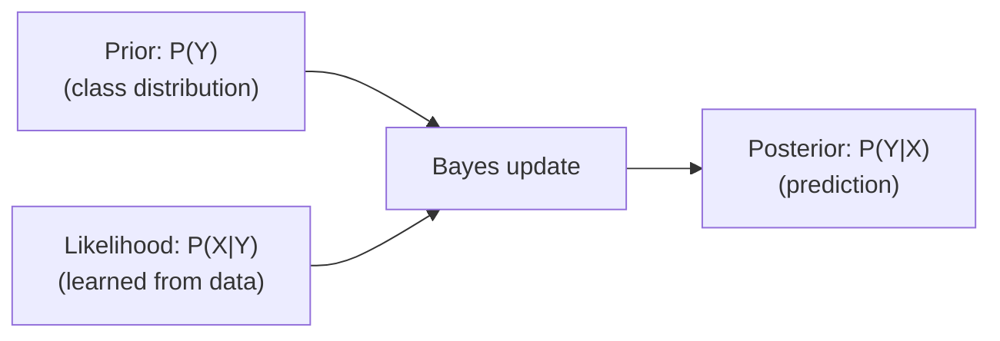

# 🎯 Day 54: Probabilistic Modeling

> *"Not just predictions, but confidence in predictions."*

---

## The "Never-Coded" Bridge

**Imagine a doctor diagnosing a patient.** A good doctor doesn't just say "You have disease X." They say "There's an 80% chance it's disease X, 15% chance it's Y, 5% other." This **uncertainty quantification** guides treatment decisions.

Traditional ML models output: **"Class A"**  
Probabilistic models output: **"Class A with 75% confidence"**

**Why it matters in business:**

**Medical diagnosis:**

- Model: "90% chance of cancer" → Biopsy recommended
- Model: "55% chance of cancer" → Monitor and retest
- **Lives saved** by knowing confidence

**Credit scoring:**

- Applicant score: 0.51 → Approve (barely over 0.5 threshold)
- But wait: Model is only 52% confident → **Risky approval**
- Probabilistic model: 0.51 ± 0.15 → **Manual review needed**

**Fraud detection:**

- Alert fatigue: 1000 daily alerts, 990 false positives
- Probabilistic approach: Only alert on >90% confidence → 50 alerts, 45 true fraud
- **10x reduction** in analyst workload

**Autonomous vehicles:**

- "Is that a pedestrian?" needs uncertainty
- 99.9% confident → Proceed
- 60% confident → Emergency brake

---

## The Technical Deep Dive

### Naive Bayes: The Probabilistic Baseline

**Bayes' Theorem:**

```
P(Y|X) = P(X|Y) × P(Y) / P(X)

P(Y|X) = Probability of class Y given features X (what we want)
P(X|Y) = Probability of features X given class Y (learned from data)
P(Y) = Prior probability of class Y (class distribution)
P(X) = Probability of features X (normalization constant)
```



```python
from sklearn.naive_bayes import GaussianNB, MultinomialNB, BernoulliNB
from sklearn.datasets import load_iris, fetch_20newsgroups
from sklearn.model_selection import train_test_split
from sklearn.feature_extraction.text import CountVectorizer
from sklearn.metrics import accuracy_score, classification_report
import numpy as np

# Example 1: Gaussian Naive Bayes (continuous features)
iris = load_iris()
X, y = iris.data, iris.target

X_train, X_test, y_train, y_test = train_test_split(
    X, y, test_size=0.3, random_state=42
)

# Assumes features follow Gaussian (normal) distribution
gnb = GaussianNB()
gnb.fit(X_train, y_train)

# Predictions
y_pred = gnb.predict(X_test)
y_proba = gnb.predict_proba(X_test)

print("=== Gaussian Naive Bayes ===")
print(f"Accuracy: {accuracy_score(y_test, y_pred):.3f}")
print(f"\nSample predictions with probabilities:")
for i in range(5):
    true_class = iris.target_names[y_test[i]]
    pred_class = iris.target_names[y_pred[i]]
    confidence = y_proba[i].max()
    print(f"True: {true_class}, Predicted: {pred_class}, Confidence: {confidence:.2%}")
    print(f"  Class probabilities: {y_proba[i]}")

# Example 2: Multinomial Naive Bayes (count features, e.g., text)
categories = ["alt.atheism", "soc.religion.christian"]
newsgroups = fetch_20newsgroups(subset="train", categories=categories, random_state=42)

vectorizer = CountVectorizer()
X_text = vectorizer.fit_transform(newsgroups.data)
y_text = newsgroups.target

X_train_text, X_test_text, y_train_text, y_test_text = train_test_split(
    X_text, y_text, test_size=0.3, random_state=42
)

# Multinomial NB for text classification
mnb = MultinomialNB(alpha=1.0)  # alpha = Laplace smoothing
mnb.fit(X_train_text, y_train_text)

print(f"\n=== Multinomial Naive Bayes (Text) ===")
print(f"Accuracy: {mnb.score(X_test_text, y_test_text):.3f}")

# Show most predictive words
feature_names = vectorizer.get_feature_names_out()
for i, category in enumerate(categories):
    top_features = np.argsort(mnb.feature_log_prob_[i])[-10:]
    print(f"\nTop words for {category}:")
    print([feature_names[idx] for idx in top_features])
```

### Probability Calibration: Making Probabilities Trustworthy

Many models (especially SVM, Random Forest) output poorly calibrated probabilities.

**Problem:**

- Model says "90% confidence" but is only correct 60% of the time
- **Calibration** aligns predicted probabilities with actual frequencies

```python
from sklearn.calibration import CalibratedClassifierCV, calibration_curve
from sklearn.ensemble import RandomForestClassifier
from sklearn.svm import SVC
import matplotlib.pyplot as plt

# Generate data
from sklearn.datasets import make_classification

X, y = make_classification(
    n_samples=10000, n_features=20, n_informative=15, random_state=42
)
X_train, X_test, y_train, y_test = train_test_split(
    X, y, test_size=0.3, random_state=42
)

# Train uncalibrated models
rf = RandomForestClassifier(n_estimators=100, random_state=42)
rf.fit(X_train, y_train)

svm = SVC(probability=True, random_state=42)
svm.fit(X_train, y_train)

# Calibrate models
rf_calibrated = CalibratedClassifierCV(rf, method="isotonic", cv=5)
rf_calibrated.fit(X_train, y_train)

svm_calibrated = CalibratedClassifierCV(svm, method="sigmoid", cv=5)
svm_calibrated.fit(X_train, y_train)

# Compare calibration
models = {
    "Random Forest (uncalibrated)": rf,
    "Random Forest (calibrated)": rf_calibrated,
    "SVM (uncalibrated)": svm,
    "SVM (calibrated)": svm_calibrated,
    "Naive Bayes (naturally calibrated)": GaussianNB().fit(X_train, y_train),
}

fig, axes = plt.subplots(2, 3, figsize=(15, 10))
axes = axes.flatten()

for idx, (name, model) in enumerate(models.items()):
    y_proba = model.predict_proba(X_test)[:, 1]

    # Calibration curve
    fraction_of_positives, mean_predicted_value = calibration_curve(
        y_test, y_proba, n_bins=10, strategy="uniform"
    )

    axes[idx].plot(
        mean_predicted_value, fraction_of_positives, marker="o", label="Model"
    )
    axes[idx].plot([0, 1], [0, 1], linestyle="--", label="Perfect Calibration")
    axes[idx].set_xlabel("Mean Predicted Probability")
    axes[idx].set_ylabel("Fraction of Positives")
    axes[idx].set_title(name)
    axes[idx].legend()
    axes[idx].grid(True, alpha=0.3)

plt.tight_layout()
plt.show()

# Calibration metrics
from sklearn.metrics import brier_score_loss

print("=== Calibration Comparison (Brier Score - lower is better) ===")
for name, model in models.items():
    y_proba = model.predict_proba(X_test)[:, 1]
    brier = brier_score_loss(y_test, y_proba)
    print(f"{name}: {brier:.4f}")
```

### Bayesian Inference with PyMC

Full Bayesian approach: treat model parameters as distributions.

```python
import pymc as pm
import arviz as az
import numpy as np
import matplotlib.pyplot as plt

# Generate data: y = 2*x + 1 + noise
np.random.seed(42)
x_data = np.random.randn(100)
y_data = 2 * x_data + 1 + np.random.randn(100) * 0.5

# Bayesian linear regression
with pm.Model() as bayesian_model:
    # Priors
    intercept = pm.Normal("intercept", mu=0, sigma=10)
    slope = pm.Normal("slope", mu=0, sigma=10)
    sigma = pm.HalfNormal("sigma", sigma=1)

    # Linear model
    mu = intercept + slope * x_data

    # Likelihood
    y_obs = pm.Normal("y_obs", mu=mu, sigma=sigma, observed=y_data)

    # Inference
    trace = pm.sample(2000, return_inferencedata=True, random_seed=42)

# Results
print("=== Bayesian Linear Regression ===")
print(az.summary(trace, var_names=["intercept", "slope", "sigma"]))

# Visualize posterior distributions
az.plot_posterior(trace, var_names=["intercept", "slope"])
plt.tight_layout()
plt.show()

# Uncertainty in predictions
with bayesian_model:
    x_new = np.linspace(-3, 3, 100)
    pm.set_data({"x": x_new})
    posterior_predictive = pm.sample_posterior_predictive(trace, var_names=["y_obs"])

# Plot with uncertainty bands
plt.figure(figsize=(10, 6))
plt.scatter(x_data, y_data, alpha=0.5, label="Data")

# Mean prediction
y_pred_mean = posterior_predictive.posterior_predictive["y_obs"].mean(
    dim=["chain", "draw"]
)
plt.plot(x_new, y_pred_mean, "r-", label="Mean Prediction")

# 95% credible interval
y_pred_hdi = az.hdi(posterior_predictive.posterior_predictive["y_obs"], hdi_prob=0.95)
plt.fill_between(
    x_new,
    y_pred_hdi["y_obs"][:, 0],
    y_pred_hdi["y_obs"][:, 1],
    alpha=0.3,
    label="95% Credible Interval",
)

plt.xlabel("x")
plt.ylabel("y")
plt.title("Bayesian Linear Regression with Uncertainty")
plt.legend()
plt.grid(True, alpha=0.3)
plt.show()
```

### Gaussian Processes: Non-Parametric Bayesian Models

GPs provide uncertainty estimates for any input, especially useful for small datasets.

```python
from sklearn.gaussian_process import GaussianProcessRegressor
from sklearn.gaussian_process.kernels import RBF, ConstantKernel as C

# Generate sparse data
np.random.seed(42)
X_train_sparse = np.array([[-3], [-2], [0], [2], [3]])
y_train_sparse = np.sin(X_train_sparse).ravel() + np.random.randn(5) * 0.1

# Define kernel
kernel = C(1.0, (1e-3, 1e3)) * RBF(1.0, (1e-2, 1e2))

# Gaussian Process
gp = GaussianProcessRegressor(kernel=kernel, n_restarts_optimizer=10, alpha=0.1)
gp.fit(X_train_sparse, y_train_sparse)

# Predict on dense grid
X_test_dense = np.linspace(-5, 5, 1000).reshape(-1, 1)
y_pred, sigma = gp.predict(X_test_dense, return_std=True)

# Plot
plt.figure(figsize=(12, 6))
plt.scatter(
    X_train_sparse, y_train_sparse, c="r", s=100, zorder=10, label="Training Data"
)
plt.plot(X_test_dense, y_pred, "b-", label="GP Mean Prediction")
plt.fill_between(
    X_test_dense.ravel(),
    y_pred - 1.96 * sigma,
    y_pred + 1.96 * sigma,
    alpha=0.3,
    label="95% Confidence Interval",
)
plt.plot(X_test_dense, np.sin(X_test_dense), "k--", alpha=0.5, label="True Function")
plt.xlabel("x")
plt.ylabel("y")
plt.title("Gaussian Process Regression with Uncertainty")
plt.legend()
plt.grid(True, alpha=0.3)
plt.show()

print(f"Learned kernel: {gp.kernel_}")
```

---

## Senior-Level Insights

### When to Use Probabilistic Models

| Use Case                     | Best Model               | Why                                         |
| ---------------------------- | ------------------------ | ------------------------------------------- |
| Text classification          | Multinomial Naive Bayes  | Fast, interpretable, works with sparse data |
| Medical diagnosis            | Calibrated Random Forest | Need reliable probabilities                 |
| Small dataset (<100 samples) | Gaussian Process         | Quantifies uncertainty well                 |
| Active learning              | GP or Bayesian NN        | Select most uncertain samples               |
| Risk-sensitive decisions     | Any calibrated model     | Confidence matters as much as prediction    |

### Calibration Methods

```python
# Isotonic regression (non-parametric)
# - Makes no assumptions about probability distribution
# - Can overfit on small datasets
# - Use when: n > 1000 samples
CalibratedClassifierCV(model, method="isotonic", cv=5)

# Platt scaling (parametric sigmoid)
# - Assumes logistic relationship
# - More stable on small datasets
# - Use when: n < 1000 samples
CalibratedClassifierCV(model, method="sigmoid", cv=5)
```

### Naive Bayes Assumptions

**Why "Naive"?**
Assumes features are **conditionally independent** given the class.

```python
# Naive assumption:
P(X1, X2 | Y) = P(X1 | Y) × P(X2 | Y)

# Reality: Features often correlated
# Example: "height" and "weight" are correlated
# But Naive Bayes treats them as independent!

# Surprisingly: Works well in practice despite violated assumptions
# Reason: Only need correct ranking of probabilities, not exact values
```

### Bayesian vs Frequentist

| Aspect          | Frequentist          | Bayesian                            |
| --------------- | -------------------- | ----------------------------------- |
| **Parameters**  | Fixed but unknown    | Random variables with distributions |
| **Uncertainty** | Confidence intervals | Credible intervals                  |
| **Inference**   | Maximum likelihood   | Posterior distribution              |
| **Priors**      | No priors            | Priors encode domain knowledge      |
| **Computation** | Often closed-form    | Requires sampling (MCMC)            |

---

## Hands-on Lab

### Exercise 1: Spam Classification with Naive Bayes

```python
from sklearn.datasets import fetch_20newsgroups
from sklearn.feature_extraction.text import TfidfVectorizer
from sklearn.naive_bayes import MultinomialNB
from sklearn.pipeline import Pipeline
from sklearn.metrics import classification_report, confusion_matrix
import seaborn as sns

# Load spam/ham-like categories
categories = ["rec.sport.baseball", "sci.space"]
newsgroups_train = fetch_20newsgroups(
    subset="train", categories=categories, random_state=42
)
newsgroups_test = fetch_20newsgroups(
    subset="test", categories=categories, random_state=42
)

# Build pipeline
text_clf = Pipeline(
    [
        ("tfidf", TfidfVectorizer(max_features=5000, stop_words="english")),
        ("clf", MultinomialNB(alpha=0.1)),
    ]
)

# Train
text_clf.fit(newsgroups_train.data, newsgroups_train.target)

# Predict
y_pred = text_clf.predict(newsgroups_test.data)
y_proba = text_clf.predict_proba(newsgroups_test.data)

print("=== Spam Classification Results ===")
print(classification_report(newsgroups_test.target, y_pred, target_names=categories))

# Confusion matrix
cm = confusion_matrix(newsgroups_test.target, y_pred)
plt.figure(figsize=(8, 6))
sns.heatmap(
    cm,
    annot=True,
    fmt="d",
    cmap="Blues",
    xticklabels=categories,
    yticklabels=categories,
)
plt.xlabel("Predicted")
plt.ylabel("Actual")
plt.title("Confusion Matrix")
plt.show()

# Show uncertain predictions
uncertain_indices = np.where((y_proba.max(axis=1) < 0.7) & (y_proba.max(axis=1) > 0.3))[
    0
]
print(f"\n=== Uncertain Predictions (30-70% confidence) ===")
print(f"Found {len(uncertain_indices)} uncertain samples")
for idx in uncertain_indices[:3]:
    print(f"\nText snippet: {newsgroups_test.data[idx][:200]}...")
    print(f"True: {categories[newsgroups_test.target[idx]]}")
    print(f"Predicted: {categories[y_pred[idx]]}, Confidence: {y_proba[idx].max():.2%}")
```

---

### Exercise 2: Probability Calibration for Production

```python
from sklearn.ensemble import RandomForestClassifier
from sklearn.calibration import CalibratedClassifierCV, calibration_curve
from sklearn.metrics import brier_score_loss, log_loss

# Generate imbalanced data (realistic for fraud detection)
X, y = make_classification(
    n_samples=10000, n_features=20, weights=[0.95, 0.05], random_state=42
)
X_train, X_test, y_train, y_test = train_test_split(
    X, y, test_size=0.3, stratify=y, random_state=42
)

# Train model
rf_uncalibrated = RandomForestClassifier(n_estimators=100, random_state=42)
rf_uncalibrated.fit(X_train, y_train)

# Calibrate
rf_calibrated = CalibratedClassifierCV(rf_uncalibrated, method="isotonic", cv=5)
rf_calibrated.fit(X_train, y_train)

# Compare probabilities
y_proba_uncalib = rf_uncalibrated.predict_proba(X_test)[:, 1]
y_proba_calib = rf_calibrated.predict_proba(X_test)[:, 1]

# Metrics
print("=== Calibration Metrics ===")
print(f"Brier Score (uncalibrated): {brier_score_loss(y_test, y_proba_uncalib):.4f}")
print(f"Brier Score (calibrated): {brier_score_loss(y_test, y_proba_calib):.4f}")
print(f"Log Loss (uncalibrated): {log_loss(y_test, y_proba_uncalib):.4f}")
print(f"Log Loss (calibrated): {log_loss(y_test, y_proba_calib):.4f}")

# Reliability diagram
fig, (ax1, ax2) = plt.subplots(1, 2, figsize=(14, 6))

for ax, proba, title in [
    (ax1, y_proba_uncalib, "Uncalibrated"),
    (ax2, y_proba_calib, "Calibrated"),
]:
    fraction_pos, mean_pred = calibration_curve(y_test, proba, n_bins=10)
    ax.plot(mean_pred, fraction_pos, marker="o", label="Model")
    ax.plot([0, 1], [0, 1], "--", label="Perfect Calibration")
    ax.set_xlabel("Mean Predicted Probability")
    ax.set_ylabel("Fraction of Positives")
    ax.set_title(f"{title} RF")
    ax.legend()
    ax.grid(True, alpha=0.3)

plt.tight_layout()
plt.show()


# Production threshold tuning based on cost
def expected_cost(threshold, y_true, y_proba, cost_fp=1, cost_fn=10):
    """Calculate expected cost given threshold and costs."""
    y_pred = (y_proba >= threshold).astype(int)
    fp = np.sum((y_pred == 1) & (y_true == 0))
    fn = np.sum((y_pred == 0) & (y_true == 1))
    return fp * cost_fp + fn * cost_fn


thresholds = np.linspace(0.01, 0.99, 100)
costs = [
    expected_cost(t, y_test, y_proba_calib, cost_fp=1, cost_fn=50) for t in thresholds
]

plt.figure(figsize=(10, 6))
plt.plot(thresholds, costs)
optimal_threshold = thresholds[np.argmin(costs)]
plt.axvline(
    optimal_threshold,
    color="r",
    linestyle="--",
    label=f"Optimal: {optimal_threshold:.2f}",
)
plt.xlabel("Threshold")
plt.ylabel("Expected Cost")
plt.title("Cost-Sensitive Threshold Selection\n(FP cost=1, FN cost=50)")
plt.legend()
plt.grid(True, alpha=0.3)
plt.show()

print(f"\nOptimal threshold: {optimal_threshold:.3f} (default: 0.500)")
```

---

### Exercise 3: Gaussian Process for Small Data

```python
from sklearn.gaussian_process import GaussianProcessRegressor
from sklearn.gaussian_process.kernels import RBF, Matern, RationalQuadratic, WhiteKernel

# Simulate expensive experiment (only 15 data points)
np.random.seed(42)
X_sparse = np.random.uniform(-5, 5, 15).reshape(-1, 1)
y_sparse = (
    np.sin(X_sparse).ravel()
    + 0.5 * np.cos(2 * X_sparse).ravel()
    + np.random.randn(15) * 0.1
)

# Try different kernels
kernels = {
    "RBF": RBF(length_scale=1.0),
    "Matern": Matern(length_scale=1.0, nu=1.5),
    "RationalQuadratic": RationalQuadratic(length_scale=1.0, alpha=0.1),
}

X_dense = np.linspace(-7, 7, 500).reshape(-1, 1)

fig, axes = plt.subplots(1, 3, figsize=(18, 5))

for ax, (name, kernel) in zip(axes, kernels.items()):
    # Add noise kernel
    full_kernel = kernel + WhiteKernel(noise_level=0.1)

    gp = GaussianProcessRegressor(kernel=full_kernel, n_restarts_optimizer=10)
    gp.fit(X_sparse, y_sparse)

    y_pred, sigma = gp.predict(X_dense, return_std=True)

    ax.scatter(X_sparse, y_sparse, c="r", s=50, zorder=10, label="Data")
    ax.plot(X_dense, y_pred, "b-", label="GP Mean")
    ax.fill_between(
        X_dense.ravel(),
        y_pred - 2 * sigma,
        y_pred + 2 * sigma,
        alpha=0.2,
        label="95% CI",
    )
    ax.set_title(f"{name} Kernel")
    ax.set_xlabel("x")
    ax.set_ylabel("y")
    ax.legend()
    ax.grid(True, alpha=0.3)

plt.tight_layout()
plt.show()

# Active learning: suggest next point to sample
uncertainty = sigma
next_sample_idx = np.argmax(uncertainty)
print(f"Most uncertain region: x = {X_dense[next_sample_idx, 0]:.2f}")
print("(This is where you should collect next data point)")
```

---

## Mastery Check

### Question 1: Naive Bayes Independence

Naive Bayes assumes features are conditionally independent. Yet it works well in practice. Why?

<details>
<summary>Click for Answer</summary>

**Answer:** Naive Bayes only needs to **rank** classes correctly, not estimate exact probabilities. Even with violated independence, it often gets the ranking right.

**Why independence assumption is violated:**

```python
# Email spam detection
Feature 1: Contains "viagra"
Feature 2: Contains "buy now"

# These are correlated (spam emails often have both)
# But Naive Bayes treats them as independent
```

**Why it still works:**

1. **Ranking matters, not exact probabilities**

   ```
   True: P(spam|email) = 0.73
   Naive Bayes: P(spam|email) = 0.85  # Overconfident!
   
   But ranking is correct:
   P(spam) > P(ham) ✓
   → Classification is correct even if probability is wrong
   ```

2. **Error cancellation**
   - Overestimating one feature's contribution
   - Underestimating another's
   - Errors often cancel out

3. **Smoothing** (Laplace) prevents zero probabilities

   ```python
   MultinomialNB(alpha=1.0)  # Adds pseudo-counts
   ```

**When Naive Bayes fails:**

- Features are **strongly** correlated and point in opposite directions
- Example: "good" and "not bad" in sentiment analysis

**Best practice:** Use Naive Bayes as a fast baseline, then try more complex models if needed.

</details>

---

### Question 2: Calibration Importance

Your Random Forest achieves 92% accuracy. Why should you care about calibrating probabilities?

<details>
<summary>Click for Answer</summary>

**Answer:** Accuracy only measures if the top prediction is correct. In many applications, you need **reliable probabilities** for decision-making, not just class labels.

**Scenarios where calibration matters:**

**1. Cost-sensitive decisions**

```python
# Medical diagnosis
if probability_disease > 0.7:
    aggressive_treatment()  # High cost/risk
elif probability_disease > 0.3:
    monitor_closely()
else:
    routine_checkup()

# Uncalibrated: Model says 0.9, but true probability is 0.6
# → Unnecessary aggressive treatment!
```

**2. Ranking/prioritization**

```python
# Customer support tickets
# Want to prioritize by urgency
# Need: P(urgent) to be accurate for fair ranking

# Unc alibrated: All predictions bunched around 0.5-0.6
# → Can't distinguish truly urgent from moderately urgent
```

**3. Ensembling/stacking**

```python
# Meta-model uses base model probabilities as features
# Uncalibrated probabilities → poor meta-model
```

**4. Confidence-based sampling**

```python
# Active learning: select most uncertain samples
# Need: True uncertainty, not model's confidence

# Uncalibrated model always says 0.9+ → never flags uncertain samples
```

**Calibration metrics:**

```python
# Brier score (lower = better)
# = Mean squared error of probabilities
brier_score_loss(y_true, y_proba)

# Log loss (cross-entropy)
# Penalizes confident wrong predictions heavily
log_loss(y_true, y_proba)
```

**Example:**

```
Model A: 92% accuracy, Brier=0.15 (well-calibrated)
Model B: 92% accuracy, Brier=0.35 (poorly calibrated)

Same accuracy, but A's probabilities are trustworthy for decisions
```

</details>

---

### Question 3: Bayesian vs MLE

Bayesian inference gives a **distribution** over parameters, while Maximum Likelihood Estimation (MLE) gives a **point estimate**. When does this matter?

<details>
<summary>Click for Answer</summary>

**Answer:** The distribution matters when you have **small data**, need **uncertainty quantification**, or want to incorporate **prior knowledge**.

**Key differences:**

**MLE (Frequentist):**

```python
# Linear regression
β_MLE = argmax P(data | β)
# Result: β = 2.5 (single number)
```

**Bayesian:**

```python
# Linear regression
P(β | data) ∝ P(data | β) × P(β)
# Result: β ~ Normal(2.5, 0.3)  # Distribution!
```

**When Bayesian distribution matters:**

**1. Small datasets**

```python
# n = 5 data points
# MLE: β = 2.5 (seems precise, but is it?)
# Bayesian: β = 2.5 ± 1.2 (reveals high uncertainty)

# With more data (n = 1000):
# MLE: β = 2.48
# Bayesian: β = 2.48 ± 0.05 (low uncertainty)
# → Converge with large data
```

**2. Prior knowledge**

```python
# Medical trial for new drug
# Prior: Similar drugs showed effect size ~ Normal(0.3, 0.1)
# Data: n=20 patients → effect = 0.8

# MLE: Effect = 0.8 (just use data)
# Bayesian: Effect = 0.5 (prior pulls it down)
# → Skeptical of extreme results from small samples
```

**3. Decision-making under uncertainty**

```python
# Investment decision
# Expected return: 10% ± 5% (Bayesian posterior)

# MLE: Use 10% (point estimate)
# → Overconfident decision

# Bayesian: Consider full distribution
# → Probability of loss = P(return < 0) = 2.5%
# → Risk-informed decision
```

**4. Sequential updating**

```python
# Day 1: β ~ Normal(2.0, 1.0)  # Prior
# Collect data → Update
# Day 2: β ~ Normal(2.3, 0.7)  # Posterior becomes prior
# Collect more data → Update
# Day 3: β ~ Normal(2.5, 0.5)  # Narrowing uncertainty

# MLE: Can't naturally incorporate previous estimates
```

**Computational cost:**

- MLE: Often closed-form or simple optimization
- Bayesian: Requires MCMC sampling (slower)

**Rule:** Use Bayesian when uncertainty quantification justifies computational cost.

</details>

---

### Question 4: Gaussian Process Scalability

GPs provide great uncertainty estimates but don't scale well. Why, and what are the workarounds?

<details>
<summary>Click for Answer</summary>

**Answer:** GPs have **O(n³) training time and O(n²) memory** due to matrix inversion. Sparse approximations enable scaling to millions of points.

**The computational bottleneck:**

```python
# GP training requires inverting covariance matrix K
K = k(X, X)  # n × n matrix
# Inversion: O(n³) time, O(n²) space

# For n = 10,000:
# n³ = 10¹² operations → hours/days
# n² = 10⁸ matrix elements → GBs of RAM
```

**Scalability limits:**

- **Exact GP**: n < 10,000
- **Sparse GP**: n < 1,000,000
- **Deep GP / Neural networks**: n > 1,000,000

**Workarounds:**

**1. Sparse / Inducing Points (FITC, SVGP)**

```python
# Use m << n "inducing points" to summarize data
# Approximate full GP with m × m matrix

from sklearn.gaussian_process import GaussianProcessRegressor
from sklearn.gaussian_process.kernels import RBF

# For n=100,000, use m=1000 inducing points
# Complexity: O(n × m²) instead of O(n³)
```

**2. Local GPs**

```python
# Partition data into clusters
# Train separate GP for each cluster
# Prediction: Use nearest cluster's GP

# Trade-off: Discontinuities at cluster boundaries
```

**3. Structured kernels**

```python
# For grid data (images, time series)
# Use Kronecker/Toeplitz structure
# Fast matrix operations via FFT

# Grid: n₁ × n₂
# Normal: O((n₁n₂)³)
# Structured: O(n₁³ + n₂³)
```

**4. Variational approximations**

```python
import gpytorch

# Stochastic variational GPs
# Mini-batch training like neural networks
# Scales to millions of points
```

**5. Use GPs only for small/expensive data**

```python
scenarios = {
    "n < 1000": "Exact GP",
    "1000 < n < 100000": "Sparse GP",
    "n > 100000": "Deep learning (Bayesian NN) or ensemble",
}
```

**When to use GPs despite scalability:**

- **Small datasets** (< 1000)
- **Expensive  experiments** (physics simulations, drug trials)
- **Need calibrated uncertainty** (robotics, active learning)

**Alternatives:**

- **Bayesian Neural Networks**: Scale better, similar uncertainty
- **Quantile Regression**: Direct uncertainty without full Bayesian
- **Ensemble methods**: Bootstrap aggregating for uncertainty

</details>

---

### Question 5: Production Probability Thresholds

Your fraud detection model outputs probabilities. How do you choose the decision threshold in production?

<details>
<summary>Click for Answer</summary>

**Answer:** Choose the threshold that **minimizes expected cost**, accounting for false positive and false negative costs, not just the default 0.5.

**The problem with 0.5:**

```python
# Default: if prob > 0.5 → flag as fraud
# Assumes: FP cost = FN cost (rarely true!)
```

**Cost-sensitive threshold:**

**Step 1: Define costs**

```python
cost_FP = $10   # Manual review of legitimate transaction
cost_FN = $500  # Missed fraud (chargeback + damage)
```

**Step 2: Calculate expected cost per threshold**

```python
def expected_cost(threshold, y_true, y_proba, cost_fp, cost_fn):
    y_pred = (y_proba >= threshold).astype(int)
    FP = np.sum((y_pred == 1) & (y_true == 0))
    FN = np.sum((y_pred == 0) & (y_true == 1))
    return FP * cost_fp + FN * cost_fn


thresholds = np.linspace(0, 1, 1000)
costs = [expected_cost(t, y_test, y_proba, 10, 500) for t in thresholds]

optimal_threshold = thresholds[np.argmin(costs)]
# Result: ~0.15 (much lower than 0.5!)
```

**Step 3: Multi-tier thresholds**

```python
# Production logic
if prob > 0.9:
    action = "auto_block"  # High confidence fraud
elif prob > 0.3:
    action = "manual_review"  # Uncertain
else:
    action = "approve"  # Low risk
```

**Step 4: A/B test thresholds**

```python
# Baseline: threshold = 0.5
# Variant: threshold = 0.15 (optimized)

# Metrics to track:
# - False positive rate (user friction)
# - False negative rate (fraud loss)
# - Total cost (FP cost + FN cost)
# - User satisfaction
```

**Dynamic thresholds:**

```python
# Adjust based on:
# - Time of day (more fraud at night → lower threshold)
# - User history (trusted user → higher threshold)
# - Transaction amount (large → lower threshold)

threshold = base_threshold
if hour > 22 or hour < 6:
    threshold *= 0.8  # More sensitive at night
if user_has_fraud_history:
    threshold *= 0.7  # More sensitive for risky users
```

**Monitoring in production:**

```python
# Track actual FP/FN rates
# Retrain and re-optimize threshold monthly

actual_FP_rate = FP / (FP + TN)
actual_FN_rate = FN / (FN + TP)

if actual_FN_rate > target_FN_rate:
    threshold *= 0.9  # Lower threshold (more sensitive)
```

**Key insight:** Optimal threshold is a **business decision**, not just a statistical one.

</details>

---

## Glossary

- **Prior probability**: The probability assigned to a hypothesis or class before observing any data, encoding existing domain knowledge or the base rate of an event (e.g., P(spam) = 0.3 across all emails).
- **Likelihood**: The probability of observing the data given a specific hypothesis or model parameters (P(data | class)); in Naive Bayes this is the product of per-feature conditional probabilities.
- **Posterior probability (Bayes' theorem)**: The updated probability of a hypothesis after incorporating observed evidence, computed as P(class | data) ∝ P(data | class) × P(class); the central quantity in Bayesian inference.
- **Naive Bayes**: A family of probabilistic classifiers that applies Bayes' theorem with the "naive" assumption that all features are conditionally independent given the class label; fast, interpretable, and surprisingly effective for text.
- **Calibration**: The alignment between a model's predicted probabilities and the true observed frequencies; a well-calibrated model that says "80% confidence" should be correct roughly 80% of the time.
- **Gaussian Process**: A non-parametric Bayesian model that places a probability distribution over functions; it provides a mean prediction and a confidence interval at every point, making it ideal for small datasets where uncertainty quantification is critical.
- **Expected Calibration Error (ECE)**: A scalar metric that measures miscalibration by averaging the absolute difference between predicted confidence and actual accuracy across probability bins; lower ECE indicates better calibration.
- **Platt scaling**: A post-hoc calibration method (a special case of sigmoid calibration) that fits a logistic regression on the model's raw scores to map them to better-calibrated probabilities; recommended for small calibration sets.

---

## Cross-References

- **Day 37B** — Probability and statistics foundations: the conditional probability, Bayes' theorem, and probability distributions that are the mathematical backbone of every technique in this lesson.
- **Day 42** — Classification: the supervised learning context in which calibration matters most; a classifier's `predict_proba` output must be calibrated before being used for cost-sensitive or ranking decisions.
- **Day 43** — Decision trees: tree-based models whose probability outputs are notoriously poorly calibrated (overconfident near 0 and 1), making them a primary use case for the calibration methods covered here.
- **Day 52** — Ensemble methods: Random Forests and gradient-boosted trees both benefit from post-hoc calibration (isotonic regression or Platt scaling) before their probability outputs are used for business decisions.

---

## Summary

Today you learned:

- ✅ Naive Bayes provides fast probabilistic baseline for classification
- ✅ Probability calibration makes model confidence reliable for decisions
- ✅ Bayesian inference quantifies uncertainty through parameter distributions
- ✅ Gaussian Processes excel on small datasets with uncertainty quantification
- ✅ Production systems need calibrated probabilities and cost-sensitive thresholds
- ✅ Uncertainty matters as much as accuracy in risk-sensitive applications

**Tomorrow**: Advanced unsupervised learning—clustering, dimensionality reduction, and anomaly detection.

---

## Optional Build Tracks (Day 49-60 Extension)

Keep the **core lab tasks** in this lesson common for all learners, then add one optional extension artifact per track:

| Track | Day 54 assignment artifact |
| --- | --- |
| **NLP** | Probabilistic classification baseline (point predictions only) vs advanced calibrated uncertainty model. |
| **Forecasting** | Probabilistic forecast baseline (point estimate) vs advanced quantile/interval forecasting. |
| **Recommenders/Graph** | CTR prediction baseline (deterministic score) vs advanced Bayesian uncertainty-aware ranking. |

### Track requirements (apply to all three tracks)

1. **Baseline + advanced model comparison (required):** report offline metrics, error slices, and deployment trade-offs.
2. **Constraint scenario test (required):** run at least one scenario each day from: **limited data**, **latency limit**, **explainability requirement**.
3. **Refactoring checkpoint #1 (Day 53):** modularize data prep, training, evaluation, and inference into reusable pipeline components.
4. **Refactoring checkpoint #2 (Day 58):** externalize hyperparameters/model settings into versioned config files.
5. **Final deliverable (Day 60):** submit a concise **performance + business-impact memo** tying model lift to ROI, risk, and rollout recommendation.
