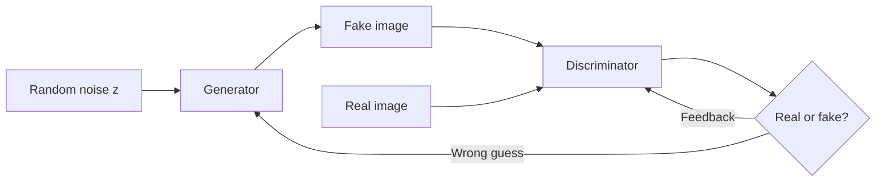

# 🎯 Day 59: Generative Models

> *"Creating new data that looks real. Art, images, text, music."*

---

## The "Never-Coded" Bridge

**What if AI could create instead of just classify?**

Generative models don't just recognize cats—they **create** realistic cat images that never existed.

**The revolution:**

**Art & Design:**

- **Midjourney, DALL-E 3**: Text → professional artwork
- "A cyberpunk city at sunset" → stunning image
- Impact: Graphic designers using AI for ideation

**Content Creation:**

- **ChatGPT, Claude**: Generate articles, code, emails
- **GitHub Copilot**: Autocomplete entire functions
- Productivity: 40-55% faster development

**Entertainment:**

- **RunwayML**: AI video generation
- **AIVA**: AI-composed music
- **Character.AI**: Interactive fictional characters

**Science:**

- **AlphaFold**: Generate protein structures
- **Drug discovery**: Generate novel molecules
- Accelerated research: Years → months

**Business value:**

- **Synthetic data**: Train models when real data is scarce/sensitive
- **Data augmentation**: 10x training data for free
- **Personalization**: Generate custom content per user

**The models:**

- **GANs (2014)**: Revolutionary but unstable
- **VAEs (2013)**: Probabilistic, stable
- **Diffusion (2020+)**: SOTA for images (Stable Diffusion, DALL-E 2/3)
- **Transformers (2017+)**: SOTA for text (GPT-4, Claude)

---

## The Technical Deep Dive

### Generative Adversarial Networks (GANs)

**The game:** Generator vs Discriminator



Both networks improve through this adversarial loop until the Generator's fakes are good enough to fool the Discriminator.

**Simple GAN for MNIST:**

```python
import torch
import torch.nn as nn
import torch.optim as optim
from torchvision import datasets, transforms
from torch.utils.data import DataLoader
import matplotlib.pyplot as plt

# Hyperparameters
latent_dim = 100
img_shape = (1, 28, 28)
batch_size = 64
lr = 0.0002


# Generator
class Generator(nn.Module):
    def __init__(self):
        super().__init__()
        self.model = nn.Sequential(
            nn.Linear(latent_dim, 128),
            nn.LeakyReLU(0.2),
            nn.Linear(128, 256),
            nn.BatchNorm1d(256),
            nn.LeakyReLU(0.2),
            nn.Linear(256, 512),
            nn.BatchNorm1d(512),
            nn.LeakyReLU(0.2),
            nn.Linear(512, 28 * 28),
            nn.Tanh(),  # Output in [-1, 1]
        )

    def forward(self, z):
        img = self.model(z)
        img = img.view(img.size(0), *img_shape)
        return img


# Discriminator
class Discriminator(nn.Module):
    def __init__(self):
        super().__init__()
        self.model = nn.Sequential(
            nn.Flatten(),
            nn.Linear(28 * 28, 512),
            nn.LeakyReLU(0.2),
            nn.Dropout(0.3),
            nn.Linear(512, 256),
            nn.LeakyReLU(0.2),
            nn.Dropout(0.3),
            nn.Linear(256, 1),
            nn.Sigmoid(),  # Probability [0, 1]
        )

    def forward(self, img):
        validity = self.model(img)
        return validity


# Initialize
generator = Generator()
discriminator = Discriminator()

# Optimizers
optimizer_G = optim.Adam(generator.parameters(), lr=lr, betas=(0.5, 0.999))
optimizer_D = optim.Adam(discriminator.parameters(), lr=lr, betas=(0.5, 0.999))

# Loss
adversarial_loss = nn.BCELoss()

# Data
transform = transforms.Compose(
    [
        transforms.ToTensor(),
        transforms.Normalize([0.5], [0.5]),  # Normalize to [-1, 1]
    ]
)

mnist = datasets.MNIST(root="./data", train=True, download=True, transform=transform)
dataloader = DataLoader(mnist, batch_size=batch_size, shuffle=True)

# Training loop
num_epochs = 50

for epoch in range(num_epochs):
    for i, (real_imgs, _) in enumerate(dataloader):
        batch_size_current = real_imgs.size(0)

        # Labels
        real_labels = torch.ones(batch_size_current, 1)
        fake_labels = torch.zeros(batch_size_current, 1)

        # ---------------------
        #  Train Discriminator
        # ---------------------
        optimizer_D.zero_grad()

        # Real images
        real_validity = discriminator(real_imgs)
        d_loss_real = adversarial_loss(real_validity, real_labels)

        # Fake images
        z = torch.randn(batch_size_current, latent_dim)
        fake_imgs = generator(z)
        fake_validity = discriminator(fake_imgs.detach())
        d_loss_fake = adversarial_loss(fake_validity, fake_labels)

        # Total discriminator loss
        d_loss = (d_loss_real + d_loss_fake) / 2
        d_loss.backward()
        optimizer_D.step()

        # -----------------
        #  Train Generator
        # -----------------
        optimizer_G.zero_grad()

        # Generate images
        z = torch.randn(batch_size_current, latent_dim)
        gen_imgs = generator(z)

        # Generator wants discriminator to think these are real
        validity = discriminator(gen_imgs)
        g_loss = adversarial_loss(validity, real_labels)  # Trick: use real_labels

        g_loss.backward()
        optimizer_G.step()

        if i % 100 == 0:
            print(
                f"Epoch [{epoch}/{num_epochs}] Batch [{i}/{len(dataloader)}] "
                f"D_loss: {d_loss.item():.4f} G_loss: {g_loss.item():.4f}"
            )

    # Save generated images
    if epoch % 10 == 0:
        with torch.no_grad():
            z = torch.randn(16, latent_dim)
            gen_imgs = generator(z).cpu()

            fig, axes = plt.subplots(4, 4, figsize=(8, 8))
            for idx, ax in enumerate(axes.flatten()):
                ax.imshow(gen_imgs[idx].squeeze(), cmap="gray")
                ax.axis("off")
            plt.suptitle(f"Epoch {epoch}")
            plt.savefig(f"gan_epoch_{epoch}.png")
            plt.close()

print("Training complete!")
```

### DCGAN: Convolutional GAN for Better Images

```python
class DCGenerator(nn.Module):
    def __init__(self, latent_dim=100):
        super().__init__()
        self.model = nn.Sequential(
            # Input: latent_dim x 1 x 1
            nn.ConvTranspose2d(latent_dim, 512, 4, 1, 0, bias=False),
            nn.BatchNorm2d(512),
            nn.ReLU(True),
            # State: 512 x 4 x 4
            nn.ConvTranspose2d(512, 256, 4, 2, 1, bias=False),
            nn.BatchNorm2d(256),
            nn.ReLU(True),
            # State: 256 x 8 x 8
            nn.ConvTranspose2d(256, 128, 4, 2, 1, bias=False),
            nn.BatchNorm2d(128),
            nn.ReLU(True),
            # State: 128 x 16 x 16
            nn.ConvTranspose2d(128, 1, 4, 2, 1, bias=False),
            nn.Tanh(),
            # Output: 1 x 32 x 32
        )

    def forward(self, z):
        z = z.view(z.size(0), z.size(1), 1, 1)
        return self.model(z)


class DCDiscriminator(nn.Module):
    def __init__(self):
        super().__init__()
        self.model = nn.Sequential(
            # Input: 1 x 32 x 32
            nn.Conv2d(1, 128, 4, 2, 1, bias=False),
            nn.LeakyReLU(0.2, inplace=True),
            # State: 128 x 16 x 16
            nn.Conv2d(128, 256, 4, 2, 1, bias=False),
            nn.BatchNorm2d(256),
            nn.LeakyReLU(0.2, inplace=True),
            # State: 256 x 8 x 8
            nn.Conv2d(256, 512, 4, 2, 1, bias=False),
            nn.BatchNorm2d(512),
            nn.LeakyReLU(0.2, inplace=True),
            # State: 512 x 4 x 4
            nn.Conv2d(512, 1, 4, 1, 0, bias=False),
            nn.Sigmoid(),
            # Output: 1 x 1 x 1
        )

    def forward(self, img):
        validity = self.model(img)
        return validity.view(-1, 1)
```

### Variational Autoencoder (VAE)

**Idea:** Learn a smooth latent space where similar inputs are nearby

```python
class VAE(nn.Module):
    def __init__(self, latent_dim=20):
        super().__init__()

        # Encoder
        self.encoder = nn.Sequential(nn.Linear(28 * 28, 400), nn.ReLU())

        # Latent space: mean and log-variance
        self.fc_mu = nn.Linear(400, latent_dim)
        self.fc_logvar = nn.Linear(400, latent_dim)

        # Decoder
        self.decoder = nn.Sequential(
            nn.Linear(latent_dim, 400), nn.ReLU(), nn.Linear(400, 28 * 28), nn.Sigmoid()
        )

    def encode(self, x):
        h = self.encoder(x.view(-1, 28 * 28))
        return self.fc_mu(h), self.fc_logvar(h)

    def reparameterize(self, mu, logvar):
        # Sample from N(mu, var) using reparameterization trick
        std = torch.exp(0.5 * logvar)
        eps = torch.randn_like(std)
        return mu + eps * std

    def decode(self, z):
        return self.decoder(z).view(-1, 1, 28, 28)

    def forward(self, x):
        mu, logvar = self.encode(x)
        z = self.reparameterize(mu, logvar)
        return self.decode(z), mu, logvar


# Loss function
def vae_loss(recon_x, x, mu, logvar):
    # Reconstruction loss (Binary Cross-Entropy)
    BCE = nn.functional.binary_cross_entropy(recon_x, x, reduction="sum")

    # KL divergence loss
    # KL(N(mu, var) || N(0, 1)) = -0.5 * sum(1 + log(var) - mu^2 - var)
    KLD = -0.5 * torch.sum(1 + logvar - mu.pow(2) - logvar.exp())

    return BCE + KLD


# Training
vae = VAE(latent_dim=20)
optimizer = optim.Adam(vae.parameters(), lr=1e-3)

vae.train()
for epoch in range(50):
    train_loss = 0
    for batch_idx, (data, _) in enumerate(dataloader):
        optimizer.zero_grad()

        recon_batch, mu, logvar = vae(data)
        loss = vae_loss(recon_batch, data, mu, logvar)

        loss.backward()
        train_loss += loss.item()
        optimizer.step()

    avg_loss = train_loss / len(dataloader.dataset)
    print(f"Epoch {epoch}, Loss: {avg_loss:.4f}")

# Generate new samples
vae.eval()
with torch.no_grad():
    # Sample from standard normal
    z = torch.randn(16, 20)
    samples = vae.decode(z).cpu()

    fig, axes = plt.subplots(4, 4, figsize=(8, 8))
    for idx, ax in enumerate(axes.flatten()):
        ax.imshow(samples[idx].squeeze(), cmap="gray")
        ax.axis("off")
    plt.suptitle("VAE Generated Samples")
    plt.show()
```

### Conditional GAN (cGAN)

**Idea:** Control what to generate (e.g., specify digit class)

```python
class ConditionalGenerator(nn.Module):
    def __init__(self, latent_dim=100, num_classes=10):
        super().__init__()
        self.label_embedding = nn.Embedding(num_classes, num_classes)

        self.model = nn.Sequential(
            nn.Linear(latent_dim + num_classes, 128),
            nn.LeakyReLU(0.2),
            nn.Linear(128, 256),
            nn.BatchNorm1d(256),
            nn.LeakyReLU(0.2),
            nn.Linear(256, 512),
            nn.BatchNorm1d(512),
            nn.LeakyReLU(0.2),
            nn.Linear(512, 28 * 28),
            nn.Tanh(),
        )

    def forward(self, noise, labels):
        # Concatenate noise and label embedding
        label_input = self.label_embedding(labels)
        gen_input = torch.cat((noise, label_input), -1)
        img = self.model(gen_input)
        img = img.view(img.size(0), 1, 28, 28)
        return img


# Usage: Generate specific digit
cgan_gen = ConditionalGenerator()
z = torch.randn(1, 100)
label = torch.LongTensor([7])  # Generate a "7"
generated_seven = cgan_gen(z, label)
```

### Diffusion Models (Modern Approach)

**Idea:** Gradually add noise, then learn to denoise

```python
import torch
import torch.nn as nn


class SimpleDiffusion:
    def __init__(self, num_steps=1000):
        self.num_steps = num_steps

        # Define noise schedule (variance at each step)
        self.betas = torch.linspace(0.0001, 0.02, num_steps)
        self.alphas = 1.0 - self.betas
        self.alphas_cumprod = torch.cumprod(self.alphas, dim=0)

    def add_noise(self, x, t):
        """Add noise to x at timestep t"""
        batch_size = x.shape[0]

        # Sample noise
        noise = torch.randn_like(x)

        # Get alpha for timestep t
        alphas_t = self.alphas_cumprod[t].view(-1, 1, 1, 1)

        # Add noise: x_t = sqrt(alpha_t) * x_0 + sqrt(1 - alpha_t) * noise
        noisy_x = torch.sqrt(alphas_t) * x + torch.sqrt(1 - alphas_t) * noise

        return noisy_x, noise

    def denoise_step(self, model, x_t, t):
        """Single denoising step"""
        # Predict noise
        predicted_noise = model(x_t, t)

        # Compute alpha values
        alpha_t = self.alphas[t]
        alpha_cumprod_t = self.alphas_cumprod[t]

        # Remove predicted noise
        x_t_minus_1 = (
            x_t - (1 - alpha_t) / torch.sqrt(1 - alpha_cumprod_t) * predicted_noise
        ) / torch.sqrt(alpha_t)

        return x_t_minus_1

    def sample(self, model, shape):
        """Generate samples by denoising from pure noise"""
        # Start from pure noise
        x = torch.randn(shape)

        # Gradually denoise
        for t in reversed(range(self.num_steps)):
            t_tensor = torch.full((shape[0],), t, dtype=torch.long)
            x = self.denoise_step(model, x, t_tensor)

        return x


# Noise prediction network (U-Net)
class NoisePredictor(nn.Module):
    def __init__(self):
        super().__init__()
        # Simplified U-Net architecture
        # In practice: Use full U-Net with attention layers
        self.model = nn.Sequential(
            nn.Conv2d(1, 64, 3, padding=1),
            nn.ReLU(),
            nn.Conv2d(64, 64, 3, padding=1),
            nn.ReLU(),
            nn.Conv2d(64, 1, 3, padding=1),
        )

        # Time embedding
        self.time_embedding = nn.Embedding(1000, 64)

    def forward(self, x, t):
        # In full implementation: inject time embedding throughout network
        return self.model(x)


# Training diffusion model
diffusion = SimpleDiffusion(num_steps=1000)
noise_predictor = NoisePredictor()
optimizer = optim.Adam(noise_predictor.parameters(), lr=1e-4)

for epoch in range(10):
    for batch, _ in dataloader:
        # Random timestep
        t = torch.randint(0, diffusion.num_steps, (batch.size(0),))

        # Add noise
        noisy_batch, noise = diffusion.add_noise(batch, t)

        # Predict noise
        predicted_noise = noise_predictor(noisy_batch, t)

        # Loss: MSE between true noise and predicted noise
        loss = nn.functional.mse_loss(predicted_noise, noise)

        optimizer.zero_grad()
        loss.backward()
        optimizer.step()

    print(f"Epoch {epoch}, Loss: {loss.item():.4f}")

# Generate samples
generated = diffusion.sample(noise_predictor, shape=(16, 1, 28, 28))
```

---

## Senior-Level Insights

### GAN vs VAE vs Diffusion

| Model         | Quality | Diversity | Training | Control | Use Case                 |
| ------------- | ------- | --------- | -------- | ------- | ------------------------ |
| **GAN**       | ⭐⭐⭐⭐⭐   | ⭐⭐⭐       | Hard     | Medium  | High-quality images      |
| **VAE**       | ⭐⭐⭐     | ⭐⭐⭐⭐⭐     | Easy     | High    | Latent space exploration |
| **Diffusion** | ⭐⭐⭐⭐⭐   | ⭐⭐⭐⭐      | Medium   | High    | SOTA image generation    |

### GAN Training Challenges

**Mode collapse:** Generator produces limited variety

```python
# Symptom: All generated images look similar
# Solution:
# 1. Minibatch discrimination
# 2. Unrolled GAN
# 3. Use Wasserstein GAN (WGAN)
```

**Training instability:**

```python
# Discriminator too strong → Generator can't learn
# Generator too strong → Discriminator can't provide useful gradient

# Solutions:
# 1. Balance learning rates (G slower than D)
# 2. One-sided label smoothing (0.9 instead of 1.0 for real)
# 3. Use WGAN-GP (Gradient Penalty)
```

### Evaluation Metrics

```python
# 1. Inception Score (IS)
# - Higher is better
# - Measures quality and diversity
# - Range: 1-10+ (ImageNet)

# 2. Fréchet Inception Distance (FID)
# - Lower is better
# - Compares distribution of real vs generated
# - SOTA models: FID < 10

# 3. Human evaluation
# - Ask humans: real or fake?
# - Gold standard but expensive
```

---

## Hands-on Lab

### Exercise 1: MNIST GAN with Progressive Training

```python
# Implement GAN with progressively increasing difficulty


class ProgressiveGAN:
    def __init__(self):
        self.generator = Generator()
        self.discriminator = Discriminator()
        self.current_epoch = 0

    def get_difficulty(self, epoch):
        """Increase discriminator difficulty over time"""
        if epoch < 10:
            return 0.1  # Easy (high dropout)
        elif epoch < 25:
            return 0.3  # Medium
        else:
            return 0.5  # Hard

    def train_epoch(self, dataloader, epoch):
        # Adjust discriminator
        dropout_rate = self.get_difficulty(epoch)
        # Update discriminator dropout layers

        # Training loop
        # ...
```

---

### Exercise 2: Latent Space Interpolation with VAE

```python
# Explore VAE latent space by interpolating between two images


def interpolate_latent_space(vae, img1, img2, num_steps=10):
    """Interpolate between two images in latent space"""
    vae.eval()
    with torch.no_grad():
        # Encode both images
        mu1, _ = vae.encode(img1.unsqueeze(0))
        mu2, _ = vae.encode(img2.unsqueeze(0))

        # Interpolate
        alphas = torch.linspace(0, 1, num_steps)
        interpolations = []

        for alpha in alphas:
            z = (1 - alpha) * mu1 + alpha * mu2
            recon = vae.decode(z)
            interpolations.append(recon.squeeze())

    # Visualize
    fig, axes = plt.subplots(1, num_steps, figsize=(20, 2))
    for idx, (ax, img) in enumerate(zip(axes, interpolations)):
        ax.imshow(img.cpu(), cmap="gray")
        ax.set_title(f"α={alphas[idx]:.1f}")
        ax.axis("off")
    plt.show()


# Usage
img_0 = mnist[0][0]
img_7 = mnist[7][0]
interpolate_latent_space(vae, img_0, img_7, num_steps=10)
```

---

### Exercise 3: Conditional Image Generation

```python
# Generate specific digits on command


def generate_digit_grid(cgan, digit, num_samples=16):
    """Generate grid of specific digit"""
    with torch.no_grad():
        z = torch.randn(num_samples, 100)
        labels = torch.full((num_samples,), digit, dtype=torch.long)
        generated = cgan(z, labels)

    fig, axes = plt.subplots(4, 4, figsize=(8, 8))
    for idx, ax in enumerate(axes.flatten()):
        ax.imshow(generated[idx].squeeze().cpu(), cmap="gray")
        ax.axis("off")
    plt.suptitle(f"Generated Digit: {digit}")
    plt.show()


# Generate all digits
for digit in range(10):
    generate_digit_grid(cgan_gen, digit)
```

---

## Mastery Check

### Question 1: GAN Training Dynamics

Your GAN's discriminator reaches 100% accuracy after 5 epochs. Generator loss keeps increasing. What's wrong?

<details>
<summary>Click for Answer</summary>

**Answer:** **Discriminator is too strong.** It perfectly separates real from fake, providing no useful gradient to the generator. The generator can't learn.

**Why this happens:**

```python
# Discriminator: 100% accuracy
# → Outputs 1.0 for real, 0.0 for fake (confident)
# → Gradient for generator becomes zero or saturated
# → Generator can't improve

# Like a teacher marking everything wrong without explanation
# Student (generator) can't learn
```

**Solutions:**

**1. Slow down discriminator**

```python
# Train discriminator less frequently
for epoch in range(num_epochs):
    for batch in dataloader:
        # Train discriminator every 5 batches
        if batch_idx % 5 == 0:
            train_discriminator()

        # Train generator every batch
        train_generator()
```

**2. Use label smoothing**

```python
# Instead of perfect labels (0 and 1)
# Use smoothed labels (0.1 and 0.9)

real_labels = torch.ones(batch_size, 1) * 0.9  # Not 1.0!
fake_labels = torch.zeros(batch_size, 1) + 0.1  # Not 0.0!

# Makes discriminator less confident
# → Better gradients for generator
```

**3. Add noise to discriminator inputs**

```python
# Add small noise to real/fake images
noise = torch.randn_like(images) * 0.1
noisy_images = images + noise

# Makes discrimination harder
# → Prevents overconfidence
```

**4. Use Wasserstein GAN (WGAN)**

```python
# Replace BCE loss with Wasserstein distance
# WGAN-GP (with gradient penalty)

# Benefits:
# - More stable training
# - Meaningful loss (correlates with quality)
# - No mode collapse
```

**5. Balance learning rates**

```python
# Discriminator learns faster → slow it down

optimizer_G = Adam(generator.parameters(), lr=0.0002)
optimizer_D = Adam(discriminator.parameters(), lr=0.0001)  # Half of G's LR
```

**Monitoring:**

```python
# Healthy GAN training

# - D accuracy: 60-80% (not 100%!)

# - G loss: Decreasing or stable

# - D loss: Stable (not → 0)

# If D accuracy > 95% for multiple epochs → discriminator too strong
```

</details>

---

### Question 2: VAE Blurry Images

Your VAE generates blurry images compared to GAN. Why, and can you fix it?

<details>
<summary>Click for Answer</summary>

**Answer:** VAEs optimize **reconstruction loss** (pixel-wise MSE), which encourages averaging and produces blurry outputs. GANs optimize **adversarial loss**, which encourages sharp, realistic images.

**Why VAEs are blurry:**

```python
# VAE loss: MSE between input and reconstruction
loss = (x - x_reconstructed)² 

# Problem: Multiple sharp images can have same average
# Example:
sharp_image_1 = [0, 0, 1, 1]  # Sharp edges
sharp_image_2 = [1, 1, 0, 0]  # Sharp edges
average = [0.5, 0.5, 0.5, 0.5]  # Blurry!

# VAE learns to output the average → blur
```

**Solutions:**

**1. Use perceptual loss (not pixel loss)**

```python
# Instead of comparing pixels directly
# Compare high-level features from pretrained network

import torchvision.models as models

# Pretrained VGG
vgg = models.vgg16(pretrained=True).features[:16].eval()


def perceptual_loss(x, x_recon):
    # Extract features
    features_x = vgg(x)
    features_recon = vgg(x_recon)

    # Compare features (not pixels)
    return F.mse_loss(features_x, features_recon)


# Encourages semantic similarity, not pixel accuracy
```

**2. Add adversarial loss (VAE-GAN hybrid)**

```python
class VAEGAN(nn.Module):
    def __init__(self):
        self.vae = VAE()
        self.discriminator = Discriminator()

    def total_loss(self, x):
        # VAE loss (reconstruction + KL)
        x_recon, mu, logvar = self.vae(x)
        vae_loss = reconstruction_loss(x, x_recon) + kl_loss(mu, logvar)

        # Adversarial loss (make discriminator think it's real)
        validity = self.discriminator(x_recon)
        adversarial_loss = F.binary_cross_entropy(validity, torch.ones_like(validity))

        # Combined
        return vae_loss + 0.1 * adversarial_loss


# Gets sharpness from adversarial training
```

**3. Increase latent dimension**

```python
# Small latent space → information bottleneck → blur

# Before: latent_dim = 2 (very compressed)
vae = VAE(latent_dim=2)  # Blurry

# After: latent_dim = 128 (more capacity)
vae = VAE(latent_dim=128)  # Sharper

# Trade-off: Larger latent space → less regularization
```

**4. Reduce KL weight (β-VAE)**

```python
# Standard VAE
loss = reconstruction_loss + KL_loss

# β-VAE: Weight reconstruction more
beta = 0.5  # < 1.0
loss = reconstruction_loss + beta * KL_loss

# Less regularization → sharper images
# But: Latent space less organized
```

**5. Use better decoder architecture**

```python
# Add skip connections (U-Net style)
# Use transposed convolutions instead of upsampling
# Add residual blocks


class BetterDecoder(nn.Module):
    def __init__(self):
        super().__init__()
        # Use DCGAN-style architecture
        # Transposed convolutions for upsampling
```

**When VAE is still preferred:**

- Need smooth latent space (interpolation)
- Want probabilistic reasoning
- Stable training more important than sharpness

</details>

---

### Question 3: Diffusion Model Intuition

Diffusion models gradually add noise, then reverse the process. Why does this work better than GANs for some tasks?

<details>
<summary>Click for Answer</summary>

**Answer:** Diffusion models are **easier to train** (stable, no adversarial dynamics), provide **better mode coverage** (no mode collapse), and allow **controllable generation** through guided sampling.

**The process:**

**Forward (diffusion): Gradually destroy data**

```python
# Start: Real image
# Step 1: Add small noise → slightly noisy
# Step 2: Add more noise → noisier
# ...
# Step 1000: Pure Gaussian noise

# This is deterministic and well-understood
```

**Reverse (denoising): Learn to recover data**

```python
# Start: Pure noise
# Step 999: Predict and remove noise → less noisy
# Step 998: Predict and remove noise → even less noisy
# ...
# Step 0: Clean image

# Model learns: "What noise was added at step t?"
# Can then remove it
```

**Why it works better:**

**1. Stable training (no adversarial game)**

```python
# GAN: Generator vs Discriminator
# - Must balance both
# - Unstable (mode collapse, non-convergence)

# Diffusion: Just predict noise
# - Single objective: MSE(true_noise, predicted_noise)
# - Stable, always converges
```

**2. Better mode coverage**

```python
# GAN problem: Mode collapse
# Generator learns to produce only a few types of images
# Misses diversity

# Diffusion: Covers all modes
# Learns entire data distribution
# Produces diverse samples
```

**3. Controllable generation**

```python
# Classifier guidance
# During denoising: nudge towards specific class

# "Generate a cat"
# At each step: Move slightly towards "cat" class
# Result: High-quality cat image

# GANs: Harder to control after training
```

**4. Scalability**

```python
# Diffusion models scale well
# Stable Diffusion, DALL-E 2: Billions of parameters
# Still train reliably

# GANs: Harder to scale
# StyleGAN: Max ~30M parameters
```

**Trade-offs:**

**Diffusion disadvantages:**

- **Slow sampling**: Need 1000 denoising steps (vs GAN's single forward pass)
- **Computational cost**: More expensive inference

**Solutions:**

```python
# DDIM (Denoising Diffusion Implicit Models)
# Reduces steps: 1000 → 50
# 20x faster, similar quality

# Latent diffusion (Stable Diffusion)
# Denoise in latent space (not pixel space)
# 8x faster, less memory
```

**When to use each:**

**Diffusion:**

- Need high quality + diversity
- Training stability important
- Can afford slower sampling
- Examples: DALL-E, Stable Diffusion, Midjourney

**GANs:**

- Need fast sampling (real-time)
- Have good training setup
- Examples: StyleGAN (faces), video generation

</details>

---

### Question 4: Conditional Generation

How do you control what a generative model creates (e.g., "generate a red car")?

<details>
<summary>Click for Answer</summary>

**Answer:** Use **conditional inputs** (cGAN, class-conditional VAE), **text embeddings** (CLIP guidance), **classifier guidance** (steer diffusion), or **prompt engineering** (LLMs).

**Methods by model type:**

**1. Conditional GAN (cGAN)**

```python
# Feed class label as additional input


class ConditionalGenerator(nn.Module):
    def forward(self, noise, class_label):
        # Embed class label
        label_embedding = self.embed(class_label)  # e.g., "car" → [0.2, 0.5, ...]

        # Concatenate with noise
        input = torch.cat([noise, label_embedding], dim=1)

        # Generate
        return self.model(input)


# Usage
z = torch.randn(1, 100)
label = torch.LongTensor([3])  # 3 = "car"
generated_car = generator(z, label)
```

**2. Text-to-Image (CLIP + Diffusion)**

```python
# Encode text prompt
text = "A red sports car at sunset"
text_embedding = clip_text_encoder(text)  # 512D vector

# Use text embedding to guide diffusion
for t in reversed(range(num_steps)):
    # Normal denoising
    noise_pred = model(x_t, t, text_embedding)

    # Also: classifier-free guidance
    # Unconditional : model(x_t, t, empty_embedding)
    # Conditional: model(x_t, t, text_embedding)
    # Guided: unconditional + scale * (conditional - unconditional)
```

**3. Attribute Control (StyleGAN)**

```python
# Manipulate latent code

# Find direction in latent space for "red"
red_direction = find_attribute_direction("red")

# Start with random car
z = torch.randn(1, 512)
car_image = stylegan(z)

# Make it red
z_red = z + 2.0 * red_direction  # Scale controls strength
red_car_image = stylegan(z_red)
```

**4. Inpainting / Editing**

```python
# Mask regions to regenerate

# Original: Blue car
# Mask: Hood region
# Prompt: "Red hood"

# Diffusion inpainting
for t in reversed(range(num_steps)):
    # Denoise full image
    x_t = denoise_step(x_t, t, prompt="red hood")

    # Keep unmasked regions from original
    x_t = mask * x_t + (1 - mask) * original_noisy[t]

# Result: Car with red hood, rest unchanged
```

**5. Prompt Engineering (Text-to-Image)**

```python
prompts = {
    "Basic": "A car",
    "Better": "A red sports car",
    "Best": "A red Ferrari F40 sports car, sunset lighting, 4k, photorealistic, trending on ArtStation",
}

# More detailed prompt → better control
```

**6. Negative Prompts**

```python
# Tell model what NOT to generate

positive_prompt = "Beautiful landscape"
negative_prompt = "blurry, low quality, watermark"

# Guidance: Move away from negative
image = generate(
    prompt=positive_prompt, negative_prompt=negative_prompt, guidance_scale=7.5
)
```

**7. ControlNet (Precise Spatial Control)**

```python
# Provide structure (edges, pose, depth map)

# Input: Sketch of car outline
# Prompt: "Red Ferrari"
# Output: Photorealistic Ferrari matching sketch

controlnet = ControlNet.from_pretrained("lllyasviel/control_v11p_sd15_canny")
image = controlnet(prompt="red Ferrari", image=sketch)
```

**Precision vs Ease:**

```
Low precision, easy: Prompt engineering
Medium: Conditional GAN (predefined classes)
High precision: ControlNet, inpainting, latent editing
```

</details>

---

### Question 5: Production Deployment

Your image generation model takes 30 seconds per image (1000 diffusion steps). How do you serve it in production?

<details>
<summary>Click for Answer</summary>

**Answer:** Use **faster samplers** (DDIM, DPM), **distillation** (fewer steps), **latent diffusion** (compress space), **batching**, and **GPU optimization**. Target: <5 seconds per image.

**Optimization strategies:**

**1. Faster Sampling Algorithms**

```python
# DDPM: 1000 steps, 30 seconds
from diffusers import DDPMScheduler

scheduler = DDPMScheduler(num_train_timesteps=1000)

# ↓ DDIM: 50 steps, 1.5 seconds (20x faster!)
from diffusers import DDIMScheduler

scheduler = DDIMScheduler(num_inference_timesteps=50)

# ↓ DPM-Solver++: 20 steps, 0.6 seconds (50x faster!)
from diffusers import DPMSolverMultistepScheduler

scheduler = DPMSolverMultistepScheduler(num_inference_timesteps=20)

# Quality: DDPM (best) > DDIM > DPM (fastest)
# Production: Use DPM for speed, DDIM for quality/speed balance
```

**2. Latent Diffusion (Stable Diffusion)**

```python
# Pixel diffusion: Denoise 512×512×3 image
# Memory: High, Speed: Slow

# Latent diffusion: Denoise 64×64×4 latent
# Memory: 8x less, Speed: 8x faster

from diffusers import StableDiffusionPipeline

pipe = StableDiffusionPipeline.from_pretrained("runwayml/stable-diffusion-v1-5")
image = pipe(prompt, num_inference_steps=20).images[0]

# 512×512 image in ~2 seconds (vs 30 seconds for pixel diffusion)
```

**3. Model Distillation**

```python
# Train smaller "student" model to mimic large "teacher" in fewer steps

# Teacher: 1000-step diffusion
# Student: 4-step distilled model

# Same quality, 250x faster!

# Recent: Consistency Models, Progressive Distillation
```

**4. Batching**

```python
# Process multiple requests together

# Sequential: 5 requests × 2 sec = 10 sec
for prompt in prompts:
    image = pipe(prompt, num_inference_steps=20).images[0]

# Batched: 5 requests in 3 sec
images = pipe(prompts, num_inference_steps=20).images  # Batch!

# GPU utilization: 30% → 90%
```

**5. Mixed Precision (FP16)**

```python
# Use half-precision floats

pipe = StableDiffusionPipeline.from_pretrained(
    "runwayml/stable-diffusion-v1-5",
    torch_dtype=torch.float16,  # FP16 instead of FP32
).to("cuda")

# 2x faster, 2x less memory
# Minimal quality loss
```

**6. Compilation (TorchScript, ONNX)**

```python
# Compile model for optimized inference

# PyTorch 2.0
pipe.unet = torch.compile(pipe.unet, mode="reduce-overhead")

# 10-20% speedup
```

**7. Multi-GPU / Distributed**

```python
# Model parallelism: Split model across GPUs
# Data parallelism: Different prompts on different GPUs

# Example: 4 GPUs
# GPU 0: Request 1
# GPU 1: Request 2
# GPU 2: Request 3
# GPU 3: Request 4

# Effective throughput: 4x
```

**8. Caching**

```python
# Cache common prompts

from functools import lru_cache


@lru_cache(maxsize=1000)
def generate_cached(prompt, seed):
    torch.manual_seed(seed)
    return pipe(prompt, num_inference_steps=20).images[0]


# Repeated "red car" prompt: 2 sec → 0.001 sec (cache hit)
```

**Production Architecture:**

```
User Request → Load Balancer
                 ↓
         [GPU Server Cluster]
         ├─ Server 1 (A100 GPU, FP16, 20 steps)
         ├─ Server 2
         └─ Server 3
                 ↓
         Redis Cache (common prompts)
                 ↓
         CDN (serve images)
                 ↓
         User (<3 seconds end-to-end)
```

**Latency breakdown:**

```
Target: <5 seconds

- Network: 0.5s
- Queue wait: 0.5s
- Image generation: 2s (optimized!)
  - 20 DDIM steps
  - FP16
  - Compiled model
- Post-processing: 0.5s  
- CDN upload: 0.5s

Total: 4s ✓
```

**Cost optimization:**

```python
# Use spot instances (70% cheaper)
# Auto-scale based on demand
# Batch during off-peak hours

# Monitoring:
metrics = {
    "p50_latency": "2.1s",
    "p95_latency": "4.8s",
    "throughput": "30 images/sec/GPU",
    "cost_per_image": "$0.002",
}
```

</details>

---

## Summary

Today you learned:

- ✅ GANs train generator and discriminator in adversarial game
- ✅ VAEs learn smooth latent spaces for probabilistic generation
- ✅ Diffusion models achieve SOTA quality through gradual denoising
- ✅ Conditional models allow controlled generation (text, class, attributes)
- ✅ Production deployment requires fast samplers, distillation, and batching
- ✅ Evaluation metrics: IS, FID, human evaluation
- ✅ Modern approaches: Stable Diffusion (latent diffusion), DALL-E 3, Midjourney

**Tomorrow**: Graph Neural Networks—learning on network data (social networks, molecules, knowledge graphs).

---

## Glossary

- **Generator**: The neural network in a GAN responsible for creating synthetic data from random noise; it learns to produce outputs that are indistinguishable from real data.
- **Discriminator**: The neural network in a GAN that distinguishes real data from generated (fake) data; it provides the training signal that pushes the generator to improve.
- **Adversarial training**: The minimax game in which the generator and discriminator are trained simultaneously against each other, each improving as the other improves.
- **Mode collapse**: A failure mode in GAN training where the generator learns to produce only a limited variety of outputs (e.g., only one digit instead of all ten), ignoring much of the data distribution.
- **KL divergence**: A measure of how one probability distribution differs from another; in VAEs, the KL term regularizes the latent space by penalizing deviation from a standard normal prior.
- **Latent space**: The compressed, lower-dimensional representation space learned by generative models; points in latent space decode into data samples, and nearby points produce similar outputs.
- **Variational Autoencoder (VAE)**: A generative model that learns a probabilistic latent space by encoding inputs as distributions (mean and variance) rather than single points, enabling smooth interpolation and sampling.
- **Reparameterization trick**: A technique that allows gradients to flow through a stochastic sampling step in VAEs by expressing the sample as a deterministic function of the parameters plus independent noise.
- **Diffusion model**: A generative model that learns to reverse a gradual noising process; training involves predicting the noise added at each step, and generation involves iteratively denoising from pure noise.
- **Fréchet Inception Distance (FID)**: A metric for evaluating image generation quality that compares the statistical distribution of real and generated images using features from a pretrained Inception network; lower FID indicates better quality and diversity.

---

## Cross-References

- **Day 46 — Neural Network Fundamentals**: Backpropagation, activation functions, and training loops are the building blocks for all generative architectures (GANs, VAEs, diffusion models) covered here.
- **Day 55 — Advanced Unsupervised Learning**: Autoencoders introduced as compression tools are the direct conceptual predecessor to VAEs; reconstruction error and latent spaces connect both lessons.
- **Day 58 — Transformers and Attention**: Modern diffusion models (e.g., Stable Diffusion, DALL-E) incorporate transformer-based U-Nets and cross-attention for text conditioning; GPT-style decoders power text generation.
- **Day 60B — LLM Fine-Tuning**: Fine-tuning large language models builds directly on generative model pretraining principles; RLHF and instruction tuning extend the generative training paradigm.

---

## Optional Build Tracks (Day 49-60 Extension)

Keep the **core lab tasks** in this lesson common for all learners, then add one optional extension artifact per track:

| Track | Day 59 assignment artifact |
| --- | --- |
| **NLP** | Generative assistant baseline (template responses) vs advanced retrieval-augmented generation workflow. |
| **Forecasting** | Scenario planning baseline (static what-if spreadsheet) vs advanced generative simulation narratives. |
| **Recommenders/Graph** | Recommendation explanation baseline (static rules) vs advanced generative explanation model. |

### Track requirements (apply to all three tracks)

1. **Baseline + advanced model comparison (required):** report offline metrics, error slices, and deployment trade-offs.
2. **Constraint scenario test (required):** run at least one scenario each day from: **limited data**, **latency limit**, **explainability requirement**.
3. **Refactoring checkpoint #1 (Day 53):** modularize data prep, training, evaluation, and inference into reusable pipeline components.
4. **Refactoring checkpoint #2 (Day 58):** externalize hyperparameters/model settings into versioned config files.
5. **Final deliverable (Day 60):** submit a concise **performance + business-impact memo** tying model lift to ROI, risk, and rollout recommendation.
