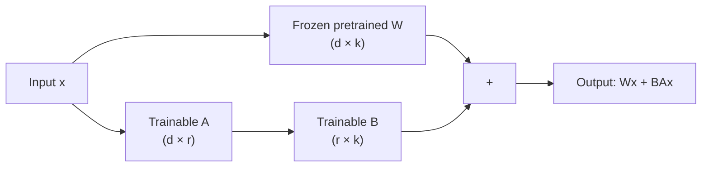

# 🤖 Day 60B: LLM Fine-Tuning & PEFT

> *"Full fine-tuning a 70B model requires 140GB of VRAM. LoRA fine-tunes it with 12GB. That's the budget difference between a research lab and a startup."*

---

## The "Never-Coded" Bridge

**You've trained Transformers (Day 58) and Generative Models (Day 59).** Now imagine you want to take GPT-4 and make it an expert in your company's internal legalese. Fine-tuning the entire model would require dozens of A100 GPUs and millions of dollars.

**PEFT (Parameter-Efficient Fine-Tuning)** is the engineering discipline that makes this achievable on a single GPU. The core insight: you don't need to update all 70 billion parameters. Update only a tiny, clever subset — and get equivalent results.

> **This lesson is a conceptual bridge.** Full implementation, code walkthroughs, and hands-on training loops are in **Phase 10 → Day 113: Fine-Tuning LLMs**, which runs on real models with Unsloth. Read this lesson to build intuition; go there to build the code.

---

## Core Concepts

### Why Fine-Tuning Matters

Pre-trained LLMs are general-purpose. They know world knowledge but not your:

- Internal jargon, product names, or business rules
- Desired output format (always return JSON, always be concise)
- Domain-specific tone (medical, legal, financial)
- Private dataset patterns that never appeared in training

**Fine-tuning** adapts a pre-trained model to your specific task/domain by continuing training on your data.

### The Memory Problem

| Model        | Parameters | Full Fine-Tune VRAM Needed |
| ------------ | ---------- | -------------------------- |
| BERT-base    | 110M       | ~4 GB                      |
| GPT-2 (1.5B) | 1.5B       | ~24 GB                     |
| LLaMA 2 7B   | 7B         | ~56 GB                     |
| LLaMA 2 70B  | 70B        | ~560 GB                    |

Each parameter needs: FP32 weights (4B) + gradients (4B) + optimizer state (8B) = **16 bytes per parameter**. Full fine-tuning is economically infeasible at 7B+ parameters for most organizations.

### LoRA: Low-Rank Adaptation

The key insight behind LoRA (Hu et al., 2021): **weight updates during fine-tuning are inherently low-rank**.

Instead of updating the full weight matrix W (shape d × k), LoRA approximates the update ΔW as a product of two small matrices: ΔW = A × B, where:

- A has shape d × r  (r = rank, typically 4–64)
- B has shape r × k

During fine-tuning, only A and B are trained. W is frozen. This reduces trainable parameters from d×k to r×(d+k) — often a **10,000x reduction**.



```python
# Conceptual LoRA: what's happening under the hood
import torch
import torch.nn as nn

class LoRALayer(nn.Module):
    """
    Wraps an existing linear layer with low-rank adaptation.
    In practice, use Hugging Face PEFT — this illustrates the concept.
    """
    def __init__(self, original_layer: nn.Linear, rank: int = 8, alpha: float = 16):
        super().__init__()
        d_in = original_layer.in_features
        d_out = original_layer.out_features

        # Frozen original weights
        self.original = original_layer
        for param in self.original.parameters():
            param.requires_grad = False  # Freeze!

        # Trainable low-rank matrices
        self.lora_A = nn.Parameter(torch.randn(rank, d_in) * 0.01)
        self.lora_B = nn.Parameter(torch.zeros(d_out, rank))

        # Scaling factor
        self.scaling = alpha / rank

    def forward(self, x):
        # Original output (frozen) + low-rank adaptation
        original_out = self.original(x)
        lora_out = (x @ self.lora_A.T @ self.lora_B.T) * self.scaling
        return original_out + lora_out


# Parameter count comparison
d_in, d_out, rank = 4096, 4096, 8
original_params = d_in * d_out          # 16,777,216
lora_params = rank * d_in + rank * d_out  # 65,536
print(f"Original: {original_params:,} params")
print(f"LoRA: {lora_params:,} trainable params ({lora_params/original_params:.2%})")
```

### QLoRA: Quantization + LoRA

QLoRA pushes further: **quantize** the frozen base model weights to 4-bit integers (from 16-bit floats), then apply LoRA adapters in 16-bit. This reduces the memory footprint by ~4x again:

- A 7B model that needed 14 GB in FP16 → needs ~4 GB in 4-bit + LoRA adapters
- Enables fine-tuning 7B models on a **single consumer GPU (RTX 3090/4090)**

### When to Fine-Tune vs Other Options

| Approach                              | When to Use                               | Cost           |
| ------------------------------------- | ----------------------------------------- | -------------- |
| **Prompt engineering**                | Task is well-defined, few examples needed | Free           |
| **Few-shot prompting**                | Need format or style guidance             | Free           |
| **RAG** *(Day 60C, Phase 10 Day 112)* | Need fresh/private knowledge              | Medium (infra) |
| **LoRA fine-tuning**                  | Need behavior/style/domain adaptation     | Low-Medium     |
| **Full fine-tuning**                  | New capability not in base model          | Very High      |

## PEFT Methods: Beyond LoRA

LoRA is not the only PEFT technique. Different methods make different trade-offs between where the adaptation happens, how many parameters are added, and what kinds of tasks they suit best.

| Method            | Where Applied                         | Trainable Params % | Typical Use Case                                     | Drawback                                                 |
| ----------------- | ------------------------------------- | ------------------ | ---------------------------------------------------- | -------------------------------------------------------- |
| **LoRA**          | Weight matrices (Q, K, V projections) | 0.01% – 1%         | Domain adaptation, style, instruction following      | Rank hyperparameter requires tuning                      |
| **Prefix Tuning** | Prepended virtual tokens at each layer | 0.1% – 0.5%        | Controlled text generation, NLG tasks                | Difficult to train; sensitive to initialization          |
| **Prompt Tuning** | Input embedding layer only            | <0.01%             | Task switching at inference time, multi-task serving | Only effective at large model scales (>10B params)       |
| **Adapter Layers**| New bottleneck layers between transformer blocks | 0.5% – 5%  | Multi-task learning, modular specialization          | Adds inference latency (extra forward passes per layer)  |
| **IA³**           | Rescaling vectors on K, V, FF layers  | <0.01%             | Few-shot adaptation, low-data regimes                | Less expressive than LoRA for complex domain shifts      |

**Rule of thumb:** For most enterprise fine-tuning tasks, start with LoRA (r=8, alpha=16). Move to QLoRA if VRAM is constrained. Consider IA³ only if you have very few training examples (<500).

---

## The Hugging Face PEFT Library

For full implementation with real models, go to **Phase 10 → Day 113**. Here's the mental model:

```python
# Pseudocode — actual runnable version in Phase 10 Day 113
# (requires GPU, model downloads, and full PEFT/transformers setup)

from transformers import AutoModelForCausalLM, AutoTokenizer
from peft import get_peft_model, LoraConfig, TaskType

# 1. Load base model
model = AutoModelForCausalLM.from_pretrained("meta-llama/Llama-2-7b-hf")

# 2. Configure LoRA
lora_config = LoraConfig(
    task_type=TaskType.CAUSAL_LM,
    r=8,          # Rank — lower = fewer params, less capacity
    lora_alpha=32,  # Scaling factor (alpha/r controls magnitude)
    lora_dropout=0.1,
    target_modules=["q_proj", "v_proj"],  # Which layers to apply LoRA
)

# 3. Wrap model with PEFT — magically adds trainable LoRA adapters
peft_model = get_peft_model(model, lora_config)
peft_model.print_trainable_parameters()
# Output: trainable params: 4,194,304 || all params: 6,742,609,920 || trainable%: 0.0622

# 4. Train normally with your dataset
# (standard HuggingFace Trainer or custom loop)

# 5. Save only the adapter weights (tiny — usually ~20MB vs 14GB base)
peft_model.save_pretrained("./my_lora_adapter")
```

---

## Mastery Check

**Q1**: Why does LoRA freeze the original model weights and only train A and B matrices?
<details><summary>Answer</summary>

Two reasons: (1) **Memory efficiency** — freezing the original weights means you don't need to store gradients and optimizer states for them (saves ~12 bytes/param). (2) **Catastrophic forgetting prevention** — the original model's general capabilities are preserved because its weights never change; only the low-rank adaptation specializes it.
</details>

**Q2**: A colleague says "just use a bigger prompt instead of fine-tuning." When is fine-tuning actually necessary?
<details><summary>Answer</summary>

Prompt engineering has limits: (1) it can't teach the model new facts not in its training data, (2) context windows are finite (can't put 10,000 examples in a prompt), (3) inference costs scale with prompt length, and (4) prompts don't reliably change fundamental behavior (e.g., always produce valid JSON). Fine-tune when you need consistent behavior change, domain adaptation, or must use your proprietary data to shift the model's outputs.
</details>

**Q3**: What is the trade-off of choosing rank r=4 vs r=64 in LoRA?
<details><summary>Answer</summary>

Lower rank (r=4): fewer trainable parameters, less memory, faster training, less risk of overfitting — but less expressive capacity. Higher rank (r=64): more capacity to learn complex adaptations — but approaches the memory/compute cost of full fine-tuning. In practice, r=8 to r=32 is sufficient for most downstream tasks; use validation loss curves to find the sweet spot.
</details>

---

## Quick-Start Lab: LoRA Parameter Efficiency Demo

**Business scenario:** Your company's HR team wants to adapt an open-source LLaMA 3 model to answer questions about your 200-page employee handbook. Full fine-tuning would cost $8,000 in compute. LoRA makes it feasible on a single T4 GPU in under an hour.

This lab uses GPT-2-scale parameter counts (no GPU, no API keys, no model downloads) to show you exactly what LoRA does to a model's parameter structure. Run this right now in any Python environment.

```python
# LoRA Parameter Efficiency Demo
# No GPU needed — runs on any Python 3.8+ environment
# pip install torch  (CPU-only torch is fine)

import torch
import torch.nn as nn

# ─────────────────────────────────────────────
# TASK 1: Define a realistic transformer-scale linear layer
# ─────────────────────────────────────────────

class StandardLinear(nn.Module):
    """A standard attention projection layer (typical size in a 7B model)."""
    def __init__(self, d_in: int, d_out: int):
        super().__init__()
        self.weight = nn.Parameter(torch.randn(d_out, d_in))
        self.bias = nn.Parameter(torch.zeros(d_out))

    def forward(self, x):
        return x @ self.weight.T + self.bias

    def count_params(self):
        return sum(p.numel() for p in self.parameters())


# Task 1: instantiate a GPT-2-style attention projection
d_model = 768   # GPT-2 hidden size
layer = StandardLinear(d_model, d_model)
print(f"Task 1 — Standard linear layer params: {layer.count_params():,}")
# Expected Output:
# Task 1 — Standard linear layer params: 590,592


# ─────────────────────────────────────────────
# TASK 2: Wrap the layer with LoRA adaptation
# ─────────────────────────────────────────────

class LoRALinear(nn.Module):
    """
    Freezes an existing linear layer and adds trainable low-rank matrices A and B.
    Forward pass: original(x) + (x @ A.T @ B.T) * scaling
    """
    def __init__(self, base_layer: nn.Linear, rank: int = 8, alpha: float = 16.0):
        super().__init__()
        d_in = base_layer.weight.shape[1]
        d_out = base_layer.weight.shape[0]

        # Freeze all original parameters
        self.base = base_layer
        for p in self.base.parameters():
            p.requires_grad = False

        # Trainable low-rank matrices
        self.lora_A = nn.Parameter(torch.randn(rank, d_in) * 0.02)
        self.lora_B = nn.Parameter(torch.zeros(d_out, rank))
        self.scaling = alpha / rank

    def forward(self, x):
        base_out = self.base(x)
        lora_out = (x @ self.lora_A.T @ self.lora_B.T) * self.scaling
        return base_out + lora_out

    def count_trainable(self):
        return sum(p.numel() for p in self.parameters() if p.requires_grad)

    def count_total(self):
        return sum(p.numel() for p in self.parameters())


# Task 2: wrap the layer with LoRA (rank=8)
lora_layer = LoRALinear(base_layer=StandardLinear(d_model, d_model), rank=8, alpha=16)

trainable = lora_layer.count_trainable()
total = lora_layer.count_total()
print(f"\nTask 2 — LoRA layer (rank=8):")
print(f"  Trainable params : {trainable:,}")
print(f"  Total params     : {total:,}")
print(f"  Trainable %      : {trainable / total:.4%}")
# Expected Output:
# Task 2 — LoRA layer (rank=8):
#   Trainable params : 12,288
#   Total params     : 603,136
#   Trainable %      : 2.0374%


# ─────────────────────────────────────────────
# TASK 3: Scale to a full GPT-2 model simulation
# ─────────────────────────────────────────────

def simulate_model_param_counts(d_model: int, n_layers: int, rank: int):
    """
    Simulates parameter counts for a transformer model
    where LoRA is applied to Q and V projections in every layer.
    """
    # Each attention layer has Q, K, V, O projections
    params_per_qv_layer = d_model * d_model  # simplified (no bias)
    total_base_params = n_layers * 4 * params_per_qv_layer  # Q, K, V, O

    # LoRA applied to Q and V only (common practice)
    lora_params_per_layer = 2 * (rank * d_model + d_model * rank)  # A + B for Q and V
    total_lora_params = n_layers * lora_params_per_layer

    return total_base_params, total_lora_params

# GPT-2 scale: 12 layers, 768 hidden dim
base_params, lora_params = simulate_model_param_counts(d_model=768, n_layers=12, rank=8)
print(f"\nTask 3 — Full GPT-2 scale simulation (rank=8, Q+V only):")
print(f"  Base model params  : {base_params:,}")
print(f"  LoRA adapter params: {lora_params:,}")
print(f"  Reduction factor   : {base_params / lora_params:.1f}x fewer trainable params")
# Expected Output:
# Task 3 — Full GPT-2 scale simulation (rank=8, Q+V only):
#   Base model params  : 28,311,552
#   LoRA adapter params: 294,912
#   Reduction factor   : 96.0x fewer trainable params


# ─────────────────────────────────────────────
# TASK 4: Compare rank values — the expressiveness trade-off
# ─────────────────────────────────────────────

print("\nTask 4 — Rank comparison (GPT-2 scale, Q+V projections):")
print(f"{'Rank':>6} | {'LoRA Params':>14} | {'% of Base':>10} | {'Typical Use Case'}")
print("-" * 65)
use_cases = {4: "Style/tone tuning", 8: "General instruction following",
             16: "Domain adaptation", 32: "Complex reasoning tasks",
             64: "New capability injection"}
for r in [4, 8, 16, 32, 64]:
    _, lp = simulate_model_param_counts(768, 12, r)
    pct = lp / base_params * 100
    print(f"{r:>6} | {lp:>14,} | {pct:>9.3f}% | {use_cases[r]}")
# Expected Output:
#   Rank |    LoRA Params |   % of Base | Typical Use Case
# -----------------------------------------------------------------
#      4 |        147,456 |     0.521%  | Style/tone tuning
#      8 |        294,912 |     1.042%  | General instruction following
#     16 |        589,824 |     2.083%  | Domain adaptation
#     32 |      1,179,648 |     4.167%  | Complex reasoning tasks
#     64 |      2,359,296 |     8.333%  | New capability injection


# ─────────────────────────────────────────────
# TASK 5: Verify LoRA forward pass produces correct output shape
# ─────────────────────────────────────────────

print("\nTask 5 — Forward pass verification:")
batch_size, seq_len = 2, 16
x = torch.randn(batch_size, seq_len, d_model)
out = lora_layer(x)
print(f"  Input shape : {tuple(x.shape)}")
print(f"  Output shape: {tuple(out.shape)}")
assert out.shape == x.shape, "Shape mismatch — LoRA must preserve tensor dimensions"
print("  Shape assertion passed: LoRA output matches input dimensions.")
print("  The adapter adds capability without changing the model's interface.")
# Expected Output:
# Task 5 — Forward pass verification:
#   Input shape : (2, 16, 768)
#   Output shape: (2, 16, 768)
#   Shape assertion passed: LoRA output matches input dimensions.
#   The adapter adds capability without changing the model's interface.
```

**Key takeaway:** A rank-8 LoRA adapter for GPT-2 trains only ~295K parameters instead of 28M — a 96x reduction. Applied to LLaMA 3 70B, this is the difference between needing 560 GB of VRAM and needing 12 GB.

---

## Senior-Level Insights: PEFT in Production

### Instruction Tuning vs Domain Fine-Tuning

These are frequently conflated but solve different problems:

- **Instruction tuning** (behavior change): Teaches the model *how to respond* — follow instructions, refuse harmful requests, output JSON, be concise. The training data is pairs of (instruction, ideal response). Example: Alpaca, FLAN, OpenAI's RLHF. The base model already *knows* the facts; you're shaping its personality and response style.
- **Domain fine-tuning** (knowledge injection): Teaches the model *new domain-specific content* — your company's internal terminology, specialized medical reasoning, proprietary product details. Requires domain-specific training examples. LoRA rank should be higher (r=16–64) because more capacity is needed.

In practice, most production fine-tuning does both simultaneously: instruction-format your domain data so the model learns both the knowledge and the behavior.

### Catastrophic Forgetting: What LoRA Prevents (and What It Does Not)

LoRA freezes the base model's weights entirely. This means the model's general language capabilities, factual knowledge, and common-sense reasoning are preserved — gradient updates never touch them. This is LoRA's primary advantage over full fine-tuning.

However, two subtler degradations can still occur:

1. **Adapter overfitting**: If your fine-tuning dataset is small (<1,000 examples) and you train too long, the A and B matrices overfit. The model performs well on training examples but poorly on out-of-distribution queries. Mitigation: early stopping, dropout (lora_dropout=0.05–0.1), and validation loss monitoring.
2. **Distribution shift at the adapter boundary**: The base model's frozen outputs are optimized for its original distribution. If your fine-tuning data is very different in style (e.g., fine-tuning an English model on formal legal Latin), the adapter struggles because it's correcting a large distributional gap. Mitigation: use a base model already close to your target domain.

### Adapter Composition: Serving Multiple LoRA Adapters

A single base model can host many LoRA adapters simultaneously, each trained for a different task. Two composition patterns:

- **Hot-swapping**: Load the base model once, swap adapter weights between requests based on the incoming task. A single 7B base model + 50 domain adapters (each ~20 MB) costs less VRAM than loading 50 separate fine-tuned models. Used by systems like S-LoRA and Punica for multi-tenant LLM serving.
- **Weighted merging**: Merge multiple adapters into one by linearly combining their weight deltas: ΔW_final = α₁ΔW₁ + α₂ΔW₂. Useful when you want a model that blends two capabilities (e.g., medical domain + concise response style). The merged adapter can be compiled back into the base model weights for zero-overhead inference.

### Rank Selection Heuristics

There is no universal optimal rank — it depends on the complexity of the adaptation task:

| Target Adaptation       | Recommended Rank | Reasoning                                               |
| ----------------------- | ---------------- | ------------------------------------------------------- |
| Style / tone tuning     | r = 4            | Low-rank sufficient for surface-level behavior changes  |
| Instruction following   | r = 8            | Standard default; works for most task formatting needs  |
| Domain vocabulary       | r = 16           | Moderate capacity for new terminology patterns          |
| Deep domain adaptation  | r = 32           | Complex medical/legal/financial reasoning patterns      |
| New capabilities        | r = 64           | Approaching full fine-tuning territory; use cautiously  |

Start at r=8. If validation loss plateaus early and performance is insufficient, double the rank. If you see overfitting, halve the rank.

### Production Deployment: Base Model + Multi-Adapter Serving

```
┌─────────────────────────────────────────────────────┐
│  Inference Server                                    │
│                                                      │
│  Base Model (7B, loaded once in GPU memory)          │
│  ├── HR Handbook Adapter     (adapter_hr.bin, 22 MB) │
│  ├── Legal Contracts Adapter (adapter_legal.bin, 22 MB)│
│  └── Customer Support Adapter(adapter_cs.bin, 22 MB) │
│                                                      │
│  Request routing: task_type → adapter selection      │
│  Adapter swap latency: <1ms (weight copy, not reload)│
└─────────────────────────────────────────────────────┘
```

Libraries enabling this pattern: **S-LoRA** (academic), **LangServe** with adapter routing, **vLLM** (adapter support in v0.4+).

### Cost Calculation Framework

Before committing to fine-tuning, estimate the full cost:

```
Total Cost = Compute + Evaluation + Serving Overhead

Compute cost     = GPU hours × $/hour × number of runs
                 = (dataset_size / batch_size) × epochs / steps_per_hour × $3.50/hr (A100)

Evaluation cost  = Human eval hours × $50/hr  OR  RAGAS eval API calls × $0.002/call

Serving overhead = Base model hosting + adapter storage + routing logic engineering

Example (7B model, 50K training examples, rank=8):
  Training: ~2 hours on 1x A100 @ $3.50 = $7
  Evaluation: 200 RAGAS calls = $0.40
  Engineering: 4 hours @ $100/hr = $400  ← often the dominant cost
  Total: ~$407 for first fine-tuning run
```

The engineering cost dominates small training runs. Fine-tuning makes economic sense when it replaces repeated prompt-engineering iteration or reduces per-query LLM costs at scale (>1M queries/month).

---

## Glossary

**Fine-tuning**: Continuing the training of a pre-trained model on a new, task-specific dataset. The model's weights are updated to specialize its behavior or knowledge for the target domain.

**PEFT (Parameter-Efficient Fine-Tuning)**: A family of techniques that adapt large pre-trained models by training only a small fraction of their parameters, rather than updating all weights. Dramatically reduces compute and memory requirements.

**LoRA (Low-Rank Adaptation)**: A PEFT method that represents weight updates as the product of two small matrices (A × B), where the rank r << original dimensions. Only A and B are trained; the base model weights are frozen.

**QLoRA**: An extension of LoRA that quantizes the frozen base model weights to 4-bit integers (reducing memory by ~4x), then trains LoRA adapters in 16-bit floating point. Enables fine-tuning 7B+ models on a single consumer GPU.

**Rank (r)**: The inner dimension of LoRA's low-rank matrix decomposition (ΔW = A × B where A is d×r and B is r×k). Controls the expressiveness of the adapter — higher rank = more capacity = more trainable parameters.

**Adapter**: A small trainable module inserted into or alongside a frozen pre-trained model. In LoRA, the adapter is the pair of matrices (A, B). Adapters can be swapped or composed without reloading the base model.

**Frozen weights**: Model parameters that are excluded from gradient updates during training. In PEFT, the base model's weights are frozen; only adapter parameters receive gradient updates.

**Catastrophic forgetting**: The phenomenon where a neural network loses previously learned capabilities when trained on new data. PEFT methods mitigate this by freezing the base model's weights, preserving general knowledge while the adapter specializes.

**Full fine-tuning**: Training all parameters of a pre-trained model on new data. Maximally expressive but requires storing gradients and optimizer states for every parameter — economically infeasible for models above ~7B parameters on most budgets.

**Instruction tuning**: A form of fine-tuning where training examples are formatted as (instruction, ideal_response) pairs, teaching the model how to follow directives, format outputs, and behave consistently — as opposed to domain fine-tuning which injects new factual knowledge.

---

## Cross-References

- **Day 58: Transformers & Attention** — The foundational architecture underlying all LLMs. Understanding self-attention and the Q/K/V projection matrices is prerequisite knowledge for understanding *where* LoRA adapters are applied.
- **Day 59: Generative Models** — Base model architectures (GPT-style autoregressive decoders, diffusion models). Fine-tuning starts from a base model; this lesson explains what those models are and how they were pre-trained.
- **Day 60C: RAG & Vector Databases** — The primary alternative to fine-tuning for injecting private or dynamic knowledge. Understanding both helps you choose the right architecture. Rule of thumb: RAG for knowledge, fine-tuning for behavior.
- **Phase 10 → Day 113: LLM Fine-Tuning (Full Implementation)** — Complete hands-on implementation using Unsloth and QLoRA on LLaMA 3, with training loops, dataset preparation, evaluation, and adapter saving. This is where the concepts in this lesson become working code.

---

## Next Steps

**Go deeper on implementation:**

- 🔗 **Phase 10 → Day 113**: Full fine-tuning walkthrough with Unsloth (QLoRA on LLaMA 3)
- 🔗 **Phase 10 → Day 114**: Evaluating your fine-tuned model with RAGAS
- 📖 [LoRA paper](https://arxiv.org/abs/2106.09685) — Original Hu et al. 2021 paper (accessible)
- 📖 [QLoRA paper](https://arxiv.org/abs/2305.14314) — Dettmers et al. 2023
- 🔧 [Hugging Face PEFT](https://huggingface.co/docs/peft/index) — Official library docs

**Tomorrow → Day 60C**: RAG & Vector Databases — retrieve private knowledge without fine-tuning.
