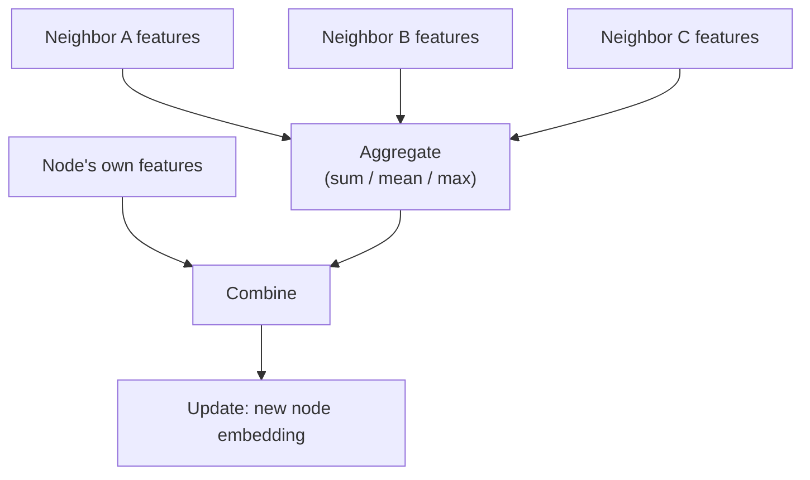

# 🎯 Day 60: Graph & Geometric Learning

> *"When your data has relationships: social networks, molecules, knowledge graphs."*

---

## The "Never-Coded" Bridge

**Most real-world data isn't in tables or grids—it's in networks.**

- **Social media**: Users connected by friendships
- **Biology**: Proteins/genes with interaction networks
- **Transportation**: Cities connected by roads
- **Chemistry**: Atoms bonded into molecules
- **Knowledge**: Entities linked by relationships (Google Knowledge Graph)

**Traditional ML fails here:**

- CNNs: Assume grid structure (images)
- RNNs: Assume sequence (text, time series)
- Neither captures arbitrary relationships!

**Graph Neural Networks (GNNs) solve this.**

**Real-world impact:**

**Drug Discovery:**

- **DeepMind AlphaFold**: Protein structure prediction
- Molecules as graphs: Atoms = nodes, bonds = edges
- Impact: Accelerated COVID-19 research

**Recommender Systems:**

- **Pinterest**: User-pin-board graph
- **Amazon**: Product co-purchase network
- GNNs: 20% improvement over matrix factorization

**Fraud Detection:**

- **PayPal, Uber**: Transaction networks
- GNNs detect fraud rings (groups of coordinated fake accounts)
- Caught 40% more fraud than traditional ML

**Traffic Prediction:**

- **Google Maps**: Road network graph
- GNNs predict congestion propagation
- 15-20% more accurate than time-series models

**Social Networks:**

- **Facebook, LinkedIn**: Friend/connection graphs
- Community detection, influence propagation
- Targeted advertising, content recommendations

---

## The Technical Deep Dive

### Graph Basics with NetworkX

```python
import networkx as nx
import matplotlib.pyplot as plt
import numpy as np

# Create a graph
G = nx.Graph()

# Add nodes
G.add_nodes_from([1, 2, 3, 4, 5])

# Add edges
G.add_edges_from([(1, 2), (1, 3), (2, 3), (3, 4), (4, 5)])

# Graph properties
print(f"Number of nodes: {G.number_of_nodes()}")
print(f"Number of edges: {G.number_of_edges()}")

# Node degree (how many connections)
for node in G.nodes():
    print(f"Node {node} degree: {G.degree(node)}")

# Adjacency matrix
A = nx.adjacency_matrix(G)
print(f"\nAdjacency Matrix:\n{A.todense()}")

# Visualize
plt.figure(figsize=(8, 6))
pos = nx.spring_layout(G, seed=42)
nx.draw(
    G,
    pos,
    with_labels=True,
    node_color="lightblue",
    node_size=500,
    font_size=16,
    font_weight="bold",
)
plt.title("Simple Graph")
plt.show()

# Graph metrics
print(f"\nClustering coefficient: {nx.average_clustering(G):.3f}")
print(f"Average shortest path: {nx.average_shortest_path_length(G):.3f}")

# Community detection
from networkx.algorithms import community

communities = community.greedy_modularity_communities(G)
print(f"\nCommunities detected: {len(list(communities))}")
```

### Node Embeddings: Node2Vec

**Idea:** Learn vector representations preserving network structure

```python
from node2vec import Node2Vec

# Create larger graph (Zachary's Karate Club - classic dataset)
G = nx.karate_club_graph()

print(f"Nodes: {G.number_of_nodes()}, Edges: {G.number_of_edges()}")

# Node2Vec: Random walks + Word2Vec
node2vec = Node2Vec(
    G,
    dimensions=64,  # Embedding size
    walk_length=30,  # Length of random walk
    num_walks=200,  # Number of walks per node
    p=1,  # Return parameter (BFS vs DFS)
    q=1,  # In-out parameter
    workers=4,
)

# Train embeddings
model = node2vec.fit(window=10, min_count=1, batch_words=4)

# Get embedding for node 0
node_0_embedding = model.wv[0]
print(f"\nNode 0 embedding (64D): {node_0_embedding[:5]}...")  # Show first 5 dims

# Find similar nodes
similar_nodes = model.wv.most_similar("0", topn=3)
print(f"\nNodes most similar to node 0:")
for node, similarity in similar_nodes:
    print(f"  Node {node}: {similarity:.3f}")

# Visualize embeddings (reduce to 2D)
from sklearn.manifold import TSNE

# Get all embeddings
embeddings = np.array([model.wv[str(i)] for i in range(G.number_of_nodes())])

# t-SNE dimensionality reduction
tsne = TSNE(n_components=2, random_state=42)
embeddings_2d = tsne.fit_transform(embeddings)

# Plot
plt.figure(figsize=(10, 8))
plt.scatter(embeddings_2d[:, 0], embeddings_2d[:, 1], s=100, alpha=0.7)

for i, (x, y) in enumerate(embeddings_2d):
    plt.annotate(str(i), (x, y), fontsize=8)

plt.title("Node2Vec Embeddings (t-SNE visualization)")
plt.xlabel("Dimension 1")
plt.ylabel("Dimension 2")
plt.show()
```

### Graph Convolutional Network (GCN)

**Idea:** Aggregate neighbor features, like CNNs but for graphs

```python
import torch
import torch.nn as nn
import torch.nn.functional as F
from torch_geometric.nn import GCNConv
from torch_geometric.datasets import Planetoid
from torch_geometric.data import Data

# Load Cora dataset (citation network)
dataset = Planetoid(root="/tmp/Cora", name="Cora")

print(f"Dataset: {dataset}")
print(f"Number of graphs: {len(dataset)}")
print(f"Number of features: {dataset.num_features}")
print(f"Number of classes: {dataset.num_classes}")

data = dataset[0]  # Single graph
print(f"\nNodes: {data.num_nodes}")
print(f"Edges: {data.num_edges}")
print(f"Features per node: {data.num_node_features}")


# Graph Convolutional Network
class GCN(nn.Module):
    def __init__(self, num_features, num_classes):
        super().__init__()
        self.conv1 = GCNConv(num_features, 16)
        self.conv2 = GCNConv(16, num_classes)

    def forward(self, data):
        x, edge_index = data.x, data.edge_index

        # First GCN layer
        x = self.conv1(x, edge_index)
        x = F.relu(x)
        x = F.dropout(x, p=0.5, training=self.training)

        # Second GCN layer
        x = self.conv2(x, edge_index)

        return F.log_softmax(x, dim=1)


# Initialize model
model = GCN(num_features=dataset.num_features, num_classes=dataset.num_classes)
optimizer = torch.optim.Adam(model.parameters(), lr=0.01, weight_decay=5e-4)


# Training
def train():
    model.train()
    optimizer.zero_grad()
    out = model(data)
    loss = F.nll_loss(out[data.train_mask], data.y[data.train_mask])
    loss.backward()
    optimizer.step()
    return loss.item()


# Testing
def test():
    model.eval()
    logits = model(data)
    pred = logits.argmax(dim=1)

    accs = []
    for mask in [data.train_mask, data.val_mask, data.test_mask]:
        correct = (pred[mask] == data.y[mask]).sum()
        acc = int(correct) / int(mask.sum())
        accs.append(acc)

    return accs


# Train model
print("\n=== Training GCN ===")
for epoch in range(1, 201):
    loss = train()
    if epoch % 20 == 0:
        train_acc, val_acc, test_acc = test()
        print(
            f"Epoch {epoch:03d}, Loss: {loss:.4f}, Train: {train_acc:.4f}, Val: {val_acc:.4f}, Test: {test_acc:.4f}"
        )

# Final evaluation
train_acc, val_acc, test_acc = test()
print(f"\n=== Final Results ===")
print(f"Train Accuracy: {train_acc:.4f}")
print(f"Val Accuracy: {val_acc:.4f}")
print(f"Test Accuracy: {test_acc:.4f}")
```

### Message Passing Framework

**How GNNs work:** Nodes send messages to neighbors



```python
class MessagePassingGNN(nn.Module):
    def __init__(self, num_features, hidden_dim, num_classes):
        super().__init__()
        self.linear1 = nn.Linear(num_features, hidden_dim)
        self.linear2 = nn.Linear(hidden_dim, num_classes)

    def aggregate_neighbors(self, x, edge_index):
        """
        Aggregate features from neighbors.

        x: Node features [num_nodes, num_features]
        edge_index: Edges [2, num_edges]
        """
        num_nodes = x.size(0)

        # Initialize aggregated features
        aggregated = torch.zeros(num_nodes, x.size(1))

        # For each edge (source → target)
        for i in range(edge_index.size(1)):
            source = edge_index[0, i]
            target = edge_index[1, i]

            # Add source's features to target's aggregation
            aggregated[target] += x[source]

        return aggregated

    def forward(self, data):
        x, edge_index = data.x, data.edge_index

        # Layer 1: Transform + Aggregate + Activate
        x = self.linear1(x)
        x = self.aggregate_neighbors(x, edge_index)
        x = F.relu(x)

        # Layer 2
        x = self.linear2(x)
        x = self.aggregate_neighbors(x, edge_index)

        return F.log_softmax(x, dim=1)


# This is simplified - real GNNs use efficient sparse operations
```

### Graph Attention Networks (GAT)

**Idea:** Not all neighbors are equally important—learn attention weights

```python
from torch_geometric.nn import GATConv


class GAT(nn.Module):
    def __init__(self, num_features, num_classes):
        super().__init__()
        # 8 attention heads in first layer
        self.conv1 = GATConv(num_features, 8, heads=8, dropout=0.6)
        # Concatenate 8 heads: 8*8=64 features
        # Single head for output
        self.conv2 = GATConv(8 * 8, num_classes, heads=1, concat=False, dropout=0.6)

    def forward(self, data):
        x, edge_index = data.x, data.edge_index

        # First GAT layer
        x = F.dropout(x, p=0.6, training=self.training)
        x = self.conv1(x, edge_index)
        x = F.elu(x)

        # Second GAT layer
        x = F.dropout(x, p=0.6, training=self.training)
        x = self.conv2(x, edge_index)

        return F.log_softmax(x, dim=1)


# Train similar to GCN
gat_model = GAT(num_features=dataset.num_features, num_classes=dataset.num_classes)
```

### Link Prediction

**Task:** Predict missing edges in graph

```python
from torch_geometric.utils import negative_sampling, train_test_split_edges

# Split edges into train/test
data = train_test_split_edges(data)


class GCNLinkPredictor(nn.Module):
    def __init__(self, num_features, embedding_dim):
        super().__init__()
        self.conv1 = GCNConv(num_features, 128)
        self.conv2 = GCNConv(128, embedding_dim)

    def encode(self, x, edge_index):
        """Generate node embeddings"""
        x = self.conv1(x, edge_index)
        x = F.relu(x)
        x = self.conv2(x, edge_index)
        return x

    def decode(self, z, edge_index):
        """Predict edge probability from embeddings"""
        # Dot product of source and target embeddings
        src, dst = edge_index
        return (z[src] * z[dst]).sum(dim=-1)

    def forward(self, data):
        z = self.encode(data.x, data.train_pos_edge_index)
        return z


# Training
link_pred_model = GCNLinkPredictor(num_features=dataset.num_features, embedding_dim=64)
optimizer = torch.optim.Adam(link_pred_model.parameters(), lr=0.01)


def train_link_prediction():
    link_pred_model.train()
    optimizer.zero_grad()

    # Encode nodes
    z = link_pred_model(data)

    # Positive edges (actual edges)
    pos_edge_index = data.train_pos_edge_index
    pos_pred = link_pred_model.decode(z, pos_edge_index)

    # Negative edges (sample non-existent edges)
    neg_edge_index = negative_sampling(
        edge_index=data.train_pos_edge_index,
        num_nodes=data.num_nodes,
        num_neg_samples=pos_edge_index.size(1),
    )
    neg_pred = link_pred_model.decode(z, neg_edge_index)

    # Binary cross-entropy loss
    pos_loss = -torch.log(torch.sigmoid(pos_pred) + 1e-15).mean()
    neg_loss = -torch.log(1 - torch.sigmoid(neg_pred) + 1e-15).mean()
    loss = pos_loss + neg_loss

    loss.backward()
    optimizer.step()

    return loss.item()


# Train
print("\n=== Training Link Predictor ===")
for epoch in range(1, 101):
    loss = train_link_prediction()
    if epoch % 10 == 0:
        print(f"Epoch {epoch:03d}, Loss: {loss:.4f}")
```

### Graph Classification

**Task:** Classify entire graphs (e.g., molecule toxicity)

```python
from torch_geometric.datasets import TUDataset
from torch_geometric.loader import DataLoader
from torch_geometric.nn import global_mean_pool

# Load molecule dataset
dataset = TUDataset(root="/tmp/ENZYMES", name="ENZYMES")

print(f"Number of graphs: {len(dataset)}")
print(f"Number of classes: {dataset.num_classes}")

# Split dataset
torch.manual_seed(42)
dataset = dataset.shuffle()

train_dataset = dataset[:540]
test_dataset = dataset[540:]

train_loader = DataLoader(train_dataset, batch_size=64, shuffle=True)
test_loader = DataLoader(test_dataset, batch_size=64)


# Graph classifier
class GraphClassifier(nn.Module):
    def __init__(self, num_features, num_classes):
        super().__init__()
        self.conv1 = GCNConv(num_features, 64)
        self.conv2 = GCNConv(64, 64)
        self.conv3 = GCNConv(64, 64)
        self.fc = nn.Linear(64, num_classes)

    def forward(self, data):
        x, edge_index, batch = data.x, data.edge_index, data.batch

        # Node-level features
        x = self.conv1(x, edge_index)
        x = F.relu(x)
        x = self.conv2(x, edge_index)
        x = F.relu(x)
        x = self.conv3(x, edge_index)

        # Graph-level pooling (aggregate all nodes in graph)
        x = global_mean_pool(x, batch)

        # Classification
        x = F.dropout(x, p=0.5, training=self.training)
        x = self.fc(x)

        return F.log_softmax(x, dim=1)


graph_classifier = GraphClassifier(
    num_features=dataset.num_features, num_classes=dataset.num_classes
)
optimizer = torch.optim.Adam(graph_classifier.parameters(), lr=0.01)


def train_graph_classifier():
    graph_classifier.train()
    total_loss = 0
    for data in train_loader:
        optimizer.zero_grad()
        out = graph_classifier(data)
        loss = F.nll_loss(out, data.y)
        loss.backward()
        optimizer.step()
        total_loss += loss.item() * data.num_graphs
    return total_loss / len(train_dataset)


def test_graph_classifier(loader):
    graph_classifier.eval()
    correct = 0
    for data in loader:
        out = graph_classifier(data)
        pred = out.argmax(dim=1)
        correct += (pred == data.y).sum().item()
    return correct / len(loader.dataset)


# Train
print("\n=== Training Graph Classifier ===")
for epoch in range(1, 201):
    loss = train_graph_classifier()
    if epoch % 20 == 0:
        train_acc = test_graph_classifier(train_loader)
        test_acc = test_graph_classifier(test_loader)
        print(
            f"Epoch {epoch:03d}, Loss: {loss:.4f}, Train Acc: {train_acc:.4f}, Test Acc: {test_acc:.4f}"
        )
```

---

## Senior-Level Insights

### GNN Architectures Comparison

| Model         | Aggregation            | Strengths                  | Use Case             |
| ------------- | ---------------------- | -------------------------- | -------------------- |
| **GCN**       | Mean of neighbors      | Simple, effective          | Node classification  |
| **GAT**       | Attention-weighted     | Learns neighbor importance | Heterogeneous graphs |
| **GraphSAGE** | Sampling + aggregation | Scalable to large graphs   | Inductive learning   |
| **GIN**       | Sum (injective)        | Most expressive            | Graph classification |

### Over-Smoothing Problem

```python
# Problem: Too many GNN layers → all nodes have similar embeddings

# After layer 1: Nodes know about 1-hop neighbors
# After layer 2: Nodes know about 2-hop neighbors
# After layer 5: Nodes know about 5-hop neighbors
# → In small graph, all nodes connected → all embeddings converge to same value

# Solutions:
# 1. Use fewer layers (2-3 typically enough)
# 2. Skip connections (residual)
# 3. Layer normalization
# 4. Jumping Knowledge networks (combine all layer outputs)
```

### Inductive vs Transductive Learning

```python
# Transductive: Test nodes present during training (but labels hidden)
# - Example: Cora dataset (all nodes in graph during training)
# - Can't generalize to new nodes

# Inductive: Test nodes NOT present during training
# - Example: GraphSAGE (learns aggregation function)
# - Can generalize to new nodes

# Production systems typically need inductive learning
```

---

## Hands-on Lab

### Exercise 1: Social Network Analysis

```python
# Build friend recommendation system

import networkx as nx

# Create social network
G = nx.karate_club_graph()

# Node features: Degree centrality, clustering coefficient
node_features = []
for node in G.nodes():
    degree_cent = nx.degree_centrality(G)[node]
    cluster_coef = nx.clustering(G, node)
    node_features.append([degree_cent, cluster_coef])

node_features = torch.tensor(node_features, dtype=torch.float)

# Edge list
edge_index = torch.tensor(list(G.edges())).t().contiguous()

# Create PyG data
from torch_geometric.data import Data

social_data = Data(x=node_features, edge_index=edge_index)

# Train GCN for link prediction
# Recommend new friendships
```

---

### Exercise 2: Molecule Property Prediction

```python
# Predict if molecule is toxic

from rdkit import Chem
from rdkit.Chem import Descriptors


def smiles_to_graph(smiles):
    """Convert SMILES string to graph"""
    mol = Chem.MolFromSmiles(smiles)

    # Node features: Atom type, charge, etc.
    atom_features = []
    for atom in mol.GetAtoms():
        features = [
            atom.GetAtomicNum(),
            atom.GetDegree(),
            atom.GetFormalCharge(),
            int(atom.GetHybridization()),
        ]
        atom_features.append(features)

    # Edge list: Bonds
    edge_list = []
    for bond in mol.GetBonds():
        i = bond.GetBeginAtomIdx()
        j = bond.GetEndAtomIdx()
        edge_list.append([i, j])
        edge_list.append([j, i])  # Undirected

    x = torch.tensor(atom_features, dtype=torch.float)
    edge_index = torch.tensor(edge_list, dtype=torch.long).t().contiguous()

    return Data(x=x, edge_index=edge_index)


# Example: Aspirin
aspirin_smiles = "CC(=O)Oc1ccccc1C(=O)O"
aspirin_graph = smiles_to_graph(aspirin_smiles)

print(f"Aspirin: {aspirin_graph.num_nodes} atoms, {aspirin_graph.num_edges} bonds")

# Train graph classifier on toxicity dataset
```

---

### Exercise 3: Traffic Prediction

```python
# Predict traffic congestion on road network

# Road network as graph
# Nodes: Intersections
# Edges: Roads
# Node features: Current speed, time of day, weather
# Task: Predict speed in next hour


class TrafficGNN(nn.Module):
    def __init__(self, num_features):
        super().__init__()
        self.conv1 = GCNConv(num_features, 64)
        self.conv2 = GCNConv(64, 32)
        self.fc = nn.Linear(32, 1)  # Predict speed

    def forward(self, data):
        x, edge_index = data.x, data.edge_index

        x = self.conv1(x, edge_index)
        x = F.relu(x)
        x = self.conv2(x, edge_index)
        x = F.relu(x)
        x = self.fc(x)

        return x


# Temporal extension: Combine GNN with RNN for time-series prediction
```

---

## Mastery Check

### Question 1: When to Use GNNs

You have user behavior data. When should you model it as a graph vs a table?

<details>
<summary>Click for Answer</summary>

**Answer:** Use graphs when **relationships between entities are informative** for the task. Use tables when features are independent or relationships don't matter.

**Use GRAPH when:**

**1. Relationships encode signal**

```python
# Social network: Friend recommendations
# The fact that Alice and Bob are friends matters
# → Their mutual friends help predict new friendships

# Graph: User → User (friendship edges)
# GNN learns: "Friends of friends might become friends"
```

**2. Network effects**

```python
# Fraud detection
# Fraudsters often work in rings (coordinated accounts)
# → Graph structure reveals collusion

# Table approach: Misses the pattern
# Graph approach: Detects suspicious subgraphs
```

**3. Hierarchical/Relational structure**

```python
# Knowledge graphs
# "Paris" → "capital_of" → "France"
# "France" → "part_of" → "Europe"

# Multi-hop reasoning needed
# GNN can follow paths
```

**Use TABLE when:**

**1. Features are independent**

```python
# Housing prices
# Features: sqft, bedrooms, location
# → No meaningful graph structure

# Sure, you could connect nearby houses
# But distance is better as a feature, not edges
```

**2. Relationships are implicit in features**

```python
# Time series forecasting
# Past → Future relationship already captured by sequence
# RNN better than graph
```

**3. Graph is too dense/sparse**

```python
# Too dense (every node connected): No structure to exploit
# Too sparse (most nodes isolated): Graph doesn't help

# Example: E-commerce views
# User viewed [1, 5, 100, 500] out of 10M products
# Too sparse → Use collaborative filtering (matrix factor), not GNN
```

**Hybrid approach:**

```python
# Combine both!

# Example: Social e-commerce
# - User features: Age, location (table)
# - Social graph: Friendships (graph)
# - Purchase predictions: Use both


class HybridModel(nn.Module):
    def __init__(self):
        self.gnn = GCN(...)  # Process social graph
        self.mlp = MLP(...)  # Process user features

    def forward(self, graph_data, user_features):
        social_embedding = self.gnn(graph_data)
        feature_embedding = self.mlp(user_features)
        combined = torch.cat([social_embedding, feature_embedding], dim=1)
        return self.classifier(combined)
```

**Decision tree:**

```
Does task involve relationships between entities?
├─ No → Use table (standard ML)
└─ Yes → Are relationships meaningful for prediction?
    ├─ No → Use table (relationships are noise)
    └─ Yes → Use graph (GNN!)
```

</details>

---

### Question 2: GNN vs Node2Vec

Both create node embeddings. When should you use each?

<details>
<summary>Click for Answer</summary>

**Answer:** Use **Node2Vec** for fast, unsupervised embeddings when you only have graph structure. Use **GNNs** when you have node features and labels, or need end-to-end training.

**Node2Vec:**

**Advantages:**

```python
# 1. No labels needed (unsupervised)
# Learn from graph structure alone

# 2. Fast training
# Walk-based methods scale well

# 3. Pretrained embeddings
# Train once, use for multiple downstream tasks

# 4. Works with structure-only graphs
# No node features required
```

**Use cases:**

```python
# - Exploratory analysis (visualize network)
# - Feature extraction (use embeddings as input to ML)
# - When no node features available
# - Small graphs (<1M nodes)
```

**GNNs:**

**Advantages:**

```python
# 1. Leverages node features
# "This user is 25 years old" + "Friends with active users"
# → Better predictions

# 2. End-to-end learning
# Optimized for specific task
node_embeddings = GNN(graph)
predictions = Classifier(node_embeddings)
# Backprop through entire pipeline

# 3. Inductive learning
# Can generalize to new nodes (GraphSAGE)

# 4. Multi-task learning
# Share GNN encoder across tasks
```

**Use cases:**

```python
# - Node classification with features
# - Need to add new nodes after training
# - Large graphs (>1M nodes) with features
# - When you have supervision
```

**Comparison:**

| Aspect             | Node2Vec                     | GNN                        |
| ------------------ | ---------------------------- | -------------------------- |
| **Supervision**    | Unsupervised                 | Supervised/Semi-supervised |
| **Node features**  | Not used                     | Essential                  |
| **Training**       | Two-stage (embed → classify) | End-to-end                 |
| **Inductive**      | No (transductive)            | Yes (GraphSAGE)            |
| **Speed**          | Fast                         | Slower (deep learning)     |
| **Expressiveness** | Limited                      | High (learned aggregation) |

**Hybrid approach:**

```python
# Use Node2Vec embeddings as input to GNN!

# 1. Pretrain with Node2Vec
node2vec_embeddings = node2vec.fit(G).wv

# 2. Use as node features
X_initial = torch.tensor([node2vec_embeddings[i] for i in range(num_nodes)])

# 3. GNN refines embeddings
gnn_output = GNN(X_initial, edge_index)

# Best of both worlds:
# - Structure info from Node2Vec
# - Task-specific learning from GNN
```

</details>

---

### Question 3: Over-Smoothing

Your 10-layer GCN performs worse than a 2-layer GCN. Why?

<details>
<summary>Click for Answer</summary>

**Answer:** **Over-smoothing**: Deep GNNs make all node embeddings converge to the same value, losing discriminative power. Each layer mixes neighbor features, and after many layers, all nodes have similar representations.

**The problem:**

```python
# Layer 1: Node sees 1-hop neighbors
# Node 5's embedding ← Mix(Node 5, Node 4, Node 6)

# Layer 2: Node sees 2-hop neighbors
# Node 5's embedding ← Mix(Node 3, Node 4, Node 5, Node 6, Node 7)

# Layer 3: Node sees 3-hop neighbors
# Node 5's embedding ← Mix(Node 1, Node 2, ..., Node 9)

# Layer 10: Nodes see entire graph (in small graphs)
# All nodes ← Mix(all nodes)
# → All embeddings become the same!
```

**Mathematical explanation:**

```python
# GCN update: h_v^{(l+1)} = σ(Σ_{u ∈ N(v)} W * h_u^{(l)})

# As l → ∞:
# All nodes converge to stationary distribution
# h_v → c (constant for all v)
# → No node-specific information left
```

**Solutions:**

**1. Use fewer layers (most common)**

```python
# For most graphs: 2-3 layers sufficient

# Why? Most graphs have small diameter
# - Social networks: 6 degrees of separation
# - Citation networks: ~5 hops most papers

# 2-3 layers capture essential neighborhood
```

**2. Skip connections (residual)**

```python
class ResGCN(nn.Module):
    def forward(self, x, edge_index):
        h = x

        # Layer 1
        h_new = self.conv1(h, edge_index)
        h = F.relu(h_new + h)  # Skip connection!

        # Layer 2
        h_new = self.conv2(h, edge_index)
        h = F.relu(h_new + h)  # Skip connection!

        return h


# Preserves original node information
```

**3. Jumping Knowledge Networks**

```python
class JKNet(nn.Module):
    def forward(self, x, edge_index):
        layer_outputs = [x]

        h = x
        for conv in self.convs:
            h = F.relu(conv(h, edge_index))
            layer_outputs.append(h)

        # Concatenate all layer outputs
        # Or max-pool across layers
        final = torch.cat(layer_outputs, dim=1)
        return final


# Uses information from all layers
# Early layers: local structure
# Late layers: global structure
```

**4. Layer normalization**

```python
class NormGCN(nn.Module):
    def __init__(self):
        self.conv1 = GCNConv(...)
        self.norm1 = nn.LayerNorm(hidden_dim)
        self.conv2 = GCNConv(...)
        self.norm2 = nn.LayerNorm(hidden_dim)

    def forward(self, x, edge_index):
        x = self.conv1(x, edge_index)
        x = self.norm1(x)  # Normalize!
        x = F.relu(x)

        x = self.conv2(x, edge_index)
        x = self.norm2(x)
        x = F.relu(x)

        return x


# Prevents saturation, maintains diversity
```

**5. PairNorm (pair normalization)**

```python
def pairnorm(x):
    """Normalize pairwise distances"""
    # Center
    mean = x.mean(dim=0, keepdim=True)
    x = x - mean

    # Scale
    row_norm = torch.norm(x, dim=1, keepdim=True)
    x = x / row_norm

    return x * np.sqrt(x.size(0))


# Maintains node distinctions even in deep networks
```

**Rule of thumb:**

```python
# Graph diameter = d (average shortest path)
# Use num_layers ≈ d + 1

# Small graphs (d=3): 2-4 layers
# Large graphs (d=10): Still 2-4 layers (with sampling)

# If you need depth:
# - Use skip connections
# - Use layer norm
# - Use JK networks
```

</details>

---

### Question 4: Scalability

Your GCN works on 1000-node graph but crashes on 1M-node graph (out of memory). How do you scale?

<details>
<summary>Click for Answer</summary>

**Answer:** Use **sampling** (GraphSAGE, neighbor sampling), **mini-batching**, **graph partitioning**, or **simplify to message-passing** on CPU. For billion-node graphs, use distributed systems like **DGL** or **PyG on multiple GPUs**.

**The problem:**

```python
# Full-batch GCN: Load entire graph
# - Adjacency matrix: O(n²) memory (1M × 1M = 1 trillion values!)
# - Node features: O(n × d)
# - Gradients: O(n × hidden_dim × num_layers)

# GPU memory: 16GB → Max ~1M nodes
# Your graph: 100M nodes → Doesn't fit!
```

**Solutions:**

**1. Neighbor Sampling (GraphSAGE)**

```python
# Instead of using ALL neighbors
#  → Sample K neighbors per node

from torch_geometric.loader import NeighborLoader

# Sample 10 neighbors per node per layer
loader = NeighborLoader(
    data,
    num_neighbors=[10, 10],  # 2 layers, 10 neighbors each
    batch_size=1024,
    shuffle=True,
)

# Each batch: ~1000 nodes (not 1M!)
# Fits in GPU memory

for batch in loader:
    out = model(batch.x, batch.edge_index)
    loss = compute_loss(out, batch.y)
    loss.backward()
```

**2. Layer-wise Sampling**

```python
# Precompute and cache

# Layer 1: Sample neighbors, compute embeddings
# Layer 2: Use Layer 1 embeddings (cached), sample again

# Avoids recomputing earlier layers
```

**3. Cluster-GCN (Graph Partitioning)**

```python
from torch_geometric.loader import ClusterData, ClusterLoader

# Partition graph into clusters
cluster_data = ClusterData(data, num_parts=100)
loader = ClusterLoader(cluster_data, batch_size=10)

# Each batch: Subgraph (cluster)
# Process clusters independently → scalable

for subgraph in loader:
    out = model(subgraph.x, subgraph.edge_index)
    # ...
```

**4. GraphSAINT (Subgraph Sampling)**

```python
from torch_geometric.loader import GraphSAINTRandomWalkSampler

# Sample connected subgraphs via random walks
loader = GraphSAINTRandomWalkSampler(data, batch_size=6000, walk_length=2, num_steps=10)

# Each batch: Connected subgraph
# Better than random nodes (preserves local structure)
```

**5. Simplification: Remove GNN, Use Precomputed Aggregations**

```python
# SIGN (Scalable Inception Graph Neural Network)

# Preprocess: Aggregate features from multi-hop neighbors (CPU)
# X_1hop = A @ X
# X_2hop = A @ X_1hop
# X_3hop = A @ X_2hop

# Model: Simple MLP on concatenated features (no message passing!)
# input = concat[X, X_1hop, X_2hop, X_3hop]
# output = MLP(input)

# Training: Standard mini-batch (no graph ops!)
# inference: Fast (just MLP)

# Trade-off: Less expressive, but scales to billions of nodes
```

**6. Distributed Training**

```python
# DGL on multiple GPUs
import dgl

# Partition graph across GPUs
# Each GPU: Subset of nodes
# Communicate embeddings at boundaries

# Can scale to 100B+ nodes (Google, Facebook use this)
```

**7. Mixed CPU-GPU**

```python
# Store graph on CPU (cheap memory)
# Compute on GPU (fast)

# Sample subgraph → Transfer to GPU → Train → Repeat

# PyTorch Geometric supports this via pin_memory=True
```

**Architecture comparison:**

| Method             | Memory      | Speed   | Complexity | Max Nodes |
| ------------------ | ----------- | ------- | ---------- | --------- |
| **Full-batch**     | O(n²)       | Fast    | Low        | ~10K      |
| **NeighborLoader** | O(batch)    | Medium  | Medium     | ~100M     |
| **Cluster-GCN**    | O(cluster)  | Medium  | Medium     | ~100M     |
| **SIGN**           | O(batch)    | Fastest | Low        | ~1B       |
| **Distributed**    | O(n/k GPUs) | Slow    | High       | ~100B+    |

**Production setup (100M nodes):**

```python
# 1. Preprocess: Cluster graph (offline)
# 2. Training: Cluster-GCN with neighbor sampling
# 3. Inference: Cache embeddings, mini-batch predictions

# Hardware: 8x A100 GPUs (distributed)
# Training time: ~1 hour per epoch
# Inference: <100ms latency
```

</details>

---

### Question 5: Production Deployment

Your GNN model works great offline. How do you deploy it to serve real-time predictions (e.g., recommend friends)?

<details>
<summary>Click for Answer</summary>

**Answer:** **Precompute embeddings** for existing nodes, **use inference-only GNN** for new nodes, **cache** frequently accessed embeddings, and **approximate** with sampling for large neighborhoods.

**Challenges:**

```python
# Training: Offline, batch processing OK
# Production: Real-time, latency <100ms required

# Problem:
# - Graph changes (new users/edges daily)
# - Must compute embeddings on-the-fly
# - Some users have 10K+ friends (slow aggregation)
```

**Solutions:**

**1. Precompute and cache embeddings**

```python
# Nightly batch job: Compute all node embeddings
import torch

model.eval()
with torch.no_grad():
    all_embeddings = model.encode(data.x, data.edge_index)

# Store in Redis/database
redis_client.set(f"embedding:{node_id}", embedding.tolist())

# Serving: Lookup, no computation
# Latency: <1ms

# Trade-off: Embeddings up to 24h stale
```

**2. Incremental updates for new nodes**

```python
# New user joins → Need embedding immediately


def encode_new_user(user_features, friend_ids):
    """Inductive inference for new user"""

    # Fetch friend embeddings from cache
    friend_embeddings = [get_cached_embedding(friend_id) for friend_id in friend_ids]

    # Aggregate (without full graph)
    aggregated = torch.mean(torch.stack(friend_embeddings), dim=0)

    # Combine with user features
    user_embedding = model.aggregate(user_features, aggregated)

    return user_embedding


# Latency: <10ms
```

**3. Neighbor sampling (limit computation)**

```python
# User has 10K friends → Don't aggregate all

# Sample top K most relevant
# - Most recent interactions
# - Mutual friends
# - Random sample


def encode_with_sampling(node_id, max_neighbors=50):
    # Fetch neighbors
    all_neighbors = get_neighbors(node_id)

    # Sample (prioritized)
    sampled = select_top_k(all_neighbors, k=max_neighbors)

    # Encode with sampled neighbors only
    embedding = model.encode_sampled(node_id, sampled)

    return embedding


# 10K neighbors → 50 neighbors
# 200x speedup
```

**4. Two-tier architecture**

```python
# Tier 1: Fast approximate (precomputed)
# Tier 2: Slow exact (on-demand)

def get_embedding(node_id, tolerance='high'):
    if tolerance == 'high':
        # Use cached (fast but stale)
        return redis.get(f"embedding:{node_id}")
    
    elif tolerance == 'medium':
        # Cached if recent, else recompute
        cached = redis.get(f"embedding:{node_id}")
        if cached and cache_age < 1_hour:
            return cached
        else:
            return compute_embedding(node_id)
    
    elif tolerance == 'low':
        # Always recompute (slow but fresh)
        return compute_embedding(node_id)

# Most requests: High tolerance (fast)
# Critical requests: Low tolerance (accurate)
```

**5. Approximate techniques**

```python
# Locality-Sensitive Hashing (LSH)
# Find similar users without expensive full graph traversal

# Precompute LSH index
lsh = LSHIndex(all_embeddings)

# Query
similar_users = lsh.query(user_embedding, k=10)  # Approximate

# Exact would require:
# - Compute similarity to all users
# - Sort
# → O(n log n) too slow

# LSH:
# → O(log n) fast!
```

**6. Model simplification**

```python
# Production model: Simpler than training model

# Training: 5-layer GCN
# Production: 2-layer GCN (distilled)

# Use model distillation:
# Train small model to mimic large model
# Same accuracy, 3x faster
```

**Production architecture:**

```
┌─────────────────────────────────────────┐
│          User Request (Friend Rec)       │
└─────────────────────────────────────────┘
                    ↓
          ┌─────────────────┐
          │  Check Cache    │ ← Redis (precomputed embeddings)
          └─────────────────┘
                    ↓
          ┌─────────────────┐
          │  Cache miss?    │
          └─────────────────┘
                 ↓     ↓
          (Hit)       (Miss)
            ↓             ↓
     Return cached   Compute on-the-fly
                          ↓
                    ┌──────────────┐
                    │ Sample       │ ← Neighbor sampling
                    │ neighbors    │
                    └──────────────┘
                          ↓
                    ┌──────────────┐
                    │ GNN inference│ ← GPU (batched)
                    └──────────────┘
                          ↓
                    ┌──────────────┐
                    │ Update cache │
                    └──────────────┘
                          ↓
                      Return result
```

**Latency targets:**

```python
# Cache hit: <5ms (most requests)
# Cache miss, small neighborhood (<100 neighbors): <50ms
# Cache miss, large neighborhood (>1000 neighbors): <200ms

# Strategies:
# - 80% requests: Cache hit (5ms)
# - 15% requests: Small neighborhood (50ms)
# - 5% requests: Large neighborhood (200ms)

# p50 latency: 5ms
# p95 latency: 50ms
# p99 latency: 200ms
```

**Monitoring:**

```python
metrics = {
    "cache_hit_rate": 0.82,  # 82% cache hits
    "avg_latency_ms": 15,
    "p99_latency_ms": 180,
    "embeddings_computed_per_sec": 500,
    "stale_embeddings_pct": 5,  # 5% >24h old
}

# Alerts:
# - Cache hit rate < 70% → Increase cache size
# - p99 latency > 300ms → Add more GPU capacity
# - Stale > 10% → Increase batch job frequency
```

</details>

---

## Summary

Today you learned:

- ✅ Graphs model relational data (social networks, molecules, knowledge)
- ✅ Node embeddings (Node2Vec) learn structure-based representations
- ✅ GCNs aggregate neighbor features via message passing
- ✅ GATs use attention to weight neighbor importance
- ✅ GNNs solve node classification, link prediction, and graph classification
- ✅ Over-smoothing in deep GNNs solved with skip connections and normalization
- ✅ Production scalability via sampling, caching, and precomputation

**🎉 Congratulations!** You've completed **Phase 5: Advanced ML & Deep Learning**!

You've mastered:

- NLP and transformers
- MLOps and production ML
- Regularization and ensembles
- Model tuning and feature engineering
- Probabilistic modeling
- Unsupervised learning
- Time series forecasting
- Recommender systems
- Transformers and attention
- Generative models
- Graph neural networks

**Next**: Apply these skills to real-world projects and continue learning cutting-edge ML research!

---

## Glossary

- **Graph**: A mathematical structure consisting of nodes (vertices) and edges (connections between nodes); used to represent relational data such as social networks, molecules, and knowledge bases.
- **Node (vertex)**: An individual entity in a graph (e.g., a user, atom, or city); nodes can carry feature vectors used as input to GNNs.
- **Edge**: A connection between two nodes representing a relationship (e.g., friendship, chemical bond, road); edges can be directed or undirected and may carry their own feature weights.
- **Adjacency matrix**: A square matrix A where A[i][j] = 1 if there is an edge between nodes i and j (0 otherwise); the primary mathematical representation of graph structure.
- **Node embedding**: A learned dense vector representation of a node that encodes both its features and its position/role in the graph structure.
- **Message passing**: The core computation paradigm in GNNs where each node aggregates information (messages) from its neighbors to update its own representation, repeated across layers.
- **Graph Convolutional Network (GCN)**: A GNN architecture that performs spectral-based convolutions on graphs, effectively computing a normalized weighted average of each node's features and its neighbors' features.
- **Graph Attention Network (GAT)**: A GNN that uses attention mechanisms to assign different importance weights to different neighbors during aggregation, rather than treating all neighbors equally.
- **Over-smoothing**: A problem in deep GNNs where stacking too many message-passing layers causes all node embeddings to converge to nearly identical vectors, losing discriminative information.
- **Link prediction**: The task of predicting whether an edge should exist between two nodes; used in applications like friend recommendation, knowledge graph completion, and drug interaction prediction.

---

## Cross-References

- **Day 38 — Linear Algebra Foundations**: Adjacency matrices, eigenvectors, and matrix operations are the mathematical backbone of spectral graph methods and GCN convolutions.
- **Day 46 — Neural Network Fundamentals**: GNNs are neural networks at their core; backpropagation, layer design, and training loops from this day apply directly to GCN and GAT architectures.
- **Day 57 — Recommender Systems**: User-item interaction data forms a bipartite graph; GNNs model these relationships more expressively than matrix factorization by propagating information through multi-hop connections.
- **Day 58 — Transformers and Attention**: Graph Attention Networks (GATs) use the same scaled dot-product attention mechanism as transformers to weight neighbor contributions, directly connecting these two architectures.

---

## Optional Build Tracks (Day 49-60 Extension)

Keep the **core lab tasks** in this lesson common for all learners, then add one optional extension artifact per track:

| Track | Day 60 assignment artifact |
| --- | --- |
| **NLP** | Graph-enhanced NLP baseline (non-graph model) vs advanced knowledge-graph-aware NLP system + final memo. |
| **Forecasting** | Graph-based forecasting baseline (tabular-only model) vs advanced graph temporal network + final memo. |
| **Recommenders/Graph** | Graph recommendation baseline (matrix factorization) vs advanced GNN recommender + final memo. |

### Track requirements (apply to all three tracks)

1. **Baseline + advanced model comparison (required):** report offline metrics, error slices, and deployment trade-offs.
2. **Constraint scenario test (required):** run at least one scenario each day from: **limited data**, **latency limit**, **explainability requirement**.
3. **Refactoring checkpoint #1 (Day 53):** modularize data prep, training, evaluation, and inference into reusable pipeline components.
4. **Refactoring checkpoint #2 (Day 58):** externalize hyperparameters/model settings into versioned config files.
5. **Final deliverable (Day 60):** submit a concise **performance + business-impact memo** tying model lift to ROI, risk, and rollout recommendation.
