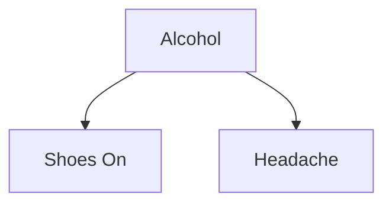

# 🎯 Day 63: Causal Inference & Uplift

> *"Correlation doesn't imply causation, but it sure is a hint." — Edward Tufte*

---

## The "Never-Coded" Bridge

**Imagine you notice that on days people buy more ice cream, there are more shark attacks.**

Does eating ice cream attract sharks? **No.**
Does getting bitten by a shark make you hungry for ice cream? **No.**

There is a **Confounder**: **Summer**.

* Hot weather causes ice cream sales.
* Hot weather causes people to swim in the ocean (where sharks live).

**Business Impact**:
If you ban ice cream to stop shark attacks, **you will fail**.
If you run a marketing campaign based on correlation ("People who buy diapers also buy beer"), you might waste millions if there's no causal link.

**Causal Inference** is the science of asking: "If I **change** X, will Y change?"
**Uplift Modeling** asks: "Who should I target so that my ad *causes* them to buy, instead of targeting people who would have bought anyway?"

---

## The Technical Deep Dive

### 1. The Ladder of Causation (Judea Pearl)

1. **Association (Seeing)**: "What if I see X?" (Correlation). ML usually stops here.
2. **Intervention (Doing)**: "What if I *do* X?" (A/B Testing).
3. **Counterfactuals (Imagining)**: "What if I *had done* X instead of Y?" (Causal Inference).

### 2. Simpson's Paradox

A famous statistical trap where a trend appears in different groups of data but **disappears or reverses** when these groups are combined.

| Treatment       | Small Stones              | Large Stones            | **Total**         |
| :-------------- | :------------------------ | :---------------------- | :---------------- |
| **Treatment A** | 93% Success (81/87)       | 73% Success (192/263)   | **78% (273/350)** |
| **Treatment B** | **87% Success** (234/270) | **69% Success** (55/80) | **83% (289/350)** |

* Treatment A is better for Small Stones.
* Treatment A is better for Large Stones.
* **But Treatment B looks better overall.** Why? Because B was used mostly on easy cases (Small Stones), while A was used on hard cases.

### 3. Uplift Modeling (The "Persuadables")

Traditional ML predicts: $P(\text{Buy} | \text{User})$.
Uplift ML predicts: $P(\text{Buy} | \text{Treat}) - P(\text{Buy} | \text{Control})$.

We categorize users into 4 quadrants:

1. **Persuadables**: Buy ONLY if treated. (**Target These!**)
2. **Sure Things**: Buy regardless of treatment. (Don't waste money.)
3. **Lost Causes**: Won't buy regardless. (Don't waste money.)
4. **Sleeping Dogs**: Buy if left alone, but LEAVE if treated. (**Avoid at all costs!**)

---

## Senior-Level Insights

### When A/B Testing Fails

A/B testing is the gold standard, but sometimes it's impossible:

* **Unethical**: "Does smoking cause cancer?" (You can't force 500 people to smoke).
* **Too Costly**: "Does this Super Bowl ad work?" (You can't show it to only half the world).
* **Historical Data**: You want to learn from *past* pricing changes, not run a new experiment.

This is where **Causal ML** (Econometrics, Instrumental Variables) shines.

### The "Sleeping Dog" Danger

One of the biggest ROI killers in marketing is sending emails to "Sleeping Dogs."

* **Scenario**: A customer is happily subscribed. You send a "rate us" email. They remember they're subscribed and realize they don't use the service. **They cancel.**
* Standard ML (Churn Prediction) would say: "This person is at high risk of churn, send them an email!"
* Uplift Modeling says: "Don't poke the bear."

---

## Hands-on Lab

### Exercise 1: Identifying Confounders

**Goal**: Draw a Causal Graph for a scenario.

**Scenario**: A study shows that "Sleeping with shoes on" is strongly correlated with "Waking up with a headache."

**Question**: Does one cause the other? Or is there a Confounder?

* *Hint*: What happens the night before?

```text
# Your Graph:
Alcohol -> Shoes on
Alcohol -> Headache
```



Alcohol is the confounder causally driving both observed variables, which is why "Shoes On" and "Headache" appear correlated despite neither causing the other.

**Task**: Define the variable `Z` (Confounder) in Python terms.

```python
# The hidden variable
def causal_mechanism(alcohol_consumed):
    shoes_on = False
    headache = False

    if alcohol_consumed > 5:
        shoes_on = True  # Too drunk to take them off
        headache = True  # Hangover

    return shoes_on, headache


# Simulation
print(causal_mechanism(6))
# Output: (True, True) -> Correlation looks perfect!
# But taking shoes off won't cure the headache.
```

---

### Exercise 2: Simpson's Paradox Challenge

**Goal**: Calculate the "Paradox" manually to prove aggregation can lie.

**Data**:

* **Hospital A**: Treated 100 mild cases (99 survived), 10 severe cases (5 survived).
* **Hospital B**: Treated 10 mild cases (9 survived), 100 severe cases (40 survived).

**Task**:

1. Calculate Survival Rate for Mild (A vs B).
2. Calculate Survival Rate for Severe (A vs B).
3. Calculate **Total** Survival Rate.

```python
# Hospital A
A_mild_surv = 99 / 100
A_severe_surv = 5 / 10
A_total_surv = (99 + 5) / (100 + 10)

# Hospital B
B_mild_surv = 9 / 10
B_severe_surv = 40 / 100
B_total_surv = (9 + 40) / (10 + 100)

print(f"Mild: A={A_mild_surv}, B={B_mild_surv}")
print(f"Severe: A={A_severe_surv}, B={B_severe_surv}")
print(f"Total: A={round(A_total_surv, 2)}, B={round(B_total_surv, 2)}")
```

**Expected Output**:

```text
Mild: A=0.99, B=0.9
Severe: A=0.5, B=0.4
Total: A=0.95, B=0.45
```

*Wait... A is better at Mild. A is better at Severe. But A's total is HIGHER? (0.95 vs 0.45).*
*Wait, logic check on Simpson's: Simpon's usually shows one looks better in subgroups but WORSE in total. Here A looks better in ALL.*
*Let's flip it to make it a paradox:*

* **Hospital A** (Specialist): 10 mild (10 survived), 100 severe (80 survived). Total: 90/110 = 81%.
* **Hospital B** (Local Clinic): 100 mild (95 survived), 10 severe (6 survived). Total: 101/110 = 91%.
* Comparison:
  * Mild: A=100%, B=95% (A wins).
  * Severe: A=80%, B=60% (A wins).
  * Total: A=81%, B=91% (B wins!).
* *Conclusion*: You would choose Hospital B based on total data, but you'd die if you had a severe case.

---

### Exercise 3: Calculating Uplift Score

**Goal**: Identify which customer to email.

**Data**:

* **Customer X**: 80% chance to buy if Emailed. 70% chance to buy if NOT Emailed.
* **Customer Y**: 20% chance to buy if Emailed. 5% chance to buy if NOT Emailed.
* **Customer Z**: 90% chance to buy if Emailed. 95% chance to buy if NOT Emailed (Sleeping Dog!).

**Task**: Calculate Uplift = $P(\text{Buy}|\text{Treat}) - P(\text{Buy}|\text{Control})$.

```python
def get_uplift(prob_treat, prob_ctrl):
    return prob_treat - prob_ctrl


# Customer X (Sure Thing / Persuadable mix)
uplift_X = get_uplift(0.80, 0.70)

# Customer Y (Persuadable)
uplift_Y = get_uplift(0.20, 0.05)

# Customer Z (Sleeping Dog)
uplift_Z = get_uplift(0.90, 0.95)

print(f"Customer X Uplift: {round(uplift_X, 2)}")
print(f"Customer Y Uplift: {round(uplift_Y, 2)}")
print(f"Customer Z Uplift: {round(uplift_Z, 2)}")
```

**Expected Output**:

```text
Customer X Uplift: 0.1
Customer Y Uplift: 0.15 (HIGHEST PRIORITY)
Customer Z Uplift: -0.05 (Do Not Contact)
```

*Notice: X has a higher probability of buying (80%), but Y has higher UPLIFT (15%). Marketing to Y generates more incremental value.*

---

## Translation Lab: Causal Findings to KPI Story

**Scenario**: Your uplift model shows positive treatment effect overall, but negative effect for one protected segment.

**Your task**:

1. Translate causal and fairness outputs (ATE/CATE + subgroup parity gap) into a business KPI narrative for revenue, retention, and brand trust.
2. Define BI metrics to track model degradation and bias over time (weekly uplift drift, subgroup conversion delta, intervention ROI by segment).
3. Draft dashboard tiles and escalation rules for non-technical stakeholders (e.g., pause campaign if subgroup harm exceeds threshold).
4. Write a one-page decision memo with technical evidence and a business recommendation.

---

## Mastery Check

### Question 1: Confounders

What is a Confounding Variable?
A) A variable that confuses the model.
B) A variable that causally influences both the Independent Variable (X) and Dependent Variable (Y).
C) A variable with missing data.
D) A variable that is perfectly correlated with Y.

<details>
<summary>Click for Answer</summary>

**Answer: B**
It creates a "backdoor path" of correlation that is not causal (e.g., Summer -> Ice Cream & Summer -> Shark Attacks).
</details>

### Question 2: Uplift Quadrants

Which group should you **AVOID** targeting in a marketing campaign?
A) Persuadables
B) Lost Causes
C) Sure Things
D) Sleeping Dogs

<details>
<summary>Click for Answer</summary>

**Answer: D**
Sleeping Dogs. Because the treatment (e.g., email) causes a NEGATIVE effect (churn) compared to doing nothing. Sure Things and Lost Causes are just waste of money, but Sleeping Dogs impose a penalty.
</details>

### Question 3: Simpson's Paradox

What causes Simpson's Paradox?
A) Bad math.
B) Unequal distribution of a confounding variable across groups (e.g., Severity of disease).
C) Small sample size.
D) Overfitting.

<details>
<summary>Click for Answer</summary>

**Answer: B**
When the groups have different compositions (e.g., Hospital A takes all the hard cases), the aggregated average is weighted biasedly.
</details>

### Question 4: Counterfactuals

A Counterfactual question asks:
A) What will happen next?
B) What is happening now?
C) What would have happened **IF** I had done something differently?
D) Why did this happen?

<details>
<summary>Click for Answer</summary>

**Answer: C**
"Counter to fact"—imagining an alternative reality.
</details>

### Question 5: ROI

Why is Uplift Modeling often better for ROI than Churn Prediction?
A) It is more accurate.
B) It focuses on *incremental* gain rather than just risk.
C) It uses deep learning.
D) It requires less data.

<details>
<summary>Click for Answer</summary>

**Answer: B**
Churn models target high-risk users (who might be Lost Causes). Uplift models target users where your action *changes the outcome*.
</details>

---

## Summary

Today you learned:

* ✅ **Correlation $\ne$ Causation**: Ice cream doesn't summon sharks.
* ✅ **Simpson's Paradox**: Aggregated data can reverse the truth.
* ✅ **Uplift Modeling**: Optimize for **incremental impact**, not just outcome probability.
* ✅ **The 4 Quadrants**: Focus on **Persuadables**, avoid **Sleeping Dogs**.

**Tomorrow**: We shift gears to **Modern NLP Pipelines** and how to process text at scale.

---

## Potential Outcomes Framework — Causal Foundations

Before running uplift models, you need to understand what you're actually estimating:

* **Potential outcomes**: For each unit, $Y_i(1)$ = outcome if treated, $Y_i(0)$ = outcome if not treated. We only *observe one* of these.
* **ATE (Average Treatment Effect)**: $E[Y(1) - Y(0)]$ — average causal effect across the whole population.
* **CATE (Conditional ATE)**: $E[Y(1) - Y(0) | X=x]$ — individual-level causal effect, which is what uplift models estimate.
* **Positivity/Overlap**: Every unit must have a nonzero probability of receiving either treatment. Violations cause extrapolation errors.
* **Ignorability (no unmeasured confounding)**: All confounders must be measured and included.
* **Confidence intervals**: Uplift scores are estimates with uncertainty. Never act on point estimates without confidence bands.

### Practical Estimators

| Method | When to Use | Key Requirement |
|:-------|:------------|:----------------|
| **Randomized Experiment (A/B test)** | Gold standard; whenever ethically and logistically feasible | Random assignment; sufficient sample size |
| **Regression Adjustment** | When confounders are measured and linear relationships hold | All confounders observed |
| **Propensity Score Matching** | Observational data; reduces confounding bias | Overlap assumption; all confounders observed |
| **Difference-in-Differences** | Before/after with control group | Parallel trends assumption |
| **Instrumental Variables** | When unmeasured confounders exist | Valid instrument available |
| **Uplift Models (S/T/X-learner)** | Heterogeneous treatment effects for targeting | Labeled treatment/control outcomes |

### Uplift Model Evaluation

Use **Qini curve** (uplift equivalent of ROC AUC) or **AUUC (Area Under Uplift Curve)** to rank targeting strategies. A random targeting baseline should show a diagonal line; a good model curves above it.

---

## Pitfalls in Causal Inference

> **Common errors that invalidate causal conclusions:**

* **Post-treatment variables**: Never include features measured *after* the treatment in your model — they may be outcomes themselves.
* **Selection bias**: If who receives treatment is not random and you didn't control for all selection factors, estimates are biased.
* **Interference (spillover)**: If treating one person affects another (social networks, household sharing), standard ATE formulas break.
* **Peeking**: Stopping an A/B test early because results "look significant" inflates Type I error rates by 2–3x.
* **Heterogeneous effects**: An average positive ATE can hide a negative CATE for a subgroup — always check subgroups.
* **Sleeping Dogs**: Correctly identified through uplift, not average-outcome models. A churn model that says "high risk → send email" will trigger Sleeping Dogs.

---

## Phase-Long Project Thread: RetailOps AI — Day 63 Milestone

Run an uplift analysis on the RetailOps promotional email campaign: segment customers into Persuadables, Sure Things, Lost Causes, and Sleeping Dogs using the causal framework. Estimate incremental revenue from targeting only Persuadables vs. the naive "target all high-purchase-probability" approach. Connect the causal model output to the monitoring KPIs defined in Day 67.

---

## Cross-References

| Related Lesson | Connection |
|:---------------|:-----------|
| Day 37B — Statistics Foundations | Hypothesis testing, p-values, and sample size calculations prerequisite for causal experiments |
| Day 50 — MLOps Fundamentals | Experiment tracking for A/B tests (logging treatment assignments and outcomes) |
| Day 62 — Model Interpretability & Fairness | SHAP attribution is correlational; causal inference goes further to ask what happens if we intervene |
| Day 67 — Model Monitoring & Reliability | Monitor causal model degradation: track uplift scores vs realized incremental conversions over time |

---

## Glossary

| Term | Definition |
|:-----|:-----------|
| **Confounder** | A variable that causally affects both the treatment assignment and the outcome, creating spurious correlation |
| **Counterfactual** | The hypothetical outcome for a unit under the treatment it did *not* receive |
| **Intervention** | An action that changes the value of a variable in the causal system (as opposed to merely observing it) |
| **ATE** | Average Treatment Effect — the mean causal effect of a treatment across the full population |
| **CATE** | Conditional Average Treatment Effect — the causal effect for a specific subgroup or individual |
| **Propensity Score** | The probability of receiving treatment given observed covariates — used to balance treatment and control groups |
| **Uplift** | The incremental effect of a treatment on an individual: P(outcome\|treated) − P(outcome\|not treated) |
| **Persuadable** | A person who buys only if treated — the ideal target for marketing interventions |
| **Sleeping Dog** | A person who would buy if left alone but churns or reacts negatively if contacted |
