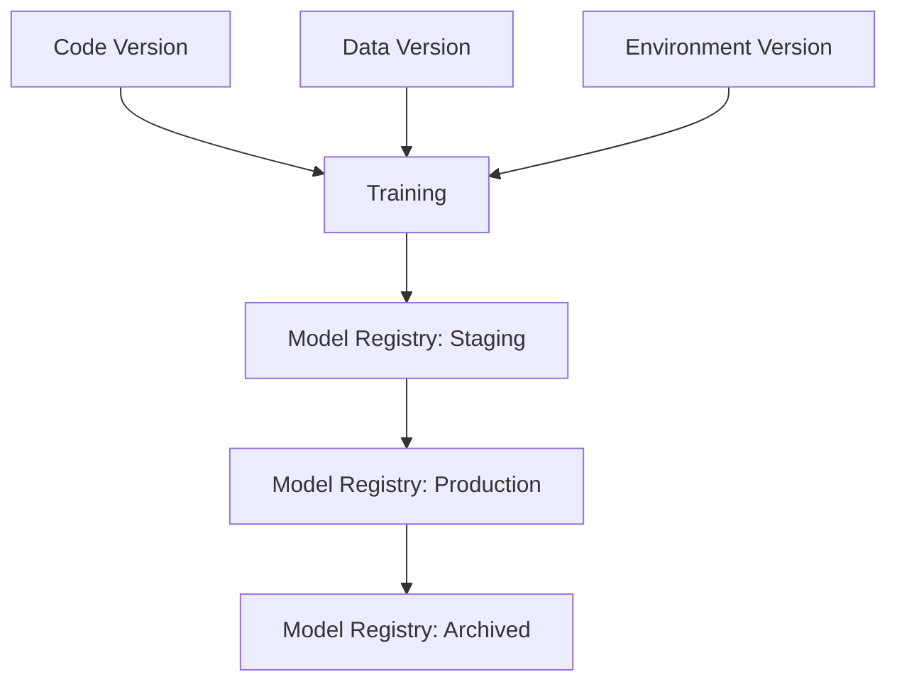

# 🎯 Day 65: MLOps Pipelines & CI

> *"It works on my machine" is not a valid production strategy.*

---

## The "Never-Coded" Bridge

**Cooking Dinner vs. Running a McDonald's Franchise.**

**Data Science (Cooking at Home):**

* You experiment with ingredients.
* You taste as you go.
* If you make a mess, you clean it up later.
* Goal: **One delicious meal.**

**MLOps (McDonald's Franchise):**

* The profound realization: **Consistency > Creativity.**
* Every burger must taste exactly the same in Tokyo and New York.
* Ingredients (Data) are checked for quality before they enter the kitchen.
* The recipe (Model) is version-locked.
* Goal: **1 Billion meals, zero surprises.**

**MLOps (Machine Learning Operations)** covers the transition from "It works in my notebook" to "It runs automatically every day for 10 million users without crashing."

---

## The Technical Deep Dive

### 1. The Hidden Technical Debt in ML Systems

Google published a famous paper: **"Machine Learning: The High-Interest Credit Card of Technical Debt."**

* **ML Code**: Only ~5% of the system.
* **The Rest**: Data collection, verification, resource management, serving infrastructure, monitoring.

### 2. The Three Pillars of MLOps Versioning

In standard software, you version Code (Git). In ML, you must version **three** things together:

1. **Code** (Git): The script that trains the model.
2. **Data** (DVC/Delta Lake): The exact dataset used (because data changes over time!).
3. **Environment** (Docker): The exact library versions (Pandas 1.1 vs 1.2 can break things).

If you miss one, you cannot reproduce your model.



Code, data, and environment versions all feed the training step, and the resulting model then moves through the registry's promotion stages.

### 3. CI/CD vs. CT (Continuous Training)

* **CI (Continuous Integration)**: Test code updates (Unit Tests).
* **CD (Continuous Delivery)**: Deploy the application.
* **CT (Continuous Training)**: Automatically retrain the model when data drifts (e.g., consumer behavior changes).

### 4. Experiment Tracking (e.g., MLflow)

Stop naming files `model_v1_final_final_REAL.pkl`.
Use a tracking server to log:

* **Parameters**: (Learning Rate=0.01, Max Depth=5)
* **Metrics**: (Accuracy=0.92, F1=0.88)
* **Artifacts**: The saved model file itself.

---

## Senior-Level Insights

### The "Training-Serving Skew"

This is the #1 silent killer of ML models.

* **Training**: You clean data using a batch script (Pandas).
* **Serving**: You clean data using a real-time API (Java/Go).
* **The Bug**: The logic differs slightly (e.g., how "Null" values are handled).
* **Result**: The model receives garbage input in production and predicts garbage.
* **Solution**: Use a **Feature Store** (one source of truth for feature logic).

### When only 10% of experiments succeed

In Software Engineering, if 90% of your commits fail tests, you're a bad engineer.
In Data Science, if 90% of your experiments fail (don't improve the model), **that's research**.

* **MLOps Challenge**: How do we enable rapid failure (Experimentation) without breaking Production?
* **Answer**: Strict separation of "Sandbox" (Dev) and "Production" environments.

---

## Hands-on Lab

### Exercise 1: Simulate MLflow Tracking

**Goal**: Write a script that "logs" an experiment run (simulated).

**Scenario**: You are testing different `n_estimators` for a Random Forest.

```python
import random

# Simulated MLflow database
experiment_log = []


def run_experiment(n_estimators, max_depth):
    # Simulate training (random accuracy for demo)
    accuracy = (
        0.80 + (n_estimators * 0.001) - (max_depth * 0.01) + random.uniform(-0.02, 0.02)
    )

    # Log the run
    run_data = {
        "params": {"n_estimators": n_estimators, "max_depth": max_depth},
        "metrics": {"accuracy": round(accuracy, 4)},
    }
    experiment_log.append(run_data)
    print(f"Run Logged: {run_data}")


# Run 3 experiments
run_experiment(100, 5)
run_experiment(200, 10)  # Maybe overfitting?
run_experiment(50, 3)

# Find best run
best_run = max(experiment_log, key=lambda x: x["metrics"]["accuracy"])
print(
    f"\n🏆 Best Run: {best_run['params']} with Accuracy: {best_run['metrics']['accuracy']}"
)
```

**Expected Output**:

```text
Run Logged: ...
Run Logged: ...
Run Logged: ...
🏆 Best Run: {'n_estimators': 100, 'max_depth': 5} with Accuracy: 0.89 (approx)
```

---

### Exercise 2: Data Validation (Great Expectations style)

**Goal**: Catch bad data *before* it breaks your training pipeline.

**Scenario**: Your training pipeline expects `age` to be between 0 and 120, and `income` to be non-negative.

```python
data_batch = [
    {"id": 1, "age": 25, "income": 50000},
    {"id": 2, "age": 150, "income": 0},  # Error: Age too high
    {"id": 3, "age": -5, "income": 10000},  # Error: Age negative
    {"id": 4, "age": 30, "income": -500},  # Error: Income negative
]


def validate_data(data):
    errors = []
    for row in data:
        # Check 1: Age
        if not (0 <= row["age"] <= 120):
            errors.append(f"Row {row['id']}: Invalid Age {row['age']}")

        # Check 2: Income
        if row["income"] < 0:
            errors.append(f"Row {row['id']}: Negative Income {row['income']}")

    if errors:
        print("❌ Validation Failed!")
        for e in errors:
            print(e)
    else:
        print("✅ Data Validated!")


validate_data(data_batch)
```

**Expected Output**:

```text
❌ Validation Failed!
Row 2: Invalid Age 150
Row 3: Invalid Age -5
Row 4: Negative Income -500
```

---

### Exercise 3: Defining a Model Signature

**Goal**: Explicitly define what your model accepts.

**Scenario**: Document the Input/Output schema for an API.

```python
# MLOps Best Practice: Type Hinting & Schema Definition
from typing import List, Dict


def predict_churn(features: Dict[str, float]) -> bool:
    """
    Accepts customer features and returns True if Churn is likely.

    Schema:
    - usage_minutes: float (must be >= 0)
    - contract_months: int (1, 12, or 24)
    """
    # Pseudo-model logic
    if features["usage_minutes"] < 10 and features["contract_months"] == 1:
        return True
    return False


# Test valid input
input_data = {"usage_minutes": 5.5, "contract_months": 1}
prediction = predict_churn(input_data)
print(f"Input: {input_data} -> Churn Probability: {prediction}")
```

**Expected Output**:

```text
Input: {'usage_minutes': 5.5, 'contract_months': 1} -> Churn Probability: True
```

---

## Translation Lab: CI/CD Signals to BI Controls

**Scenario**: Your CI pipeline starts failing data-validation checks intermittently after schema changes.

**Your task**:

1. Translate pipeline reliability and fairness test outputs into KPI narratives (release velocity, incident cost, customer-impact risk).
2. Define BI metrics for ongoing degradation/bias detection (failed fairness gate rate, retrain frequency, lead time to recovery).
3. Design dashboard requirements and escalation paths for engineering, product, and compliance stakeholders.
4. Deliver a one-page decision memo recommending deploy, rollback, or conditional release.

---

## Mastery Check

### Question 1: MLOps Definition

What differentiates MLOps from standard DevOps?
A) MLOps uses Python, DevOps uses Go.
B) MLOps manages Data and Models in addition to Code.
C) MLOps is only for deep learning.
D) There is no difference.

<details>
<summary>Click for Answer</summary>

**Answer: B**
The combination of Code + Data + Model creates complexity that standard DevOps doesn't address (e.g., data drift).
</details>

### Question 2: Experiment Tracking

Why should you log experiments programmatically?
A) To make the code look professional.
B) To remember which hyperparameters produced the best results 3 months ago.
C) To use more disk space.
D) To slow down training.

<details>
<summary>Click for Answer</summary>

**Answer: B**
Reproducibility is key. You will forget what "test_v2_final.py" actually did.
</details>

### Question 3: Skew

What is "Training-Serving Skew"?
A) When the model is trained on skew-symmetric matrices.
B) When the model takes too long to serve a request.
C) Differences between the training environment/data and the production serving environment/data.
D) When the user interface is crooked.

<details>
<summary>Click for Answer</summary>

**Answer: C**
This leads to models that perform well in the lab but fail in the real world.
</details>

### Question 4: Data Validation

When should you validate your data?
A) Never, trust the upstream team.
B) Only manually before the quarterly report.
C) Automatically, every time new data arrives (before training or serving).
D) After the model crashes.

<details>
<summary>Click for Answer</summary>

**Answer: C**
Automated data validation prevents "Garbage In, Garbage Out."
</details>

### Question 5: Feature Store

What is the primary purpose of a Feature Store?
A) To sell features to customers.
B) To store CSV files.
C) To serve the exact same feature values/logic to both Training and Inference to prevent skew.
D) To compress images.

<details>
<summary>Click for Answer</summary>

**Answer: C**
It acts as a single source of truth for feature engineering logic.
</details>

---

## Summary

Today you learned:

* ✅ **MLOps** brings discipline (CI/CD) to the chaos of Data Science.
* ✅ **Three-Pillar Versioning**: You must track Code, Data, and Environment to reproduce a model.
* ✅ **Experiment Tracking** saves your sanity by logging every run.
* ✅ **Data Validation** prevents your pipeline from silently failing on bad inputs.

**Tomorrow**: We discuss **Model Deployment & Serving**—how to actually put your model on the internet.

---

## A Minimal CI Pipeline for ML

The lesson's simulated MLflow tracking is a starting point. A production ML CI pipeline runs these checks on every commit before allowing promotion to staging:

```python
# ci_pipeline.py — a minimal ML CI check suite
import pytest
import numpy as np
from sklearn.linear_model import LogisticRegression
from sklearn.datasets import make_classification
from sklearn.model_selection import train_test_split

# --- Gate 1: Unit test on model class ---
def test_model_trains_and_predicts():
    X, y = make_classification(n_samples=200, random_state=42)
    X_train, X_test, y_train, y_test = train_test_split(X, y, random_state=42)
    model = LogisticRegression()
    model.fit(X_train, y_train)
    assert model.score(X_test, y_test) > 0.70, "Model accuracy below threshold"

# --- Gate 2: Data contract check ---
def test_data_contract(df):
    assert "age" in df.columns, "Required column 'age' missing"
    assert df["age"].between(0, 120).all(), "Age values out of valid range"
    assert df["income"].ge(0).all(), "Negative income values found"
    assert df.duplicated(subset="customer_id").sum() == 0, "Duplicate customer IDs"

# --- Gate 3: Performance regression gate ---
BASELINE_F1 = 0.82  # Set from last approved model version

def test_no_performance_regression(new_f1: float):
    assert new_f1 >= BASELINE_F1 * 0.98, (
        f"F1 {new_f1:.3f} is more than 2% below baseline {BASELINE_F1:.3f} — block promotion"
    )

# --- Gate 4: Fairness gate ---
def test_fairness_gate(mf_difference: dict):
    for metric, gap in mf_difference.items():
        assert abs(gap) < 0.05, (
            f"Fairness gap on '{metric}' is {gap:.3f} — exceeds 5% threshold, block release"
        )
```

**Promotion/failure rules:**
* Gates 1–2 (unit + data contract) → block merge if failing
* Gate 3 (performance regression) → block deployment to staging
* Gate 4 (fairness) → require compliance sign-off before production release

### Note on Illustrative Numbers

The lesson states "Only ~5%," "10% of experiments," and validation ranges. These are from the Google paper's *illustrative* framing. Your actual ratios depend on team size, data pipeline maturity, and experiment velocity. Track your own baselines; don't set targets from industry folklore.

---

## Senior-Level MLOps: Registry, Lineage, and Secrets

* **Model registry stages**: `Staging` → `Production` → `Archived`. Models should never be deployed by copying files; they must be promoted through the registry with an approval audit trail.
* **Lineage**: Every production model must have traceable provenance: which code commit, which data snapshot (DVC hash), which environment (Docker image SHA) produced it.
* **Rollback**: The registry should always retain the previous Production model so a one-click rollback is possible without retraining.
* **Secrets management**: Credentials (DB passwords, API keys) must come from a secrets manager (AWS Secrets Manager, HashiCorp Vault), never hardcoded or stored in the model artifact.
* **Cost controls**: Set maximum GPU hours per experiment run and a monthly budget alert; data scientists without guardrails can accidentally spend $10,000 overnight.

---

## Phase-Long Project Thread: RetailOps AI — Day 65 Milestone

Wire the inventory ordering model into an MLflow (or lightweight equivalent) tracking run. Log parameters (reorder threshold, batch size), metrics (fill rate, holding cost reduction), and the serialized model artifact. Add data validation checks for the demand forecast feed. Define the CI gates that must pass before the model is promoted to staging.

---

## Cross-References

| Related Lesson | Connection |
|:---------------|:-----------|
| Day 50 — MLOps Fundamentals (Phase 5) | Foundation concepts (experiment tracking, drift, feature stores) expanded here with CI/CD |
| Day 66 — Model Deployment & Serving | After the CI pipeline promotes a model, Day 66 covers how to serve it via API |
| Day 67 — Model Monitoring & Reliability | CT (continuous training) is triggered by monitoring signals from Day 67 |
| Day 69 — Responsible AI in Practice | Fairness gates in the CI pipeline connect to the governance framework from Day 69 |

---

## Glossary

| Term | Definition |
|:-----|:-----------|
| **CI (Continuous Integration)** | Automatically running tests on every code change to catch regressions early |
| **CD (Continuous Delivery)** | Automating deployment of validated artifacts to staging/production environments |
| **CT (Continuous Training)** | Automatically retraining models when data drift or performance degradation is detected |
| **Lineage** | Full traceable provenance of a model: code → data → environment → artifact |
| **Artifact** | A versioned output of an ML run: a trained model file, dataset, or evaluation report |
| **Model Registry** | A versioned store for trained models with stage labels (Staging, Production, Archived) |
| **Feature Store** | A system that serves the same feature transformation logic to both training and real-time inference |
| **Data Contract** | A schema agreement between data producers and consumers, enforced at pipeline boundaries |
| **Skew** | Differences between training-time and serving-time data distributions or feature logic |
| **Reproducibility** | The ability to re-run an experiment and get the same (or statistically equivalent) result |
