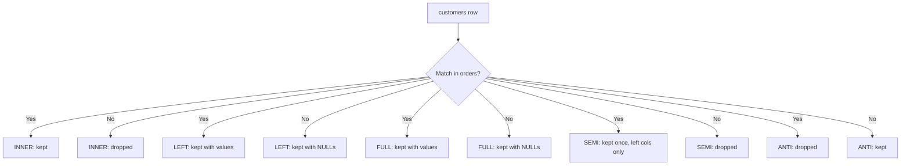

# 🎯 Day 100: Advanced Joins & Algorithms

> *"A Join is not magic. It's just two loops. If one loop is broken, the query dies."*

**Dialect note**: SQL and `EXPLAIN`/`SET enable_*` syntax in this lesson are **PostgreSQL 14+**. Result-shape semantics (which rows survive a LEFT JOIN, etc.) are standard SQL and apply across engines; the physical-algorithm names (`enable_hashjoin`, etc.) are Postgres-specific knobs — other engines expose similar controls under different names (e.g., SQL Server's join hints, MySQL's optimizer switches).

---

## 0. Logical Join Types: What Each One Actually Returns

Before tuning *how fast* a join runs, you need to be precise about *what rows it produces*. This section assumes nothing beyond basic `SELECT`/`WHERE`.

### Setup tables for this section

```sql
-- customers: 4 rows
-- id | name
--  1 | Alice
--  2 | Bob
--  3 | Carla
--  4 | Dan      <- no orders

-- orders: 4 rows
-- id | customer_id | amount
--  1 |     1        | 50
--  2 |     1        | 30
--  3 |     2        | 75
--  4 |     9        | 20    <- customer_id 9 does not exist in customers
```

| Join Type | Keyword | What survives | Venn-style intuition |
|---|---|---|---|
| **INNER JOIN** | `INNER JOIN` | Only rows where the join condition matches on *both* sides | Intersection only |
| **LEFT (OUTER) JOIN** | `LEFT JOIN` | Every row from the left table, matched columns from the right where available, else `NULL` | All of left + intersection |
| **RIGHT (OUTER) JOIN** | `RIGHT JOIN` | Every row from the right table, matched columns from the left where available, else `NULL` | All of right + intersection (mirror of LEFT) |
| **FULL OUTER JOIN** | `FULL JOIN` | Every row from both tables; unmatched rows from either side get `NULL`s for the other side's columns | Union of both circles |
| **CROSS JOIN** | `CROSS JOIN` | Every row from the left paired with every row from the right (no condition) | Cartesian product — not a Venn diagram, every pair exists |
| **SEMI JOIN** | `WHERE EXISTS (...)` | Rows from the left where *at least one* match exists on the right — but only left-table columns are returned, and a left row appears **at most once** even with multiple right-side matches | Left circle, restricted to the overlap, no duplication |
| **ANTI JOIN** | `WHERE NOT EXISTS (...)` | Rows from the left where **no** match exists on the right | Left circle, minus the overlap |
| **SELF JOIN** | any join type, same table twice with aliases | Whatever the join type's normal rules say, applied to a table joined against itself | Same rules, just both circles are the same table |

**Worked example — INNER JOIN** (`customers c INNER JOIN orders o ON c.id = o.customer_id`):

| name | amount |
|---|---|
| Alice | 50 |
| Alice | 30 |
| Bob | 75 |

Carla and Dan disappear (no matching orders); the orphaned order for nonexistent `customer_id = 9` also disappears. **3 rows.**

**Worked example — LEFT JOIN** (`customers c LEFT JOIN orders o ON c.id = o.customer_id`):

| name | amount |
|---|---|
| Alice | 50 |
| Alice | 30 |
| Bob | 75 |
| Carla | NULL |
| Dan | NULL |

Every customer appears at least once; Carla and Dan get `NULL` in `amount` since they have no orders. **5 rows.**

**Worked example — FULL OUTER JOIN**: all 5 rows above, **plus** a 6th row for the orphaned order (`customer_id = 9`, with `name = NULL`). **6 rows.**

**Worked example — SEMI JOIN** (`SELECT * FROM customers c WHERE EXISTS (SELECT 1 FROM orders o WHERE o.customer_id = c.id)`):

| name |
|---|
| Alice |
| Bob |

Alice appears **once**, even though she has 2 matching orders — `EXISTS` only asks "does a match exist?", it never multiplies rows. No `amount` column, because a semi-join only returns left-table columns by definition.

**Worked example — ANTI JOIN** (`SELECT * FROM customers c WHERE NOT EXISTS (SELECT 1 FROM orders o WHERE o.customer_id = c.id)`):

| name |
|---|
| Carla |
| Dan |

The customers with zero orders — the exact complement of the semi-join.



INNER and SEMI drop unmatched rows, LEFT/FULL preserve them with NULLs, and ANTI keeps only the rows that have no match at all.

### Decision guidance: which logical join do you need?

| Question you're asking | Join to use |
|---|---|
| "Rows present in both tables" | INNER JOIN |
| "All of table A, with table B's info where it exists" | LEFT JOIN |
| "All of table B, with table A's info where it exists" | RIGHT JOIN (or flip table order and use LEFT — equivalent, LEFT is more commonly used by convention) |
| "Everything from both, matched where possible" | FULL OUTER JOIN |
| "Every combination of A and B" (e.g., generating a calendar × product grid) | CROSS JOIN |
| "Rows in A that have at least one match in B — don't care how many, don't need B's columns" | SEMI JOIN (`EXISTS`) |
| "Rows in A that have **no** match in B" | ANTI JOIN (`NOT EXISTS`) |
| "Compare rows within the same table to each other" (hierarchies, duplicate detection, pairwise comparison) | SELF JOIN |

---

## The "Never-Coded" Bridge

**The Wedding Seating Chart**

**Goal**: Match Guests (Table A) to Seats (Table B). This is about *how* a JOIN finds its matches, after you've already decided you want an INNER JOIN (or whichever logical type).

1. **Nested Loop Join**:
    * Pick Guest 1. Walk every Seat. Is it for them? No.
    * Pick Guest 2. Walk every Seat.
    * *Result*: Extremely slow if you have 1,000 guests and 1,000 seats (up to 1M checks) — unless there's a fast way to "look up" the seat directly (an index), in which case it's actually the cheapest option.
2. **Hash Join**:
    * Build a lookup table of Guests, keyed by name (a Hash Table).
    * Walk each Seat card ("Reserved for Bob"). Look up "Bob" directly. Done.
    * *Result*: Very fast for large, unsorted lists — but needs enough memory to hold the lookup table.
3. **Merge Join**:
    * Sort Guests by name. Sort Seats by name.
    * Walk down both lists together: "Alice matches Alice." "Bob matches Bob."
    * *Result*: Fastest *if both lists are already sorted* (e.g., by primary key, or via an index) — otherwise the sorting itself costs time.

---

## The Technical Deep Dive

### 1. Join Algorithms (Physical Execution)

The optimizer chooses one of these for a given logical join, based on table statistics, available indexes, and memory — these are implementation details invisible to the SQL you write, but they explain *why* the same `JOIN ... ON` can be fast on one table and slow on another.

* **Nested Loop**: For every row of the "outer" input, scan (or index-probe) the "inner" input.
  * Good for: a small outer side joined to a large, *indexed* inner side (e.g., 10 rows joined to 1 million rows where the join column is indexed).
  * Bad for: two large, unindexed inputs — cost grows roughly with the product of both sizes.
* **Hash Join**: Build an in-memory hash table from the smaller input (the "build" side), then probe it once per row of the larger input (the "probe" side).
  * Good for: equi-joins (`ON a.id = b.id`) on large, unsorted tables.
  * Memory: the hash table must fit in `work_mem`. If it doesn't, Postgres spills batches to disk, which is much slower than an in-memory hash join (see Pitfalls).
* **Merge Join**: Requires both inputs sorted on the join key (either via an index or an explicit `Sort` node in the plan).
  * Good for: tables already sorted by the join key, e.g., joining on a primary key with a supporting index on both sides.
  * If neither side is pre-sorted, the plan inserts `Sort` nodes first — at that point a Hash Join is frequently cheaper unless the data is needed in sorted order downstream anyway.

### 2. Skewed Joins — Correcting the NULL Myth

**A common but incorrect claim**: "Hash Join puts all NULLs into one bucket, so NULLs cause a slow join." This conflates two *different* things.

**What's actually true about NULLs in standard SQL equi-joins**: `NULL = NULL` evaluates to `UNKNOWN`, never `TRUE`, in standard SQL three-valued logic (Day 101 covers this in depth). This means **rows with a NULL join-key value never match anything in a standard equi-join** — not the matching row, not even another NULL on the other side. So if `orders.user_id` is NULL for guest checkouts, those rows simply **disappear from an INNER JOIN's output** entirely; they don't slow down the matching process by colliding with anything, because they never participate in a match at all.

**What's actually true about hash buckets and skew**: A Hash Join's build phase computes a hash of the join key and places each row into one of a fixed number of in-memory buckets. *If many rows share the same key value* — NULL or otherwise — they all hash to the *same bucket*. When the probe phase processes that bucket, it must compare the probe row against every row in that bucket. A bucket holding 90% of one side's rows turns an expected near-constant-time lookup into a near-linear scan for every probe against that bucket — that's the real performance problem, and it is a property of **any heavily duplicated key value**, not something special about NULL. (And again: NULL keys never actually produce a *match*, so a bucket full of NULLs causes wasted hashing/bucketing work, not wasted *comparison* work in the final match step — the rows still all return UNKNOWN and get filtered.)

**Distinguish from other kinds of "skew" you'll hear about**:
* **This lesson's skew** = an imbalanced hash bucket on a single-node engine like Postgres, caused by a duplicated key value.
* **Distributed-system partition skew** (Spark, BigQuery, Snowflake) = one worker node ends up doing disproportionately more work than others because the data wasn't evenly distributable across the cluster by the chosen key — a related but architecturally different problem, since it's about *cross-machine* load balance, not in-process bucket comparisons.
* **Engine-specific hash behavior**: exactly how NULLs and duplicates are bucketed, and whether a given engine special-cases NULL keys at all (some engines skip hashing NULL keys entirely, since they can never match in an equi-join), varies by implementation.

* **Practical fix for either flavor**: `WHERE user_id IS NOT NULL` before the join removes rows that can never match anyway, reducing wasted hashing/bucketing work — this is a legitimate optimization, just not because NULLs were "matching wrongly."

### 3. Cross Join (Generating Data)

Useful for "filling gaps" in reports — see the completed lab exercise below for the full pattern.

* **Report need**: "Show sales for every day of January, including days with zero sales."
* **Problem**: A plain query against the `sales` table only returns rows for days that *had* sales — missing days are invisible, not zero.
* **Fix**: `CROSS JOIN` a generated date series against the dimension table (e.g., products), then `LEFT JOIN` the real sales data onto that complete grid, then `COALESCE` missing values to 0.

---

## Senior-Level Insights

### "Broadcasting" (Distributed Joins)

* **In Spark/BigQuery/Snowflake**: joining a 10TB `transactions` table to a 50-row `state_names` lookup table.
* **Shuffle Join**: redistribute (shuffle) both tables across the cluster by join key so matching rows land on the same worker. Expensive when one side is huge.
* **Broadcast Join**: copy the tiny 50-row table to *every* worker node; each worker joins its local slice of the big table against the full small table with no network shuffle needed for the big side.
* **Result**: often 10-100x faster for small-to-large joins — but only because one side is small enough to copy cheaply; broadcasting a large table would be the opposite of helpful.

### The "Cartesian Explosion"

* **Query**: `SELECT * FROM A, B` (no join condition) or `SELECT * FROM A CROSS JOIN B`.
* **Result**: A has 100 rows, B has 100 rows → result has 10,000 rows (every pair).
* **Risk**: A has 1M rows, B has 1M rows → 1 trillion rows. This is rarely intentional; it's usually a forgotten `ON`/`WHERE` clause after a comma-join.

---

## Hands-on Lab

### Setup: Schema and Seed Data

**Dialect: PostgreSQL 14+.**

```sql
DROP TABLE IF EXISTS sales, products, users;

CREATE TABLE products (
    id    SERIAL PRIMARY KEY,
    name  TEXT NOT NULL
);

CREATE TABLE sales (
    id          SERIAL PRIMARY KEY,
    product_id  INTEGER REFERENCES products(id),
    sale_date   DATE NOT NULL,
    amount      NUMERIC(10,2) NOT NULL
);

CREATE TABLE users (
    id     SERIAL PRIMARY KEY,
    name   TEXT NOT NULL,
    email  TEXT NOT NULL
);

INSERT INTO products (name) VALUES ('Widget'), ('Gadget'), ('Gizmo');

-- Deliberately sparse: only a few (product, date) combinations have sales
-- so most of the calendar x product grid will need COALESCE(amount, 0)
INSERT INTO sales (product_id, sale_date, amount) VALUES
    (1, '2024-01-01', 100.00),
    (1, '2024-01-03', 50.00),
    (2, '2024-01-02', 75.00),
    (3, '2024-01-01', 20.00);
-- Note: Widget has no sale on Jan 2; Gadget has no sale on Jan 1 or 3; Gizmo has no sale on Jan 2 or 3.

INSERT INTO users (name, email) VALUES
    ('Alice', 'alice@example.com'),
    ('Bob', 'bob@example.com'),
    ('Carla', 'alice@example.com'),  -- duplicate email, different person (data quality issue)
    ('Dan', 'dan@example.com');

ANALYZE products;
ANALYZE sales;
ANALYZE users;
```

### Exercise 1: Generating a Calendar (Cross Join) — Completed Zero-Sales Report

**Goal**: Show every (date, product) combination for Jan 1-3, 2024, with `0.00` where there was no sale — finishing what the original lesson left incomplete.

```sql
WITH calendar AS (
    SELECT generate_series(
        '2024-01-01'::date,
        '2024-01-03'::date,
        '1 day'::interval
    )::date AS sale_date
)
SELECT
    c.sale_date,
    p.name AS product_name,
    COALESCE(s.amount, 0.00) AS amount
FROM calendar c
CROSS JOIN products p
LEFT JOIN sales s
    ON s.product_id = p.id AND s.sale_date = c.sale_date
ORDER BY c.sale_date, p.name;
```

**Exact expected result (9 rows — 3 days x 3 products):**

| sale_date | product_name | amount |
|---|---|---|
| 2024-01-01 | Gadget | 0.00 |
| 2024-01-01 | Gizmo | 20.00 |
| 2024-01-01 | Widget | 100.00 |
| 2024-01-02 | Gadget | 75.00 |
| 2024-01-02 | Gizmo | 0.00 |
| 2024-01-02 | Widget | 0.00 |
| 2024-01-03 | Gadget | 0.00 |
| 2024-01-03 | Gizmo | 0.00 |
| 2024-01-03 | Widget | 50.00 |

**Zero-sales rows specifically** (`WHERE amount = 0`, 6 rows): Gadget on Jan 1 and Jan 3; Gizmo on Jan 2 and Jan 3; Widget on Jan 2. Trace each against the seed data above to confirm.

**Plan/timing comparison step**: Run `EXPLAIN ANALYZE` on this query. You should see a `Nested Loop` (for the `CROSS JOIN`, since `calendar` is tiny — 3 rows from `generate_series` — and `products` is tiny) feeding into a `Hash Left Join` or `Nested Loop Left Join` against `sales`. With only 3 products and 3 days, the planner has so little data to work with that algorithm choice barely matters here; re-run this same query pattern against 365 days × 1,000 products (365,000 grid rows) to see the planner switch strategy as the grid size grows — this is the same `EXPLAIN`-reading skill from Day 99 applied to a join-heavy query.

### Exercise 2: Self Join — Finding Duplicate Emails

```sql
SELECT u1.name AS person_a, u2.name AS person_b, u1.email
FROM users u1
JOIN users u2
    ON u1.email = u2.email   -- same table, two aliases, matched on the column we're checking for duplicates
WHERE u1.id < u2.id;          -- explained below
```

**Line-by-line**:
* `users u1` / `users u2`: the *same table*, given two different aliases so the database (and we) can refer to "this copy" vs. "that copy" of a row independently. Without aliases, `users JOIN users ON email = email` would be ambiguous — which `users.email`?
* `ON u1.email = u2.email`: the join condition — find every pair of rows (including a row paired with itself) that share an email value.
* `WHERE u1.id < u2.id`: **why this specific condition, and not `!=`**. Without any filter, every row matches itself (`u1.id = u2.id`, since `email = email` is trivially true) — useless self-matches. Using `u1.id != u2.id` removes self-matches but still returns **both directions** of every real pair: `(Alice, Carla)` *and* `(Carla, Alice)` — the same duplicate reported twice. `u1.id < u2.id` keeps only one direction (the one where the first id is numerically smaller), which both eliminates self-matches (a row's id is never less than itself) and eliminates the redundant mirror pair.

**Expected result** (1 row, given the seed data above — Alice and Carla share `alice@example.com`):

| person_a | person_b | email |
|---|---|---|
| Alice | Carla | alice@example.com |

### Exercise 3: Plan-Forcing as a Diagnostic Tool (Not a Production Fix)

**Goal**: Observe how the optimizer's choice changes when an algorithm is disabled — strictly to *understand* the plan space, never to leave in production.

```sql
EXPLAIN ANALYZE
SELECT s.sale_date, p.name, s.amount
FROM sales s JOIN products p ON s.product_id = p.id;
-- Note the chosen algorithm (likely Hash Join, given products is tiny).

SET enable_hashjoin = OFF;

EXPLAIN ANALYZE
SELECT s.sale_date, p.name, s.amount
FROM sales s JOIN products p ON s.product_id = p.id;
-- Observe: does it switch to Merge Join or Nested Loop? Compare cost= and actual time.

RESET enable_hashjoin;  -- ALWAYS reset; never leave this off after debugging (see Pitfalls)
```

**Why this is diagnostic-only**: `enable_hashjoin = OFF` doesn't make Hash Join "wrong" for this query — it forces the planner to use a *worse* option so you can see, by comparison, how much better the original choice was. It's a controlled experiment for understanding the plan space, identical in spirit to covering one eye to test the other — never a setting you'd leave on for real traffic, because it permanently removes one of the optimizer's tools for *every* query on that connection/session until reset.

---

## Decision Guidance: Logical Join Type x Physical Algorithm

| Logical Join | Typical Physical Algorithm | Ordering Requirement | Indexes Help? | Memory Need | Data Scale Fit | Output Row Rule |
|---|---|---|---|---|---|---|
| INNER | Hash (unsorted, large) or Nested Loop (small-to-indexed-large) or Merge (pre-sorted) | None for Hash/Nested Loop; sorted input for Merge | Yes for Nested Loop's inner side; yes for Merge's sort avoidance | Hash needs `work_mem` for build side | Hash/Merge scale best; Nested Loop only for small outer side | Drops unmatched rows from both sides |
| LEFT/RIGHT OUTER | Hash Left Join or Nested Loop Left Join | Same as INNER | Same as INNER | Same as INNER | Same as INNER | Preserves every row from the "preserved" side; NULLs for unmatched other side |
| FULL OUTER | Usually Hash Full Join or Merge Full Join | Merge needs sorted input | Helps Merge variant | Hash needs build-side memory | Less common at huge scale; often Merge | Preserves rows from both sides |
| CROSS | Nested Loop (no condition to hash or sort on) | None | No | Minimal per pair, but total output can be huge | Only safe for small x small | Every combination — no rows dropped, none "matched" |
| SEMI (`EXISTS`) | Often a Hash Semi Join or Nested Loop Semi Join — optimizer-chosen | None required | Yes, on the inner (existence-check) side | Lower than full join — short-circuits per row | Scales well; avoids fanout entirely | Left rows only, each at most once |
| ANTI (`NOT EXISTS`) | Hash Anti Join or Nested Loop Anti Join | None required | Yes, on the inner side | Similar to Semi | Scales well | Left rows with zero matches, each at most once |
| SELF | Whatever the chosen logical type's algorithm is, applied to the same table twice | Depends on logical type | Yes, same as any join on the join column | Same as the underlying type | Same as the underlying type | Same as the underlying type |

---

## Pitfalls

* **Many-to-many fanout**: Joining two tables that both have multiple rows per key multiplies output rows. If `orders` has 3 rows for `customer_id = 1` and `order_items` has 4 line-items per order, joining them directly produces `3 x average-items-per-order` rows per customer — easy to accidentally double-count revenue if you then `SUM()` without first aggregating one side.
* **Duplicate join keys**: Even a one-to-many join can surprise you if you expected one-to-one. Always check `SELECT key, COUNT(*) FROM table GROUP BY key HAVING COUNT(*) > 1` on a join column before assuming uniqueness.
* **A filter on the "nullable" side silently turning a LEFT JOIN into an INNER JOIN**: This is one of the most common production bugs.

  ```sql
  -- INTENDED: all customers, with their orders if any
  SELECT c.name, o.amount
  FROM customers c
  LEFT JOIN orders o ON c.id = o.customer_id
  WHERE o.amount > 10;   -- BUG: filters out customers with no orders (amount IS NULL fails this test)
  ```

  Because unmatched rows get `NULL` for every `orders` column, and `NULL > 10` evaluates to `UNKNOWN` (never `TRUE`), the `WHERE` clause silently discards every customer who had no matching order — exactly the rows a LEFT JOIN was supposed to preserve. **Fix**: move the condition into the `JOIN ... ON` clause (`LEFT JOIN orders o ON c.id = o.customer_id AND o.amount > 10`) so it's applied *during* matching, not after, preserving unmatched left rows with NULLs.
* **Join-order effects on planner choices**: The order tables appear in your SQL doesn't dictate execution order — the optimizer reorders joins based on statistics — but for very large multi-way joins (more than ~8-12 tables by default in Postgres, controlled by `join_collapse_limit`), the planner may not exhaustively search every possible order, and your written order can subtly bias the search space it considers.
* **Hash-join spills to disk**: If the build-side hash table exceeds `work_mem`, Postgres spills batches to temporary disk files. The plan will show `Disk Usage` in `EXPLAIN (ANALYZE, BUFFERS)` output for the `Hash` node when this happens — a strong signal to either raise `work_mem` for the session or reduce the build side's row width/count.
* **Disabled planner settings left on accidentally**: After running `SET enable_hashjoin = OFF;` for diagnosis (Exercise 3), forgetting to `RESET enable_hashjoin;` (or close the session) leaves *every subsequent query on that connection* unable to use Hash Joins — a quiet, hard-to-diagnose performance regression that has nothing to do with the query someone is currently complaining about. Always pair a diagnostic `SET` with an immediate `RESET` in the same script/transaction.

---

## Glossary

| Term | Definition |
|---|---|
| **Equi-join** | A join whose condition uses equality (`=`) between columns — the most common case, and the only kind a Hash Join algorithm can directly support. |
| **Nested Loop** | A join algorithm that, for each row of one input, scans or index-probes the other input. |
| **Hash Join** | A join algorithm that builds an in-memory hash table from one input, then probes it once per row of the other input. |
| **Merge Join** | A join algorithm that walks two pre-sorted inputs in parallel, advancing whichever side has the smaller current key. |
| **Skew** | An imbalance in how rows are distributed across hash buckets (single-node) or worker partitions (distributed systems), caused by a small number of key values having disproportionately many rows. |
| **Broadcast** | Copying a small table's full contents to every worker node in a distributed join, avoiding a network shuffle for the large side. |
| **Shuffle** | Redistributing data across worker nodes by join key so matching rows land together, used in distributed joins when no side is small enough to broadcast. |
| **Fanout** | The multiplication of output rows that occurs when joining tables with a one-to-many or many-to-many relationship. |
| **Cartesian Product** | The result of pairing every row of one table with every row of another, with no matching condition — produced intentionally by `CROSS JOIN` or accidentally by a missing `ON`/`WHERE` clause. |

---

## Mastery Check

### Question 1: LEFT JOIN result shape

A LEFT JOIN between `customers` (4 rows) and `orders` (4 rows, one of which references a nonexistent customer) on `customers.id = orders.customer_id` returns how many rows, if 1 customer has 2 orders, 1 customer has 1 order, and 2 customers have 0 orders?

A) 4 rows (one per customer).
B) 5 rows: every customer at least once, with the 2-order customer appearing twice and the 0-order customers appearing once each with NULLs.
C) 8 rows (Cartesian product).
D) 1 row (only the perfect matches).

<details>
<summary>Click for Answer</summary>

**Answer: B**
LEFT JOIN preserves every row from the left table at least once. A customer with 2 matching orders appears twice (once per match); customers with zero matches appear once, with NULLs in the right table's columns. The orphaned order (referencing a nonexistent customer) does not appear at all in a LEFT JOIN from customers.
</details>

### Question 2: NULL hash-join myth

Why is "Hash Join puts all NULLs into one bucket, causing slow matches" misleading as stated?

A) It's completely false; NULLs are never placed in hash buckets at all.
B) NULL join-key rows never match anything in a standard equi-join (NULL = NULL is UNKNOWN, not TRUE), so the real issue with a bucket of duplicated keys -- NULL or otherwise -- is wasted bucketing/comparison work, not an actual incorrect match.
C) NULLs always cause an error in a Hash Join.
D) It's entirely accurate as originally stated.

<details>
<summary>Click for Answer</summary>

**Answer: B**
The myth conflates "NULLs hash to the same bucket" (true, and true of any duplicated key value) with "NULLs match each other in the join" (false -- NULL = NULL is UNKNOWN). The real skew problem is any heavily duplicated key value creating an imbalanced bucket, not something NULL-specific.
</details>

### Question 3: Self-join deduplication

In `SELECT u1.name, u2.name FROM users u1 JOIN users u2 ON u1.email = u2.email WHERE u1.id < u2.id`, why use `<` instead of `!=`?

A) `<` and `!=` behave identically here.
B) `!=` would return each duplicate pair twice (both orderings) and `<` keeps only one direction, while also excluding a row matching itself.
C) `<` is required syntax for self-joins.
D) `!=` would cause a syntax error.

<details>
<summary>Click for Answer</summary>

**Answer: B**
Without any filter, every row trivially matches itself. `u1.id != u2.id` removes self-matches but still returns both (A,B) and (B,A) for every real duplicate pair. `u1.id < u2.id` returns only one canonical ordering per pair.
</details>

### Question 4: Hash Join memory

What happens when a Hash Join's build-side hash table exceeds `work_mem`?

A) The query fails with an out-of-memory error.
B) Postgres spills batches of the hash table to temporary disk files, which is markedly slower than an in-memory hash join.
C) The database automatically switches to a Merge Join instead.
D) Nothing; work_mem is only a soft suggestion with no effect.

<details>
<summary>Click for Answer</summary>

**Answer: B**
Hash Joins need the build side to fit in work_mem for best performance. When it doesn't, Postgres spills to disk in batches -- visible as "Disk Usage" in EXPLAIN (ANALYZE, BUFFERS) output -- which is a strong signal to tune work_mem or reduce the build side.
</details>

### Question 5: LEFT JOIN turning into INNER JOIN

A query does `customers c LEFT JOIN orders o ON c.id = o.customer_id WHERE o.amount > 10`. Why does this silently exclude customers with zero orders, defeating the purpose of the LEFT JOIN?

A) LEFT JOIN syntax is broken in this case.
B) Unmatched rows get NULL for o.amount, and `NULL > 10` evaluates to UNKNOWN, which WHERE treats as false -- discarding exactly the rows LEFT JOIN was meant to preserve.
C) `WHERE` cannot be used after a `LEFT JOIN`.
D) `o.amount > 10` should be written as `o.amount >= 10`.

<details>
<summary>Click for Answer</summary>

**Answer: B**
A condition on the nullable (right) side's column, placed in WHERE, runs after the join and filters out the very NULL-filled rows the LEFT JOIN preserved. Moving the condition into the JOIN...ON clause applies it during matching, preserving unmatched left rows.
</details>

### Question 6: Plan-forcing as a technique

Why is `SET enable_hashjoin = OFF` described as diagnostic-only, never a production fix?

A) It doesn't actually change anything.
B) It permanently disables a planner option for every query on that session until reset, which is useful for controlled comparison but harmful if forgotten -- it can silently degrade unrelated future queries.
C) It can only be run by a database administrator.
D) It is deprecated and no longer functions in Postgres 14+.

<details>
<summary>Click for Answer</summary>

**Answer: B**
Disabling an algorithm forces the optimizer to use a worse option for comparison purposes. Left enabled, it removes a tool from the optimizer for every subsequent query on that connection -- a classic "forgot to reset after debugging" production incident.
</details>

### Question 7: SEMI join row count

`SELECT * FROM customers c WHERE EXISTS (SELECT 1 FROM orders o WHERE o.customer_id = c.id)` is run against a customer with 5 matching orders. How many rows does that customer produce?

A) 5 rows, one per matching order.
B) 1 row -- EXISTS only checks whether a match exists; it never multiplies rows like a JOIN would.
C) 0 rows, because EXISTS requires exactly one match.
D) An error, because EXISTS cannot be used in WHERE.

<details>
<summary>Click for Answer</summary>

**Answer: B**
A semi-join (EXISTS) answers a yes/no question per left row. Regardless of how many right-side rows match, the left row appears at most once and only left-table columns are returned -- this is the key semantic difference from an INNER JOIN, which would fan out to 5 rows.
</details>

### Question 8: Cartesian explosion

`SELECT * FROM A, B` is run where A has 2,000 rows and B has 3,000 rows, with no WHERE/ON condition. How many rows does it produce, and why?

A) 5,000 rows (sum of both tables).
B) 6,000,000 rows (2,000 x 3,000) -- a comma-join with no condition is a Cartesian product, pairing every row of A with every row of B.
C) 0 rows, since there's no join condition.
D) 3,000 rows (the larger table's size).

<details>
<summary>Click for Answer</summary>

**Answer: B**
Without an ON/WHERE condition, a comma-separated FROM list (or an explicit CROSS JOIN) produces every possible pairing -- the product of both row counts. This is the most common accidental performance disaster in SQL: a forgotten join condition.
</details>

---

## Summary

Today you learned:

* ✅ **Logical join types**: INNER, LEFT, RIGHT, FULL, CROSS, SEMI, ANTI, SELF — each with a distinct, precise result shape.
* ✅ **Algorithms**: Nested Loop (small/indexed), Hash (unsorted large), Merge (pre-sorted) — chosen by the optimizer, not by you.
* ✅ **Skew, corrected**: NULLs never match in equi-joins; the real skew risk is *any* duplicated key value overloading a hash bucket.
* ✅ **Cross Join**: Not just a mistake — a deliberate tool for data densification (calendars, complete grids).
* ✅ **Broadcast**: The distributed-systems version of a Hash Join's build side.
* ✅ **Pitfalls**: Fanout, the LEFT-JOIN-becomes-INNER-JOIN filter bug, and forgetting to `RESET` a diagnostic planner setting.

**Tomorrow**: We nest logic deeply with **Advanced Subqueries** (Day 101) — building directly on today's JOIN semantics and yesterday's `EXPLAIN ANALYZE` skills.
