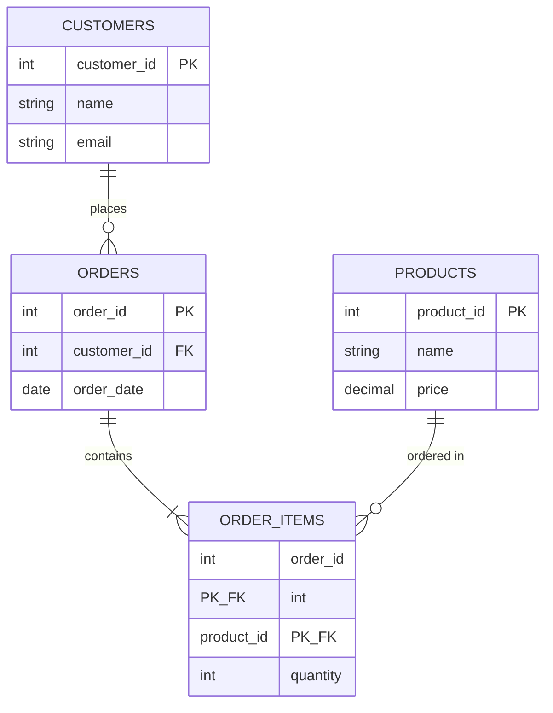

# 🎯 Day 96: Relational Database Internals

> *"The Database is the only component in your stack that cannot be stateless. Respect the physics of disk I/O."*

---

## Read This First: Why This Lesson Comes Before Days 90–95

**This is the foundational lesson of Phase 8.** If you have already worked through Days 90–95 (Advanced SQL Patterns, Cloud Architecture, Data Governance, and the two Capstone days), you used transactions, locking, partitioning, and concurrency-sensitive schema design without first learning *why* those things behave the way they do. That is fine — it is not unusual to meet advanced techniques before their underlying theory — but you should treat this lesson as backfilling the internals that explain:

- Why your capstone's `trips` table didn't corrupt under concurrent writes (MVCC).
- Why the governance lesson's `SELECT` policies didn't block writers (readers vs. writers, isolation).
- Why a crashed load during the capstone didn't leave half-written rows (WAL, atomicity).
- Why "the query worked yesterday but blocked today" is usually a locking, not a logic, problem.

**Forward links — read this lesson now, then revisit or continue to:**

- **[Day 92 — Data Governance](../Day_92_Data_Governance/README.md):** Row-level security and audit logging both depend on understanding MVCC snapshots and transaction visibility — a writer's uncommitted change is invisible to a reader's snapshot, which is exactly the mechanism RLS policies ride on top of.
- **[Day 93 — Capstone Part 1: Design](../Day_93_Capstone_Part_1/README.md)** and **[Day 94 — Capstone Part 2: Implementation](../Day_94_Capstone_Part_2/README.md):** Your schema and concurrency choices (lock ordering, isolation level, retry logic) are direct applications of the ACID/MVCC/deadlock material below.
- **[Day 98 — Advanced DML & Upserts](../Day_98_Data_Manipulation_Language/README.md):** Upserts, savepoints, and modifying CTEs are all transaction-boundary mechanics — this lesson explains what a transaction boundary *is* at the storage-engine level.
- **[Day 99 — Advanced DQL & Optimization](../Day_99_Data_Query_Language/README.md):** Query plans interact directly with MVCC visibility (index-only scans need the visibility map) and with locks (long-running analytical queries can block VACUUM, covered below).

If you have **not** yet done Days 90–95, no backfilling needed — just continue in order and you'll meet those lessons with the right foundation already in place.

---

## The "Never-Coded" Bridge

**The Bank Vault (ACID)**

1. **Atomicity**: You transfer $100 to Mom.
    * *Scenario*: Only $50 leaves your account before the power dies.
    * *Result*: The vault locks down. The $50 is put back. **All or Nothing**.
2. **Consistency**: You cannot transfer money you don't have. (Constraint: Balance >= 0).
3. **Isolation**: While you are transferring, the ATM can't check your balance and see "Half-Transferred" money.
4. **Durability**: Once the receipt prints, even if the bank burns down, your money is safe (on a hard drive in a bunker).

**MVCC (The Snapshot)**:

* Imagine the bank takes a **Photo** of the vault when you walk in.
* You act on the Photo.
* Even if someone else changes the vault *while* you are there, your photo doesn't change.
* *Result*: **Readers (You) don't block Writers (Them).**

---

## Part 1: Normalization — The Foundation Beneath ACID

Before internals make sense, you need to know what shape a "correct" relational schema is supposed to have. Normalization is the discipline of structuring tables so that each fact is stored exactly once, which is what makes atomic, consistent updates possible in the first place.

### The Worked Example: A Denormalized Orders Table

Imagine a spreadsheet-style table a junior analyst built:

```
orders_unnormalized
| order_id | customer_name | customer_email      | product_name | product_price | quantity | order_date |
|----------|----------------|----------------------|---------------|----------------|----------|------------|
| 1        | Asha Rao       | asha@acme.com        | Widget        | 9.99           | 2        | 2024-01-05 |
| 2        | Asha Rao       | asha@acme.com        | Gadget        | 19.99          | 1        | 2024-01-07 |
| 3        | Ben Liu        | ben@acme.com         | Widget        | 9.99           | 5        | 2024-01-08 |
```

**1NF (First Normal Form): atomic values, no repeating groups.**
This table is already in 1NF — every cell holds one value (no comma-separated product lists). The violation here is more subtle: there is no single-column primary key that uniquely and minimally identifies a row's *facts* (see 2NF below). If a row had stored `"Widget, Gadget"` in one cell, it would violate 1NF — fix by giving each product its own row, which is what the table above already does.

**2NF (Second Normal Form): no partial dependency on part of a composite key.**
Not yet a problem here since the key is just `order_id`, but it becomes relevant once we add an `order_items` table keyed on `(order_id, product_id)`: `product_price` depends only on `product_id`, not on the full composite key — that is a 2NF violation, fixed by moving `product_price` to a `products` table.

**3NF (Third Normal Form): no transitive dependency — non-key columns must depend on the key, the whole key, and nothing but the key.**
`customer_email` depends on `customer_name`, not on `order_id` directly — `customer_name` is a non-key column, and `customer_email` is *transitively* dependent on the key through it. This is the violation that matters most in our example: if Asha's email changes, you must update it in every row where she appears (rows 1 and 2), and if you miss one, you now have two different emails for the same customer — an inconsistency that cannot exist in a properly normalized schema.

### After Normalization (3NF)

```sql
-- Dialect: PostgreSQL 14+

CREATE TABLE customers (
    customer_id   SERIAL PRIMARY KEY,
    name          TEXT NOT NULL,
    email         TEXT NOT NULL UNIQUE
);

CREATE TABLE products (
    product_id    SERIAL PRIMARY KEY,
    name          TEXT NOT NULL,
    price         NUMERIC(10,2) NOT NULL CHECK (price >= 0)
);

CREATE TABLE orders (
    order_id      SERIAL PRIMARY KEY,
    customer_id   INT NOT NULL REFERENCES customers(customer_id),
    order_date    DATE NOT NULL DEFAULT CURRENT_DATE
);

CREATE TABLE order_items (
    order_id      INT NOT NULL REFERENCES orders(order_id) ON DELETE CASCADE,
    product_id    INT NOT NULL REFERENCES products(product_id),
    quantity      INT NOT NULL CHECK (quantity > 0),
    PRIMARY KEY (order_id, product_id)
);
```

Now `customers.email` exists in exactly one row per customer. Updating Asha's email is one `UPDATE` statement touching one row, and every order automatically reflects the new email via the foreign key — there is no way for the data to become inconsistent. This is **why** ACID's Consistency guarantee is even achievable: a normalized schema turns "keep two copies of a fact in sync" into "there is only one copy," which removes an entire class of update anomalies before a single transaction runs.



Splitting the denormalized table into four entities removes duplicate `customer_email` and `product_price` values, which is what makes the 3NF schema consistent by construction.

**Keys glossary in context:**
- **Primary key**: `customer_id`, `product_id`, `order_id` — uniquely identifies a row.
- **Foreign key**: `orders.customer_id` references `customers.customer_id` — enforces that an order can't point to a nonexistent customer.
- **Composite key**: `order_items(order_id, product_id)` — the *combination* uniquely identifies a row; neither column alone does.
- **Surrogate key**: the `SERIAL` integer IDs — meaningless system-generated identifiers, as opposed to a *natural key* like `email`, which could theoretically serve as a key but is riskier (people change emails; IDs don't change).

---

## Part 2: ACID and MVCC

### MVCC (Multi-Version Concurrency Control)

How Postgres handles concurrency.

* **Old Way (Locking)**: If I am reading the table, YOU cannot write to it. (Slow).
* **MVCC Way**:
  * Row 1 (Version 1): `User: Bob, Active: True` (Created at 10:00).
  * Update: I set `Active: False`.
  * Row 1 (Version 2): `User: Bob, Active: False` (Created at 10:01).
  * **The Trick**: Both versions exist on disk!
  * Transaction A (Started 09:59) sees V1.
  * Transaction B (Started 10:02) sees V2.

**Precise definition — Snapshot**: a snapshot is the set of transaction IDs that were committed *at the moment your transaction started* (or, in Read Committed, at the moment your *statement* started). Every row version is tagged internally with the transaction ID that created it (`xmin`) and, if deleted/updated, the transaction ID that obsoleted it (`xmax`). When you read a row, Postgres checks whether `xmin` is in your snapshot's "visible" set and `xmax` is not — that's how it decides which version you see, without taking a read lock.

**Precise definition — Dead tuple**: an old row version that is no longer visible to any current or future transaction's snapshot, but still physically occupies disk space until `VACUUM` reclaims it.

### The WAL (Write-Ahead Log)

The "Journal" of the database.

* **Rule**: Before writing to the Table (Data File), write to the Log (WAL).
* **Why?**: Appending to a Log is fast (Sequential I/O). Writing to a Table is slow (Random I/O).
* **Crash Recovery (precise mechanics)**:
  * On reboot, Postgres replays the WAL from the last checkpoint forward.
  * **Redo**: for every WAL record describing a committed change not yet reflected in the data files, the change is reapplied ("redone").
  * **Undo**: Postgres does not literally "undo" via WAL the way some databases do — instead, MVCC means an uncommitted transaction's row versions are simply never marked visible, so they are ignored and eventually vacuumed. There is no separate undo log; the *absence* of a commit record is the undo mechanism.
  * **Checkpoint**: a periodic flush of all dirty (modified) pages from memory to the data files, after which Postgres can discard older WAL segments — recovery only needs to replay WAL written *after* the last checkpoint, which bounds recovery time.

**WAL archiving and PITR (Point-in-Time Recovery)**: in production, WAL segments are continuously copied ("archived") to durable storage (S3, a WAL archive server) in addition to being used for crash recovery. Combined with a periodic full base backup, archived WAL lets you restore the database to any timestamp between backups — e.g., "restore to 09:58, one minute before someone ran a bad `DELETE`." This is the mechanism behind "restore to 2 minutes before the incident," which is a normal production recovery capability, not a hypothetical.

### Isolation Levels — Precisely Defined

SQL defines isolation in terms of which **anomalies** are permitted. An anomaly is a way two concurrent transactions can observe data that wouldn't be possible if they ran one at a time (serially).

| Anomaly | Definition |
|---|---|
| **Dirty read** | Transaction A reads a row that Transaction B has modified but not yet committed. If B rolls back, A read data that never officially existed. |
| **Nonrepeatable read** | Transaction A reads a row twice in the same transaction and gets different values, because B committed an update to that row in between A's two reads. |
| **Phantom read** | Transaction A runs the same *range* query twice (e.g., `WHERE amount > 100`) and gets a different *set of rows* the second time, because B inserted or deleted a row matching the condition in between. |

| Isolation Level | Dirty Read | Nonrepeatable Read | Phantom Read | Postgres Implementation |
|---|---|---|---|---|
| Read Uncommitted | Possible (per spec) | Possible | Possible | Postgres treats this identically to Read Committed — it never actually allows dirty reads, even though the SQL standard would permit it at this level. |
| Read Committed (default) | Prevented | Possible | Possible | Each *statement* gets a fresh snapshot. |
| Repeatable Read | Prevented | Prevented | Prevented (Postgres-specific; stricter than the SQL standard requires) | One snapshot for the whole *transaction*, taken at the first query. |
| Serializable | Prevented | Prevented | Prevented | Repeatable Read snapshot **plus** Serializable Snapshot Isolation (SSI), which detects and aborts transactions whose concurrent execution could not be reordered into any serial (one-at-a-time) execution. |

**Correcting "Serializable: Strict Execution. Slowest."** This overstates the cost. Postgres's Serializable level is implemented as **Serializable Snapshot Isolation (SSI)** — an optimistic algorithm that runs transactions concurrently using the same MVCC snapshot mechanism as Repeatable Read, and only aborts a transaction when it detects a genuine serialization hazard (a "dangerous structure" of read/write dependencies among concurrent transactions). This is *not* the same as old-style pessimistic locking ("Strict Execution" implies transactions run one-by-one, which is not how Postgres does it).

The real cost profile:
- **Low contention** (few overlapping read/write conflicts): SSI overhead over Repeatable Read is modest — a bit of extra bookkeeping (SIREAD locks) and very few aborts.
- **High contention**: SSI can produce more serialization-failure errors (`could not serialize access due to read/write dependencies`) than locking-based approaches, which means your application needs a **retry loop** — the cost shows up as retries, not as raw latency per attempt.
- A naively locked, hand-rolled "serializable" implementation (e.g., taking `SELECT ... FOR UPDATE` on every row touched) is often *slower* than SSI under low-to-medium contention, because it blocks rather than running concurrently.

So "slowest" depends on contention shape and what you're comparing against — it is not a universal ranking.

---

## Part 3: Production Diagnostics and Decision Guide

### Isolation Level Decision Guide by Workload

| Workload | Recommended Level | Why |
|---|---|---|
| Checkout / payment processing | **Serializable**, with an application retry loop on serialization-failure errors | Money-correctness invariants (e.g., "don't oversell inventory") need protection against write-skew anomalies that Repeatable Read alone does not prevent. The retry cost is acceptable because checkout volume per row is low relative to the cost of a correctness bug. |
| Reporting / analytical dashboards | **Repeatable Read** (or default Read Committed if the report is a single query) | Reports need a consistent snapshot across multiple queries in one transaction (so two queries against the same report don't see different "now"s), but don't need write-conflict detection since they don't write. |
| Financial reconciliation (e.g., end-of-day ledger matching) | **Repeatable Read**, often combined with explicit row locks (`SELECT ... FOR UPDATE`) on the specific ledger rows being reconciled | You need a stable snapshot for the comparison, but the well-known, narrow set of rows being touched makes explicit locking cheaper and more predictable than SSI's abort-and-retry pattern. |
| High-throughput event ingestion | **Read Committed** (default) | Each insert is independent; there's no cross-row invariant to protect, so the cheapest isolation level is correct. |

### Production Diagnostic Queries

```sql
-- Dialect: PostgreSQL 14+

-- Who is currently blocking whom? Run this when you suspect a stuck transaction.
SELECT
    blocked.pid       AS blocked_pid,
    blocked.query     AS blocked_query,
    blocking.pid      AS blocking_pid,
    blocking.query    AS blocking_query,
    now() - blocked.query_start AS blocked_duration
FROM pg_stat_activity AS blocked
JOIN pg_locks bl ON bl.pid = blocked.pid AND NOT bl.granted
JOIN pg_locks kl ON kl.locktype = bl.locktype
    AND kl.database IS NOT DISTINCT FROM bl.database
    AND kl.relation IS NOT DISTINCT FROM bl.relation
    AND kl.granted
JOIN pg_stat_activity AS blocking ON blocking.pid = kl.pid
WHERE blocked.pid <> blocking.pid;

-- How much dead-tuple bloat does each table have? Run this weekly or when queries slow down.
SELECT
    relname AS table_name,
    n_live_tup,
    n_dead_tup,
    round(n_dead_tup::numeric / GREATEST(n_live_tup, 1) * 100, 1) AS dead_pct,
    last_autovacuum,
    last_autoanalyze
FROM pg_stat_user_tables
ORDER BY n_dead_tup DESC
LIMIT 20;

-- How close is the oldest transaction to causing wraparound risk? (see Pitfalls below)
SELECT
    datname,
    age(datfrozenxid) AS xid_age
FROM pg_database
ORDER BY xid_age DESC;
```

---

## Hands-on Lab: Two-Session MVCC, Locking, and Deadlock Walkthrough

### Setup (run once, in any single session)

```sql
-- Dialect: PostgreSQL 14+

DROP TABLE IF EXISTS accounts;
CREATE TABLE accounts (
    id      INT PRIMARY KEY,
    owner   TEXT NOT NULL,
    balance NUMERIC(10,2) NOT NULL CHECK (balance >= 0)
);

INSERT INTO accounts (id, owner, balance) VALUES
    (1, 'Asha', 500.00),
    (2, 'Ben',  300.00);
```

Open **two separate terminals** (`psql` sessions), referred to below as **Session 1** and **Session 2**. Run each numbered step in the session indicated, in order.

### Exercise 1 — Observing MVCC (Readers Don't Block Writers)

| Step | Session | Command | Expected Result |
|---|---|---|---|
| 1 | 1 | `BEGIN;` | `BEGIN` |
| 2 | 1 | `UPDATE accounts SET balance = 999.00 WHERE id = 1;` | `UPDATE 1` — **not yet committed** |
| 3 | 2 | `SELECT balance FROM accounts WHERE id = 1;` | `500.00` — Session 2's snapshot was taken before Session 1's update was committed, so it sees the old value. Notice Session 2 was **not blocked** — it returned immediately. |
| 4 | 1 | `COMMIT;` | `COMMIT` |
| 5 | 2 | `SELECT balance FROM accounts WHERE id = 1;` | `999.00` — a fresh statement under Read Committed (the default) takes a new snapshot and now sees the committed change. |
| 6 | 2 | `UPDATE accounts SET balance = 500.00 WHERE id = 1;` (cleanup) | `UPDATE 1` |

**What just happened**: Session 2's `SELECT` in step 3 never waited on a lock — it read an older, still-consistent row version. This is MVCC: readers see a snapshot, never block on a writer's in-progress change.

### Exercise 2 — Causing and Resolving a Deadlock

| Step | Session | Command | Expected Result |
|---|---|---|---|
| 1 | 1 | `BEGIN;` | `BEGIN` |
| 2 | 2 | `BEGIN;` | `BEGIN` |
| 3 | 1 | `UPDATE accounts SET balance = balance - 50 WHERE id = 1;` | `UPDATE 1` — Session 1 now holds a row lock on id=1 |
| 4 | 2 | `UPDATE accounts SET balance = balance - 50 WHERE id = 2;` | `UPDATE 1` — Session 2 now holds a row lock on id=2 |
| 5 | 1 | `UPDATE accounts SET balance = balance + 50 WHERE id = 2;` | **Hangs** — Session 1 is waiting for Session 2's lock on id=2 |
| 6 | 2 | `UPDATE accounts SET balance = balance + 50 WHERE id = 1;` | After ~1 second, **one of the two sessions** receives: `ERROR: deadlock detected` / `DETAIL: Process N waits for ShareLock on transaction M; blocked by process ...` — Postgres picks one transaction as the "victim" and rolls it back automatically. |
| 7 | (survivor) | `COMMIT;` | `COMMIT` — the session that was *not* killed completes normally |
| 8 | (victim) | `ROLLBACK;` | Required cleanup — the killed session's transaction is already aborted server-side, but the client library/psql still expects you to issue `ROLLBACK` to reset local state. |

**Observation query** (run in a third session while step 5 is hung, before step 6 executes):

```sql
SELECT pid, wait_event_type, wait_event, query
FROM pg_stat_activity
WHERE wait_event_type = 'Lock';
```

Expected output: one row showing Session 1's `pid` with `wait_event_type = Lock`, confirming it is blocked, not crashed.

**Fix for production code**: always acquire locks on multiple rows in the same order across every code path (e.g., always update the lower `id` first). That alone eliminates this entire deadlock pattern, because two transactions can never form a circular wait if they agree on ordering.

### Exercise 3 — Dead Tuples and VACUUM

```sql
-- Generate dead tuples: 1,000 updates to the same row creates 1,000 old versions
UPDATE accounts SET balance = balance + 0.01 WHERE id = 1;
-- (repeat 999 more times, or wrap in a DO block:)
DO $$
BEGIN
    FOR i IN 1..999 LOOP
        UPDATE accounts SET balance = balance + 0.01 WHERE id = 1;
    END LOOP;
END $$;
```

**Observation query — dead tuples:**

```sql
SELECT relname, n_live_tup, n_dead_tup
FROM pg_stat_user_tables
WHERE relname = 'accounts';
```

Expected output immediately after the loop: `n_live_tup = 2`, `n_dead_tup` somewhere close to `1000` (autovacuum may have already reclaimed some, depending on timing — that's expected and fine; the point is observing a nonzero count before autovacuum catches up).

**Force a manual VACUUM and re-check:**

```sql
VACUUM accounts;
SELECT relname, n_live_tup, n_dead_tup FROM pg_stat_user_tables WHERE relname = 'accounts';
```

Expected output: `n_dead_tup` drops back near `0` — VACUUM marked the dead tuple slots reusable (it does not necessarily shrink the file on disk; that requires `VACUUM FULL`, which takes an exclusive lock and is rarely safe to run on a live production table).

### Cleanup

```sql
DROP TABLE accounts;
```

---

## Senior-Level Insights and Pitfalls

### The VACUUM and Bloat Problem

* **MVCC Side Effect**: Old versions (Dead Tuples) pile up.
* **VACUUM**: The Garbage Collector. It marks dead tuple space reusable (does not necessarily shrink the file).
* **Bloat**: If VACUUM doesn't run fast enough, your 1GB table becomes 10GB of dead rows. Queries slow down because the planner and executor must scan past dead versions to find live ones.
* **Senior Action**: Tune `autovacuum_vacuum_scale_factor` and `autovacuum_vacuum_cost_delay` more aggressively on high-churn tables (e.g., a `page_views` counter table updated thousands of times per minute) than the defaults, which are tuned for average workloads.

### Long-Running Transactions Block VACUUM

This is more dangerous than it sounds. VACUUM cannot remove a dead tuple if **any** open transaction's snapshot might still need to see it — including a read-only `SELECT` left open in an interactive psql session, or an ORM that opens a transaction and forgets to close it. A single forgotten `BEGIN;` with no `COMMIT`, left open for hours, can prevent VACUUM from reclaiming *any* dead tuples database-wide, not just on the tables that transaction touched. Symptom: `n_dead_tup` climbing steadily with no autovacuum activity despite autovacuum being enabled. Fix: monitor `pg_stat_activity` for transactions with old `xact_start` timestamps and kill or alert on them.

```sql
-- Find transactions open longer than 5 minutes — a common cause of stalled VACUUM
SELECT pid, usename, xact_start, now() - xact_start AS duration, state, query
FROM pg_stat_activity
WHERE xact_start < now() - interval '5 minutes'
  AND state != 'idle'
ORDER BY xact_start;
```

### Transaction ID Wraparound

Postgres transaction IDs (XIDs) are a 32-bit counter. Internally, "is this row visible to me" comparisons use modulo arithmetic on a circular number line — which means if the counter wraps around without old rows being frozen first, rows that should look "old" can suddenly look "in the future" and become invisible, corrupting query results. Postgres protects against this by forcing autovacuum to run in **aggressive/wraparound mode** as the XID age approaches the limit, and ultimately — if ignored — the database will **shut down and refuse writes** rather than risk corruption. This is why the `age(datfrozenxid)` diagnostic query above matters: a steadily climbing age with no freezing activity is a multi-week countdown to an outage, not a cosmetic metric.

### Lock Timeouts and the Optimistic-Retry Pattern

Production systems should generally set `lock_timeout` (and often `statement_timeout`) at the session or role level so a blocked transaction fails fast instead of queuing indefinitely behind a long-held lock:

```sql
SET lock_timeout = '3s';
```

Combined with an **optimistic retry pattern** for Serializable transactions:

```sql
-- Application pseudocode pattern
-- for attempt in 1..3:
--     BEGIN; ... do work ...; COMMIT
--     if error code == '40001' (serialization_failure) or '40P01' (deadlock_detected):
--         wait briefly (e.g., exponential backoff), retry
--     else: re-raise
```

The key idea: under SSI or row-lock contention, a failed transaction is *expected behavior*, not a bug — your application code must be written to retry rather than surface the error to the end user.

### Durability Tradeoffs — What Actually Goes Wrong

* **`fsync = off`**: Postgres calls `fsync()` to force the OS to physically flush WAL writes to disk. Disabling it (or running on storage that lies about `fsync` completion, a real risk with some cloud block-storage tiers) means committed transactions can live only in the OS page cache or a disk's write cache. **What actually happens on power loss**: the WAL tail since the last real disk flush is gone, and on restart Postgres may read a *corrupted* (partially written) data file, not just a slightly-stale one — recovery can fail outright, requiring a restore from backup rather than a clean replay. This is materially worse than "you lose the last few transactions"; it can mean the whole cluster won't start.
* **`synchronous_commit = off`**: a lighter-weight tradeoff — `COMMIT` returns to the client before the WAL record is flushed to disk, risking loss of the last few seconds of commits on crash, but without the corruption risk of disabling `fsync` entirely. This is a reasonable tradeoff for high-throughput, loss-tolerant workloads (e.g., clickstream ingestion) — never for financial transactions.

---

### Non-Functional Constraints (Apply to All Exercises)

* **Performance / Scale**: Document a target query runtime of **p95 < 2s** for your final solution, validate behavior at **25 concurrent analytical users/sessions**, and keep compute spend below **$2** per production-equivalent run.
* **Data Governance / Security**: Define acceptance criteria for least-privilege access, PII handling (masking/tokenization where applicable), audit logging of query access, and retention/deletion alignment with policy.
* **Business KPI Impact**: Explicitly state which business KPI(s) improve based on your schema/query decisions and quantify expected directional impact.
  * KPI focus for this day: *Transaction and locking strategies should protect checkout/order reliability KPIs (success rate, timeout rate, and retry volume).*

## Mastery Check

### Question 1: MVCC

What is the main benefit of MVCC over locking?
A) Readers don't block Writers.
B) It uses less disk space.
C) It is simpler.
D) It converts SQL to C++.

<details>
<summary>Click for Answer</summary>

**Answer: A**
High concurrency.
</details>

### Question 2: WAL

Why write to the log before the data file?
A) Because logs look cool.
B) To ensure Durability (D in ACID) in case of a crash.
C) To slow down the database.
D) To use more disk space.

<details>
<summary>Click for Answer</summary>

**Answer: B**
Write-Ahead Logging is the standard durability mechanism: sequential log writes are cheap, and replaying the log on recovery reconstructs any committed change that didn't make it to the data files.
</details>

### Question 3: Isolation

Which Isolation Level is the strictest, and is it always the slowest?
A) Read Committed; yes, always slowest.
B) Serializable; not necessarily — its cost depends on contention and implementation (e.g., Postgres's SSI is optimistic, not lock-everything).
C) Repeatable Read; yes, always slowest.
D) Chaotic; no such level exists.

<details>
<summary>Click for Answer</summary>

**Answer: B**
Serializable prevents the most anomalies, but "strictest" does not mean "slowest" — Postgres's Serializable Snapshot Isolation runs transactions concurrently and only aborts on detected hazards, so its overhead scales with contention, not with the isolation level's name.
</details>

### Question 4: VACUUM

What happens if you never VACUUM a Postgres database?
A) It runs perfectly forever.
B) It "bloats" with dead rows, performance degrades, and eventually it risks Transaction ID Wraparound, at which point Postgres refuses further writes.
C) It deletes itself.
D) It migrates to Mongo.

<details>
<summary>Click for Answer</summary>

**Answer: B**
Wraparound failure is catastrophic — the database stops accepting writes to protect data integrity, and recovery requires emergency aggressive vacuuming.
</details>

### Question 5: Atomicity

If a transaction has 10 statements, and the 10th one fails...

A) The first 9 remain saved.
B) The entire transaction rolls back (First 9 are undone), unless savepoints were used to isolate the failure.
C) The DB crashes.
D) The DBA strikes the user.

<details>
<summary>Click for Answer</summary>

**Answer: B**
All or nothing, at the transaction boundary — `COMMIT` was never called, so none of the 10 statements take effect.
</details>

### Question 6: Anomalies

A report query reads `SUM(amount) WHERE status = 'pending'` twice within the same transaction and gets two different row counts because another session inserted a new pending row in between. What anomaly is this, and which isolation level prevents it in Postgres?

A) Dirty read; prevented by Read Uncommitted.
B) Phantom read; prevented by Repeatable Read or Serializable in Postgres.
C) Nonrepeatable read; cannot be prevented.
D) Deadlock; prevented by lock_timeout.

<details>
<summary>Click for Answer</summary>

**Answer: B**
A changing *row set* for the same range condition is a phantom read. The SQL standard only requires Serializable to prevent it, but Postgres's Repeatable Read also prevents it because it takes one snapshot for the entire transaction.
</details>

### Question 7: Recovery

After a crash, Postgres replays the WAL. A transaction had written several WAL records but never wrote a commit record before the crash. What happens to its changes?

A) They are explicitly undone via an undo log.
B) They are redone like any committed transaction.
C) They are simply not redone — without a commit record, MVCC visibility rules mean the changes are never considered visible, so no explicit "undo" step is needed.
D) The database refuses to start.

<details>
<summary>Click for Answer</summary>

**Answer: C**
Postgres's WAL-based recovery only redoes records belonging to committed transactions. An uncommitted transaction's changes are skipped during replay and any partially-written row versions are later reclaimed by VACUUM.
</details>

---

## Glossary

| Term | Definition |
|---|---|
| **ACID** | Atomicity, Consistency, Isolation, Durability — the four guarantees a transactional database makes about how transactions behave. |
| **MVCC** | Multi-Version Concurrency Control — Postgres's mechanism of keeping multiple versions of a row so readers never block on writers. |
| **WAL** | Write-Ahead Log — an append-only log of changes, written before the corresponding data-file change, used for crash recovery and replication. |
| **Dirty read** | Reading a row that another transaction has changed but not yet committed. |
| **Snapshot** | The set of committed transaction IDs visible to a given transaction or statement, used to decide which row versions it can see. |
| **Dead tuple** | An old row version no longer visible to any snapshot, occupying disk space until VACUUM reclaims it. |
| **VACUUM** | The process that reclaims dead-tuple space and updates visibility-related metadata; `autovacuum` runs it automatically. |
| **Deadlock** | A cycle of transactions each waiting on a lock held by another, with no possible resolution without one being aborted. |
| **Isolation** | The "I" in ACID — the degree to which concurrent transactions are shielded from seeing each other's in-progress changes. |
| **Checkpoint** | A periodic flush of all dirty memory pages to disk, after which older WAL segments are no longer needed for crash recovery. |
| **PITR** | Point-in-Time Recovery — restoring a database to an arbitrary past timestamp using a base backup plus archived WAL. |

---

## Summary

Today you learned:

* ✅ **Normalization**: 1NF-3NF and why a normalized schema is the precondition for ACID's Consistency guarantee.
* ✅ **ACID**: The contract the DB makes with you.
* ✅ **MVCC**: How high-concurrency is achieved (Readers don't block Writers), down to snapshot and dead-tuple mechanics.
* ✅ **WAL**: The durability guarantee, redo behavior, checkpoints, and PITR.
* ✅ **Isolation levels**: Precise anomaly definitions and a corrected, contention-aware view of Serializable's cost.
* ✅ **Deadlocks and VACUUM**: How locks interact, what bloat and wraparound actually do, and the diagnostic queries to catch them before they become incidents.

**Tomorrow**: We define structures in **Data Definition Language (DDL)** — building on the normalization model introduced here.
