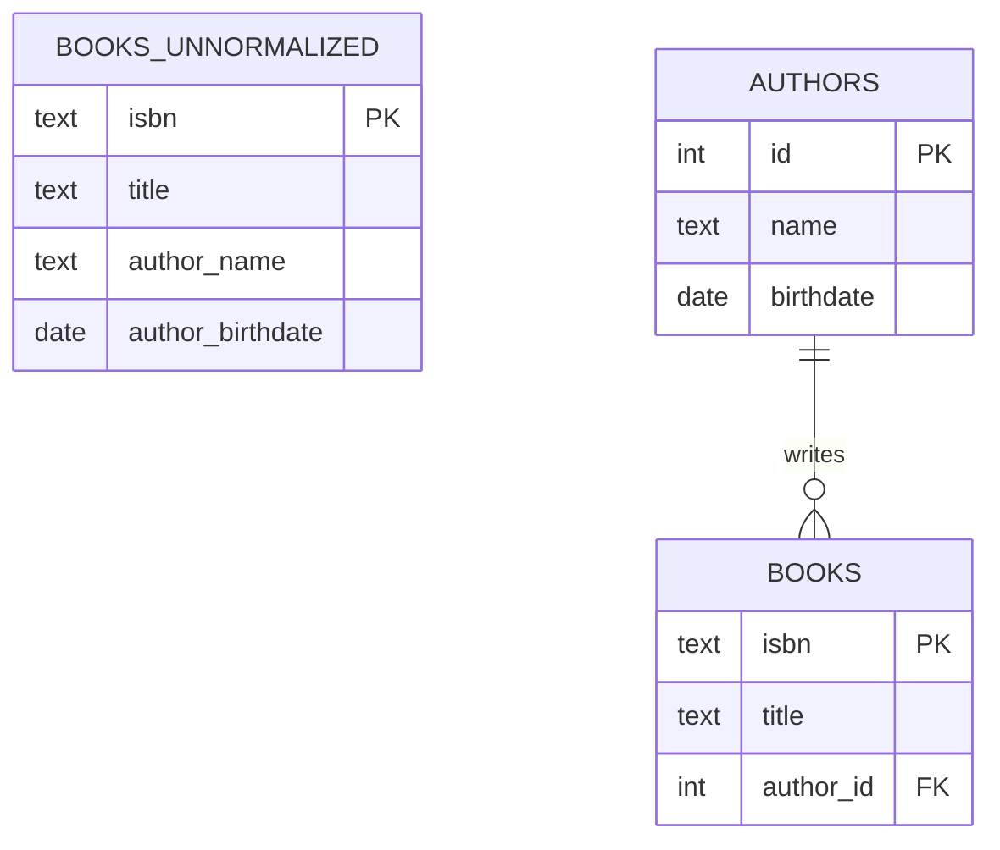

# 🎯 Day 109: Database Design & Normalization

> *"Data integrity is forever. Join performance is temporary. Optimize for the former, cache the latter."*

---

> **Sequencing note**: This lesson is numbered Day 109, but the concepts here — normalized table design, functional dependencies, the anomaly taxonomy — are *foundations* that Days 102–108 (Materialized Views, Indexing, Transactions, Stored Procedures, Triggers, CTEs, Pivoting) all implicitly assumed you already knew. Every `JOIN` you wrote in those lessons exists *because* the underlying tables were normalized. If you skipped straight here from Day 101, that is fine — this lesson is self-contained — but mentally treat it as "Day 101.5": the schema-design literacy that anchors everything else in Phase 9. (We did not renumber or move the lesson directory, to avoid breaking existing links and progress tracking; consider re-reading Days 102–108 with this lesson's vocabulary in mind.)

---

## The "Never-Coded" Bridge

**The Address Book**

* **Unnormalized (The Spreadsheet)**:
  * Row 1: `John Smith, 123 Main St, New York`.
  * Row 2: `Jane Doe, 123 Main St, New York`.
  * *Problem*: If "New York" changes its name to "New Amsterdam", you have to update 2 rows. If you miss one, John lives in NY and Jane lives in NA. (Inconsistent).
* **Normalized (The Relational DB)**:
  * Table `Cities`: `ID=1, Name=New York`.
  * Table `People`: `John, CityID=1`, `Jane, CityID=1`.
  * *Update*: Change City 1 to "New Amsterdam". Both John and Jane are updated instantly.

---

## The Technical Deep Dive

### 1. The Normal Forms

Rules to prevent anomalies.

* **1NF (Atomic)**: No lists in one cell. (Don't put `["red", "blue"]` in a column. Use a separate row).
* **2NF (Whole Key)**: No Partial Dependencies. (If PK is `(Order, Product)`, don't store `Product_Name` here. It depends only on `Product`, not `Order`).
* **3NF (Direct)**: No Transitive Dependencies. (Don't store `City_Population` in the `Users` table. `User -> City -> Population`. Move Population to `City` table).

### 1B. BCNF — The Stricter 3NF

3NF has a loophole: it only forbids non-key attributes from depending on other non-key attributes. It says nothing about a *part* of a composite key depending on a *non-key* attribute. **Boyce-Codd Normal Form (BCNF)** closes that loophole.

* **Formal rule**: For every non-trivial functional dependency `X → Y` in the table, `X` must be a **superkey** (a column or column-set that could, by itself, uniquely identify every row).
* **Plain English**: If knowing the value of column(s) `X` always lets you derive column `Y`, then `X` must be capable of being the whole key — not just part of it, and not some unrelated attribute.
* **3NF can pass while BCNF fails.** Classic example: a table `course_enrollment (student_id, course_id, instructor)` where each course is taught by exactly one instructor, and each instructor teaches at the same time slot for every course they teach.
  * Candidate key: `(student_id, course_id)`.
  * Functional dependency: `course_id → instructor`. But `course_id` alone is *not* a candidate key (it doesn't determine `student_id`), so `course_id` is not a superkey.
  * This passes 3NF (instructor is not transitively dependent through a non-key attribute relative to the *whole* key in the classic textbook test) but **fails BCNF**, because the determinant (`course_id`) of the dependency `course_id → instructor` is not itself a superkey.
  * **Fix**: split into `courses (course_id, instructor)` and `enrollments (student_id, course_id)`. Now every determinant is a superkey in its own table.
* **Why it matters in practice**: BCNF violations show up most often in tables with **multiple overlapping candidate keys** — e.g., a `room_bookings (building, room, time_slot, manager)` table where `(building, room)` determines `manager` but the primary key is `(building, room, time_slot)`. If you only check 3NF, you'll miss this and still get update anomalies (change the manager for a room, and you must remember to update every time-slot row for that room).
* **Trade-off**: BCNF is not always achievable while preserving all original functional dependencies without losing the ability to enforce them via a single constraint (a known decomposition limitation). In practice, most production OLTP schemas stop at 3NF and treat BCNF violations as a deliberate, documented risk if no anomaly has actually been observed — but you should be able to recognize one when asked.

### 2. The Anomalies

Why we do this.

* **Update Anomaly**: Updating data in one place leaves it stale in another.
* **Insertion Anomaly**: You can't add a new "City" unless you have a User who lives there.
* **Deletion Anomaly**: If you delete the last User in "Tokyo", you lose the information that "Tokyo" exists.

### Normal Form Reference Table

| Normal Form | Rule | Violation Example | How to Fix |
|---|---|---|---|
| **1NF** | Every column holds a single, atomic value — no lists, no repeating groups. | `orders(id, items)` with `items = 'Apple, Banana'` in one cell. | Split into a child table: `order_items(order_id, item)` with one row per item. |
| **2NF** | Must satisfy 1NF, and every non-key attribute must depend on the **whole** primary key, not just part of it (only relevant when the PK is composite). | `order_items(order_id, product_id, product_name, qty)` — `product_name` depends only on `product_id`, not the full `(order_id, product_id)` key. | Move `product_name` to a `products(product_id, product_name)` table. |
| **3NF** | Must satisfy 2NF, and no non-key attribute may depend on another non-key attribute (no transitive dependency). | `users(id, city, city_population)` — `city_population` depends on `city`, not on `id`. | Move `city_population` to a `cities(city, population)` table. |
| **BCNF** | Must satisfy 3NF, and for every functional dependency `X → Y`, `X` must be a superkey (capable of determining the entire row on its own). | `enrollments(student_id, course_id, instructor)` where `course_id → instructor` but `course_id` alone isn't a candidate key. | Split into `courses(course_id, instructor)` and `enrollments(student_id, course_id)`. |

### 3. Denormalization (The Dark Side)

* **OLTP (Transactional)**: normalize to 3NF. (Fast writes, safe data).
* **OLAP (Analytics)**: Denormalize to **Star Schema**.
  * *Why?*: Joining 10 tables is slow.
  * *Action*: Store `Product_Category_Name` directly in the `Sales` table to avoid joining `Product` -> `SubCategory` -> `Category`.

### OLTP vs OLAP vs Hybrid — Decision Table

| Dimension | OLTP (3NF) | OLAP (Star Schema) | Hybrid (Normalized core + JSONB extensions) |
|---|---|---|---|
| **Write frequency** | High — many small transactions per second (orders, payments). | Low — typically batch-loaded (nightly ETL, hourly micro-batch). | Medium — core fields written transactionally, flexible fields appended. |
| **Query complexity** | Simple, targeted lookups by key (`WHERE order_id = ?`). | Complex aggregations across millions of rows (`SUM(...) GROUP BY region, month`). | Mixed — key lookups on core columns, ad hoc filters on JSONB fields. |
| **Join count** | Many small joins across normalized tables (3–10 tables for one business object). | Few joins — fact table joins directly to a handful of denormalized dimension tables. | Few joins on the relational core; zero joins needed to read JSONB payload fields. |
| **Maintenance overhead** | Low per-row (no redundant data to keep in sync), but schema migrations (`ALTER TABLE`) are frequent as the business model evolves. | Higher data-pipeline overhead (ETL/ELT jobs must keep dimensions in sync with source-of-truth OLTP tables). | Low schema-migration overhead (new fields go into JSONB, no `ALTER TABLE`), but JSONB fields need disciplined naming conventions and validation in application code. |
| **Best for** | Order processing, inventory deduction, user account changes — anywhere correctness during concurrent writes matters most. | Executive dashboards, quarterly trend reports, anywhere read throughput on huge datasets matters most. | Event tracking, user preferences, product catalogs with variable attributes per category — anywhere schema evolves faster than migrations can keep up. |

---

## Senior-Level Insights

### Natural vs Surrogate Keys

* **Natural Key**: `User_Email` or `SSN`.
  * *Pros*: Unique by definition.
  * *Cons*: Emails change. SSNs are PII. If key changes, you must update all Foreign Keys (Cascade).
* **Surrogate Key**: `Serial ID` or `UUID`.
  * *Pros*: Never changes. Purely internal.
  * *Cons*: Extra column.
  * *Verdict*: Use Surrogate Keys (BigInt/UUID) for Primary Keys. Use Natural Keys for Unique Constraints.

> ⚠️ Pitfall: Over-Engineering the Schema
>
> **Failure mode**: A junior engineer splits `Address` into `Street_Number`, `Street_Name`, `Street_Suffix`, `Apartment`, `Unit_Type` — five columns, five places to get a `NULL` wrong, five columns to include in every `INSERT`.
> **Senior question**: "What query would ever filter by 'Street Suffix'?" If the honest answer is none, the decomposition bought nothing.
> **Rule of thumb**: Normalize what you need to *filter*, *aggregate*, or *enforce a foreign key against*. If a value is only ever displayed as a single opaque string (and never joined, grouped, or constrained), a single `address_line_1 text` column — or even a JSONB field — is the correct, senior-level choice. Normalization is a tool for solving anomalies, not a aesthetic goal.

### Referential Integrity Enforcement: `ON DELETE` Strategies

Once tables are split via normalization, foreign keys must decide what happens when the *parent* row is deleted. The `ON DELETE` clause is not cosmetic — it is a business decision encoded in DDL.

| Strategy | Behavior | Business scenario |
|---|---|---|
| `ON DELETE CASCADE` | Deleting the parent automatically deletes all matching child rows. | A `shopping_cart_items` row should disappear when its parent `shopping_carts` row (an abandoned, never-checked-out cart) is purged — there is no independent value in keeping orphaned cart items. |
| `ON DELETE RESTRICT` (or the default `NO ACTION`) | Deleting the parent is **blocked** with an error if any child rows still reference it. | A `products` row should **not** be deletable while `sales` rows still reference it — deleting the product would silently erase historical revenue records. Force the deletion of dependent rows (or an explicit archive step) first. |
| `ON DELETE SET NULL` | Deleting the parent sets the child's foreign key column to `NULL`, keeping the child row. | A `customers` row in a soft-delete/GDPR-erasure system: deleting the customer's PII should set `orders.customer_id = NULL` while preserving the order itself for financial/tax record-keeping. |

```sql
-- RESTRICT: protect sales history from accidental product deletion
ALTER TABLE sales
    ADD CONSTRAINT fk_sales_product
    FOREIGN KEY (product_id) REFERENCES products(id) ON DELETE RESTRICT;

-- CASCADE: abandoned cart cleanup should be total
ALTER TABLE shopping_cart_items
    ADD CONSTRAINT fk_cart_item_cart
    FOREIGN KEY (cart_id) REFERENCES shopping_carts(id) ON DELETE CASCADE;
```

The Incident Drill below is built around exactly this decision being made wrong.

---

## Hands-on Lab

### Exercise 1: Breaking 1NF

**Goal**: Identify the issue and convert to 1NF.

**Seed data**:

```sql
CREATE TABLE orders (id int, items text);
INSERT INTO orders VALUES (1, 'Apple, Banana');
```

* **Problem**: `items` holds two values in one cell — you cannot run `WHERE item = 'Banana'` without string parsing.
* **Fix**:

```sql
CREATE TABLE order_items (order_id int, item text);
INSERT INTO order_items VALUES
    (1, 'Apple'),
    (1, 'Banana');
```

**Expected result**:

| order_id | item |
|---|---|
| 1 | Apple |
| 1 | Banana |

### Exercise 2: Achieving 3NF

**Goal**: Fix a Transitive Dependency.

**Seed data (before — violates 3NF)**:

```sql
CREATE TABLE books_unnormalized (
    isbn text PRIMARY KEY,
    title text,
    author_name text,
    author_birthdate date
);
INSERT INTO books_unnormalized VALUES
    ('978-0', 'Database Systems', 'C.J. Date', '1941-06-07'),
    ('978-1', 'SQL Performance', 'C.J. Date', '1941-06-07');
```

* **Problem**: `author_birthdate` depends on `author_name`, not on `isbn` (the key). If "C.J. Date" is misspelled in one row, two different birthdates could end up attached to the same author — an Update Anomaly.

**Fix**:

```sql
CREATE TABLE authors (id serial PRIMARY KEY, name text, birthdate date);
INSERT INTO authors (name, birthdate) VALUES ('C.J. Date', '1941-06-07');

CREATE TABLE books (isbn text PRIMARY KEY, title text, author_id int REFERENCES authors(id));
INSERT INTO books VALUES
    ('978-0', 'Database Systems', 1),
    ('978-1', 'SQL Performance', 1);
```

**Verification query**:

```sql
SELECT b.isbn, b.title, a.name, a.birthdate
FROM books b
JOIN authors a ON b.author_id = a.id;
```

**Expected result**:

| isbn | title | name | birthdate |
|---|---|---|---|
| 978-0 | Database Systems | C.J. Date | 1941-06-07 |
| 978-1 | SQL Performance | C.J. Date | 1941-06-07 |

Updating the author's birthdate now requires touching exactly one row in `authors`, regardless of how many books they've written.



The unnormalized table repeats `author_birthdate` on every book row (a 3NF transitive dependency); splitting it into `authors`/`books` moves that fact to one row per author, eliminating the update anomaly.

### Exercise 3: Strategic Denormalization

**Goal**: Speed up a report by trading normalization for read performance.

**Seed data**:

```sql
CREATE TABLE cities (id serial PRIMARY KEY, name text);
INSERT INTO cities (name) VALUES ('New York'), ('Boston');

CREATE TABLE users (id serial PRIMARY KEY, name text, city_id int REFERENCES cities(id));
INSERT INTO users (name, city_id) VALUES ('John', 1), ('Jane', 1), ('Amy', 2);
```

Query: `SELECT count(*) FROM users u JOIN cities c ON u.city_id = c.id WHERE c.name = 'New York';` — requires a join; fine at small scale, costly at 500M rows scanned nightly for a dashboard.

* **Optimization**: Add a denormalized `cached_city_name` column directly to `users`.

```sql
ALTER TABLE users ADD COLUMN cached_city_name text;
UPDATE users u SET cached_city_name = c.name FROM cities c WHERE u.city_id = c.id;
```

**Expected result**: `SELECT count(*) FROM users WHERE cached_city_name = 'New York';` now answers with zero joins.

| count |
|---|
| 2 |

* **Trade-off**: A trigger (see Day 106) is now required on `cities` updates to keep `cached_city_name` in sync — this is the same Update Anomaly normalization was designed to prevent, deliberately reintroduced for read speed. Only do this when the read-path savings are measured and material.

---

## Mastery Check

### Question 1: 3NF

If A implies B, and B implies C, then A implies C. This is a...
A) Transitive Dependency.
B) Partial Dependency.
C) Circular Dependency.
D) Good Design.

<details>
<summary>Click for Answer</summary>

**Answer: A**
This chain (`A → B → C`) is a **Transitive Dependency**: `C` is determined by `B`, which is itself determined by `A`, rather than `C` depending directly on the table's key. 3NF specifically forbids this because it creates redundancy — `C`'s value gets repeated for every row sharing the same `B`, opening the door to Update Anomalies if one copy is changed and another is missed. The fix is to split the table so `B → C` lives in its own table (keyed by `B`), and the original table keeps only `A → B`. This is exactly the `users(id, city, city_population)` example from the Technical Deep Dive: `city_population` should live in a `cities` table, not be repeated on every user row.
</details>

### Question 2: First Normal Form

Which value violates 1NF?
A) `25`.
B) `2023-01-01`.
C) `blue,red,green`.
D) `NULL`.

<details>
<summary>Click for Answer</summary>

**Answer: C**
`blue,red,green` packs three independent values into a single cell — a violation of 1NF's atomicity rule. The practical cost shows up immediately at query time: finding every row that includes "blue" requires a fragile `LIKE '%blue%'` scan instead of a clean `WHERE color = 'blue'` equality check, and that `LIKE` pattern would also incorrectly match a hypothetical "skyblue" or "blueish" value. The fix is to give each value its own row in a child table (e.g., `item_colors(item_id, color)`), restoring the ability to filter, index, and aggregate by individual color cleanly.
</details>

### Question 3: Surrogate Keys

What is a benefit of UUID over Natural Key (Email)?
A) Shorter.
B) It doesn't change when the user changes their email.
C) Easier to remember.
D) It sorts alphabetically.

<details>
<summary>Click for Answer</summary>

**Answer: B**
A surrogate key (an auto-incrementing `BIGINT` or a `UUID`) is a value with no business meaning whatsoever — it exists solely to identify the row, so nothing in the outside world ever gives anyone a reason to change it. An email address, by contrast, is a natural key that users routinely change (marriage, company changes, typo fixes), and because every foreign key referencing that user would need to cascade-update if the email itself were the primary key, a single email change could ripple through every child table that references it. Using a stable surrogate key as the PK and keeping the email as a `UNIQUE` constraint (not the PK) gets you both stability for joins and uniqueness enforcement for the business rule.
</details>

### Question 4: Star Schema

In Data Warehousing, do we prefer 3NF or Denormalized?
A) 3NF.
B) Denormalized (Star/Snowflake).
C) No Schema.
D) Excel.

<details>
<summary>Click for Answer</summary>

**Answer: B**
Data warehouses deliberately denormalize into a **Star Schema** (one central fact table surrounded by denormalized dimension tables) because OLAP workloads run massive `GROUP BY`/`SUM` aggregations across millions or billions of rows, and every additional join in that query plan multiplies the I/O and CPU cost. By flattening `product → subcategory → category` into a single `category_name` column directly on the fact table (or a single `products` dimension), a query that aggregates "revenue by category" touches two tables instead of four. The trade-off accepted is exactly the anomaly risk normalization was built to prevent — but in a warehouse that is refreshed via a controlled, repeatable ETL/ELT pipeline rather than live ad hoc writes, that risk is manageable because the "source of truth" 3NF tables still exist upstream.
</details>

### Question 5: BCNF

Boyce-Codd Normal Form is a stricter version of...
A) 1NF.
B) 2NF.
C) 3NF.
D) 4NF.

<details>
<summary>Click for Answer</summary>

**Answer: C**
BCNF is a stricter version of **3NF**: every table that satisfies BCNF automatically satisfies 3NF, but the reverse is not guaranteed. The gap between them only becomes visible in tables with multiple *overlapping* candidate keys — 3NF only checks that non-key attributes don't transitively depend on other non-key attributes, while BCNF additionally demands that the determinant of *every* functional dependency (`X` in `X → Y`) be a superkey, even if `X` is only part of a composite key. The `course_enrollment(student_id, course_id, instructor)` example in the Technical Deep Dive (where `course_id → instructor` but `course_id` alone isn't a candidate key) passes 3NF yet fails BCNF — this is the exact pattern the question is testing.
</details>

---

## Glossary

| Term | Definition |
|---|---|
| **First Normal Form (1NF)** | Every column holds a single, atomic value; no lists or repeating groups in one cell. |
| **Second Normal Form (2NF)** | Satisfies 1NF, and every non-key attribute depends on the *entire* primary key (relevant only when the key is composite). |
| **Third Normal Form (3NF)** | Satisfies 2NF, and no non-key attribute depends transitively on another non-key attribute. |
| **Boyce-Codd Normal Form (BCNF)** | Satisfies 3NF, and the determinant of every functional dependency (`X` in `X → Y`) is a superkey — closes the multi-candidate-key loophole 3NF leaves open. |
| **Partial Dependency** | A non-key attribute depends on only *part* of a composite primary key, not the whole key (the 2NF violation). |
| **Transitive Dependency** | A non-key attribute depends on another non-key attribute rather than directly on the table's key (the 3NF violation). |
| **Candidate Key** | Any minimal column or column-set that could uniquely identify every row in a table; a table may have several. |
| **Surrogate Key** | An artificial, business-meaningless identifier (auto-increment integer or UUID) used as the primary key purely for stability. |
| **Natural Key** | A real-world attribute (email, SSN, ISBN) that happens to be unique and could serve as a key, but may change over time. |
| **Update Anomaly** | Updating one fact requires changing multiple rows; missing one leaves the data inconsistent. |
| **Insertion Anomaly** | You cannot record a fact (e.g., a new city) without also having an unrelated fact available (e.g., a resident). |
| **Deletion Anomaly** | Deleting one record accidentally erases an unrelated fact that had no other row to "live in." |
| **Star Schema** | A denormalized OLAP design: one central fact table joined directly to several denormalized dimension tables, minimizing join depth for aggregation queries. |
| **Snowflake Schema** | A star schema whose dimension tables are themselves normalized into sub-dimensions — a middle ground between 3NF and a pure star schema. |

---

## Summary

Today you learned:

* ✅ **1NF**: Atomic values.
* ✅ **2NF**: Whole Key dependencies.
* ✅ **3NF**: Separation of concerns (transitive).
* ✅ **BCNF**: The stricter rule for tables with multiple overlapping candidate keys.
* ✅ **Keys**: Surrogate vs Natural.
* ✅ **Referential Integrity**: `CASCADE` vs `RESTRICT` vs `SET NULL` as deliberate business decisions.

**Tomorrow**: We break the relational model with **JSON & NoSQL in SQL**.

---

## 🚨 Escalating Incident Drill Track (Day 109-specific)

A single connected drill sequence, tailored to normalization and referential-integrity failure modes. Each stage is intentionally harder than the previous one and must be completed with production-style evidence.

### Drill 1 (Severity 2): Phantom inconsistency from an unnormalized table

**Scenario**: Customer support reports that the same client appears with two different phone numbers depending on which order they look up. Finance is asking "which number is correct?" and nobody can answer with confidence.

**Required outputs**:

1. **Root-cause analysis using query plans and schema objects**
   * Inspect the `orders` table schema: confirm `customer_name` and `customer_phone` are stored directly on every order row instead of referencing a `customers` table — a transitive dependency (3NF violation) where `phone` depends on the customer, not the order.
   * Run a query (`SELECT customer_name, COUNT(DISTINCT customer_phone) FROM orders GROUP BY customer_name HAVING COUNT(DISTINCT customer_phone) > 1`) to prove the inconsistency exists and quantify how many customers are affected.
2. **Mitigation patch strategy and rollback criteria**
   * Patch: extract a `customers(id, name, phone)` table, backfill it by picking the most recent phone number per customer (with explicit sign-off from support on the tie-break rule), and replace `orders.customer_phone` with a `customer_id` foreign key.
   * Rollback criteria: if the backfilled `customer_id` mapping cannot achieve 100% match against existing orders (some orders have no clean match), halt the migration and resolve the unmatched rows manually before dropping the old columns.
3. **Post-incident report**
   * Summarize business impact (support team gave conflicting contact info to a customer, delaying a refund).
   * Document prevention controls: add a schema-review checklist item requiring "does this column repeat per parent entity?" before any new column is added to a transactional table.

### Drill 2 (Severity 1): `ON DELETE CASCADE` silently destroys sales history

**Scenario**: A data analyst reports that deleting a discontinued product from the `products` catalog silently removed three months of sales history for that product — the quarterly revenue report now undercounts total sales, and nobody noticed until Finance's numbers didn't reconcile with Stripe's.

**Required outputs**:

1. **Root-cause analysis using query plans and schema objects**
   * Inspect the foreign key definition on `sales.product_id` via `\d sales` or `information_schema.referential_constraints` and confirm it is defined `ON DELETE CASCADE` rather than `ON DELETE RESTRICT`.
   * Reproduce in a sandbox: insert a product, insert sales rows referencing it, delete the product, and show the sales rows vanish with it.
2. **Mitigation patch strategy and rollback criteria**
   * Patch: drop and recreate the foreign key as `ON DELETE RESTRICT` (per the Referential Integrity Enforcement table above), forcing future product deletions to fail loudly unless sales are archived first. Add a `discontinued boolean` flag to `products` as the correct way to "remove" a product without breaking history.
   * Rollback criteria: validate in staging that legitimate workflows (e.g., deleting a truly orphaned test product with zero sales) still succeed under `RESTRICT` before deploying to production.
3. **Post-incident report**
   * Quantify business impact (understated quarterly revenue, reconciliation delay, analyst hours spent investigating).
   * Write a recovery script: restore the deleted sales rows from the most recent backup/WAL archive, re-attach them to a recreated `products` row (even if marked `discontinued`), and re-run the revenue report to confirm parity with Stripe.
   * Add a regression test: any migration that changes an `ON DELETE` clause on a financially significant table requires explicit review sign-off.

### Drill 3 (Severity 1 / Executive Escalation): BCNF violation causes a compounding update anomaly at scale

**Scenario**: Following a multi-region expansion, the `room_bookings(building, room, time_slot, manager)` table has grown to 200,000 rows. A building's manager changed three months ago, but the change was only applied to *new* bookings going forward — old and new bookings now disagree on who manages each room, and a regulatory audit is asking for a single source of truth.

**Required outputs**:

1. **Root-cause analysis using query plans and schema objects**
   * Demonstrate the BCNF violation: `(building, room) → manager` is a valid functional dependency, but `(building, room)` is not the table's full candidate key (which is `(building, room, time_slot)`), so the determinant of this dependency is not a superkey.
   * Run `SELECT building, room, COUNT(DISTINCT manager) FROM room_bookings GROUP BY building, room HAVING COUNT(DISTINCT manager) > 1;` to enumerate every room with conflicting manager records and quantify the audit exposure.
2. **Mitigation patch strategy and rollback criteria**
   * Patch: decompose into `room_managers(building, room, manager)` (one row per room, always current) and `room_bookings(building, room, time_slot)` referencing it via foreign key — eliminating the possibility of two different managers ever being recorded for the same room.
   * Rollback criteria: before cutting over reporting queries to the new structure, validate that a `JOIN` between the decomposed tables reproduces the same row count and manager-per-booking result as a hand-reconciled sample of 500 bookings.
3. **Post-incident report**
   * Summarize business/compliance impact (audit finding, potential contractual liability if the wrong manager was held accountable for a room incident).
   * Document prevention controls: add normalization-form review (explicitly checking BCNF, not just 3NF) to the schema design checklist for any table with more than one candidate key.
   * Add monitoring: a scheduled query that flags any table where a non-key column's value varies for what should be a stable determinant — an early warning for BCNF drift before it reaches audit scale.
