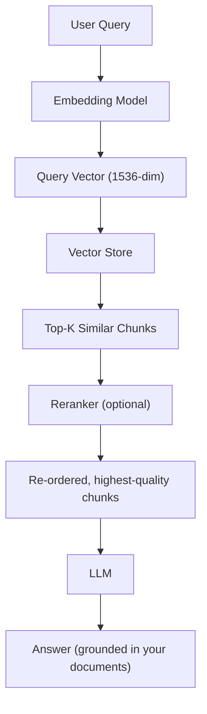

# 🎯 Day 112: RAG Pipelines

> *"RAG is how you teach a model to look things up rather than hallucinate — turning a brilliant amnesiac into a brilliant researcher."*

---

## The "Never-Coded" Bridge

**Imagine a brilliant historian who knows everything about world history — but your company started yesterday.**

They can't answer *"What was our Q3 revenue?"* because it wasn't in their training data. Two options:
1. **Fine-tuning**: Re-educate them with all your company documents. Months of work. Expensive. They forget old history.
2. **RAG (Retrieval-Augmented Generation)**: Give them a library card and a very fast research assistant. Before every question, the assistant finds the 5 most relevant pages from your company docs and hands them to the historian. The historian reads those pages and gives you a perfect answer using both their world knowledge AND your company-specific data.

**RAG = fast, cheap, and always up-to-date.** Fine-tuning teaches the model style; RAG teaches it facts.

---

## The Technical Deep Dive

### 1. The RAG Architecture



Each stage narrows or reorders the candidate context before it ever reaches the LLM, so retrieval quality upstream caps answer quality downstream.

### 2. Understanding Embeddings

**What a vector space actually represents.** An embedding model takes a piece of text and places it as a single point in a high-dimensional space (1536 dimensions for `text-embedding-3-small`) — think of it as a vastly expanded version of plotting words on a 2D map by topic. The model is trained so that texts with *similar meaning* end up as *nearby points*, regardless of whether they share any actual words. "I'd like a refund" and "Can I get my money back?" land close together in this space even though they share zero vocabulary, because the model learned the semantic relationship between them during training — not a keyword overlap.

**Why this enables semantic search.** Traditional keyword search (like SQL `LIKE` or a basic full-text index) matches strings. Vector search matches *meaning*, by measuring the distance between two points in this space. "Distance" between two embedding vectors is what cosine similarity computes — the smaller the angle between two vectors, the more semantically related the underlying text. This is the entire trick behind RAG: instead of asking "which documents contain these exact words," you ask "which documents live near this question's point in meaning-space."

```python
from openai import OpenAI
import numpy as np

client = OpenAI()

def embed(text: str, model: str = "text-embedding-3-small") -> list[float]:
    """Convert text to a vector of floats."""
    response = client.embeddings.create(input=text, model=model)
    return response.data[0].embedding

# A 1536-dimensional vector representing the semantic meaning of the text
vec = embed("What is the refund policy for enterprise customers?")
print(f"Vector dimensions: {len(vec)}")         # 1536
print(f"Vector sample: {vec[:5]}")              # [-0.02, 0.04, 0.01, ...]

# Cosine similarity: 1.0 = identical meaning, 0.0 = completely unrelated
def cosine_similarity(a: list, b: list) -> float:
    a, b = np.array(a), np.array(b)
    return float(np.dot(a, b) / (np.linalg.norm(a) * np.linalg.norm(b)))

# Semantic similarity (not keyword matching)
query = embed("What do I get refunded if I cancel?")
doc1 = embed("Cancellations receive a full refund within 30 days")    # semantically similar
doc2 = embed("The company was founded in 2010")                         # unrelated

print(cosine_similarity(vec, doc1))  # → ~0.85 (very similar)
print(cosine_similarity(vec, doc2))  # → ~0.12 (unrelated)
```

### 3. Building a Complete RAG Pipeline

```python
from langchain_openai import OpenAIEmbeddings, ChatOpenAI
from langchain_community.vectorstores import Chroma
from langchain_core.prompts import ChatPromptTemplate
from langchain_core.output_parsers import StrOutputParser
from langchain_core.runnables import RunnablePassthrough
from langchain.text_splitter import RecursiveCharacterTextSplitter
from langchain_core.documents import Document

# ─────────────────────────────────────────
# STEP 1: Prepare your knowledge base
# ─────────────────────────────────────────
company_docs = [
    Document(
        page_content="Enterprise refund policy: Customers on annual contracts receive prorated refunds with 30-day notice. Monthly contracts: no refunds after billing cycle start.",
        metadata={"source": "policies/refunds.txt", "category": "policy"}
    ),
    Document(
        page_content="Standard shipping: 5-7 days, $5.99. Express: 2-3 days, $14.99. Free shipping on orders over $75.",
        metadata={"source": "policies/shipping.txt", "category": "policy"}
    ),
    Document(
        page_content="Q3 2025 Revenue: $12.4M (up 34% YoY). Top products: ProSuite ($5.1M), DataEngine ($4.2M). Churn rate: 3.2%.",
        metadata={"source": "finance/q3_report.txt", "category": "finance"}
    ),
    Document(
        page_content="TechCorp was founded in 2019 by Alice Chen and Bob Martinez. HQ in San Francisco. 312 employees as of 2025.",
        metadata={"source": "about/company.txt", "category": "company"}
    ),
]

# ─────────────────────────────────────────
# STEP 2: Chunk and embed
# ─────────────────────────────────────────
splitter = RecursiveCharacterTextSplitter(chunk_size=400, chunk_overlap=50)
chunks = splitter.split_documents(company_docs)

embeddings = OpenAIEmbeddings(model="text-embedding-3-small")

# Store in ChromaDB (local, persistent vector database)
vectorstore = Chroma.from_documents(
    documents=chunks,
    embedding=embeddings,
    persist_directory="./chroma_db",     # Saved to disk — don't re-embed next run!
    collection_name="company_knowledge"
)
print(f"Indexed {vectorstore._collection.count()} chunks")

# ─────────────────────────────────────────
# STEP 3: Build the RAG chain
# ─────────────────────────────────────────
retriever = vectorstore.as_retriever(
    search_type="similarity",
    search_kwargs={"k": 4}   # Return top 4 most similar chunks
)

RAG_PROMPT = ChatPromptTemplate.from_template("""
You are a helpful assistant for TechCorp. Answer the question using ONLY the provided context.
If the context doesn't contain enough information, say "I don't have that information."
Never make up facts.

CONTEXT:
{context}

QUESTION: {question}

ANSWER:
""")

def format_docs(docs: list) -> str:
    """Format retrieved docs with source attribution."""
    return "\n\n".join(
        f"[Source: {doc.metadata.get('source', 'unknown')}]\n{doc.page_content}"
        for doc in docs
    )

llm = ChatOpenAI(model="gpt-4o-mini", temperature=0)

rag_chain = (
    {"context": retriever | format_docs, "question": RunnablePassthrough()}
    | RAG_PROMPT
    | llm
    | StrOutputParser()
)

# Query your knowledge base
questions = [
    "What is the refund policy for enterprise customers on annual contracts?",
    "What was Q3 revenue?",
    "When was TechCorp founded?",
    "What is the cancellation fee?",  # Not in knowledge base
]

for q in questions:
    print(f"\nQ: {q}")
    print(f"A: {rag_chain.invoke(q)}")
```

### 4. Retrieval Strategies

```python
# ─────────────────────────────────────────
# STRATEGY 1: Dense Retrieval (default)
# Pros: Semantic understanding, handles paraphrasing
# Cons: Can miss exact keyword matches
# ─────────────────────────────────────────
dense_retriever = vectorstore.as_retriever(
    search_type="similarity", search_kwargs={"k": 5}
)

# ─────────────────────────────────────────
# STRATEGY 2: MMR (Maximum Marginal Relevance)
# Returns diverse results — avoids returning 5 nearly identical chunks
# ─────────────────────────────────────────
mmr_retriever = vectorstore.as_retriever(
    search_type="mmr",
    search_kwargs={"k": 5, "fetch_k": 20, "lambda_mult": 0.7}
    # lambda_mult: 1.0 = pure similarity, 0.0 = pure diversity
)

# ─────────────────────────────────────────
# STRATEGY 3: Hybrid Search (BM25 + Dense)
# Best of both worlds: keyword precision + semantic understanding
# ─────────────────────────────────────────
from langchain_community.retrievers import BM25Retriever
from langchain.retrievers import EnsembleRetriever

# BM25 captures exact keywords (like traditional search)
bm25_retriever = BM25Retriever.from_documents(chunks)
bm25_retriever.k = 5

# Ensemble with equal weighting
hybrid_retriever = EnsembleRetriever(
    retrievers=[bm25_retriever, dense_retriever],
    weights=[0.4, 0.6]  # 40% BM25, 60% dense — tune empirically
)

# ─────────────────────────────────────────
# STRATEGY 4: Reranking (cross-encoder)
# Expensive but most accurate — use as final step
# ─────────────────────────────────────────
from langchain.retrievers import ContextualCompressionRetriever
from langchain_cohere import CohereRerank  # or use cross-encoder locally

# Fetch 20, rerank to 5
compressor = CohereRerank(top_n=5)
reranking_retriever = ContextualCompressionRetriever(
    base_compressor=compressor,
    base_retriever=hybrid_retriever
)
```

### 5. Metadata Filtering

```python
# Filter by metadata before semantic search
# Much faster than post-filtering on millions of chunks

# Only search finance documents
finance_results = vectorstore.similarity_search(
    query="revenue growth",
    k=5,
    filter={"category": "finance"}
)

# Filter by date range
recent_results = vectorstore.similarity_search(
    query="product updates",
    k=5,
    filter={"$and": [{"year": {"$gte": 2024}}, {"category": "product"}]}
)

# This is why good metadata is critical at indexing time!
```

### 6. Evaluating RAG Quality

```python
def evaluate_rag_pipeline(rag_chain, eval_dataset: list[dict]) -> dict:
    """
    Evaluate RAG on a labeled Q&A dataset.
    eval_dataset: [{"question": str, "expected_answer": str, "expected_sources": list}]
    """
    results = []
    for item in eval_dataset:
        # Get answer
        answer = rag_chain.invoke(item["question"])

        # Simple evaluation metrics
        # In production: use RAGAS library for automatic evaluation
        contains_key_fact = any(
            fact.lower() in answer.lower()
            for fact in item.get("key_facts", [])
        )
        results.append({
            "question": item["question"],
            "answer": answer,
            "key_facts_found": contains_key_fact,
        })

    accuracy = sum(r["key_facts_found"] for r in results) / len(results)
    return {"accuracy": accuracy, "results": results}

# Production: use RAGAS (Retrieval Augmented Generation Assessment)
# pip install ragas
from ragas import evaluate
from ragas.metrics import faithfulness, answer_relevancy, context_recall
# See Day 114 for full evaluation setup
```

---

## Senior-Level Insights

### Why RAG Fails in Production

**Problem 1 — Chunking mismatch**: A chunk explains "what" but a different chunk explains "why" — the retriever gets the wrong chunk. Fix: Use parent document retrievers or summary indexes.

**Problem 2 — Query-document mismatch**: Users ask "how do I cancel?" but doc says "termination procedure". Fix: Hybrid search or query expansion (generate multiple paraphrases of the query, retrieve for all).

**Problem 3 — Hallucination despite retrieval**: LLM ignores retrieved context and makes up answers. Fix: Constrain the prompt ("ONLY use the provided context"), and validate outputs with RAGAS `faithfulness` metric.

**Problem 4 — Stale index**: New documents added to the knowledge base aren't reflected. Fix: Implement incremental indexing + document fingerprinting to re-embed only changed chunks.

### The Embedding Model Matters

```python
# embedding quality comparison (approximate)
EMBEDDING_MODELS = {
    "text-embedding-3-small": {
        "cost": "$0.02/M tokens",
        "MTEB_score": 62.3,
        "dims": 1536,
        "speed": "fast"
    },
    "text-embedding-3-large": {
        "cost": "$0.13/M tokens",
        "MTEB_score": 64.6,
        "dims": 3072,
        "speed": "medium"
    },
    "BAAI/bge-large-en-v1.5": {
        "cost": "free (local)",
        "MTEB_score": 64.2,
        "dims": 1024,
        "speed": "fast (GPU)"
    },
}
# bge-large is nearly as good as text-embedding-3-large at zero API cost!
```

---

## Pitfalls

- ⚠️ **Chunking by a fixed character count with no regard for structure.** Splitting mid-sentence or mid-table destroys the semantic unit the embedding model is trying to represent, producing chunks that retrieve poorly. Prefer splitting at paragraph/section boundaries first (as `RecursiveCharacterTextSplitter`'s separator list does), and validate chunk boundaries on a sample of your actual documents.
- ⚠️ **Re-embedding the same documents on every app restart.** This burns API cost and time for no benefit. Persist the vector store (`persist_directory=...`) and only re-embed chunks whose source content actually changed (track a content hash per chunk).
- ⚠️ **Using a different embedding model for indexing vs. querying.** Embeddings from different models (or even different versions of the same model) are NOT comparable — cosine similarity between them is meaningless. Always use the exact same embedding model for both indexing and querying.
- ⚠️ **Trusting retrieval without checking it.** A RAG system can return a fluent, confident-sounding answer built from the *wrong* retrieved chunks. Always log which chunks were retrieved for each answer in production, and spot-check retrieval quality separately from generation quality.
- ⚠️ **No fallback for "not in the knowledge base."** If the prompt doesn't explicitly instruct the model to say "I don't know" when context is insufficient, RAG systems will happily hallucinate an answer that sounds grounded but isn't.

---

## Glossary

| Term | Definition |
| --- | --- |
| **RAG (Retrieval-Augmented Generation)** | An architecture that retrieves relevant text chunks from an external knowledge base at query time and inserts them into the LLM's prompt as context, instead of relying solely on the model's trained-in knowledge. |
| **Embedding** | A fixed-length vector of floats that represents the semantic meaning of a piece of text, produced by an embedding model. |
| **Vector space** | The high-dimensional space (e.g., 1536 dimensions) in which embeddings live; texts with similar meaning are placed at nearby points. |
| **Cosine similarity** | A measure of the angle between two vectors (ranging -1 to 1, typically 0 to 1 for text embeddings); higher values indicate more similar meaning, independent of vector magnitude. |
| **Vector store / vector database** | A database (e.g., ChromaDB, Pinecone, Weaviate) optimized for storing embeddings and performing fast nearest-neighbor similarity search. |
| **Dense retrieval** | Retrieval based purely on embedding similarity — captures semantic/paraphrase matches but can miss exact keyword matches. |
| **BM25** | A classic keyword-based ranking algorithm (the "traditional search" baseline) that scores documents by term frequency, used as the keyword half of hybrid search. |
| **Hybrid search** | Combining dense (semantic) retrieval and BM25 (keyword) retrieval, usually via weighted ensemble, to capture both paraphrase matches and exact-term matches. |
| **MMR (Maximum Marginal Relevance)** | A retrieval re-ranking method that selects results balancing relevance to the query against diversity from already-selected results, avoiding near-duplicate chunks. |
| **Reranking** | A second-pass scoring step (often with a cross-encoder model) applied to an initial set of retrieved candidates to reorder them by more precise relevance before sending to the LLM. |
| **Chunking** | Splitting a long document into smaller overlapping pieces so each piece fits within an embedding model's or LLM's context limit. |
| **Faithfulness** | A RAGAS evaluation metric measuring whether an LLM's generated answer is actually supported by (grounded in) the retrieved context, as opposed to hallucinated. |

---

## Hands-on Lab

### Exercise 1: Build RAG from Scratch

```python
# Build a minimal RAG system WITHOUT LangChain/LlamaIndex abstraction
# This teaches you exactly what the frameworks do under the hood

import json
import numpy as np
from openai import OpenAI

client = OpenAI()

DOCS = [
    {"id": "d1", "text": "Python was created by Guido van Rossum in 1991.", "source": "wiki"},
    {"id": "d2", "text": "The GIL (Global Interpreter Lock) prevents true multi-threading in CPython.", "source": "docs"},
    {"id": "d3", "text": "Python 3.11 introduced significant performance improvements — 10-60% faster than 3.10.", "source": "release_notes"},
    {"id": "d4", "text": "FastAPI is a modern Python web framework built on Starlette and Pydantic.", "source": "fastapi_docs"},
]

def embed(text: str) -> list[float]:
    return client.embeddings.create(
        input=text, model="text-embedding-3-small"
    ).data[0].embedding

def cosine_sim(a, b) -> float:
    a, b = np.array(a), np.array(b)
    return float(np.dot(a, b) / (np.linalg.norm(a) * np.linalg.norm(b)))

# TODO: Implement the following functions:
def build_index(docs: list[dict]) -> list[dict]:
    """Embed each doc and add 'embedding' field to each dict."""
    pass

def retrieve(query: str, index: list[dict], top_k: int = 2) -> list[dict]:
    """Embed query, compute cosine similarity to all docs, return top_k."""
    pass

def answer(query: str, context_docs: list[dict]) -> str:
    """Build a prompt with context docs and get an answer from GPT-4o-mini."""
    pass

# Test it
index = build_index(DOCS)
results = retrieve("Who invented Python?", index, top_k=2)
response = answer("Who invented Python and when?", results)
print(response)

# EXPECTED RESULT:
# retrieve("Who invented Python?", index, top_k=2) should return d1 as the
# top result (cosine similarity ≈ 0.7-0.85 — it directly answers the query)
# and d3 as a plausible #2 (also about Python, but a much weaker match,
# cosine similarity ≈ 0.2-0.3). d2 and d4 should NOT appear in the top 2 —
# they're about unrelated Python topics (threading, web frameworks).
# answer(...) should produce something like:
#   "Python was created by Guido van Rossum in 1991."
# grounded only in d1. If the answer mentions FastAPI or the GIL, your
# retrieve() function is likely returning irrelevant chunks — check that
# cosine_sim is computed correctly (dot product over norms, not squared
# Euclidean distance).
```

### Exercise 2: Metadata Filtering Strategy

You have a company knowledge base with 50,000 chunks from: policies (10K), product docs (25K), financial reports (15K).

Design a metadata schema and filtering strategy for these queries:
1. "What is our GDPR data deletion process?" (policy)
2. "Does Product X support OAuth 2.0?" (product, specific product)
3. "What was EMEA revenue in Q4 2024?" (financial, region, quarter, year)

Write the metadata dict structure for a sample document from each category, and the filter dict you'd pass to `vectorstore.similarity_search()`.

### Exercise 3: Evaluate Retrieval Quality

```python
# Given this Q&A evaluation dataset and your RAG pipeline,
# calculate precision and recall at retrieval stage

eval_set = [
    {
        "question": "What is the refund policy for enterprise customers?",
        "relevant_chunk_ids": ["policy_refund_001", "policy_refund_002"],
    },
    {
        "question": "What was Q3 revenue?",
        "relevant_chunk_ids": ["finance_q3_001"],
    },
]

def evaluate_retrieval(retriever, eval_set: list, k: int = 5) -> dict:
    """
    TODO: For each query:
    1. Retrieve k chunks (get their IDs from metadata)
    2. Check which relevant_chunk_ids were found
    3. Precision@k = (relevant chunks retrieved) / k
    4. Recall@k = (relevant chunks retrieved) / (total relevant chunks)
    Return mean precision and recall across all queries.
    """
    pass

# EXPECTED RESULT (k=5):
#   Query 1 ("refund policy"): 2 relevant chunks exist (policy_refund_001/002).
#     If both are retrieved in the top 5 -> Precision@5 = 2/5 = 0.40,
#     Recall@5 = 2/2 = 1.0
#   Query 2 ("Q3 revenue"): 1 relevant chunk exists (finance_q3_001).
#     If it's retrieved in the top 5 -> Precision@5 = 1/5 = 0.20,
#     Recall@5 = 1/1 = 1.0
#   Mean precision@5 ≈ 0.30, Mean recall@5 = 1.0 (assuming a well-tuned
#   retriever finds all relevant chunks within the top 5).
# Note: precision will mechanically look low whenever a query has fewer
# relevant chunks than k — that's expected, not a bug. Recall is the more
# meaningful metric here; if recall is below 1.0, your retriever is
# genuinely missing relevant chunks and you should investigate chunking or
# the embedding model.
```

---

## Mastery Check

**Q1**: What is the difference between RAG and fine-tuning for adding company knowledge to an LLM?
<details><summary>Answer</summary>
RAG retrieves relevant chunks at query time from an external database and passes them as context. It's always up-to-date, cheap to update (just re-index new docs), and doesn't modify the model. Fine-tuning bakes knowledge into model weights — it teaches style and patterns, not facts. Fine-tuning requires expensive training, risks catastrophic forgetting, and can't be updated incrementally. For dynamic company knowledge, RAG is almost always the right choice.
</details>

**Q2**: Why is cosine similarity preferred over Euclidean distance for embedding search?
<details><summary>Answer</summary>
Embedding vectors can have different magnitudes (lengths) depending on text length, but the direction encodes the semantic meaning. Cosine similarity measures the angle between vectors, ignoring magnitude — so a short and long version of the same sentence will have high cosine similarity. Euclidean distance is affected by magnitude, so longer texts systematically appear more distant even if semantically close.
</details>

**Q3**: What is MMR (Maximum Marginal Relevance) and when should you use it?
<details><summary>Answer</summary>
MMR balances relevance and diversity in retrieved results. Instead of returning the top 5 most similar chunks (which might all be paraphrases of the same sentence), MMR selects chunks that are both relevant to the query AND different from already-selected chunks. Use it when your knowledge base has many near-duplicate chunks or when answer quality improves with diverse evidence rather than redundant repetition.
</details>

**Q4**: What is the "lost in the middle" problem specific to RAG?
<details><summary>Answer</summary>
When many chunks are passed to the LLM as context, the model tends to rely heavily on chunks at the beginning and end of the context window, often ignoring chunks placed in the middle. This means that even if the most relevant chunk is retrieved, if it's placed third out of five in the prompt, the model may not use it. Solutions: reranking (put the best chunk first), limit context to 2-3 chunks maximum, or use retrieval strategies that prioritize chunk position.
</details>

**Q5**: A RAG system is returning answers that don't reference the retrieved documents at all. What is likely wrong?
<details><summary>Answer</summary>
Several possible causes: (1) The system prompt doesn't clearly instruct the model to use the provided context. (2) The retrieved chunks are in a different section of the prompt (model may miss them due to "lost in the middle"). (3) The model "knows" the answer from training data and ignores context — more likely for well-known facts. Fix: Use the `faithfulness` metric from RAGAS to measure if answers are grounded in context, and strengthen the system prompt: "Answer ONLY from the provided context."
</details>

---

## Further Reading

- [RAGAS — RAG Evaluation Framework](https://github.com/explodinggradients/ragas)
- [ChromaDB Documentation](https://docs.trychroma.com/)
- [Advanced RAG Patterns — LlamaIndex](https://docs.llamaindex.ai/en/stable/optimizing/advanced_retrieval/advanced_retrieval/)
- [Pinecone Learning Center — Vector Database Guide](https://www.pinecone.io/learn/)
- [MTEB Leaderboard — Embedding Model Benchmarks](https://huggingface.co/spaces/mteb/leaderboard)

---

## Summary

- ✅ **RAG** = retrieve relevant chunks → augment LLM prompt → generate grounded answer.
- ✅ **Embeddings** convert text to vectors; cosine similarity finds semantically similar chunks.
- ✅ **ChromaDB**: Local, persistent vector store ideal for prototyping and small-medium corpora.
- ✅ **Retrieval strategies**: Dense (semantic), BM25 (keyword), Hybrid (both), MMR (diverse), Reranking (best quality).
- ✅ **RAG failures**: Chunking mismatch, query-doc mismatch, hallucination despite retrieval, stale index.
- ✅ **Always evaluate**: Use RAGAS to measure faithfulness, context recall, and answer relevancy.

**Tomorrow → Day 113**: **Fine-Tuning LLMs** — when RAG isn't enough: LoRA, QLoRA, Unsloth, and when fine-tuning beats prompting.
