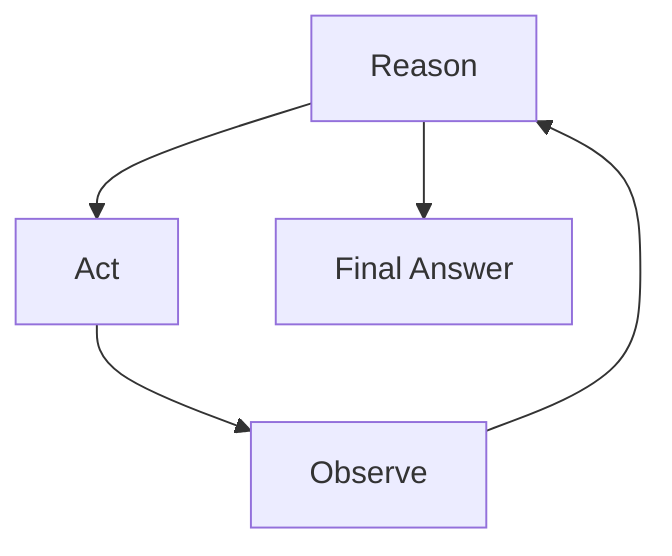

# 🎯 Day 115: LLM Agents & Tool Use

> *"A model that can only talk is a consultant. A model that can also act is an employee."*

---

## The "Never-Coded" Bridge

**Imagine an incredibly smart intern who can read, write, and reason perfectly — but can't touch a keyboard, browser, or phone.**

They can answer questions from memory, but can't look up real-time data, can't run code, can't send emails, and certainly can't book your flights.

**Tools** give LLMs hands. With tool use:
- Your LLM can search the web, query a database, call an API, run Python code, or write a file
- The **ReAct loop** (Reason → Act → Observe → Reason → Act...) is how the LLM decides *which* tool to use, *when*, and what to do next based on the result

This is the difference between a chatbot and an **autonomous AI agent that gets work done**.

---

## The Technical Deep Dive

### 0. What an "Agent" Actually Is

Strip away the hype: an LLM agent is a **loop**, not a new kind of model. The model itself doesn't change between "chatbot mode" and "agent mode" — what changes is the *control flow* wrapped around it.

**A plain chatbot call is one round-trip:** prompt in, text out, done. An agent turns that into a `while` loop: prompt in → model responds → if the response says "I need to call a tool," your code executes that tool in the real world (a database query, an API call, a calculation) → the tool's result gets appended to the conversation → the loop runs again, now with that new information available → repeat until the model produces a final answer instead of another tool call. That's it. There's no separate "agent architecture" inside the model — the LLM is just being asked, repeatedly, "given everything so far, what's the next step?"

**The ReAct pattern names the three things happening in each loop iteration:**
- **Reason** — the model's internal next-step thinking ("I need Q3 and Q2 revenue to answer this")
- **Act** — the model requests a tool call instead of a final answer (it cannot execute code itself — it can only ask your code to)
- **Observe** — your code runs the requested tool and feeds the real-world result back into the conversation as new context

The reason this loop is powerful: each iteration gives the model fresh, *grounded* information it didn't have at the start, letting it correct course based on real results rather than guessing everything up front in one shot. The reason it's risky: the model is now triggering real actions (API calls, writes, sends) based on its own judgment about what to do next — which is exactly why Section 5 (human-in-the-loop) exists.

### 1. The ReAct Loop

```
User Query: "What were our total sales for Q3 2025, and how does it compare to Q2?"

REASON: I need to query the sales database for Q3 and Q2 data.
ACT: query_database("SELECT SUM(revenue), quarter FROM sales WHERE quarter IN ('Q2', 'Q3') AND year=2025 GROUP BY quarter")
OBSERVE: [{"quarter": "Q2", "sum": 9200000}, {"quarter": "Q3", "sum": 12400000}]

REASON: I have the data. I can now calculate the YoY change and format the answer.
ACT: calculate_growth(q2=9200000, q3=12400000)
OBSERVE: 34.8% growth

REASON: I have everything needed. Composing the final answer.
ANSWER: "Q3 2025 sales were $12.4M, up 34.8% from Q2's $9.2M."
```



Reason, Act, and Observe form a feedback loop that repeats until the model has enough grounded information to exit with a final answer instead of another tool call.

### 2. OpenAI Function Calling

```python
from openai import OpenAI
import json

client = OpenAI()

# ─────────────────────────────────────────
# STEP 1: Define your tools as JSON schemas
# ─────────────────────────────────────────
tools = [
    {
        "type": "function",
        "function": {
            "name": "query_sales_database",
            "description": "Query the sales database for revenue data. Use for questions about revenue, sales, transactions.",
            "parameters": {
                "type": "object",
                "properties": {
                    "quarter": {"type": "string", "enum": ["Q1", "Q2", "Q3", "Q4"], "description": "The fiscal quarter"},
                    "year": {"type": "integer", "description": "The fiscal year (e.g., 2025)"},
                    "metric": {"type": "string", "enum": ["revenue", "units", "margin"], "description": "What to measure"},
                },
                "required": ["quarter", "year"],
            },
        },
    },
    {
        "type": "function",
        "function": {
            "name": "search_knowledge_base",
            "description": "Search internal documentation, policies, and product manuals.",
            "parameters": {
                "type": "object",
                "properties": {
                    "query": {"type": "string", "description": "The search query"},
                    "category": {"type": "string", "enum": ["policy", "product", "finance", "hr"], "description": "Document category filter"},
                },
                "required": ["query"],
            },
        },
    },
    {
        "type": "function",
        "function": {
            "name": "send_notification",
            "description": "Send a Slack notification to a channel.",
            "parameters": {
                "type": "object",
                "properties": {
                    "channel": {"type": "string", "description": "Slack channel name (e.g., #finance-alerts)"},
                    "message": {"type": "string", "description": "The message text"},
                },
                "required": ["channel", "message"],
            },
        },
    },
]

# ─────────────────────────────────────────
# STEP 2: Implement the actual tool functions
# ─────────────────────────────────────────
def query_sales_database(quarter: str, year: int, metric: str = "revenue") -> dict:
    """Mock implementation — replace with real DB query."""
    data = {
        ("Q1", 2025): {"revenue": 8200000, "units": 1840, "margin": 0.42},
        ("Q2", 2025): {"revenue": 9200000, "units": 2100, "margin": 0.44},
        ("Q3", 2025): {"revenue": 12400000, "units": 2850, "margin": 0.46},
    }
    result = data.get((quarter, year))
    if not result:
        return {"error": f"No data found for {quarter} {year}"}
    return {metric: result.get(metric), "quarter": quarter, "year": year}

def search_knowledge_base(query: str, category: str = None) -> str:
    """Mock RAG retrieval — replace with real vector search."""
    return f"[KB Result] Relevant documents found for '{query}' in category '{category}': [3 documents retrieved]"

def send_notification(channel: str, message: str) -> dict:
    """Mock Slack notification."""
    print(f"[SLACK → {channel}]: {message}")
    return {"status": "sent", "channel": channel}

TOOL_MAP = {
    "query_sales_database": query_sales_database,
    "search_knowledge_base": search_knowledge_base,
    "send_notification": send_notification,
}

# ─────────────────────────────────────────
# STEP 3: The agent loop
# ─────────────────────────────────────────
def run_agent(user_query: str, max_iterations: int = 5) -> str:
    """Run the ReAct agent loop until completion or max_iterations."""
    messages = [
        {
            "role": "system",
            "content": "You are a business intelligence assistant. Use tools to answer questions accurately. Never guess numerical data — always query the database."
        },
        {"role": "user", "content": user_query}
    ]

    for iteration in range(max_iterations):
        response = client.chat.completions.create(
            model="gpt-4o",
            messages=messages,
            tools=tools,
            tool_choice="auto"   # Let model decide when to use tools
        )

        message = response.choices[0].message

        # If no tool calls, we have a final answer
        if not message.tool_calls:
            return message.content

        # Process all tool calls in this response
        messages.append(message)  # Add assistant's reasoning + tool calls

        for tool_call in message.tool_calls:
            fn_name = tool_call.function.name
            fn_args = json.loads(tool_call.function.arguments)

            print(f"  [TOOL] {fn_name}({fn_args})")

            # Execute the tool
            fn = TOOL_MAP.get(fn_name)
            if fn:
                result = fn(**fn_args)
            else:
                result = {"error": f"Unknown tool: {fn_name}"}

            # Add tool result to messages
            messages.append({
                "role": "tool",
                "tool_call_id": tool_call.id,
                "content": json.dumps(result)
            })

    return "Max iterations reached — could not complete the task."

# Test the agent
response = run_agent("What were Q3 2025 sales and how does it compare to Q2? Alert the #finance-alerts channel with a one-line summary.")
print(response)
```

### 3. ReAct Pattern with LangChain

```python
from langchain import hub
from langchain.agents import AgentExecutor, create_react_agent
from langchain_openai import ChatOpenAI
from langchain_core.tools import tool

@tool
def get_stock_price(ticker: str) -> str:
    """Get the current stock price for a ticker symbol. Input: stock ticker (e.g., AAPL, MSFT)."""
    # Mock — replace with yfinance or financial API
    prices = {"AAPL": 189.50, "MSFT": 415.20, "GOOG": 175.80}
    price = prices.get(ticker.upper())
    if price:
        return f"{ticker.upper()}: ${price}"
    return f"Ticker {ticker} not found"

@tool
def calculate_portfolio_value(holdings: str) -> str:
    """Calculate total value of a stock portfolio.
    Input format: 'AAPL:100,MSFT:50' (ticker:shares pairs)
    """
    # Parse holdings
    total = 0.0
    breakdown = []
    prices = {"AAPL": 189.50, "MSFT": 415.20, "GOOG": 175.80}
    for holding in holdings.split(","):
        ticker, shares = holding.strip().split(":")
        price = prices.get(ticker.upper(), 0)
        value = price * int(shares)
        total += value
        breakdown.append(f"{ticker}: {shares} × ${price} = ${value:,.0f}")
    return "\n".join(breakdown) + f"\nTOTAL: ${total:,.0f}"

llm = ChatOpenAI(model="gpt-4o", temperature=0)
tools = [get_stock_price, calculate_portfolio_value]

# Pull the standard ReAct prompt from LangChain Hub
prompt = hub.pull("hwchase17/react")

agent = create_react_agent(llm, tools, prompt)
agent_executor = AgentExecutor(agent=agent, tools=tools, verbose=True, max_iterations=5)

result = agent_executor.invoke({
    "input": "What is the current value of my portfolio: 100 shares of Apple and 50 shares of Microsoft?"
})
print(result["output"])
```

### 4. Multi-Agent Orchestration

```python
from langchain_openai import ChatOpenAI
from langchain_core.messages import HumanMessage, AIMessage

# Specialist agents for a financial analysis workflow
llm = ChatOpenAI(model="gpt-4o-mini")

def data_retrieval_agent(query: str) -> str:
    """Agent specializing in database queries and data extraction."""
    system = "You are a data retrieval specialist. Identify what data is needed and return it as structured JSON. Be concise."
    msgs = [
        {"role": "system", "content": system},
        {"role": "user", "content": f"Extract the relevant data for: {query}"}
    ]
    return llm.invoke(msgs).content

def analysis_agent(data: str, question: str) -> str:
    """Agent specializing in financial analysis and insights."""
    system = "You are a senior financial analyst. Analyze the data and provide business insights with specific recommendations."
    msgs = [
        {"role": "system", "content": system},
        {"role": "user", "content": f"Data: {data}\n\nAnalyze: {question}"}
    ]
    return llm.invoke(msgs).content

def report_writer_agent(analysis: str, audience: str = "executives") -> str:
    """Agent specializing in business communication."""
    system = f"You are a business writer. Rewrite analyses for {audience}. Use bullet points, avoid jargon, max 150 words."
    msgs = [
        {"role": "system", "content": system},
        {"role": "user", "content": f"Rewrite for {audience}:\n{analysis}"}
    ]
    return llm.invoke(msgs).content

def orchestrator(user_request: str) -> str:
    """
    Orchestrates the multi-agent pipeline.
    Order: Data → Analysis → Report
    """
    print("Step 1: Retrieving data...")
    data = data_retrieval_agent(user_request)

    print("Step 2: Analyzing...")
    analysis = analysis_agent(data, user_request)

    print("Step 3: Writing report...")
    report = report_writer_agent(analysis, audience="board of directors")

    return report

# Usage
output = orchestrator("Analyze Q3 2025 performance vs Q2 and identify top risks")
print(output)
```

### 5. Agent Safety: The Human-in-the-Loop Pattern

```python
# CRITICAL: Never let agents take irreversible actions automatically
# Always implement confirmation for high-stakes operations

SAFE_OPERATIONS = {"query_sales", "search_docs", "calculate"}
REQUIRE_APPROVAL = {"send_email", "update_database", "delete_record", "send_notification"}

def safe_tool_executor(tool_name: str, args: dict, auto_approve: bool = False) -> dict:
    """
    Execute tools with human-in-the-loop for high-stakes operations.
    """
    if tool_name in REQUIRE_APPROVAL and not auto_approve:
        print(f"\n⚠️  APPROVAL REQUIRED")
        print(f"Tool: {tool_name}")
        print(f"Args: {json.dumps(args, indent=2)}")
        user_input = input("Approve? (yes/no): ").strip().lower()
        if user_input != "yes":
            return {"status": "REJECTED", "message": "User rejected this action"}

    fn = TOOL_MAP.get(tool_name)
    if not fn:
        return {"error": f"Tool not found: {tool_name}"}
    return fn(**args)
```

---

## Senior-Level Insights

### The Agent Reliability Problem

Agents are powerful but brittle:
- **Loops**: Agents can get stuck calling the same tool repeatedly if the result is ambiguous.
- **Hallucinated tool calls**: The LLM may call a tool with invalid arguments if the schema is unclear.
- **Cascading failures**: In multi-agent systems, a bad output from Agent A poisons Agent B.

**Production safeguards**: Always set `max_iterations` (5-10), log every tool call, validate tool inputs against schemas, and require human confirmation for irreversible actions.

### Agents vs Chains: When to Use Each

```
Chains: Predetermined, sequential steps. ←→ Agents: Dynamic, decide steps at runtime.

Use chains when: You know exactly what steps are needed.
    Example: Extract → Summarize → Format → Return (fixed pipeline)

Use agents when: The number/type of steps depends on the query.
    Example: "Analyze our business performance" — agent decides what data to pull, whether to compare periods, what to flag, etc.
```

---

## Pitfalls

- ⚠️ **Vague tool descriptions.** The model selects tools purely from the `description` field — it never sees your implementation. `"get data"` gives it nothing to decide on; describe exactly when to use the tool and what each parameter means.
- ⚠️ **No `max_iterations` cap.** Without a hard limit, a confused agent can loop indefinitely (and expensively) calling the same tool with slightly different arguments hoping for a different result. Always cap iterations (5-10 is typical) and fail loudly when the cap is hit.
- ⚠️ **Letting agents take irreversible actions with no approval gate.** `send_email`, `delete_record`, `update_database` should always require human confirmation until the agent has demonstrated high reliability in production — a single hallucinated tool call can cause real damage in seconds.
- ⚠️ **Forgetting that tool results are still just text appended to context.** Large tool outputs (a 500-row SQL result, a full document) consume tokens just like everything else, and can blow your context budget or trigger "lost in the middle" issues in long agent runs. Summarize or truncate large tool outputs before appending them.
- ⚠️ **Assuming the model will catch its own tool-call errors.** If you don't catch exceptions when executing a tool and feed a structured error back, the agent loop crashes instead of reasoning about the failure and trying an alternative — defeating the entire point of the loop's self-correction.

---

## Glossary

| Term | Definition |
| --- | --- |
| **Agent** | A control-flow loop around an LLM that lets the model request real-world actions (tool calls) and incorporate their results before producing a final answer. |
| **ReAct (Reasoning + Acting)** | A pattern of interleaving model reasoning, tool-call actions, and observation of tool results across multiple loop iterations. |
| **Tool / function calling** | An LLM API feature where the model can respond with a structured request to invoke a named function with specific arguments, instead of (or in addition to) plain text. |
| **Tool schema** | The JSON Schema description of a tool's name, description, and parameters that tells the model when and how to call it. |
| **tool_choice** | An API parameter controlling whether the model may, must, or must not call a tool on a given turn (`"auto"`, `"required"`, a specific function, or `"none"`). |
| **Agentic loop** | The `while` loop that repeatedly sends the conversation (including tool results) back to the model until it returns a final answer instead of another tool call. |
| **Multi-agent orchestration** | Structuring a task as a pipeline or graph of specialized agents (e.g., data retrieval → analysis → writing), each with its own system prompt and toolset. |
| **Human-in-the-loop (HITL)** | A safety pattern requiring explicit human approval before an agent executes a high-stakes or irreversible action. |
| **Max iterations** | A hard cap on how many reasoning/tool-call cycles an agent loop may run before being forced to stop, preventing runaway loops. |

---

## Hands-on Lab

### Exercise 1: Custom Tool Definition

Define proper JSON schemas for these tools:
1. `search_crm(customer_id: str, fields: list[str])` — search customer records
2. `calculate_churn_risk(company_id: str, window_days: int = 90)` — predict churn for a B2B account
3. `schedule_meeting(attendees: list[str], duration_minutes: int, title: str, preferred_time: str)` — schedule a calendar event

For each: write the full function object JSON with name, description, parameters (with types and required fields).

**EXPECTED RESULT** (schema for tool #2, as a reference for the level of detail expected on all three):
```json
{
  "type": "function",
  "function": {
    "name": "calculate_churn_risk",
    "description": "Predict the churn risk for a B2B account based on recent activity. Use when asked about a customer's likelihood to cancel, renewal risk, or account health.",
    "parameters": {
      "type": "object",
      "properties": {
        "company_id": {"type": "string", "description": "Unique identifier for the B2B account"},
        "window_days": {"type": "integer", "description": "Lookback window in days for activity analysis", "default": 90}
      },
      "required": ["company_id"]
    }
  }
}
```
Tools #1 and #3 should follow the same shape: a specific `description` stating *when* to call the tool (not just what it does), every parameter typed and described, `list[str]` parameters represented as `{"type": "array", "items": {"type": "string"}}`, and only truly mandatory fields in `required` (e.g., `preferred_time` for `schedule_meeting` is reasonably optional if your design allows a default).

### Exercise 2: Handle Tool Errors

```python
# Modify run_agent() to handle common failure scenarios:
def run_robust_agent(user_query: str) -> str:
    """
    TODO: Add error handling to the agent loop:
    1. If a tool raises an exception, catch it and return {"error": str(e)} 
       so the agent can reason about the failure and try an alternative.
    2. If the agent has been calling the same tool with the same args 3 times,
       break the loop and return "Agent stuck in loop — human review required."
    3. If total token count (sum of all messages) exceeds 10,000, 
       truncate old messages keeping only the last 4 in history.
    """
    pass

# EXPECTED RESULT (behavioral test cases):
#   1. A tool that raises ValueError("invalid ticker") should result in the
#      agent receiving {"error": "invalid ticker"} as the tool message content
#      (not an unhandled exception crashing run_robust_agent), and the next
#      model turn should attempt a different approach or ask for clarification.
#   2. If query_sales_database is called 3 times in a row with the EXACT same
#      arguments, run_robust_agent should return the literal string
#      "Agent stuck in loop — human review required." instead of calling a 4th time.
#   3. Simulate a long-running conversation (15+ tool round-trips); once the
#      summed message length crosses ~10,000 tokens, only the system message
#      + last 4 messages should remain in `messages` before the next API call —
#      verify with len(messages) <= 5 at that point.
```

### Exercise 3: Build a Data Analysis Agent

```python
# Build an agent that can:
# 1. Query a simple in-memory dataset (provided below)
# 2. Calculate statistics (sum, avg, min, max, growth rate)
# 3. Answer business questions in plain English

import json

# Simple in-memory "database"
SALES_DATA = {
    "2025-Q1": {"revenue": 8200000, "customers": 142, "churn_rate": 0.05},
    "2025-Q2": {"revenue": 9200000, "customers": 159, "churn_rate": 0.04},
    "2025-Q3": {"revenue": 12400000, "customers": 201, "churn_rate": 0.03},
}

# TODO: Define 3 tools:
# - get_quarter_data(quarter: str) → returns the dict for that quarter
# - calculate_growth(metric: str, from_quarter: str, to_quarter: str) → % change
# - find_best_quarter(metric: str) → which quarter had highest value

# TODO: Build an agent with these tools that can answer:
# "In which quarter did we grow the fastest, and by how much?"
# "What is the average monthly revenue in Q3?"
# "Is our churn rate improving?"

# EXPECTED RESULT:
#   "In which quarter did we grow the fastest, and by how much?"
#     -> Q1→Q2 growth = (9.2M-8.2M)/8.2M = 12.2%
#        Q2→Q3 growth = (12.4M-9.2M)/9.2M = 34.8%
#        Correct answer: "Q3 grew fastest, up 34.8% from Q2."
#   "What is the average monthly revenue in Q3?"
#     -> Q3 quarterly revenue is $12.4M / 3 months = ~$4.13M/month
#        (the agent must derive this — there's no monthly field in the data,
#        so it should reason: quarterly_revenue / 3, not fabricate a number)
#   "Is our churn rate improving?"
#     -> churn_rate: 0.05 (Q1) -> 0.04 (Q2) -> 0.03 (Q3): consistently
#        decreasing -> "Yes, churn improved from 5% to 3% over the last
#        two quarters."
# If your agent's find_best_quarter or calculate_growth tools return raw
# numbers without the agent contextualizing them in the final answer, the
# tool design is fine but the system prompt needs to instruct it to always
# explain the "why" behind the numbers, not just restate them.
```

---

## Mastery Check

**Q1**: What is the ReAct pattern and what problem does it solve?
<details><summary>Answer</summary>
ReAct (Reasoning + Acting) is an agent framework where the LLM interleaves reasoning steps ("I need to query the database for Q3 data") with action steps (calling the database tool) and observation steps (processing the result). It solves the "one-shot bottleneck" where complex tasks can't be done in a single forward pass — ReAct allows iterative information gathering before composing a final answer. The model can self-correct based on tool results that don't match expectations.
</details>

**Q2**: Why should functions have very clear, specific descriptions in the tool schema?
<details><summary>Answer</summary>
The LLM chooses which tool to call based entirely on the description — it can't execute code to understand what a tool does. Vague descriptions lead to wrong tool selection. For example, `"get data"` offers no signal about when to use it; `"Query the sales database for revenue, units sold, or margin by quarter and year"` makes the choice obvious. Also, the parameter descriptions must explain exactly what values are valid — a poorly described `quarter` parameter that accepts "Q3" or "Q3 2025" interchangeably will cause JSON parsing errors.
</details>

**Q3**: What is the difference between single-agent and multi-agent architectures?
<details><summary>Answer</summary>
A single agent handles all tasks with all tools. Multi-agent architecture divides work by specialty: a data retrieval agent fetches structured data, an analysis agent interprets it, and a writer agent formats it for a specific audience. Multi-agent is better when: tasks have very different system prompts (a data agent needs a terse, precise persona; a writer needs a communication-focused persona), when parallel execution is needed, or when specialist models (fine-tuned for coding vs writing) should be routed to appropriately.
</details>

**Q4**: What is the `tool_choice` parameter in OpenAI's API and what values can it take?
<details><summary>Answer</summary>
`tool_choice` controls how the model uses tools: `"auto"` — model decides whether to call a tool or respond directly (usually the right choice); `"required"` — model MUST call a tool on every turn (use when you always need structured data extraction); `{"type": "function", "function": {"name": "my_func"}}` — forces the model to call a specific function (use for deterministic pipelines); `"none"` — disables tool calling entirely. Most agentic systems use `"auto"` and let the model reason about when tools are needed.
</details>

**Q5**: Why is "human-in-the-loop" critical for production agents?
<details><summary>Answer</summary>
Agents can take irreversible actions: sending emails to customers, updating database records, deleting files, or triggering financial transactions. A bug in the agent loop (wrong tool args, misinterpreted user intent, prompt injection) can cause real-world harm in seconds — far faster than a developer can intervene. HITL patterns require explicit user confirmation for destructive/irreversible operations. Start with full confirmation for every action, collect reliability data, then automate only the actions where the agent has demonstrated >99% accuracy.
</details>

---

## Further Reading

- [OpenAI Function Calling Guide](https://platform.openai.com/docs/guides/function-calling)
- [ReAct: Synergizing Reasoning and Acting in Language Models](https://react-lm.github.io/)
- [LangGraph — Stateful Multi-Agent Orchestration](https://langchain-ai.github.io/langgraph/)
- [CrewAI — Multi-Agent Collaboration Framework](https://www.crewai.com/)
- [OWASP LLM Top 10 — Agent Security Considerations](https://owasp.org/www-project-top-10-for-large-language-model-applications/)

---

## Summary

- ✅ **ReAct loop**: Reason → Act → Observe → Repeat — enables iterative, self-correcting LLM workflows.
- ✅ **Function calling**: Define tool schemas (JSON) → LLM selects and invokes → return results to message history.
- ✅ **Tool descriptions**: The most critical part — unclear descriptions lead to wrong tool selection.
- ✅ **Multi-agent**: Specialist agents (data → analysis → writer) for better output quality and parallel execution.
- ✅ **Safety**: Always cap iterations, log all tool calls, require human approval for irreversible actions.

**Tomorrow → Day 116**: **LLM Ops & Cost Management** — token optimization, caching, prompt compression, tracing, and running LLMs profitably at scale.
