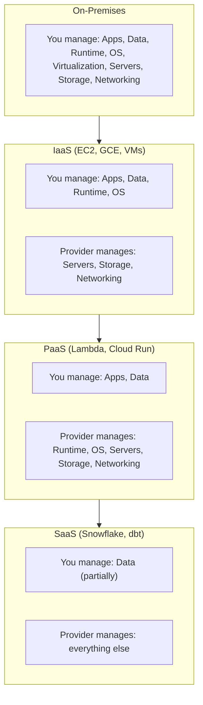

# ☁️ Day 126: Cloud Fundamentals — AWS, GCP, Azure

> *"The cloud isn't someone else's computer — it's someone else's data centre that bills you by the second."*

---

## The "Never-Coded" Bridge

**Think of cloud computing like real estate.**

You could **build your own office building** (on-premises) — total control, massive upfront cost, and you maintain everything from the plumbing to the roof. Or you could **rent serviced office space** (cloud) — move in immediately, pay monthly, scale up or down as your team changes, and someone else fixes the roof.

Cloud computing applies this principle to IT infrastructure. Instead of buying servers, you rent compute, storage, and networking by the hour. The three major "landlords" — **AWS**, **GCP**, and **Azure** — each offer slightly different floor plans.

For data engineers, the cloud isn't optional — it's where 85% of new enterprise data platforms are being built in 2026.

---

## The Technical Deep Dive

### 1. Cloud Computing Models



As you move from on-premises to SaaS, the slice of the stack you're responsible for shrinks and the provider's slice grows.

### 2. The Big Three — Comparison for Data Engineers

| Feature                 | AWS                      | GCP                           | Azure                        |
| ----------------------- | ------------------------ | ----------------------------- | ---------------------------- |
| **Data Warehouse**      | Redshift                 | BigQuery                      | Synapse Analytics            |
| **Object Storage**      | S3                       | Cloud Storage (GCS)           | Blob Storage                 |
| **Serverless Compute**  | Lambda                   | Cloud Functions / Cloud Run   | Azure Functions              |
| **Stream Processing**   | Kinesis                  | Pub/Sub + Dataflow            | Event Hubs                   |
| **Orchestration**       | MWAA (Managed Airflow)   | Cloud Composer                | Data Factory                 |
| **ML Platform**         | SageMaker                | Vertex AI                     | Azure ML                     |
| **IAM Model**           | IAM Policies + Roles     | IAM + Service Accounts        | RBAC + Entra ID (AAD)        |
| **Market Share (2025)** | ~32%                     | ~12%                          | ~23%                         |
| **Strength**            | Broadest service catalog | Best for analytics/AI         | Best for enterprises on M365 |
| **Pricing Model**       | Pay-per-use, reserved    | Sustained-use discounts, flat | Enterprise agreements        |

**AWS** wins on breadth: if you need a niche managed service — IoT, satellite ground stations, quantum computing — AWS probably already shipped it. That breadth has a tax, though: AWS's IAM model and service sprawl (200+ services) mean more surface area for misconfiguration, more decisions per project, and a steeper ramp for new hires. Teams choose AWS when they need "a service for everything" and have the platform engineering maturity to manage the complexity.

**GCP** wins on analytics economics: BigQuery's serverless, pay-per-query model and genuinely excellent query optimizer make it the cheapest path to "ask a question of 50TB of data right now" for most mid-size teams. The trade-off is ecosystem depth — GCP has fewer third-party integrations, a smaller bench of consultants and systems integrators, and noticeably thinner enterprise support compared to AWS or Azure, which can matter when something breaks at 2 a.m. and you need a vendor on the phone.

**Azure** wins when the organization already lives in Microsoft's world: Entra ID (AAD) becomes your single IAM source of truth across Office 365, on-prem Active Directory, and cloud resources, and Power BI/Synapse integrate natively with tools business users already know. The cost is on the analytics-native side — Synapse and its surrounding tooling are generally considered less mature and less performant than BigQuery or Snowflake for pure large-scale analytical workloads, so Azure-first data teams often end up bolting on Databricks or Snowflake anyway.

### 3. Regions and Availability Zones

```python
# Choosing the right region for your data platform
# Factors: data residency laws, latency, service availability, cost

region_decision = {
    "data_residency": {
        "EU customers": "eu-west-1 (Ireland) or eu-central-1 (Frankfurt)",
        "India": "ap-south-1 (Mumbai)",
        "US": "us-east-1 (Virginia) — cheapest, most services",
    },
    "latency": "Choose region closest to your users and data sources",
    "cost_variation": {
        "us-east-1": 1.00,   # Baseline (cheapest)
        "eu-west-1": 1.08,   # ~8% premium
        "ap-south-1": 1.12,  # ~12% premium
        "sa-east-1": 1.40,   # ~40% premium (São Paulo)
    },
    "availability_zones": """
        Each region has 3+ AZs (physically separate data centres).
        Deploy across 2+ AZs for high availability.
        Cross-AZ data transfer has minimal cost (~$0.01/GB).
    """,
}
```

### 4. IAM — Identity and Access Management

```python
# AWS IAM Policy: Least-privilege for a data engineer
data_engineer_policy = {
    "Version": "2012-10-17",
    "Statement": [
        {
            "Sid": "ReadFromDataLake",
            "Effect": "Allow",
            "Action": ["s3:GetObject", "s3:ListBucket"],
            "Resource": [
                "arn:aws:s3:::company-data-lake",
                "arn:aws:s3:::company-data-lake/*",
            ],
        },
        {
            "Sid": "WriteToProcessedBucket",
            "Effect": "Allow",
            "Action": ["s3:PutObject", "s3:DeleteObject"],
            "Resource": "arn:aws:s3:::company-processed/*",
        },
        {
            "Sid": "RunGlueJobs",
            "Effect": "Allow",
            "Action": [
                "glue:StartJobRun",
                "glue:GetJobRun",
                "glue:GetJob",
            ],
            "Resource": "arn:aws:glue:us-east-1:123456789:job/etl-*",
        },
        {
            "Sid": "QueryRedshift",
            "Effect": "Allow",
            "Action": ["redshift-data:ExecuteStatement"],
            "Resource": "*",
            "Condition": {
                "StringEquals": {"redshift:DbUser": "data_engineer_role"}
            },
        },
    ],
}

# Key IAM principles:
# 1. Least privilege: grant minimum permissions needed
# 2. Role-based: assign policies to roles, not individual users
# 3. Service accounts: machines use service accounts, not human credentials
# 4. MFA: enforce multi-factor authentication for console access
# 5. Audit: enable CloudTrail/Audit Logs for all API calls
```

### 5. Cloud Cost Management

```python
# Monthly cost estimation for a mid-size data platform

cost_estimate = {
    "compute": {
        "description": "3x m5.xlarge EC2 instances (Airflow)",
        "monthly_cost": 3 * 0.192 * 730,  # $420/mo
    },
    "storage": {
        "description": "10 TB in S3 Standard",
        "monthly_cost": 10 * 1024 * 0.023,  # $235/mo
    },
    "data_warehouse": {
        "description": "BigQuery — 50 TB stored, 5 TB scanned/mo",
        "storage_cost": 50 * 20,     # $1,000/mo (active storage)
        "query_cost": 5 * 1024 * 6.25 / 1024,  # $31/mo (on-demand)
    },
    "data_transfer": {
        "description": "500 GB egress/mo",
        "monthly_cost": 500 * 0.09,  # $45/mo
    },
    "total_estimated": "$1,731/mo",
    "optimization_tips": [
        "Use Reserved Instances for predictable compute (save 40-72%)",
        "Archive cold data to S3 Glacier (save 80%)",
        "BigQuery: use partitioned/clustered tables (reduce scanned data 90%)",
        "Set billing alerts at 80% and 100% of budget",
        "Tag all resources for cost attribution by team/project",
    ],
}
```

---

## Senior-Level Insights

### The Multi-Cloud Reality

Most enterprises use 2+ clouds. The data engineer's job is to pick the **right tool per cloud**, not to be dogmatic about one provider:

- **BigQuery** for ad-hoc analytics (best price-performance for SQL)
- **S3** for object storage (deepest ecosystem integration)
- **Azure** for anything Microsoft-adjacent (Power BI, Teams, M365)

### The FinOps Discipline

Cloud costs are the #1 concern for CTOs. As a data engineer, you'll be asked to justify every dollar:

> *"Why is our BigQuery bill $8,000/month?"*

The answer is never "because cloud is expensive." It's always: "Here's the query breakdown, here's what we're optimizing, and here's the ROI vs. the $2.3M in revenue this data platform enables."

---

## Glossary

| Term | Definition |
| --- | --- |
| **IaaS** | Infrastructure as a Service — the provider manages physical hardware, virtualization, and networking; you manage the OS, runtime, and everything above it (e.g., EC2, GCE). |
| **PaaS** | Platform as a Service — the provider also manages the OS and runtime; you just deploy code (e.g., Lambda, Cloud Run). |
| **SaaS** | Software as a Service — fully managed application; you just use it (e.g., Snowflake, dbt Cloud). |
| **Shared Responsibility Model** | The split between what the cloud provider secures (physical infrastructure, hypervisor, network) and what the customer secures (data, IAM, application config, encryption). |
| **IAM** | Identity and Access Management — the system for defining who (or what service) can do what, on which resources. |
| **Region** | A geographic area containing multiple data centres, chosen for data residency, latency, and cost. |
| **Availability Zone (AZ)** | A physically separate data centre within a region; deploying across 2+ AZs protects against single-data-centre failures. |
| **Reserved Instance** | Compute capacity purchased with a 1-3 year commitment in exchange for a 40-72% discount over on-demand pricing. |
| **Spot Instance** | Spare compute capacity sold at a steep discount, which the provider can reclaim with little notice — good for fault-tolerant, interruptible workloads. |
| **FinOps** | The discipline of continuously tracking, attributing, and optimizing cloud spend across engineering and finance teams. |
| **Egress** | Data transferred *out* of a cloud provider's network (e.g., to the internet or another cloud); typically the most expensive type of data transfer. |
| **Least Privilege** | The security principle of granting only the minimum permissions needed to perform a task, nothing more. |

---

## Hands-on Lab

### Exercise 1: Cost Calculator

FinOps teams don't reconstruct cost math in a spreadsheet every time a stakeholder asks "what would 10 more instances cost us?" — they build a single reusable function that takes the cost drivers as parameters and returns a structured breakdown, so the same logic powers budgeting, alerting, and "what-if" scenarios. The function below is that pattern in miniature: every pricing dimension (compute, storage, query, egress) becomes a parameter rather than a hardcoded number.

```python
def estimate_monthly_cost(
    compute_instances: int,
    instance_hourly_rate: float,
    storage_tb: float,
    storage_price_per_gb: float,
    query_tb_scanned: float,
    query_price_per_tb: float,
    egress_gb: float,
) -> dict:
    """
    TODO: Calculate monthly cloud costs broken down by category.
    Return total and per-category breakdown.
    Assume 730 hours per month for compute.
    """
    pass

# Test: 5 instances at $0.20/hr, 20TB storage at $0.023/GB,
#        10TB queried at $5/TB, 1TB egress at $0.09/GB

# EXPECTED RESULT
# Arithmetic:
#   compute = 5 instances * $0.20/hr * 730 hr/mo        = $730.00
#   storage = 20 TB * 1024 GB/TB * $0.023/GB             = $471.04
#   query   = 10 TB * $5/TB                              = $50.00
#   egress  = 1 TB * 1024 GB/TB * $0.09/GB                = $92.16
#   total   = 730.00 + 471.04 + 50.00 + 92.16            = $1,343.20
#
# estimate_monthly_cost(5, 0.20, 20, 0.023, 10, 5, 1024) ->
# {
#     "compute": 730.00,
#     "storage": 471.04,
#     "query": 50.00,
#     "egress": 92.16,
#     "total": 1343.20,
# }
```

### Exercise 2: IAM Policy Design

```python
# Scenario: Your company has three teams:
# - Data Engineers: read/write to raw and processed S3 buckets, run Glue jobs
# - Data Analysts: read-only access to processed data, query Redshift
# - ML Engineers: read processed data, write to model artifacts bucket, use SageMaker

# TODO: Design three IAM policies (as Python dicts) following least-privilege.
# Each policy should have at least 3 statements.

data_engineer_policy = {}
data_analyst_policy = {}
ml_engineer_policy = {}
```

### Exercise 3: Cloud Provider Selection

For each scenario, choose the best cloud provider and justify in 2 sentences:

1. A startup building a real-time analytics dashboard with a small team (3 engineers).
2. A Fortune 500 bank with strict regulatory requirements and existing Microsoft infrastructure.
3. A machine learning company training large models and running hundreds of experiments daily.
4. A government agency with data residency requirements for a specific country.

---

## Mastery Check

**Q1**: What is the shared responsibility model and why does it matter for data engineers?
<details><summary>Answer</summary>

The shared responsibility model defines what the cloud provider secures (physical infrastructure, hypervisor, network) vs. what you secure (data, IAM, application config, encryption). Data engineers must understand this because misconfigured S3 buckets and overly permissive IAM policies are the #1 cause of cloud data breaches — these are YOUR responsibility, not AWS's.
</details>

**Q2**: Your BigQuery bill jumped from $500/month to $5,000/month. What are the first 3 things you investigate?
<details><summary>Answer</summary>

1. **Check query logs**: Identify which queries scanned the most data — look for `SELECT *` without `WHERE` clauses on large tables.
2. **Check table partitioning**: Are analysts querying unpartitioned tables and scanning entire datasets? Add date partitioning + clustering.
3. **Check for recurring queries**: Are expensive queries running on a schedule (e.g., every 5 minutes instead of daily)? Optimize frequency and cache results.
</details>

**Q3**: Why should data engineers avoid using root/admin credentials for daily work?
<details><summary>Answer</summary>

Root credentials have unrestricted access — a compromised root account can delete all data, spin up expensive resources, and access every secret. Use dedicated IAM roles with least-privilege permissions for daily work. Root should only be used for initial account setup, billing changes, and emergency access — with MFA always enabled.
</details>

**Q4**: A data engineer proposes running the data platform on a single availability zone to save costs. What's the risk?
<details><summary>Answer</summary>

A single AZ is a single point of failure. If that data centre experiences a power outage, network issue, or hardware failure, your entire platform goes down. Cross-AZ deployment costs ~$0.01/GB for data transfer — a trivial cost compared to the business impact of downtime. Always deploy critical workloads across 2+ AZs.
</details>

**Q5**: What is the difference between on-demand and reserved pricing, and when should you use each?
<details><summary>Answer</summary>

On-demand: pay by the hour/second with no commitment, full flexibility. Reserved: commit to 1-3 years for 40-72% discount. Use on-demand for development, testing, and variable workloads. Use reserved for production workloads with predictable utilization (e.g., 24/7 Airflow workers, always-on databases). Many teams use a mix: reserved for baseline + on-demand for burst capacity.
</details>

---

## Further Reading

- [AWS Well-Architected Framework](https://aws.amazon.com/architecture/well-architected/) — 6 pillars of cloud architecture
- [GCP Cloud Architecture Center](https://cloud.google.com/architecture) — Reference architectures for data platforms
- [FinOps Foundation](https://www.finops.org/) — Cloud financial management best practices
- [Cloud Comparison Tool](https://comparecloud.in/) — Side-by-side service comparison

---

## Summary

- ✅ **Three cloud models**: IaaS (you manage OS up), PaaS (just deploy code), SaaS (just use it)
- ✅ **Big three providers**: AWS (broadest), GCP (best analytics/AI), Azure (best for Microsoft shops)
- ✅ **IAM**: Least privilege, role-based, service accounts, MFA, audit trails
- ✅ **Cost management**: Reserved instances, storage tiers, query optimization, billing alerts
- ✅ **Regions**: Choose by data residency, latency, cost, and service availability

**Tomorrow → Day 127**: **Object Storage** — S3, GCS, Delta Lake, and Iceberg — the foundation of every modern data platform.
