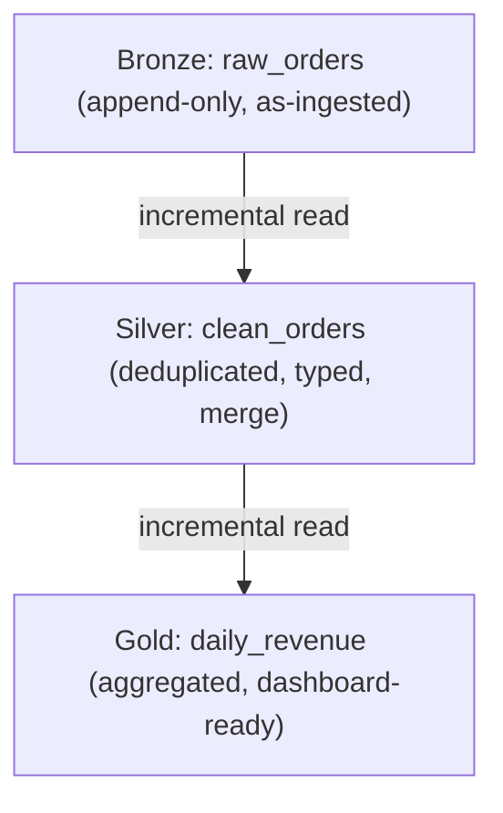

# 🏠 Day 132: Lakehouse Architecture — Databricks, Unity Catalog, Delta Live Tables

> *"The lakehouse ended the data lake vs. data warehouse debate — by combining the best of both into a single platform."*

---

## The "Never-Coded" Bridge

**Data lakes** are like a giant filing room — cheap, stores everything, but chaotic. No schema enforcement, no ACID transactions, no way to efficiently query without reading everything. **Data warehouses** are like a perfectly organized library — fast queries, strong governance, but expensive and can only store structured data.

The **lakehouse** is both: store everything cheaply in open formats (like a data lake), but with transactions, schema enforcement, and SQL performance (like a warehouse). Databricks pioneered this with **Delta Lake** as the storage layer and **Unity Catalog** as the governance layer.

---

## The Technical Deep Dive

### 1. Lakehouse vs. Lake vs. Warehouse

| Feature                | Data Lake                | Data Warehouse     | Lakehouse             |
| ---------------------- | ------------------------ | ------------------ | --------------------- |
| **Storage**            | Object storage           | Proprietary format | Object storage (open) |
| **Format**             | Any (CSV, JSON, Parquet) | Proprietary        | Delta Lake / Iceberg  |
| **ACID Transactions**  | ❌ No                     | ✅ Yes              | ✅ Yes                 |
| **Schema Enforcement** | ❌ No                     | ✅ Yes              | ✅ Yes                 |
| **SQL Performance**    | 🐌 Slow                   | 🚀 Fast             | 🚀 Fast (Photon)       |
| **ML/DS Workloads**    | ✅ Yes                    | ❌ Limited          | ✅ Yes                 |
| **Unstructured Data**  | ✅ Yes                    | ❌ No               | ✅ Yes                 |
| **Cost**               | 💰 Low                    | 💰💰💰 High           | 💰💰 Medium             |
| **Governance**         | ❌ Manual                 | ✅ Built-in         | ✅ Unity Catalog       |

### Choosing a Table Format: Delta Lake vs. Iceberg vs. Apache Hudi

The table above names "Delta Lake / Iceberg" as the open storage format for a lakehouse, but doesn't say which one to pick — or where Apache Hudi fits in. The three open table formats overlap heavily but optimize for different workloads:

| Dimension | Delta Lake | Apache Iceberg | Apache Hudi |
| --- | --- | --- | --- |
| **Primary strength** | Deep integration with ACID transactions, time travel, and DLT-style declarative pipelines | Multi-engine interoperability and flexible partition evolution without rewriting data | Fast, incremental upserts and native change-data-capture (CDC) |
| **Best engine/ecosystem fit** | Databricks / Spark-first shops | Engine-agnostic: Trino, Snowflake, BigQuery, Spark, Flink | Spark/Flink shops doing heavy streaming writes |
| **Write pattern** | Batch-heavy, with good streaming reads | Batch-heavy, schema/partition evolution over time | Streaming-upsert-heavy, frequent small writes |
| **Choose this when...** | You're standardized on Databricks/Spark and want batch + streaming reads from one format. | You need multiple query engines reading the same tables and expect partitioning schemes to change. | You're ingesting high-frequency CDC streams and need the most efficient incremental upserts (e.g., near-real-time database replication into the lake). |

### 2. Databricks Architecture

```python
# Databricks Workspace Organization
workspace = {
    "catalog": "prod_analytics",           # Unity Catalog top-level namespace
    "schemas": {
        "bronze": "Raw data, as-ingested",
        "silver": "Cleaned, typed, deduplicated",
        "gold": "Business-ready aggregates and features",
    },
    "tables": {
        "bronze.raw_orders": "Delta table, append-only, partitioned by date",
        "silver.clean_orders": "Delta table, incremental merge, deduplicated",
        "gold.daily_revenue": "Delta table, aggregated, powers dashboards",
    },
}

# Unity Catalog: Three-level namespace
# catalog.schema.table → prod_analytics.gold.daily_revenue
# This enables:
# 1. Multi-workspace governance (dev/staging/prod share the same catalog)
# 2. Fine-grained access control (column-level, row-level)
# 3. Lineage tracking (who reads what, where does data flow)
# 4. Data discovery (search across all catalogs)
```



Each layer only reads the new rows from the layer below, so incremental processing flows forward without ever re-scanning the full upstream table.

### 3. Delta Live Tables (DLT) — Declarative Pipelines

```python
# DLT: Declare WHAT you want, not HOW to process it
# Databricks handles incremental processing, error handling, and data quality

import dlt
from pyspark.sql.functions import col, when, current_timestamp

@dlt.table(
    name="raw_orders",
    comment="Bronze: Raw orders from source system",
    table_properties={"quality": "bronze"},
)
def raw_orders():
    return (
        spark.readStream
        .format("cloudFiles")  # Auto Loader
        .option("cloudFiles.format", "json")
        .option("cloudFiles.schemaLocation", "/checkpoints/raw_orders")
        .load("s3://raw-bucket/orders/")
    )

@dlt.table(
    name="clean_orders",
    comment="Silver: Cleaned and validated orders",
    table_properties={"quality": "silver"},
)
@dlt.expect_or_drop("valid_amount", "total_amount > 0")
@dlt.expect_or_drop("valid_date", "order_date IS NOT NULL")
@dlt.expect("reasonable_amount", "total_amount < 100000", on_violation="warn")
def clean_orders():
    return (
        dlt.read_stream("raw_orders")
        .withColumn("total_amount", col("total_amount").cast("decimal(12,2)"))
        .withColumn("order_date", col("order_date").cast("date"))
        .withColumn("processed_at", current_timestamp())
        .dropDuplicates(["order_id"])
    )

@dlt.table(
    name="daily_revenue",
    comment="Gold: Daily revenue aggregates",
    table_properties={"quality": "gold"},
)
def daily_revenue():
    return (
        dlt.read("clean_orders")
        .groupBy("order_date", "region")
        .agg(
            {"total_amount": "sum", "order_id": "countDistinct"}
        )
        .withColumnRenamed("sum(total_amount)", "total_revenue")
        .withColumnRenamed("count(DISTINCT order_id)", "total_orders")
    )
```

### 4. Unity Catalog Governance

```sql
-- Grant fine-grained access to different teams

-- Data engineers: full access to all schemas
GRANT ALL PRIVILEGES ON CATALOG prod_analytics TO `data-engineers`;

-- Analysts: read-only to silver and gold
GRANT USAGE ON CATALOG prod_analytics TO `analysts`;
GRANT SELECT ON SCHEMA prod_analytics.silver TO `analysts`;
GRANT SELECT ON SCHEMA prod_analytics.gold TO `analysts`;

-- ML engineers: read gold, write to features schema
GRANT SELECT ON SCHEMA prod_analytics.gold TO `ml-engineers`;
GRANT ALL PRIVILEGES ON SCHEMA prod_analytics.features TO `ml-engineers`;

-- Row-level security: analysts only see their region
CREATE FUNCTION region_filter(region STRING)
RETURN IF(IS_ACCOUNT_GROUP_MEMBER('global-analysts'), true, region = current_user_region());

ALTER TABLE prod_analytics.gold.daily_revenue
SET ROW FILTER region_filter ON (region);

-- Column masking: hide PII from non-privileged users
CREATE FUNCTION mask_email(email STRING)
RETURN IF(IS_ACCOUNT_GROUP_MEMBER('pii-access'), email, REGEXP_REPLACE(email, '(.).*@', '***@'));

ALTER TABLE prod_analytics.silver.customers
ALTER COLUMN email SET MASK mask_email;
```

---

## Senior-Level Insights

### Photon: Databricks' Secret Weapon

Photon is Databricks' C++ query engine that replaces the Spark SQL engine for supported operations. It's 3-12x faster for SQL workloads and costs the same (included in SQL warehouses and premium clusters). Always use Photon-enabled clusters for SQL analytics workloads.

### The Vendor Lock-in Question

Databricks uses Delta Lake (open source) on open storage (S3/GCS/ADLS). Your data is never locked in — you can read Delta tables from Spark, Trino, Presto, or any engine that supports the Delta protocol. However, Unity Catalog and DLT are Databricks-specific — that governance layer doesn't transfer.

---

## Glossary

| Term | Definition |
| --- | --- |
| **Lakehouse** | An architecture that combines data lake storage (cheap, open formats) with data warehouse features (ACID transactions, schema enforcement, fast SQL) in a single platform. |
| **Delta Lake** | An open-source storage layer that adds ACID transactions, schema enforcement, and time travel on top of Parquet files in object storage. |
| **Unity Catalog** | Databricks' centralized governance layer providing a three-level namespace, fine-grained access control, lineage tracking, and data discovery across workspaces. |
| **Delta Live Tables (DLT)** | A declarative framework for building ETL pipelines in Databricks; you define the desired tables and Databricks handles incremental processing and quality checks. |
| **Photon Engine** | Databricks' native C++ vectorized query engine that accelerates SQL and DataFrame workloads 3-12x over standard Spark, at no extra cost on supported clusters. |
| **ACID Transaction** | A database operation guaranteed to be Atomic, Consistent, Isolated, and Durable — ensuring concurrent reads/writes don't corrupt or partially apply data. |
| **Schema Enforcement** | The system rejects writes that don't match the expected table schema, preventing silent data corruption from malformed or unexpected columns. |
| **Medallion Architecture** | A data design pattern with three layers — bronze (raw), silver (cleaned/validated), gold (business-ready aggregates) — used to progressively refine data quality. |
| **Row-Level Security** | An access control mechanism that filters which rows a user can see in a table based on their identity or group membership (e.g., analysts only see their own region). |
| **Column Masking** | A governance technique that obscures or redacts sensitive column values (e.g., emails, SSNs) for users who lack the required permission group. |
| **Auto Loader** | A Databricks feature (`cloudFiles` format) that incrementally and efficiently processes new files landing in cloud storage using cloud-native notifications instead of file listing. |
| **Three-Level Namespace** | Unity Catalog's `catalog.schema.table` addressing scheme, which allows the same governance model to span multiple workspaces and environments. |

---

## Hands-on Lab

### Exercise 1: Design a Unity Catalog Namespace

```python
# Scenario: A retail company with these teams:
# - Data Engineering (build pipelines)
# - Marketing Analytics (campaign reporting)
# - Finance (revenue reconciliation, PII access)
# - ML Team (features, model training)

# TODO: Design the catalog/schema hierarchy and access matrix
# Include: which teams can read/write which schemas
# Consider: PII columns, row-level security by region
```

```python
# EXPECTED RESULT — Access matrix (schema x team -> permission)
#
# Catalog: prod_retail
# Schemas: bronze, silver, gold, finance, features
#
# | Schema    | Data Engineering | Marketing Analytics | Finance        | ML Team        |
# |-----------|------------------|----------------------|----------------|----------------|
# | bronze    | ALL PRIVILEGES   | NO ACCESS            | NO ACCESS      | SELECT         |
# | silver    | ALL PRIVILEGES   | SELECT (row-filtered)| SELECT (full)  | SELECT         |
# | gold      | ALL PRIVILEGES   | SELECT (row-filtered)| SELECT (full)  | SELECT         |
# | finance   | SELECT           | NO ACCESS            | ALL PRIVILEGES | NO ACCESS      |
# | features  | ALL PRIVILEGES   | NO ACCESS            | NO ACCESS      | ALL PRIVILEGES |
#
# Row-level security by region:
# - silver.customers and gold.daily_revenue have a ROW FILTER on `region`.
# - Marketing Analytics sees only their assigned region's rows (e.g., "NA-analysts" -> region = 'NA').
# - Finance and Data Engineering are in the 'global-analysts' group and bypass the filter (see all regions).
#
# PII column masking:
# - silver.customers.email, silver.customers.phone, silver.customers.ssn use MASK functions.
# - Only Finance (in the 'pii-access' group) sees unmasked values; Marketing Analytics and ML Team see masked values.
# - bronze schema is considered pre-validation and is restricted entirely from Marketing Analytics
#   to avoid exposure to unmasked, unvalidated PII.
```

### Exercise 2: DLT Quality Expectations

```python
# TODO: Write DLT expectations for a customer table:
# 1. email must not be null
# 2. email must match a basic regex pattern
# 3. age must be between 13 and 120 (warn, don't drop)
# 4. created_at must not be in the future (drop bad rows)
# 5. country_code must be a valid 2-letter ISO code
```

### Exercise 3: Lakehouse Migration Plan

```
Scenario: A company currently uses:
- 30 TB in PostgreSQL (OLTP + analytics queries causing slowdowns)
- 100 GB of CSV files on a shared drive
- 20 Python scripts run manually by analysts

TODO: Design a lakehouse migration plan:
1. What goes into bronze/silver/gold?
2. What should use streaming vs batch ingestion?
3. How do you handle the transition period (old + new systems)?
4. What governance policies do you set up in Unity Catalog?
```

---

## Mastery Check

**Q1**: What problem does the lakehouse solve that data lakes and warehouses individually cannot?
<details><summary>Answer</summary>
Data lakes have cheap storage for all data types but lack transactions, governance, and query performance. Warehouses have great SQL performance and governance but can't handle unstructured data and are expensive. The lakehouse provides ACID transactions, schema enforcement, and fast SQL queries on top of cheap object storage — supporting both BI and ML workloads from a single copy of the data.
</details>

**Q2**: What is the purpose of DLT expectations (`@dlt.expect_or_drop`)?
<details><summary>Answer</summary>
DLT expectations define data quality rules inline with your pipeline. `expect_or_drop` removes rows that fail the check (e.g., null emails), `expect` logs a warning but keeps the row, and `expect_or_fail` halts the entire pipeline on violation. This provides built-in data quality monitoring without external frameworks — quality metrics appear in the DLT dashboard.
</details>

**Q3**: How does Unity Catalog differ from database-level GRANT statements?
<details><summary>Answer</summary>
Unity Catalog provides centralized, cross-workspace governance — one set of permissions applies across all Databricks workspaces (dev, staging, prod). It also adds column masking, row-level security, data lineage, and audit logging that simple GRANT statements don't provide. Think of it as a governance layer above individual databases.
</details>

**Q4**: What is Databricks Auto Loader and why is it preferred over manual file listing?
<details><summary>Answer</summary>
Auto Loader (`cloudFiles`) automatically detects and processes new files as they arrive in cloud storage. It uses cloud notifications (S3 SNS/SQS or GCS Pub/Sub) instead of listing all files — which is critical when you have millions of files in a directory. File listing at that scale is slow and expensive; Auto Loader scales to billions of files with constant-time detection.
</details>

**Q5**: Should you always use the lakehouse pattern? When might a traditional warehouse be better?
<details><summary>Answer</summary>
A traditional warehouse (Snowflake, BigQuery) may be better when: (1) your data is 100% structured/tabular, (2) you have no ML workloads, (3) your team doesn't have Spark expertise, (4) you want fully managed with zero operations. The lakehouse shines when you need ML + BI on the same data, have mixed structured/unstructured data, or need fine-grained governance at scale.
</details>

---

## Summary

- ✅ **Lakehouse** = data lake cost and flexibility + warehouse performance and governance
- ✅ **Delta Lake** provides ACID transactions, time travel, and schema enforcement on object storage
- ✅ **Unity Catalog** provides centralized governance: permissions, lineage, masking, auditing
- ✅ **Delta Live Tables** provides declarative ETL with built-in data quality expectations
- ✅ **Photon engine** delivers 3-12x SQL performance improvement over vanilla Spark

**Tomorrow → Day 133**: **Data Contracts and Quality** — Great Expectations, Soda, and the discipline of treating data like a product.
