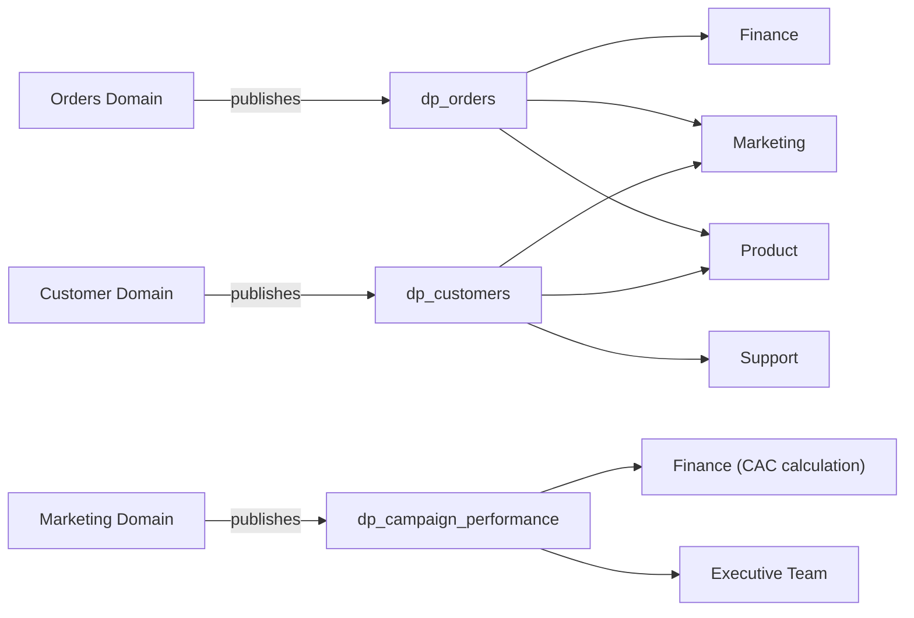

# 🕸️ Day 136: Data Mesh Principles — Domain Ownership and Federated Governance

> *"Data mesh doesn't mean chaos — it means each team owns their data like a product, with the same rigor they'd apply to an API their customers depend on."*

---

## The "Never-Coded" Bridge

**Think of data mesh like a franchise vs. a company-owned chain.** In a company-owned chain (centralized data team), one headquarters manages every restaurant — consistent quality but slow to adapt. In a franchise (data mesh), each location owns its operations while following corporate standards — faster innovation with federated quality control.

Data mesh applies this to data: instead of one central team managing all data, each business domain (marketing, finance, product) owns and publishes their data as products — with shared standards for quality, security, and interoperability.

---

## The Technical Deep Dive

### 1. The Four Principles of Data Mesh

Data mesh, as defined by Zhamak Dehghani, rests on four interlocking principles — remove any one and the other three break down (e.g., domain ownership without a self-serve platform just means every domain reinvents its own infrastructure). The dictionary below captures the "before vs. after" shift for each principle alongside what's centralized vs. decentralized in practice.

```python
data_mesh_principles = {
    "1_domain_ownership": {
        "principle": "Domain teams own their data end-to-end",
        "before": "Central data team builds ALL pipelines for ALL domains",
        "after": "Marketing team owns marketing data. Finance owns financial data.",
        "key_shift": "Data ownership shifts from the data team to the business domain",
    },
    "2_data_as_product": {
        "principle": "Treat datasets as products with consumers, SLAs, and quality",
        "requirements": [
            "Discoverable (listed in catalog)",
            "Addressable (accessible via standard interface)",
            "Trustworthy (tested, documented, SLA-backed)",
            "Self-describing (schema + documentation + lineage)",
            "Interoperable (follows company-wide standards)",
            "Secure (access-controlled, compliant)",
        ],
    },
    "3_self_serve_platform": {
        "principle": "A platform team provides infrastructure as a service",
        "provides": [
            "One-click data pipeline provisioning",
            "Standard storage/compute (Snowflake, dbt, Airflow)",
            "Data quality tooling (Soda, GE)",
            "Monitoring and alerting",
        ],
        "does_not": [
            "Write domain-specific transformations",
            "Define business metrics for domains",
            "Own domain data quality",
        ],
    },
    "4_federated_governance": {
        "principle": "Decentralized decisions + centralized standards",
        "centralized": [
            "Data classification (PII policies)",
            "Interoperability standards (naming, formats)",
            "Quality baseline (minimum test requirements)",
            "Security policies (access control patterns)",
        ],
        "decentralized": [
            "Domain-specific metric definitions",
            "Pipeline scheduling decisions",
            "Data model design within standards",
            "Consumer prioritization",
        ],
    },
}
```

### 2. Domain Boundaries and Data Products

Principle 1 (domain ownership) and Principle 2 (data as a product) become concrete once you draw domain boundaries around real business capabilities and define what each domain actually *publishes*. The example below shows three domains at an e-commerce company, each owning one data product with an explicit interface, SLA, and named consumers — the minimum a data product needs to be usable by another domain.

```python
# Example: E-commerce company data mesh domains

domains = {
    "orders_domain": {
        "team": "Order Management Squad",
        "data_products": {
            "dp_orders": {
                "description": "Completed orders with items and payments",
                "interface": "fct_orders (BigQuery view, documented in catalog)",
                "sla": "Updated within 1 hour, 99.5% availability",
                "consumers": ["finance", "marketing", "product"],
            }
        },
    },
    "customer_domain": {
        "team": "Customer Experience Squad",
        "data_products": {
            "dp_customers": {
                "description": "Customer profiles, segments, and LTV",
                "interface": "dim_customers (BigQuery, API, catalog)",
                "sla": "Updated daily by 6AM UTC",
                "consumers": ["marketing", "support", "product"],
            }
        },
    },
    "marketing_domain": {
        "team": "Growth Marketing Squad",
        "data_products": {
            "dp_campaign_performance": {
                "description": "Multi-channel campaign ROI and attribution",
                "interface": "fct_campaign_metrics (BigQuery, Looker explore)",
                "sla": "Updated daily, 4-hour freshness",
                "consumers": ["finance (CAC calculation)", "executive team"],
            }
        },
    },
}
```



Each domain publishes one data product as a defined interface, and consumers across other domains subscribe to it rather than rebuilding the same data themselves.

### 3. When to (and NOT to) Adopt Data Mesh

Data mesh is an organizational change, not a tool purchase, so the decision to adopt it should rest on org-readiness criteria rather than technology trends. The lists below give the concrete signals for "good fit" vs. "bad fit," plus a middle path for organizations that aren't a clean match for either.

```python
adopt_data_mesh_when = {
    "good_fit": [
        "Organization has 100+ employees with distinct domains",
        "Central data team is bottlenecked (>2 week queue for requests)",
        "Multiple domains with deep subject matter expertise",
        "Strong engineering culture that can support distributed ownership",
        "Leadership supports organizational change",
    ],
    "bad_fit": [
        "Small company (<50 employees) — overhead outweighs benefits",
        "Domains lack technical capability to own data",
        "No platform team to build self-serve infrastructure",
        "Data culture is immature (people don't understand data quality)",
        "Leadership wants quick wins (data mesh is a 12-18 month journey)",
    ],
    "compromise": "Start with data products in 2-3 mature domains. Keep central team for others. Evolve gradually — data mesh is a spectrum, not a binary switch.",
}
```

---

## Glossary

| Term | Definition |
|---|---|
| **Data Mesh** | A decentralized data architecture where domain teams own, produce, and publish their own data as products, supported by a self-serve platform and federated governance. |
| **Domain Ownership** | Principle that the team closest to the business context (not a central data team) owns its data end-to-end. |
| **Data as a Product** | Treating a dataset with product-management rigor: discoverable, addressable, trustworthy, self-describing, interoperable, and secure. |
| **Data Product** | A specific, owned, documented dataset published by a domain with a defined interface, SLA, and consumers (e.g., `dp_orders`). |
| **Self-Serve Data Platform** | Shared infrastructure (provisioning, storage/compute, quality tooling, monitoring) provided by a platform team so domains don't each rebuild plumbing. |
| **Federated Computational Governance** | A governance model where standards (PII policy, naming, minimum quality bar) are centralized while domain-specific decisions stay decentralized. |
| **SLA (Service Level Agreement)** | A measurable commitment a data product makes to its consumers (e.g., "updated within 1 hour, 99.5% availability"). |
| **Discoverability** | Whether a data product is listed and findable in a catalog — a prerequisite for other domains being able to consume it. |
| **Interoperability** | Whether a data product follows shared standards (naming, formats) so it can be combined with data from other domains without custom translation. |
| **Platform Team** | The team that builds and operates the self-serve infrastructure domains use — analogous to an internal cloud provider, not a producer of domain data. |
| **Domain Squad** | A cross-functional team (e.g., "Order Management Squad") responsible for a business domain's data products end-to-end. |

---

## Hands-on Lab

### Exercise 1: Domain Boundary Design

```python
# Scenario: a 250-person B2B SaaS company (project management tool) with
# Product, Billing, Support, and Marketing teams, currently served by one
# centralized 4-person data team with a 3-week request backlog.

# TODO: Design domain boundaries for this SaaS company. For each domain,
# define 1-2 data products with their interfaces and SLAs.

# EXPECTED RESULT:
saas_domains = {
    "product_domain": {
        "data_products": {
            "dp_feature_usage": {
                "interface": "fct_feature_events (BigQuery view, dbt-documented)",
                "sla": "Updated every 4 hours, 99% availability",
            }
        }
    },
    "billing_domain": {
        "data_products": {
            "dp_subscriptions": {
                "interface": "fct_subscriptions (BigQuery, Stripe-sourced)",
                "sla": "Updated within 15 min of webhook event, 99.9% availability",
            },
            "dp_revenue": {
                "interface": "fct_mrr (BigQuery, finance-reviewed)",
                "sla": "Updated daily by 6AM UTC",
            },
        }
    },
    "support_domain": {
        "data_products": {
            "dp_ticket_metrics": {
                "interface": "fct_support_tickets (BigQuery, Zendesk-sourced)",
                "sla": "Updated hourly, 99% availability",
            }
        }
    },
    "marketing_domain": {
        "data_products": {
            "dp_campaign_attribution": {
                "interface": "fct_campaign_metrics (BigQuery, Looker explore)",
                "sla": "Updated daily, 4-hour freshness",
            }
        }
    },
}
# Each product's consumers span domains: e.g., dp_subscriptions feeds
# Marketing's CAC calc and Product's expansion-revenue analysis.
```

### Exercise 2: Data Product Specification

```markdown
# Scenario: write the spec for the customer churn prediction dataset that
# Support and Marketing both want to consume.

Write a full data product specification for a customer churn prediction
dataset, including schema, quality requirements, access policies, and
consumer documentation.

EXPECTED RESULT:
- Schema: dp_customer_churn_risk(customer_id PK, churn_probability FLOAT
  [0-1], risk_tier ENUM[low,medium,high], top_risk_factor STRING,
  model_version STRING, scored_at TIMESTAMP).
- Quality requirements: churn_probability non-null for 100% of active
  customers, model_version tracked for reproducibility, scored_at refreshed
  weekly (Sunday 2AM UTC), backtested precision/recall published in the
  catalog entry each release.
- Access policies: Support and Marketing get read access to the full table;
  Sales gets risk_tier and top_risk_factor only (no raw probability, to
  avoid over-interpreting a noisy score as exact).
- Consumer documentation: catalog entry explains the model is a gradient-
  boosted classifier on 90-day usage + support-ticket features, links to
  the model card, and flags known limitation: "scores are unreliable for
  customers with <30 days of history."
```

### Exercise 3: Governance Model

```markdown
# Scenario: the same SaaS company now has all 4 domains owning data
# products. Conflicts have already started: Billing and Marketing each
# have their own "customer" ID scheme.

Design a federated governance model specifying which decisions are
centralized vs. decentralized, and how conflicts are resolved.

EXPECTED RESULT:
- Centralized (platform/governance team decides): customer_id format and
  source of truth (Billing's Stripe customer_id becomes canonical; Marketing
  must map to it), PII classification rules, minimum test coverage (every
  published data product needs uniqueness + not-null tests on its primary
  key), naming conventions (fct_/dim_/dp_ prefixes).
- Decentralized (domain decides): which metrics it tracks internally,
  pipeline scheduling/orchestration choices, internal modeling decisions
  not exposed to other domains.
- Conflict resolution: a monthly federated governance council (1 rep per
  domain + platform lead) reviews proposed standards changes and disputes;
  unresolved conflicts escalate to the VP of Data with a 2-week SLA to
  decide, so disagreements can't block shipping indefinitely.
```

---

## Mastery Check

**Q1**: What is data mesh and how does it differ from a centralized data team?
<details><summary>Answer</summary>
Data mesh decentralizes data ownership to domain teams — each team owns, produces, and maintains their data as products. A centralized model has one data team responsible for all data across the organization. Data mesh scales better because domain teams have deeper business context, but requires more organizational maturity and a platform team to provide infrastructure.
</details>

**Q2**: What does "data as a product" mean in practice?
<details><summary>Answer</summary>
Treating data as a product means applying product management rigor: it has consumers with specific needs, an SLA for quality and freshness, documentation, a versioning strategy, a feedback mechanism, and an owner who is accountable for its quality — just like a software API has endpoints, docs, and an SLA that the owning team maintains.
</details>

**Q3**: What is the role of the platform team in a data mesh?
<details><summary>Answer</summary>
The platform team provides self-serve infrastructure: pipeline provisioning, compute/storage, quality tooling, monitoring, and catalog services. They do NOT write domain-specific transformations or own domain data quality. Think of them as the "cloud provider" for internal data teams — they build the roads, domains drive the cars.
</details>

**Q4**: What is federated governance and why is it necessary?
<details><summary>Answer</summary>
Federated governance balances autonomy with standards: domain teams make local decisions (metric definitions, pipeline timing) while centralized standards ensure interoperability (naming conventions, PII handling, minimum test coverage). Without federated governance, data mesh becomes chaos — every domain uses different formats, naming, and quality levels.
</details>

**Q5**: Your CEO asks: "Should we adopt data mesh?" What questions do you ask?
<details><summary>Answer</summary>
1. How large is the organization and how distinct are the business domains? 2. Is the current central data team a bottleneck? How long is the request queue? 3. Do domain teams have (or can they hire) people with data engineering skills? 4. Is there budget and executive sponsorship for a 12-18 month organizational change? 5. Do we have a platform team, or can we build one? Data mesh is a strategic organizational decision, not just a technical one.
</details>

---

## Summary

- ✅ **Data mesh**: Decentralized data ownership with domain teams producing data products
- ✅ **Four principles**: Domain ownership, data as product, self-serve platform, federated governance
- ✅ **Not for everyone**: Requires 100+ org, mature engineering culture, platform team
- ✅ **Start small**: 2-3 domains, evolve gradually, don't "big bang" the transformation
- ✅ **Federated governance**: Centralized standards + decentralized decisions

**Tomorrow → Day 137**: **Product Analytics Deep Dive** — retention, funnels, cohort analysis, and driving product decisions with data.
