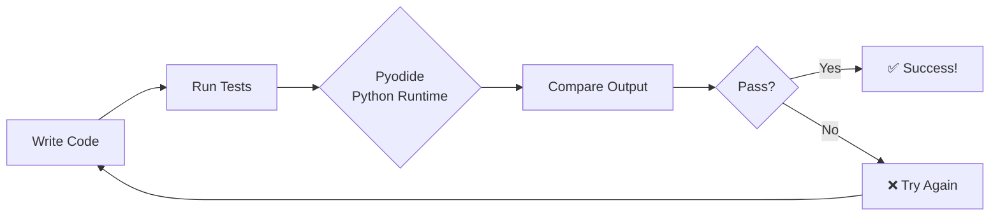

# 🚀 Interactive Learning Platform

Welcome to the **Interactive Learning Platform** - a LeetCode/HackerRank-style experience for learning Python right in your browser!

## Features

  

    📝
    <h3>Code Editor</h3>
    
Syntax highlighting with CodeMirror

  

  

    🐍
    <h3>Python Runtime</h3>
    
Execute Python directly in browser

  

  

    ✅
    <h3>Auto-Grading</h3>
    
Instant feedback on your solutions

  

  

    💡
    <h3>Hints</h3>
    
Progressive hints when you're stuck

  

---

## Try It Out

### Exercise 1: Company Welcome Message

Create a function that generates a welcome message for a company.

---

### Exercise 2: Calculate Gross Profit

Create a function that calculates gross profit from revenue and cost of goods sold (COGS).

**Formula:** Gross Profit = Revenue - COGS

---

### Exercise 3: Calculate Profit Margin

Calculate the gross profit margin percentage, handling the edge case where revenue is 0.

**Formula:** Profit Margin = (Gross Profit / Revenue) × 100

---

## How It Works

1. **Write your solution** in the code editor
2. **Click "Run Tests"** or press `Ctrl+Enter`
3. **See instant feedback** with test results
4. **Use hints** if you get stuck

---

## Keyboard Shortcuts

| Shortcut | Action |
|----------|--------|
| `Ctrl+Enter` | Run tests |
| `Ctrl+Z` | Undo |
| `Ctrl+Shift+Z` | Redo |
| `Tab` | Indent |

---

  <h3>🎯 Ready for More?</h3>
  
Start with <a href="day-01-introduction/">Day 1: Python for Business Analytics</a> and work through all 108 lessons!

