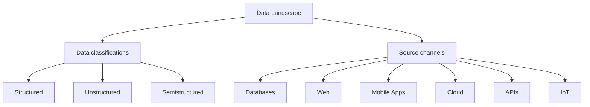

> This lesson expands the BI roadmap by grounding each data classification and source channel in real assets from the Coding-for-MBA repository.

## Why it matters

Understanding how structured, unstructured, and semi-structured sources flow into the BI stack ensures analysts can scope ingestion pipelines, negotiate requirements with engineers, and prioritize governance activities.

## Developer-roadmap alignment



## Classification reference table

| Section | Title | What to emphasize |
| --- | --- | --- |
| Data classifications | Types of data | Position the three major categories and when each surfaces in BI projects. |
| Data classifications | Structured | Highlight schemas, SQL queries, and data warehouse management. |
| Data classifications | Unstructured | Discuss text, audio, and other media that require NLP or transcription. |
| Data classifications | Semistructured | Connect JSON, XML, and log formats that straddle tables and documents. |
| Data classifications | What is Data? | Frame data as recorded facts produced by business processes. |

## Source channels mapped to repository datasets

| Source channel | Repository dataset | Format | Classroom talking point |
| --- | --- | --- | --- |
| Data Sources | `data/README.md` | md | Catalog that enumerates every example dataset students can explore. |
| Databases | `data/fortune1000_final.csv` | csv | Warehouse-style table for corporate benchmarking exercises. |
| Web | `data/hacker_news.csv` | csv | Community conversations scraped from the Hacker News website. |
| Mobile Apps | `data/result.csv` | csv | Behavior metrics analogous to exports from a product analytics SDK. |
| Cloud | `data/countries_data.json` | json | Semi-structured payload similar to what lands in cloud object storage. |
| APIs | `data/countries.py` | py | Lightweight client that mimics tapping into a REST Countries API. |
| IoT | `data/weight-height.csv` | csv | Sensor-like measurements from wearables or connected devices. |

## Next steps

- Run `python Day_71_BI_Data_Landscape/lesson.py` to preview the discussion tables.
- Pair each dataset with a lightweight notebook showing ingestion and profiling.
- Update stakeholder playbooks with the classification and sourcing vocabulary.

## Additional Topic: Data Sources & Governance

> This lesson is part of the Phase 5 Business Intelligence specialization. Use the [Phase 5 overview](https://github.com/saint2706/Coding-For-MBA/blob/main/docs/bi-curriculum.md) to see how the developer-roadmap topics align across Days 68–84.

## Why it matters

Audit how raw data flows into governed analytics environments.

## Developer-roadmap alignment

- Data Sources
- Data Formats
- Data Quality
- Ethical Data Use
- Privacy

## Next steps

- Draft case studies and notebooks that exercise these roadmap nodes.
- Update the Phase 5 cheat sheet with the insights you capture here.

## Additional Materials

???+ example "lesson.py"
    [View on GitHub](https://github.com/saint2706/Coding-For-MBA/blob/main/Day_71_BI_Data_Landscape/lesson.py)

    ```python title="lesson.py"
    # %%
    """Day 71 – BI Data Landscape classroom script."""

    # %%
    from __future__ import annotations

    from pathlib import Path
    from typing import Mapping

    import pandas as pd

    from Day_71_BI_Data_Landscape import (
        SECTION_TOPICS,
        SOURCE_CHANNELS_SECTION,
        build_topic_dataframe,
        load_topic_groups,
    )

    # %%
    REPO_ROOT = Path(__file__).resolve().parents[1]
    DATA_DIR = REPO_ROOT / "data"

    SOURCE_DATASETS: Mapping[str, tuple[str, str]] = {
        "Data Sources": (
            "data/README.md",
            "Directory catalog describing every educational dataset.",
        ),
        "Databases": (
            "data/fortune1000_final.csv",
            "Fortune 1000 extract emulating a warehouse fact table.",
        ),
        "Web": (
            "data/hacker_news.csv",
            "Community discussions captured from the Hacker News website.",
        ),
        "Mobile Apps": (
            "data/result.csv",
            "Usage metrics mirroring analytics exported from a mobile product.",
        ),
        "Cloud": (
            "data/countries_data.json",
            "JSON payload representative of a cloud data lake feed.",
        ),
        "APIs": (
            "data/countries.py",
            "Python client that mirrors consuming an external countries API.",
        ),
        "IoT": (
            "data/weight-height.csv",
            "Telemetry-style body measurements similar to wearable devices.",
        ),
    }

    # %%
    TOPIC_GROUPS = load_topic_groups(SECTION_TOPICS)
    TOPIC_FRAME = build_topic_dataframe(sections=SECTION_TOPICS)


    # %%
    def build_source_asset_table(mapping: Mapping[str, tuple[str, str]]) -> pd.DataFrame:
        """Return metadata about the sample datasets that anchor each source type."""

        records: list[dict[str, object]] = []
        for source, (relative_path, description) in mapping.items():
            candidate = REPO_ROOT / relative_path
            records.append(
                {
                    "source": source,
                    "dataset": relative_path,
                    "format": candidate.suffix.lstrip("."),
                    "exists": candidate.exists(),
                    "description": description,
                }
            )
        frame = pd.DataFrame(
            records, columns=["source", "dataset", "format", "exists", "description"]
        )
        return frame.sort_values(by="source", kind="stable").reset_index(drop=True)


    # %%
    def preview_topic_groups(groups: Mapping[str, list]) -> None:
        """Display the roadmap alignment for each section."""

        for section, topics in groups.items():
            titles = ", ".join(topic.title for topic in topics)
            print(f"- {section}: {titles}")


    # %%
    def preview_source_table(frame: pd.DataFrame) -> None:
        """Print the dataset table that pairs each source channel with repository assets."""

        print("\nSample datasets by source channel:\n")
        print(frame.to_markdown(index=False))


    # %%
    def main() -> None:
        """Run the Day 71 classroom walkthrough."""

        preview_topic_groups(TOPIC_GROUPS)
        preview_source_table(build_source_asset_table(SOURCE_DATASETS))
        print("\nData classification overview:\n")
        print(
            TOPIC_FRAME[TOPIC_FRAME["section"] != SOURCE_CHANNELS_SECTION].to_markdown(
                index=False
            )
        )


    # %%
    if __name__ == "__main__":
        main()
    ```

???+ example "solutions.py"
    [View on GitHub](https://github.com/saint2706/Coding-For-MBA/blob/main/Day_71_BI_Data_Landscape/solutions.py)

    ```python title="solutions.py"
    """Utilities for the Day 71 – BI Data Landscape lesson."""

    from __future__ import annotations

    from typing import Mapping, Sequence

    import pandas as pd

    from mypackage.bi_curriculum import BiTopic, group_topics_by_titles

    DATA_CLASSIFICATIONS_SECTION = "Data classifications"
    DATA_CLASSIFICATION_TITLES: Sequence[str] = [
        "Types of data",
        "Structured",
        "Unstructured",
        "Semistructured",
        "What is Data?",
    ]

    SOURCE_CHANNELS_SECTION = "Source channels"
    SOURCE_CHANNEL_TITLES: Sequence[str] = [
        "Data Sources",
        "Databases",
        "Web",
        "Mobile Apps",
        "Cloud",
        "APIs",
        "IoT",
    ]

    SECTION_TOPICS: Mapping[str, Sequence[str]] = {
        DATA_CLASSIFICATIONS_SECTION: DATA_CLASSIFICATION_TITLES,
        SOURCE_CHANNELS_SECTION: SOURCE_CHANNEL_TITLES,
    }

    TOPIC_DESCRIPTIONS: Mapping[str, str] = {
        "Types of data": "Overview of how business intelligence teams categorize data assets.",
        "Structured": "Relational and tabular datasets with rigid schema definitions.",
        "Unstructured": "Free-form text, media, and documents requiring qualitative processing.",
        "Semistructured": "Flexible data with markers such as JSON or XML, blending structure and text.",
        "What is Data?": "Framing data as recorded facts and events captured by business systems.",
        "Data Sources": "Inventory of upstream systems that collect or generate business data.",
        "Databases": "Transactional or analytical repositories providing structured records.",
        "Web": "Public and partner-facing digital channels supplying external context.",
        "Mobile Apps": "Customer or field applications emitting behavioral and operational signals.",
        "Cloud": "Hosted platforms and storage services centralizing enterprise data.",
        "APIs": "Programmatic interfaces for exchanging data between systems in real time.",
        "IoT": "Sensor and device networks streaming telemetry from the physical world.",
    }


    def load_topic_groups(
        sections: Mapping[str, Sequence[str]] = SECTION_TOPICS,
    ) -> dict[str, list[BiTopic]]:
        """Return BI roadmap topics grouped by the requested section titles."""

        return group_topics_by_titles(sections)


    def build_topic_dataframe(
        *,
        sections: Mapping[str, Sequence[str]] = SECTION_TOPICS,
        descriptions: Mapping[str, str] = TOPIC_DESCRIPTIONS,
    ) -> pd.DataFrame:
        """Return a dataframe summarizing Day 71 roadmap topics and descriptions."""

        grouped_topics = load_topic_groups(sections)
        records: list[dict[str, str]] = []
        for section, topics in grouped_topics.items():
            for topic in topics:
                records.append(
                    {
                        "section": section,
                        "title": topic.title,
                        "description": descriptions.get(topic.title, ""),
                    }
                )
        frame = pd.DataFrame(records, columns=["section", "title", "description"])
        if not frame.empty:
            frame = frame.sort_values(by=["section", "title"], kind="stable").reset_index(
                drop=True
            )
        return frame


    __all__ = [
        "DATA_CLASSIFICATIONS_SECTION",
        "DATA_CLASSIFICATION_TITLES",
        "SECTION_TOPICS",
        "SOURCE_CHANNELS_SECTION",
        "SOURCE_CHANNEL_TITLES",
        "TOPIC_DESCRIPTIONS",
        "build_topic_dataframe",
        "load_topic_groups",
    ]
    ```
